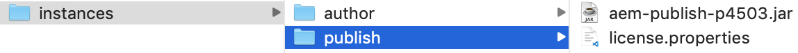

# Integración de Adobe Experience Manager con Adobe Target

En esta sección analizaremos cómo configurar Adobe Experience Manager con Adobe Target para diferentes escenarios. En función de su escenario y de los requisitos de la organización.

* **Añadir la biblioteca JavaScript de Adobe Target (necesaria para todos los escenarios)** Para los sitios alojados en AEM, puede agregar bibliotecas de Destinatarios a su sitio mediante [Iniciar](https://docs.adobe.com/content/help/en/launch/using/overview.html). Launch proporciona una forma sencilla de implementar y administrar todas las etiquetas necesarias para potenciar las experiencias relevantes de los clientes.
* **Añada los Cloud Services de Adobe Target (necesarios para el escenario Fragmentos de experiencia)** Para AEM clientes que deseen utilizar ofertas de fragmentos de experiencia para crear una actividad en Adobe Target, deberá integrar Adobe Target con AEM mediante los Cloud Services heredados. Esta integración es necesaria para insertar fragmentos de experiencia de AEM a Destinatario como ofertas HTML/JSON y mantener las ofertas sincronizadas con AEM. 
*Esta integración es necesaria para implementar el escenario 1.*

## Requisitos previos

* **Adobe Experience Manager (AEM){#aem}**
   * AEM 6.5 (se recomienda *el*&#x200B;último Service Pack)
   * Descargar AEM paquetes de sitios de referencia WKND
      * [aem-guides-wknd.ui.apps-0.0.1-SNAPSHOT.zip](https://github.com/adobe/aem-guides-wknd/releases/download/archetype-18.1/aem-guides-wknd.ui.apps-0.0.1-SNAPSHOT.zip)
      * [aem-guides-wknd.ui.content-0.0.1-SNAPSHOT.zip](https://github.com/adobe/aem-guides-wknd/releases/download/archetype-18.1/aem-guides-wknd.ui.content-0.0.1-SNAPSHOT.zip)
      * [Componentes principales](https://github.com/adobe/aem-core-wcm-components/releases/download/core.wcm.components.reactor-2.5.0/core.wcm.components.all-2.5.0.zip)
      * [Capa de datos digital](assets/implementation/digital-data-layer.zip)

* **Experience Cloud**
   * Acceso a sus organizaciones Adobe Experience Cloud - <https://>`<yourcompany>`.experienceCloud.adobe.com
   * Experience Cloud aprovisionado con las siguientes soluciones
      * [Adobe Experience Platform Launch](https://experiencecloud.adobe.com)
      * [Adobe Target](https://experiencecloud.adobe.com)
      * [Consola de E/S de Adobe](https://console.adobe.io)

* **creación**
   * Java 1.8 o Java 11 (solo AEM 6.5 o posterior)
   * Apache Maven (3.3.9 o posterior)
   * Chrome

>[!NOTE]
>
> El cliente debe estar aprovisionado con E/S de Experience Platform Launch y Adobe desde la asistencia [de](https://helpx.adobe.com/es/contact/enterprise-support.ec.html) Adobe o ponerse en contacto con el administrador del sistema

### Configurar AEM{#set-up-aem}

AEM instancia de creación y publicación es necesaria para completar este tutorial. La instancia de creación se está ejecutando `http://localhost:4502` y la instancia de publicación se está ejecutando en `http://localhost:4503`. Para obtener más información, consulte: [Configure un Entorno](https://helpx.adobe.com/experience-manager/kt/platform-repository/using/local-aem-dev-environment-article-setup.html)de desarrollo de AEM local.

#### Configuración de instancias de AEM Author y Publish

1. Obtenga una copia de la [AEM Jar Quickstart y una licencia.](https://helpx.adobe.com/experience-manager/6-5/sites/deploying/using/deploy.html#GettingtheSoftware)
2. Cree una estructura de carpetas en el equipo como la siguiente:
   
3. Cambie el nombre del tarro de inicio rápido `aem-author-p4502.jar` y colóquelo debajo del `/author` directorio. Añada el `license.properties` archivo debajo del `/author` directorio.
   
4. Haga una copia del frasco de inicio rápido, cámbiele el nombre `aem-publish-p4503.jar` y colóquelo debajo del `/publish` directorio. Añada una copia del `license.properties` archivo debajo del `/publish` directorio.
   
5. Doble haga clic en el `aem-author-p4502.jar` archivo para instalar la instancia de Autor. Esto inicio la instancia de creación, que se ejecuta en el puerto 4502 del equipo local.
6. Inicie sesión con las credenciales que se indican a continuación y, una vez iniciada la sesión, se le dirigirá a la pantalla de Página de inicio de AEM.
username: **admin** password: **admin**
   
7. Doble haga clic en el `aem-publish-p4503.jar` archivo para instalar una instancia de publicación. Puede observar una nueva ficha abierta en el navegador para la instancia de publicación, que se ejecuta en el puerto 4503 y muestra la página de inicio WeRetail. Utilizaremos el sitio de referencia de WKND para este tutorial y vamos a instalar los paquetes en la instancia de creación.
8. Vaya a AEM Author en su navegador web en `http://localhost:4502`. En la pantalla del Inicio de AEM, vaya a *[Herramientas > Implementación > Paquetes](http://localhost:4502/crx/packmgr/index.jsp)*.
9. Descargue y cargue los paquetes para AEM (enumerados arriba en Requisitos *[previos > AEM](#aem)*)
   * [aem-guides-wknd.ui.apps-0.0.1-SNAPSHOT.zip](https://github.com/adobe/aem-guides-wknd/releases/download/archetype-18.1/aem-guides-wknd.ui.apps-0.0.1-SNAPSHOT.zip)
   * [aem-guides-wknd.ui.content-0.0.1-SNAPSHOT.zip](https://github.com/adobe/aem-guides-wknd/releases/download/archetype-18.1/aem-guides-wknd.ui.content-0.0.1-SNAPSHOT.zip)
   * [core.wcm.components.all-2.5.0.zip](https://github.com/adobe/aem-core-wcm-components/releases/download/core.wcm.components.reactor-2.5.0/core.wcm.components.all-2.5.0.zip)
   * [digital-data-layer.zip](assets/implementation/digital-data-layer.zip)

   >[!VIDEO](https://video.tv.adobe.com/v/28377?quality=12&learn=on)
10. Después de instalar los paquetes en AEM Author, seleccione cada paquete cargado en AEM administrador de paquetes y seleccione **Más > Replicar** para asegurarse de que los paquetes se implementan en AEM Publish.
11. En este punto, ha instalado correctamente su sitio de referencia WKND y todos los paquetes adicionales necesarios para este tutorial.

[CAPÍTULO](./using-launch-adobe-io.md)SIGUIENTE: En el siguiente capítulo, integrará Launch con AEM.
