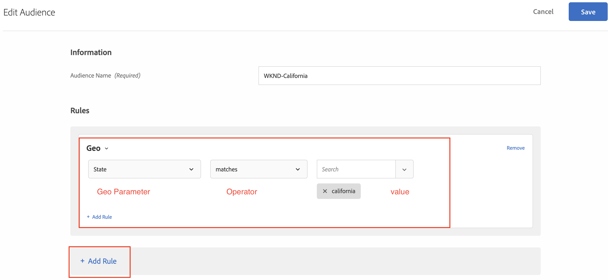

# Personalización mediante AEM fragmentos de experiencias y Adobe Target

Con la capacidad de exportar AEM fragmentos de experiencia a Adobe Target como ofertas HTML, puede combinar la facilidad de uso y la potencia de las AEM con potentes capacidades de Inteligencia automatizada (AI) y Aprendizaje automático (ML) en Target para probar y personalizar experiencias a escala.

AEM reúne todo su contenido y recursos en una ubicación central para impulsar su estrategia de personalización. AEM permite crear fácilmente contenido para escritorios, tabletas y dispositivos móviles en una ubicación sin necesidad de escribir código. No es necesario crear páginas para cada dispositivo: AEM ajusta automáticamente cada experiencia con el contenido.

Target permite ofrecer experiencias personalizadas a escala basada en una combinación de enfoques de aprendizaje automático basados en reglas y dirigidos por IA que incorporan variables de comportamiento, contextuales y sin conexión.  Con Target, puede configurar y ejecutar fácilmente actividades A/B y multivariable (MVT) para determinar las mejores ofertas, contenidos y experiencias.

Los fragmentos de experiencia representan un gran paso adelante para vincular a los creadores de contenido con los especialistas en marketing que dirigen los resultados comerciales mediante Target.

## Información general del escenario

El sitio WKND planea anunciar un **SkateFest Challenge** en toda América a través de su sitio web y desea que los usuarios del sitio se registren para la audición llevada a cabo en cada estado. Como especialista en marketing, se le ha asignado la tarea de ejecutar una campaña en la página de inicio del sitio WKND, con mensajes de banners relevantes para la ubicación de los usuarios y un vínculo a la página de detalles del evento. Exploremos la página de inicio del sitio WKND y aprendamos a crear y ofrecer una experiencia personalizada para un usuario en función de su ubicación actual.

### Usuarios implicados

Para este ejercicio, es necesario involucrar a los siguientes usuarios y para realizar algunas tareas es posible que necesite acceso administrativo.

* **Productor de contenido/Editor de contenido**  (Adobe Experience Manager)
* **Especialista en marketing**  (Adobe Target/Equipo de optimización)

### Requisitos previos

* **AEM**
   * [AEM creación y publicación de ](./implementation.md#getting-aem) instancias en localhost 4502 y 4503 respectivamente.
* **Experience Cloud**
   * Acceso a sus organizaciones Adobe Experience Cloud - `https://<yourcompany>.experiencecloud.adobe.com`
   * Experience Cloud aprovisionado con las siguientes soluciones
      * [Adobe Target](https://experiencecloud.adobe.com)

### Página principal del sitio WKND

1. El especialista en marketing inicia el debate de la campaña WKND SkateFest con AEM editor de contenido y detalla los requisitos.
   * ***Requisito***: Promocione la campaña WKND SkateFest en la página de inicio del sitio WKND con contenido personalizado para visitantes de cada estado de Estados Unidos. Añada un nuevo bloque de contenido debajo del carrusel de la página principal que contenga una imagen de fondo, texto y un botón.
      * **Imagen** de fondo: La imagen debe ser relevante para el estado desde el que el usuario está visitando la página del sitio WKND.
      * **Texto**: &quot;Regístrese para los Audition&quot;
      * **Botón**: &quot;Detalles del evento&quot; que apuntan a la página de WKND SkateFest
      * **Página** SkateFest de WKND: una nueva página con detalles del evento, que incluye el lugar de la audiencia, la fecha y la hora.
1. En función de los requisitos, AEM editor de contenido crea un fragmento de experiencia para el bloque de contenido y lo exporta a Adobe Target como una oferta. Para ofrecer contenido personalizado para todos los estados de los Estados Unidos, el autor de contenido puede crear una variación maestra de fragmentos de experiencias y, a continuación, crear otras 50 variaciones, una para cada estado. El contenido de cada variación de estado con imágenes y texto relevantes se puede editar manualmente. Al crear un fragmento de experiencia, los editores de contenido pueden acceder rápidamente a todos los recursos disponibles en AEM Assets mediante la opción del Buscador de recursos . Cuando se exporta un fragmento de experiencia a Adobe Target, todas sus variaciones también se envían a Adobe Target como ofertas.

1. Después de exportar fragmentos de experiencia de AEM a Adobe Target como ofertas, los especialistas en marketing pueden crear actividades en Target mediante estas ofertas. Según la campaña SkateFest del sitio WKND, el especialista en marketing debe crear y ofrecer una experiencia personalizada a los visitantes del sitio WKND de cada estado. Para crear una actividad de segmentación de experiencias, el especialista en marketing debe identificar las audiencias. Para nuestra campaña WKND SkateFest, necesitamos crear 50 audiencias separadas, en función de su ubicación desde la cual están visitando el sitio web de WKND.
   *  Las audiencias definen el público objetivo de la actividad y se utilizan en cualquier parte donde esté disponible la segmentación. Las audiencias de destino son un conjunto definido de criterios de visitantes. Las ofertas se pueden dirigir a audiencias (o segmentos) específicas. Solo los visitantes que pertenezcan a esa audiencia verán la experiencia segmentada para ellos.  Por ejemplo, puede enviar una oferta a una audiencia compuesta por visitantes que utilicen un navegador concreto o una ubicación geográfica específica.
   * Una [oferta](https://experienceleague.adobe.com/docs/target/using/introduction/target-key-concepts.html#section_973D4CC4CEB44711BBB9A21BF74B89E9) es el contenido que se muestra en las páginas web durante campañas o actividades. Al probar las páginas web, se mide el éxito de cada experiencia con diferentes ofertas en las ubicaciones. Una oferta puede contener diferentes tipos de contenido, entre ellos:
      * Imagen
      * Texto
      * **HTML**
         * *Se utilizarán ofertas HTML para la actividad de este escenario*
      * Vínculo
      * Botón

## Actividades del editor de contenido

>[!VIDEO](https://video.tv.adobe.com/v/28596?quality=12&learn=on)

>[!NOTE]
>
>Publique el fragmento de experiencia antes de exportarlo a Adobe Target.

## Actividades de marketing

### Crear una audiencia con segmentación geográfica {#marketer-audience}

1. Vaya a sus organizaciones [Adobe Experience Cloud](https://experiencecloud.adobe.com/) (`<https://<yourcompany>.experiencecloud.adobe.com`)
1. Inicie sesión con su Adobe ID y asegúrese de que se encuentra en la organización correcta.
1. En el conmutador de soluciones, haga clic en **Target** y luego en **launch** Adobe Target.

   

1. Vaya a la pestaña **Offers** y busque ofertas &quot;WKND&quot;. Debería poder ver la lista de variaciones de fragmentos de experiencias, exportadas desde AEM como ofertas HTML. Cada oferta corresponde a un estado. Por ejemplo, *WKND SkateFest California* es la oferta que se suministra a un visitante del sitio WKND de California.

   

1. En la navegación principal, haga clic en **Audiencias**.

   Un especialista en marketing debe crear 50 audiencias independientes para los visitantes del sitio WKND procedentes de cada estado de Estados Unidos de América.

1. Para crear una audiencia, haga clic en el botón **Crear audiencia** y proporcione un nombre para la audiencia.

   **Formato del nombre de la audiencia : WKND-\&lt;>state *\>***

   

1. Haga clic en **Agregar regla > Geografía**.
1. Haga clic en **Seleccionar** y, a continuación, seleccione una de las siguientes opciones:
   * País
   * **Estado** *(seleccione Estado para la campaña WKND Site SkateFest)*
   * Ciudad
   * Código postal
   * Latitud
   * Longitud
   * DMA
   * Operador de telefonía móvil

   **Geografía** : Utilice audiencias para segmentar usuarios según su ubicación geográfica, incluidos país, estado/provincia, ciudad, código postal, DMA y operador de telefonía móvil. Los parámetros de geolocalización le permiten segmentar actividades y experiencias en función de la ubicación geográfica de los visitantes. Estos datos se envían con cada solicitud de Target y se basan en la dirección IP del visitante. Seleccione estos parámetros como cualquier otro valor de segmentación.

   >[!NOTE]
   >La dirección IP de un visitante se transfiere con una solicitud de mbox, una vez por visita (sesión), para resolver los parámetros de segmentación geográfica para ese visitante.

1. Seleccione el operador como **coincide con**, proporcione un valor apropiado (Por ejemplo: California) y **Guarde** los cambios. En nuestro caso, proporcione el nombre del estado.

   

   >[!NOTE]
   >Puede tener varias reglas asignadas a una audiencia.

1. Repita los pasos 6-9 para crear audiencias para los demás estados.

   

En este punto, hemos creado audiencias correctamente para todos los visitantes del sitio WKND en diferentes estados de Estados Unidos de América y también tenemos la oferta HTML correspondiente para cada estado. Por lo tanto, ahora vamos a crear una actividad de segmentación de experiencias para dirigirse a la audiencia con una oferta correspondiente para la página principal del sitio WKND.

### Crear una actividad con segmentación geográfica

1. En la ventana de Adobe Target, vaya a la pestaña **Actividades**.
1. Haga clic en **Crear actividad** y seleccione el tipo de actividad **Segmentación de experiencias**.
1. Seleccione el canal **Web** y elija el **Compositor de experiencias visuales**.
1. Introduzca la **URL de actividad** y haga clic en **Siguiente** para abrir el Compositor de experiencias visuales.

   URL de publicación de la página principal del sitio WKND: http://localhost:4503/content/wknd/en.html

   

1. Para que **Compositor de experiencias visuales** se cargue, habilite **Permitir la carga de scripts no seguros** en el explorador y vuelva a cargar la página.

   

1. Observe que se abre la página de inicio del sitio WKND en el editor del Compositor de experiencias visuales.

   

1. Para añadir una audiencia al VEC, haga clic en **Añadir segmentación de experiencias** en Audiencias, seleccione la audiencia de WKND-California y haga clic en **Siguiente**.

   

1. Haga clic en la página del sitio WKND dentro del VEC, seleccione el elemento HTML para añadir la oferta para la audiencia de WKND-California y elija la opción **Reemplazar con** y, a continuación, seleccione la **Oferta HTML**.

   

1. Seleccione la oferta HTML **WKND SkateFest California** para la audiencia **WKND-California** en la interfaz de usuario seleccionada de la oferta y haga clic en **Listo**.
1. Ahora debería poder ver la oferta HTML **WKND SkateFest California** agregada a su página del sitio WKND para la audiencia WKND-California.
1. Repita los pasos del 7 al 10 para añadir Segmentación de experiencias para los demás estados y elegir la oferta HTML correspondiente.
1. Haga clic en **Siguiente** para continuar y verá una asignación para Audiencias a Experiencias.
1. Haga clic en **Siguiente** para desplazarse a Objetivos y configuración.
1. Elija la fuente de informes e identifique un objetivo principal para su actividad. Para nuestro escenario, vamos a seleccionar la fuente de informes como **Adobe Target**, midiendo la actividad como **Conversión**, acción como si se viera una página y dirección URL que apunte a la página Detalles del WKND SkateFest.

   

   >[!NOTE]
   >También puede elegir Adobe Analytics como fuente de informes.

1. Pase el ratón sobre el nombre de la actividad actual y puede cambiarle el nombre por **WKND SkateFest - USA** y luego **Guardar y cerrar** los cambios.
1. En la pantalla Detalles de la actividad, asegúrese de **Activar** su actividad.

   

1. Su campaña de WKND SkateFest ya está activa para todos los visitantes del sitio WKND.
1. Vaya a la [Página principal del sitio WKND](http://localhost:4503/content/wknd/en.html) y debería poder ver la oferta de WKND SkateFest en función de su ubicación geográfica (*estado: California*).

   

### Control de calidad de la actividad de Target

1. En la pestaña **Detalles de la actividad > Información general** , haga clic en el botón **Control de calidad de la actividad** y puede obtener el vínculo de control de calidad directo a todas sus experiencias.

   

1. Vaya a la [Página principal del sitio WKND](http://localhost:4503/content/wknd/en.html) y debería poder ver la oferta de WKND SkateFest en función de su ubicación geográfica (estado ).
1. Vea el siguiente vídeo para comprender cómo se entrega una oferta a su página, cómo personalizar los tokens de respuesta y para realizar una comprobación de calidad.

>[!VIDEO](https://video.tv.adobe.com/v/28658?quality=12&learn=on)

## Resumen

En este capítulo, un editor de contenido pudo crear todo el contenido para admitir la campaña WKND SkateFest en Adobe Experience Manager y exportarlo a Adobe Target como ofertas HTML para crear Segmentación de experiencias, en función de la ubicación geográfica de los usuarios.
