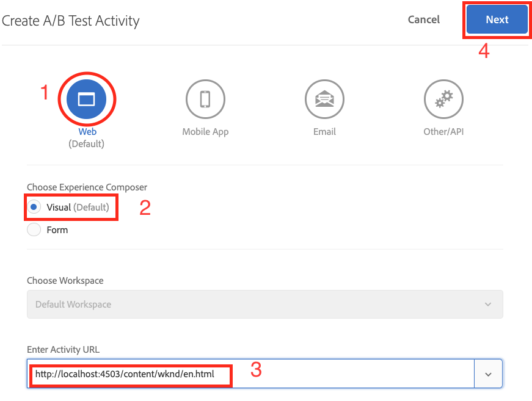
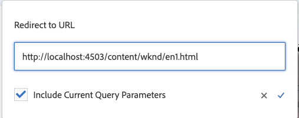
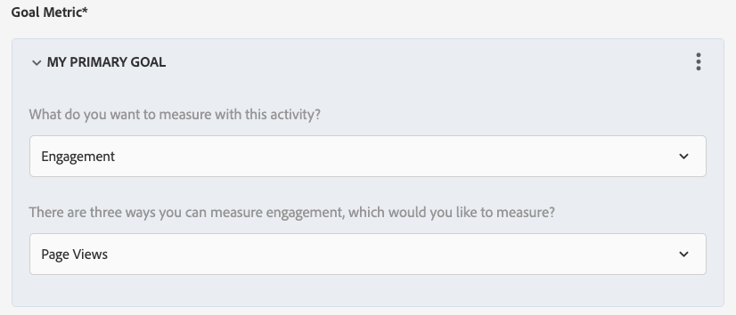
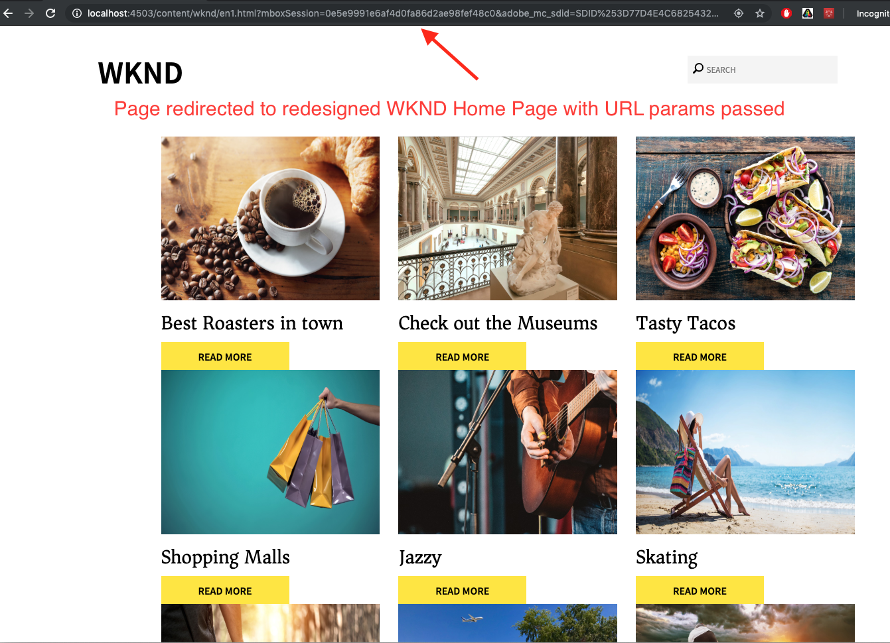

# Personalización de las experiencias de página web completa con Adobe Target

En el capítulo anterior, hemos aprendido a crear una actividad basada en la ubicación geográfica dentro de Adobe Target utilizando contenido creado como fragmentos de experiencias y exportado desde AEM como ofertas HTML.

En este capítulo, analizaremos la creación de actividad para redirigir las páginas del sitio alojadas en AEM a una nueva página mediante Adobe Target.

## Información general del escenario

El sitio WKND rediseñó su página principal y le gustaría redirigir a los visitantes de su página principal actual a la nueva página principal. Al mismo tiempo, comprenda también cómo la página de inicio rediseñada ayuda a mejorar la participación del usuario y los ingresos. Como especialista en marketing, se le ha asignado la tarea de crear una actividad para redirigir a los visitantes a la nueva página principal. Exploremos la página de inicio del sitio WKND y aprendamos a crear una actividad con Adobe Target.

### Usuarios implicados

Para este ejercicio, es necesario involucrar a los siguientes usuarios y para realizar algunas tareas es posible que necesite acceso administrativo.

* **Productor de contenido/Editor de contenido**  (Adobe Experience Manager)
* **Especialista en marketing**  (Adobe Target/Equipo de optimización)

### Página principal del sitio WKND

### Requisitos previos

* **AEM**
   * [Creación y publicación de ](./implementation.md#getting-aem) instancias de AEM en localhost 4502 y 4503 respectivamente.
   * [AEM integrado con Adobe Target mediante Adobe Experience Platform Launch](./using-launch-adobe-io.md#aem-target-using-launch-by-adobe)
* **Experience Cloud**
   * Acceso a sus organizaciones Adobe Experience Cloud: <https://>`<yourcompany>`.experiencecloud.adobe.com
   * Experience Cloud aprovisionado con las siguientes soluciones
      * [Adobe Target](https://experiencecloud.adobe.com)

## Actividades del editor de contenido

1. El especialista en marketing inicia el debate sobre el rediseño de la página principal de WKND con el Editor de contenido de AEM y detalla los requisitos.
   * ***Requisito*** : Rediseñe la página principal del sitio WKND con un diseño basado en tarjetas.
2. Según los requisitos, el Editor de contenido de AEM crea una nueva página principal del sitio WKND con un diseño basado en tarjetas y publica la nueva página principal.

## Actividades de marketing

1. El especialista en marketing crea una actividad de objetivo A/B con la oferta de redireccionamiento como experiencia y el tráfico del 100 % del sitio web asignado a la nueva página principal con el objetivo de éxito y las métricas añadidas.
   1. En la ventana de Adobe Target, vaya a la pestaña **Actividades**.
   2. Haga clic en el botón **Crear actividad** y seleccione el tipo de actividad como **Prueba A/B**

      
   3. Seleccione el canal **Web** y elija el **Compositor de experiencias visuales**.
   4. Introduzca la **URL de actividad** y haga clic en **Siguiente** para abrir el Compositor de experiencias visuales.
      
   5. Para que **Compositor de experiencias visuales** se cargue, habilite **Permitir la carga de scripts no seguros** en el explorador y vuelva a cargar la página.
      
   6. Observe que se abre la página de inicio del sitio WKND en el editor del Compositor de experiencias visuales.
      
   7. Pase el ratón sobre la **Experiencia B** y seleccione Ver otras opciones.
      
   8. Seleccione la opción **Redireccionar a URL** e introduzca la URL a la nueva página principal de WKND. (http://localhost:4503/content/wknd/en1.html)
      
   9. **** Guarde los cambios y continúe con los siguientes pasos de la creación de actividades.
   10. Seleccione el **Método de asignación de tráfico** como manual y asigne el 100% de tráfico a **Experiencia B**.
      
   11. Haga clic en **Siguiente**. 
   12. Proporcione **Métricas de objetivo** para su actividad y guarde y cierre la prueba A/B.
      
   13. Proporcione un nombre (**WKND Home Page Redesign**) para su actividad y guarde los cambios.
   14. En la pantalla Detalles de la actividad, asegúrese de **Activar** su actividad.
      
   15. Vaya a la página principal de WKND (http://localhost:4503/content/wknd/en.html) y se le redirigirá a la página principal del sitio WKND rediseñada (http://localhost:4503/content/wknd/en1.html).
      

## Resumen

En este capítulo, un especialista en marketing pudo crear una actividad para redirigir las páginas del sitio alojadas en AEM a una nueva página mediante Adobe Target.
