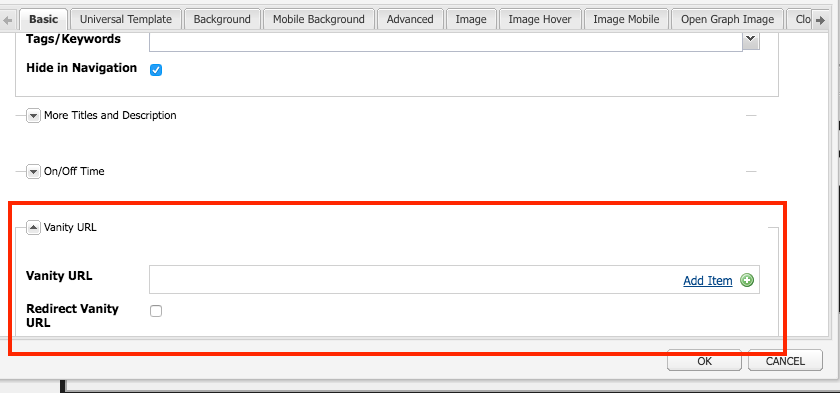

# URL mnemónicas de Dispatcher

[Tabla de contenidos](./overview.md)

[&lt;- Anterior: Vaciado de Dispatcher](./disp-flushing.md)

## Información general

Este documento le ayuda a comprender cómo AEM trata las direcciones URL mnemónicas y algunas técnicas adicionales mediante el uso de reglas de reescritura para asignar contenido más cerca del borde del envío

## ¿Qué son las URL mnemónicas?

Cuando tiene contenido que se aloja en una estructura de carpetas lógica, no siempre vive en una dirección URL de referencia fácil. Las URL mnemónicas son como accesos directos. Direcciones URL únicas o más cortas que hacen referencia al lugar donde se encuentra el contenido real.

Un ejemplo: `/aboutus` apuntó a `/content/we-retail/us/en/about-us.html`

Los autores de AEM tienen la opción de establecer propiedades de URL mnemónicas en un fragmento de contenido en AEM y publicarlo.

Para que funcione, debe ajustar los filtros de Dispatcher para permitir el elemento mnemónico. Esto no es razonable con el ajuste de los archivos de configuración de Dispatcher a la velocidad que los autores tendrían para configurar estas entradas de página mnemónicas.

Por este motivo, el módulo de Dispatcher tiene una función para permitir automáticamente cualquier elemento enumerado como mnemónico en el árbol de contenido.


## Funcionamiento

### Creación de URL mnemónicas

El autor visita una página en AEM, hace clic en las propiedades de la página y agrega entradas en la sección _URL de vanidad_. Al guardar los cambios y activar la página, el elemento mnemónico se asigna a la página.

Los autores también pueden seleccionar la casilla de verificación _Redirigir URL mnemónica_ al agregar _entradas de URL mnemónica_, esto hace que las URL mnemónicas se comporten como redirecciones 302. Significa que se le indica al explorador que vaya a la nueva URL (a través del encabezado de respuesta `Location`) y el explorador realiza una nueva solicitud a la nueva URL.

#### IU táctil:


#### Buscador de contenido clásico:





>[!NOTE]
>
>Comprenda que esto es propenso a problemas del área de nombres. Las entradas mnemónicas son globales para todas las páginas. Esta es solo una de las deficiencias que debe planificar para encontrar algunas soluciones que explicaremos más adelante.


## Asignación/resolución de recursos

Cada entrada mnemónica es una entrada de mapa sling para una redirección interna.

Los mapas se pueden ver en la consola Felix de instancias de AEM ( `/system/console/jcrresolver` )

Esta es una captura de pantalla de una entrada de mapa creada por una entrada mnemónica:


En el ejemplo anterior, cuando solicitamos a la instancia de AEM que visite `/aboutus`, se resuelve en `/content/we-retail/us/en/about-us.html`

## Dispatcher permite filtros automáticamente

Dispatcher en un estado seguro filtra las solicitudes en la ruta de acceso `/` a través de Dispatcher porque esa es la raíz del árbol JCR.

Es importante asegurarse de que los editores solo permiten contenido de `/content` y otras rutas de acceso seguras, y así sucesivamente, y no rutas de acceso como `/system`.

Aquí están las URL mnemónicas activas en la carpeta base de `/`. ¿Cómo les permitimos llegar a los editores mientras se mantienen seguros?

Dispatcher simple tiene un mecanismo de autorización de filtro automático y debe instalar un paquete de AEM y luego configurar Dispatcher para que apunte a esa página del paquete.

[https://experience.adobe.com/#/downloads/content/software-distribution/en/aem.html?package=/content/software-distribution/en/details.html/content/dam/aem/public/adobe/packages/granite/vanityurls-components](https://experience.adobe.com/#/downloads/content/software-distribution/es/aem.html?package=/content/software-distribution/en/details.html/content/dam/aem/public/adobe/packages/granite/vanityurls-components)

Dispatcher tiene una sección de configuración en su archivo de granja de servidores:

```
/vanity_urls { 
    /url    "/libs/granite/dispatcher/content/vanityUrls.html" 
    /file   "/tmp/vanity_urls" 
    /delay  300 
}
```

El parámetro `/delay`, medido en segundos, no funciona en base a un intervalo fijo, sino en base a una comprobación basada en condiciones. Dispatcher evalúa la marca de tiempo de la modificación de `/file` (que almacena la lista de URL de vanidad reconocidas) al recibir una solicitud de una dirección URL no incluida. `/file` no se actualizará si la diferencia horaria entre el momento actual y la última modificación de `/file` es menor que la duración de `/delay`. La actualización de `/file` se produce bajo dos condiciones:

1. La solicitud entrante es para una dirección URL no almacenada en caché o enumerada en `/file`.
1. Han transcurrido al menos `/delay` segundos desde la última actualización de `/file`.

Este mecanismo está diseñado para protegerse contra los ataques de denegación de servicio (DoS), que de lo contrario podrían saturar a Dispatcher con solicitudes, aprovechando la función de direcciones URL mnemónicas.

En términos más simples, `/file` que contiene direcciones URL personales solo se actualiza si llega una solicitud para una dirección URL que no se encuentra ya en `/file` y si la última modificación de `/file` se produjo hace más tiempo que el período de `/delay`.

Para almacenar en déclencheur explícitamente una actualización de `/file`, puede solicitar una dirección URL inexistente después de asegurarse de que haya transcurrido el tiempo necesario de `/delay` desde la última actualización. Las direcciones URL de ejemplo para este fin incluyen:

- `https://dispatcher-host-name.com/this-vanity-url-does-not-exist`
- `https://dispatcher-host-name.com/please-hand-me-that-planet-maestro`
- `https://dispatcher-host-name.com/random-vanity-url`

Este método obliga a Dispatcher a actualizar `/file`, siempre que el intervalo `/delay` especificado haya transcurrido desde la última modificación.

Almacena su caché de la respuesta en el argumento `/file`; en este ejemplo, `/tmp/vanity_urls`

Si visita la instancia de AEM en la URL, verá lo que arroja:


Es literalmente una lista, súper simple

## Reescribir reglas como reglas mnemónicas

¿Por qué mencionamos el uso de reglas de reescritura en lugar del mecanismo predeterminado integrado en AEM como se describe más arriba?

Se explican sencillamente los problemas de área de nombres, rendimiento y lógica de nivel superior que se pueden gestionar mejor.

Veamos un ejemplo de la entrada mnemónica `/aboutus` de su contenido `/content/we-retail/us/en/about-us.html` mediante el módulo `mod_rewrite` de Apache para lograr esto.

```
RewriteRule ^/aboutus /content/we-retail/us/en/about-us.html [PT,L,NC]
```

Esta regla busca el elemento mnemónico `/aboutus` y obtiene la ruta de acceso completa del procesador con el indicador PT (Pasar).

También detiene el procesamiento de todas las demás reglas del indicador L (Última), lo que significa que no tiene que atravesar una enorme lista de reglas como la resolución JCR.

Además de no tener que representar la solicitud y esperar a que el editor de AEM responda a estos dos elementos de este método, se hace mucho más eficaz.

A continuación, la cereza del pastel aquí es el indicador NC (sin distinción de mayúsculas y minúsculas), lo que significa que si un cliente escribe la URI con `/AboutUs` en lugar de `/aboutus`, aún funciona.

Para crear una regla de reescritura, debe crear un archivo de configuración en Dispatcher (ejemplo: `/etc/httpd/conf.d/rewrites/examplevanity_rewrite.rules`) e incluirlo en el archivo `.vhost` que administra el dominio que necesita aplicar estas URL mnemónicas.

Este es un ejemplo de fragmento de código de inclusión dentro de `/etc/httpd/conf.d/enabled_vhosts/we-retail.vhost`

```
<VirtualHost *:80> 
 ServerName weretail.com 
 ServerAlias www.weretail.com 
        ........ SNIP ........ 
 <IfModule mod_rewrite.c> 
  ReWriteEngine on 
  LogLevel warn rewrite:info 
  Include /etc/httpd/conf.d/rewrites/examplevanity_rewrite.rules 
 </IfModule> 
        ........ SNIP ........ 
</VirtualHost>
```

## Qué método y dónde

El uso de AEM para controlar las entradas personales ofrece las siguientes ventajas

- Los autores pueden crearlos sobre la marcha
- Se alojan con el contenido y se pueden empaquetar con este

El uso de `mod_rewrite` para controlar las entradas personales ofrece las siguientes ventajas

- Resolución de contenido más rápida
- Más cerca del límite de las solicitudes de contenido de usuario final
- Más extensibilidad y opciones para controlar cómo se asigna el contenido a otras condiciones
- Puede distinguir entre mayúsculas y minúsculas

Utilice ambos métodos, pero aquí están los consejos y criterios que debe utilizar cuando:

- Si el elemento mnemónico es temporal y tiene un tráfico planificado bajo, use la función integrada de AEM
- Si el elemento mnemónico es un extremo básico que no cambia con frecuencia y tiene uso frecuente, use una regla `mod_rewrite`.
- Si el área de nombres mnemónica (por ejemplo: `/aboutus`) debe reutilizarse para muchas marcas en la misma instancia de AEM, utilice reglas de reescritura.

>[!NOTE]
>
>Si desea utilizar la función mnemónica de AEM y evitar el área de nombres, puede crear una convención de nombres. Utilizando direcciones URL mnemónicas anidadas como `/brand1/aboutus`, `brand2/aboutus`, `brand3/aboutus`.

[Siguiente -> Registro común](./common-logs.md)
