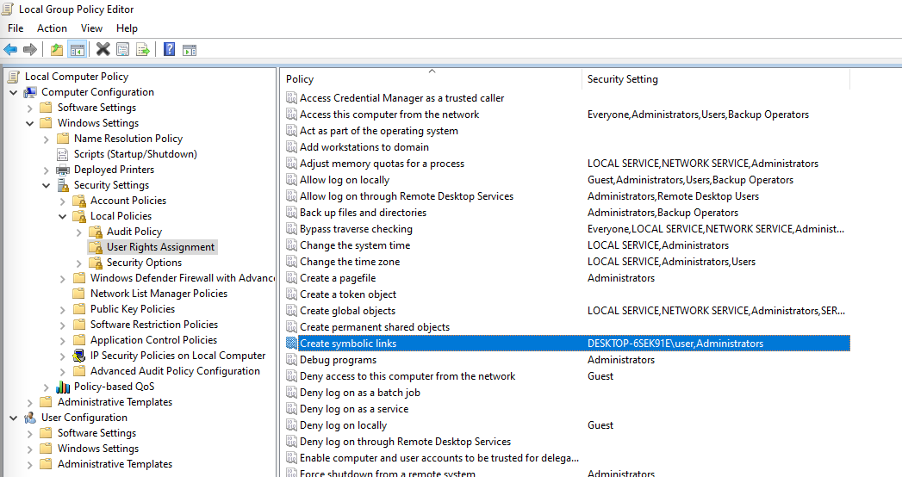

# Adición de enlaces simbólicos a GIT

[Tabla de contenidos](./overview.md)

[&lt;- Anterior: Comprobación de estado de Dispatcher](./health-check.md)

En AMS, obtendrá un repositorio GIT rellenado previamente que contiene el código fuente de su distribuidor listo para iniciar el desarrollo y la personalización.

Después de crear el primer archivo de `.vhost` o el archivo de nivel superior `farm.any`, deberá crear un vínculo simbólico del directorio `available_*` al directorio `enabled_*`. El uso del tipo de vínculo adecuado será clave para una implementación correcta a través de la canalización de Cloud Manager. Esta página le ayudará a saber cómo hacerlo.

## Arquetipo de Dispatcher

El desarrollador de AEM inicia su proyecto normalmente desde el [arquetipo de AEM](https://github.com/adobe/aem-project-archetype)

A continuación, se muestra un ejemplo del área del código fuente donde puede ver los enlaces simbólicos utilizados:

```
$ tree dispatcher
dispatcher
└── src
   ├── conf.d
.....SNIP.....
    │   └── available_vhosts
    │   │   ├── 000_unhealthy_author.vhost
    │   │   ├── 000_unhealthy_publish.vhost
    │   │   ├── aem_author.vhost
    │   │   ├── aem_flush.vhost
    │   │   ├── aem_health.vhost
    │   │   ├── aem_lc.vhost
    │   │   └── aem_publish.vhost
    └── dispatcher_vhost.conf
    │   └── enabled_vhosts
    │   │   ├── aem_author.vhost -> ../available_vhosts/aem_author.vhost
    │   │   ├── aem_flush.vhost -> ../available_vhosts/aem_flush.vhost
    │   │   ├── aem_health.vhost -> ../available_vhosts/aem_health.vhost
    │   │   └── aem_publish.vhost -> ../available_vhosts/aem_publish.vhost
.....SNIP.....
    └── conf.dispatcher.d
    │   ├── available_farms
    │   │   ├── 000_ams_author_farm.any
    │   │   ├── 001_ams_lc_farm.any
    │   │   └── 002_ams_publish_farm.any
.....SNIP.....
    │   └── enabled_farms
    │   │   ├── 000_ams_author_farm.any -> ../available_farms/000_ams_author_farm.any
    │   │   └── 002_ams_publish_farm.any -> ../available_farms/002_ams_publish_farm.any
.....SNIP.....
17 directories, 60 files
```

Por ejemplo, el directorio `/etc/httpd/conf.d/available_vhosts/` contiene los archivos `.vhost` potenciales clasificados que podemos usar en nuestra configuración en ejecución.

Los archivos habilitados `.vhost` se mostrarán como una ruta de acceso relativa `symlinks` dentro del directorio `/etc/httpd/conf.d/enabled_vhosts/`.

## Creación de un enlace simbólico

Utilizamos vínculos simbólicos al archivo para que el servidor web Apache trate el archivo de destino como el mismo archivo.  No se desea duplicar el archivo en ambos directorios.  En su lugar, solo un acceso directo de un directorio (vínculo simbólico) al otro.

Tenga en cuenta que las configuraciones implementadas se dirigirán a un host Linux.  La creación de un enlace simbólico que no sea compatible con el sistema de destino provocará fallos y resultados no deseados.

Si su estación de trabajo no es una máquina Linux, probablemente se preguntará qué comandos utilizar para crear estos vínculos correctamente para que puedan enviarlos a GIT.

> `TIP:` Es importante usar vínculos relativos porque si instaló una copia local de Apache Webserver y tenía una base de instalación diferente, los vínculos seguirían funcionando.  Si utiliza una ruta absoluta, la estación de trabajo u otros sistemas tendrán que coincidir con la misma estructura de directorio exacta.

### OSX/Linux

Los enlaces simbólicos son nativos de estos sistemas operativos y aquí hay algunos ejemplos de cómo crearlos.  Abra su aplicación de terminal favorita y utilice los siguientes comandos de ejemplo para crear el vínculo:

```
$ cd <LOCATION OF CLONED GIT REPO>\src\conf.d\enabled_vhosts
$ ln -s ../available_vhosts/<Destination File Name> <Target File Name>
```

Este es un ejemplo de comando rellenado como referencia:

```
$ git clone https://github.com/adobe/aem-project-archetype.git
$ cd aem-project-archetype/src/main/archetype/dispatcher.ams/src/conf.d/enabled_vhosts/
$ ln -s ../available_vhosts/aem_flush.vhost aem_flush.vhost
```

Este es un ejemplo del vínculo ahora, si enumera el archivo con el comando `ls`:

```
ls -l
total 0
lrwxrwxrwx. 1 root root 35 Oct 13 21:38 aem_flush.vhost -> ../available_vhosts/aem_flush.vhost
```

### Windows

> `Note:` Resulta que MS Windows (mejor, NTFS) admite vínculos simbólicos ya que... ¡Windows Vista!


> `Warning:`: el comando mklink para crear enlaces simbólicos requiere privilegios de administrador para ejecutarse correctamente. Incluso como cuenta de administrador, deberá ejecutar el Símbolo del sistema &quot;Como administrador&quot; a menos que tenga habilitado el modo de desarrollador
> <br/>Permisos inadecuados:
> 
> <br/>Permisos adecuados:
> 

Estos son los comandos para crear el vínculo:

```
C:\<PATH TO SRC>\enabled_vhosts> mklink <Target File Name> ..\available_vhosts\<Destination File Name>
```


Este es un ejemplo de comando rellenado como referencia:

```
C:\> git clone https://github.com/adobe/aem-project-archetype.git
C:\> cd aem-project-archetype\src\main\archetype\dispatcher.ams\src\conf.d\enabled_vhosts\
C:\aem-project-archetype\src\main\archetype\dispatcher.ams\src\conf.d\enabled_vhosts> mklink aem_flush.vhost ..\available_vhost\aem_flush.vhost
symbolic link created for aem_flush.vhost <<===>> ..\available_vhosts\aem_flush.vhost
```

#### Modo de desarrollador ( Windows 10 )

Cuando se pone en [Modo de desarrollador](https://docs.microsoft.com/en-us/windows/apps/get-started/enable-your-device-for-development), Windows 10 le permite probar más fácilmente las aplicaciones que está desarrollando, usar el entorno de shell de Ubuntu Bash, cambiar una variedad de configuraciones centradas en el desarrollador y hacer otras cosas por el estilo.

Microsoft parece seguir añadiendo funciones al modo de desarrollador o habilitando algunas de ellas de forma predeterminada una vez que alcanzan una adopción más generalizada y se consideran estables (por ejemplo, con la actualización de los creadores, el entorno de Ubuntu Bash Shell ya no necesita el modo de desarrollador).

¿Qué pasa con los enlaces simbólicos? Con el modo de desarrollador HABILITADO, no es necesario ejecutar un símbolo del sistema con privilegios elevados para poder crear enlaces simbólicos. Por lo tanto, una vez habilitado el modo de desarrollador, cualquier usuario puede crear enlaces simbólicos.

> Después de habilitar el modo de desarrollador, los usuarios deben cerrar la sesión o iniciarla para que los cambios surtan efecto.

Ahora puede ver que el comando funciona sin ejecutarse como administrador


#### Enfoque alternativo/programático

Existe una directiva específica que puede permitir a determinados usuarios crear vínculos simbólicos → [Crear vínculos simbólicos (Windows 10) - Seguridad de Windows | Documentos de Microsoft](https://docs.microsoft.com/en-us/windows/security/threat-protection/security-policy-settings/create-symbolic-links)

Profesionales:
- Los clientes podrían aprovechar esto para permitir mediante programación la creación de vínculos simbólicos a todos los desarrolladores dentro de su organización (es decir, Active Directory) sin tener que habilitar el modo de desarrollador manualmente en cada dispositivo.
- Además, esta directiva debería estar disponible en versiones anteriores de MS Windows que no ofrezcan el modo de desarrollador.

CONs:
- Esta directiva parece no tener ningún efecto en los usuarios que pertenecen al grupo Administradores. Los administradores seguirían teniendo que ejecutar el Símbolo del sistema con privilegios elevados. Qué raro.

> Se requerirá el cierre de sesión del usuario o el inicio de sesión para que surtan efecto los cambios en la directiva local o de grupo.

Ejecute `gpedit.msc`, agregue o cambie usuarios según sea necesario. Los administradores están allí de forma predeterminada



#### Habilitar enlaces simbólicos en GIT

Git gestiona los enlaces simbólicos según la opción core.symlinks

Source: [Git: documentación de git-config](https://git-scm.com/docs/git-config#Documentation/git-config.txt-coresymlinks)

*Si core.symlinks es false, los vínculos simbólicos se extraen como pequeños archivos sin formato que contienen el texto del vínculo. `git-update-index[1]` y `git-add[1]` no cambiarán el tipo registrado a archivo normal. Útil en sistemas de archivos como FAT que no admiten enlaces simbólicos.
El valor predeterminado es true, excepto `git-clone[1]` o `git-init[1] will probe and set core.symlinks false if appropriate when the repository is created.`. En la mayoría de los casos, Git supondrá que Windows no es bueno para los enlaces simbólicos y lo establecerá en false.*

El comportamiento de Git en Windows se explica aquí: Vínculos simbólicos · Wiki de Git-for-windows/Git · GitHub

> `Info`: Las suposiciones enumeradas en la documentación enlazada arriba parecen ser correctas con una posible configuración de AEM Developer en Windows, sobre todo NTFS y el hecho de que solo tenemos enlaces simbólicos de archivo vs. enlaces simbólicos de directorio

Estas son las buenas noticias: desde [Git para Windows versión 2.10.2](https://github.com/git-for-windows/git/releases/tag/v2.10.2.windows.1), el instalador tiene una opción [explícita para habilitar la compatibilidad con vínculos simbólicos.](https://github.com/git-for-windows/git/issues/921)

> `Warning`: la opción core.symlink se puede proporcionar en tiempo de ejecución mientras se clona el repositorio, o bien se puede almacenar como una configuración global.


Git para Windows almacenará las preferencias globales en `"C:\Program Files\Git\etc\gitconfig"` Es posible que otras aplicaciones cliente de escritorio de Git no consideren esta configuración.
Este es el truco, no todos los desarrolladores utilizarán el cliente nativo de Git (es decir, Git Cmd, Git Bash), y algunas de las aplicaciones de escritorio de Git (por ejemplo, GitHub Desktop, Atlassian Sourcetree) pueden tener diferentes configuraciones/valores predeterminados para usar System o un Git incrustado

Este es un ejemplo de lo que hay dentro del archivo `gitconfig`

```
[diff "astextplain"]
    textconv = astextplain
[filter "lfs"]
    clean = git-lfs clean -- %f
    smudge = git-lfs smudge -- %f
    process = git-lfs filter-process
    required = true
[http]
    sslBackend = openssl
    sslCAInfo = C:/Program Files/Git/mingw64/ssl/certs/ca-bundle.crt
[core]
    autocrlf = true
    fscache = true
    symlinks = true
[pull]
    rebase = false
[credential]
    helper = manager-core
[credential "https://dev.azure.com"]
    useHttpPath = true
[init]
    defaultBranch = master
```

#### Consejos de línea de comandos Git

Puede haber casos en los que tenga que crear nuevos vínculos simbólicos (por ejemplo, agregar un nuevo vhost o una nueva granja).

En la documentación anterior hemos visto que Windows ofrece un comando &quot;mklink&quot; para crear vínculos simbólicos.

Si trabaja en un entorno de Git Bash, puede usar en su lugar el comando estándar de Bash `ln -s`, pero tendrá que ir precedido de una instrucción especial como la que se muestra a continuación:

```
MSYS=winsymlinks:nativestrict ln -s test_vhost_symlink ../dispatcher/src/conf.d/available_vhosts/default.vhost
```

#### Resumen

Para que Git administre los enlaces simbólicos correctamente (al menos para el ámbito de la línea de base de la configuración actual de AEM Dispatcher) en un sistema operativo Microsoft Windows, necesitará:

| Elemento | Versión/configuración mínima | Versión y configuración recomendadas |
|------|---------------------------------|-------------------------------------|
| Sistema operativo | Windows Vista o posterior | Windows 10 Creator Update o posterior |
| Sistema de archivos | NTFS | NTFS |
| Capacidad para gestionar enlaces simbólicos para el usuario de Windows | `"Create symbolic links"` grupo/directiva local `under "Group Computer Configuration\Windows Settings\Security Settings\Local Policies\User Rights Assignment"` | Modo de desarrollador de Windows 10 habilitado |
| GIT | Versión de cliente nativa 1.5.3 | Native Client versión 2.10.2 o posterior |
| Configuración de Git | Opción `--core.symlinks=true` al hacer un clon de Git desde la línea de comandos | Configuración global de Git<br/>`[core]`<br/>    symlinks = true <br/> Ruta de configuración nativa del cliente Git: `C:\Program Files\Git\etc\gitconfig` <br/>Ubicación estándar para clientes de Git Desktop: `%HOMEPATH%\.gitconfig` |

> `Note:` Si ya tiene un repositorio local, deberá clonar de nuevo desde el origen. Puede clonar en una nueva ubicación y fusionar manualmente los cambios locales no confirmados/no clasificados en el repositorio recién clonado.
