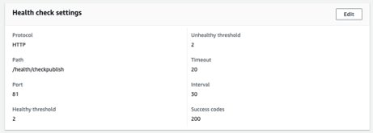
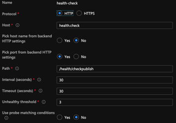

# Comprobación de estado de AMS Dispatcher

[Tabla de contenidos](./overview.md)

[&lt;- Anterior: Archivos de solo lectura](./immutable-files.md)

Cuando tiene una línea de base de AMS instalada en Dispatcher, viene con algunas regalías.  Una de estas características es un conjunto de secuencias de comandos de comprobación de estado.
AEM Estos scripts permiten al equilibrador de carga que se encuentra delante de la pila de la saber qué patas están en buen estado y mantenerlas en servicio.


## Comprobación del estado del equilibrador de carga básico

AEM Cuando el tráfico de los clientes llega a través de Internet para llegar a su instancia de, pasará a través de un equilibrador de carga


Cada solicitud que llegue a través del equilibrador de carga se redondeará a cada instancia.  El equilibrador de carga tiene un mecanismo de comprobación de estado integrado para asegurarse de que envía tráfico a un host en buen estado.

La comprobación predeterminada suele ser un puerto para ver si los servidores a los que se dirige el equilibrador de carga están escuchando cuando se enciende el tráfico del puerto (es decir, TCP 80 y 443)

> `Note:` AEM Aunque esto funciona, no tiene un indicador real de si la es saludable.  Solo prueba si Dispatcher (servidor web Apache) está en funcionamiento.

## AMS Health Check

AEM Para evitar el envío de tráfico a un distribuidor en buen estado que se encuentra frente a una instancia de en mal estado, AMS creó algunos extras que evalúan el estado del segmento y no solo el de Dispatcher.


La comprobación de estado consta de los siguientes elementos
- 1 `Load balancer`
- 1 `Apache web server`
- 3 `Apache *VirtualHost* config files`
- 5 `CGI-Bin scripts`
- 1 `AEM instance`
- 1 `AEM package`

Cubriremos para qué está configurada cada pieza y su importancia

### AEM Paquete de

AEM Para indicar si está funcionando, necesita que haga una compilación básica de la página y sirva a la página.  Adobe Managed Services ha creado un paquete básico que contiene la página de prueba.  La página prueba que el repositorio está activo y que los recursos y la plantilla de página se pueden procesar.


Esta es la página.  Muestra el ID del repositorio de la instalación


> `Note:` Nos aseguramos de que la página no se pueda almacenar en caché.  No comprobaría el estado real si cada vez que devuelve una página en caché.

AEM Este es el punto final de peso ligero que podemos probar para ver que el está funcionando.

### Configuración del equilibrador de carga

Configuramos los equilibradores de carga para que apunten a un extremo CGI-BIN en lugar de utilizar una comprobación de puerto.





### Hosts virtuales de comprobación de estado de Apache

#### Host virtual CGI-BIN `(/etc/httpd/conf.d/available_vhosts/ams_health.vhost)`

Este es el `<VirtualHost>` Archivo de configuración de Apache que permite ejecutar los archivos CGI-Bin.

```
Listen 81
<VirtualHost *:81>
    ServerName	"health"
    ...SNIP...
    ScriptAlias /health/ "/var/www/cgi-bin/health/"
</VirtualHost>
```

> `Note:` los archivos cgi-bin son scripts que se pueden ejecutar.  Este puede ser un vector de ataque vulnerable y los scripts que utiliza AMS no son de acceso público y solo están disponibles para que los pruebe el equilibrador de carga.


#### Hosts virtuales de mantenimiento incorrecto

- `/etc/httpd/conf.d/available_vhosts/000_unhealthy_author.vhost`
- `/etc/httpd/conf.d/available_vhosts/000_unhealthy_publish.vhost`

Estos archivos tienen el nombre `000_` como prefijo a propósito.  Se configura intencionadamente para utilizar el mismo nombre de dominio que el sitio activo.  AEM La intención es que este archivo se habilite cuando la comprobación de estado detecte un problema con uno de los backends de la interfaz de usuario de la interfaz de usuario de la interfaz de usuario de la interfaz de usuario de la interfaz de usuario.  A continuación, ofrezca una página de error en lugar de solo un código de respuesta HTTP 503 sin página.  Robará el tráfico de lo normal `.vhost` porque se carga antes de eso `.vhost` mientras se comparte el mismo archivo `ServerName` o `ServerAlias`.  Esto hace que las páginas destinadas a un dominio en particular vayan al vhost en mal estado en lugar del predeterminado por el que fluye su tráfico normal.

Cuando se ejecutan los scripts de comprobación de estado, cierran la sesión de su estado actual.  Una vez por minuto, se ejecuta un trabajo de comando en el servidor que busca entradas que no están en buen estado en el registro.  AEM Si detecta que la instancia del autor no está en buen estado, habilitará el enlace simbólico:

Entrada de registro:

```
# grep "ERROR\|publish" /var/log/lb/health_check.log
E, [2022-11-23T20:13:54.984379 #26794] ERROR -- : AUTHOR -- Exception caught: Connection refused - connect(2)
I, [2022-11-23T20:13:54.984403 #26794]  INFO -- : [checkpublish]-author:0-publish:1-[checkpublish]
```

Cron recoge el error y reacciona:

```
# grep symlink /var/log/lb/health_check_reload.log
I, [2022-11-23T20:34:19.213179 #2275]  INFO -- : ADDING VHOST symlink /etc/httpd/conf.d/available_vhosts/000_unhealthy_author.vhost => /etc/httpd/conf.d/enabled_vhosts/000_unhealthy_author.vhost
```

Puede controlar si los sitios de autor o publicados pueden tener este error al cargar la página configurando la configuración del modo de recarga en `/var/www/cgi-bin/health_check.conf`

```
# grep RELOAD_MODE /var/www/cgi-bin/health_check.conf
RELOAD_MODE='author'
```

Opciones válidas:
- autor
   - Esta es la opción predeterminada.
   - Esto creará una página de mantenimiento para el autor cuando no esté en buen estado
- publicación
   - Esta opción creará una página de mantenimiento para el editor cuando no esté en buen estado
- todo
   - Esta opción creará una página de mantenimiento para el autor, el editor o ambos si no están en buen estado
- ninguno
   - Esta opción omite esta característica de la comprobación de estado

Al consultar el `VirtualHost` configurando para estos verá que cargan el mismo documento como una página de error para cada solicitud que llega cuando está habilitada:

```
<VirtualHost *:80>
	ServerName	unhealthyauthor
	ServerAlias	${AUTHOR_DEFAULT_HOSTNAME}
	ErrorDocument	503 /error.html
	DocumentRoot	/mnt/var/www/default
	<Directory />
		Options FollowSymLinks
		AllowOverride None
	</Directory>
	<Directory "/mnt/var/www/default">
		AllowOverride None
		Require all granted
	</Directory>
	<IfModule mod_headers.c>
		Header always add X-Dispatcher ${DISP_ID}
		Header always add X-Vhost "unhealthy-author"
	</IfModule>
	<IfModule mod_rewrite.c>
		ReWriteEngine   on
		RewriteCond %{REQUEST_URI} !^/error.html$
		RewriteRule ^/* /error.html [R=503,L,NC]
	</IfModule>
</VirtualHost>
```

El código de respuesta sigue siendo un `HTTP 503`

```
# curl -I https://we-retail.com/
HTTP/1.1 503 Service Unavailable
X-Dispatcher: dispatcher1useast1
X-Vhost: unhealthy-author
```

En lugar de una página en blanco, obtendrán esta página.


### Scripts CGI-Bin

Hay 5 scripts diferentes que su CSE puede configurar en la configuración del equilibrador de carga para cambiar el comportamiento o los criterios a la hora de extraer un Dispatcher del equilibrador de carga.

#### /bin/checkauthor

Cuando se use, esta secuencia de comandos comprobará y registrará todas las instancias a las que esté dirigida, pero solo devolverá un error si la variable `author` AEM La instancia de no es saludable

> `Note:` AEM AEM Tenga en cuenta que si la instancia de publicación no estaba en buen estado, Dispatcher permanecería en servicio para permitir que el tráfico fluya a la instancia de creación de la instancia de

#### /bin/checkpublish (predeterminado)

Cuando se use, esta secuencia de comandos comprobará y registrará todas las instancias a las que esté dirigida, pero solo devolverá un error si la variable `publish` AEM La instancia de no es saludable

> `Note:` AEM AEM Tenga en cuenta que si la instancia de creación de la instancia no estaba en buen estado, Dispatcher permanecería en servicio para permitir que el tráfico fluya a la instancia de publicación

#### /bin/checkEither

Cuando se use, esta secuencia de comandos comprobará y registrará todas las instancias a las que esté dirigida, pero solo devolverá un error si la variable `author` o el `publisher` AEM La instancia de no es saludable

> `Note:` AEM AEM Tenga en cuenta que si la instancia de publicación de la o la instancia de creación de la instancia no estaba en buen estado, Dispatcher se retiraría del servicio.  Lo que significa que si uno de ellos estaba en buen estado, tampoco recibiría tráfico

#### /bin/checkboth

Cuando se use, esta secuencia de comandos comprobará y registrará todas las instancias a las que esté dirigida, pero solo devolverá un error si la variable `author` y el `publisher` AEM Las instancias no son saludables

> `Note:` AEM AEM Tenga en cuenta que si la instancia de publicación o de creación de la instancia de de publicación no estaba en buen estado, Dispatcher no se retiraría del servicio.  Lo que significa que si uno de ellos no estaba en buen estado, seguiría recibiendo tráfico y daría errores a las personas que solicitaban recursos.

#### /bin/healthy

AEM Cuando se use, esta secuencia de comandos comprobará y registrará cualquier instancia que esté delante, pero devolverá un estado saludable independientemente de si se devuelve o no un error o no un error.

> `Note:` AEM Esta secuencia de comandos se utiliza cuando la comprobación de estado no funciona como se desea y permite que una anulación mantenga las instancias de la en el equilibrador de carga.

[Siguiente -> GIT Symlinks](./git-symlinks.md)
