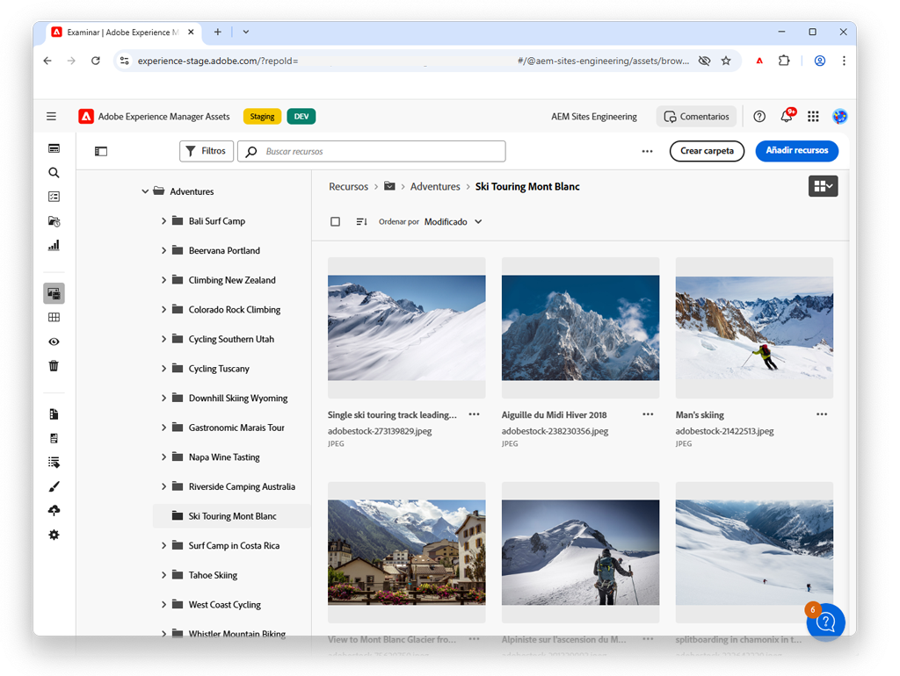

# AEM Assets Essentials

Experience Manager Assets Essentials proporciona una interfaz de usuario optimizada para una colaboración y administración de recursos liviana.

Consulte nuestros vídeos sobre cómo utilizar Assets Essentials para gestionar sus recursos, así como cómo se puede integrar con Adobe Recorrido Orchestrator!

<table>
<td>
   
   

      <a href="./basics/managing.md">
      <strong>Introducción a Assets Essentials</strong>
      </a>
   

   

      <em>Conozca los conceptos básicos de cómo Assets Essentials!</em>
   

</td>
<!--
<td>
   
   

      <a href="./provisioning/getting-access.md">
      <strong>Creative Cloud and Assets Essentials</strong>
      </a>
   

   

      <em>Learn how Assets Essentials can integrate with your Creative Cloud Enterprise Libraries!</em>
   

</td>
-->
<td>
   
   

      <a href="https://experienceleague.adobe.com/docs/journey-optimizer/using/create-messages/assets-essentials.html">
      <strong>Adobe Journey Optimizer</strong>
      </a>
   

   

      <em>Descubra cómo Assets Essentials se integra con Adobe Journey Optimizer!</em>
   

</td>
</table>
