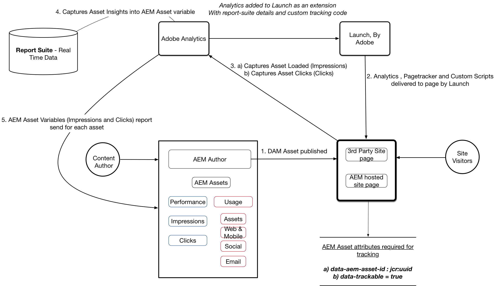

# Configurar perspectivas de recursos con AEM Assets y Adobe Experience Platform Launch

En esta serie de vídeos de 5 partes, analizamos la configuración y configuración de Asset Insights para Experience Manager implementados mediante Adobe Launch.

## Parte 1: Información general de perspectivas de recursos {#overview}

Información general de perspectivas de recursos. Instale los componentes principales, el componente de imagen de muestra y otros paquetes de contenido para preparar el entorno.

>[!VIDEO](https://video.tv.adobe.com/v/25943/?quality=12&learn=on)

### Diagrama de arquitectura {#architecture-diagram}



>[!CAUTION]
>
>Asegúrese de descargar la [última versión de Componentes principales](https://github.com/adobe/aem-core-wcm-components) para su implementación.

El vídeo utiliza Core Components v2.2.2, que ya no es la última versión; asegúrese de utilizar la versión más reciente antes de pasar a la siguiente sección.

* Descargar [Contenido de imagen de muestra de Asset Insights](./assets/asset-insights-launch-tutorial/aem-assets-insights-sample.zip)
* Descargue [los últimos componentes principales de AEM WCM](https://github.com/adobe/aem-core-wcm-components/releases)

## Parte 2 : Activación del seguimiento de perspectivas de recursos para el componente de imagen de muestra {#sample-image-component-asset-insights}

Mejoras en los componentes principales y el uso del componente proxy (componente de imagen de muestra) para las perspectivas de recursos. Edición de las directivas de plantilla de página de contenido para habilitar el componente de imagen de muestra para el sitio de referencia.

>[!VIDEO](https://video.tv.adobe.com/v/25944/?quality=12&learn=on)

>[!NOTE]
>
>El componente principal de imagen incluye la capacidad de desactivar el seguimiento UUID desactivando el seguimiento del UUID del recurso (valor de identificador único para un nodo creado en JCR)

El componente Imagen principal utiliza el atributo ***data-asset-id*** dentro del atributo principal &lt;div> de una etiqueta de imagen para habilitar/deshabilitar esta función. El componente proxy anula el componente principal con los siguientes cambios.

* Quita el ***data-asset-id*** del div principal de un elemento &lt;img> dentro de image.html
* Añade ***data-aem-asset-id*** directamente al elemento &lt;img> dentro de image.html
* Añade el valor ***data-trackable=&#39;true&#39;*** en el elemento &lt;img> dentro de image.html
* ***data-aem-asset-*** idand  ***data-trackable=&#39;true&#39;*** se mantienen en el mismo nivel de nodo

>[!NOTE]
>
>*data-aem-asset-id=&#39;image.UUID&#39;* y  *data-trackable=&#39;true&#39;* son los atributos clave que deben estar presentes en las impresiones de recursos. Para las perspectivas de clics en recursos, además de los atributos de datos anteriores presentes en la etiqueta &lt;img>, la etiqueta principal &lt;a> debe tener un valor href válido.

## Parte 3: Adobe Analytics — Creación de grupos de informes, habilitación de la recopilación de datos en tiempo real y el Sistema de informes de AEM Assets {#adobe-analytics-asset-insights}

El grupo de informes con recopilación de datos en tiempo real se crea para el seguimiento de recursos. La configuración de AEM Assets Insights se configura con las credenciales de Adobe Analytics.

>[!VIDEO](https://video.tv.adobe.com/v/25945/?quality=12&learn=on)

>[!NOTE]
Es necesario habilitar la recopilación de datos en tiempo real y AEM Sistema de informes de recursos para el grupo de informes de Adobe Analytics. Habilitar AEM Sistema de informes de recursos reserva variables de análisis para el seguimiento de perspectivas de recursos.

Para la configuración de AEM Assets Insights necesita las siguientes credenciales

* Centro de datos
* Nombre de Compañía de Analytics
* Nombre de usuario de Analytics
* Shared Secret (puede obtenerse en *Adobe Analytics > Administración > Configuración de Compañía > Servicio Web*).
* Grupo de informes (asegúrese de seleccionar el grupo de informes correcto que se utiliza para el Sistema de informes de recursos)

## Parte 4: Uso de Adobe Experience Platform Launch para agregar la extensión de Adobe Analytics {#part-using-launch-by-adobe-for-adding-adobe-analytics-extension}

Añadir Adobe Analytics Extension, crear reglas de carga de página e integrar AEM con Launch con la cuenta técnica de Adobe IMS.

>[!VIDEO](https://video.tv.adobe.com/v/25946/?quality=12&learn=on)

>[!NOTE]
Asegúrese de replicar todos los cambios de la instancia de autor a la instancia de publicación.

### Regla 1: Rastreador de páginas (pagetracker.js) {#rule-page-tracker-pagetracker-js}

```javascript
//For AEM 6.3
<script type="text/javascript" src="http://localhost:4503/etc/clientlibs/foundation/assetinsights/pagetracker.js"></script>
```

```javascript
//For AEM 6.4
<script type="text/javascript" src="http://localhost:4503/etc.clientlibs/dam/clientlibs/assetinsights/pagetracker.js"></script>
```

El rastreador de páginas implementa dos llamadas de retorno (registradas en el código incrustado del recurso)

* **\&lt;code>assetAnalytics.core.assetLoaded\&lt;/code>** &lt;code>&lt;code>: se llama cuando se envía el evento &#39;load&#39; para el elemento de DOM-asset.&lt;/code>&lt;/code>
* **\&lt;code>assetAnalytics.core.assetHaga clic\&lt;/code>** &lt;code>&lt;code>: cuando se envía el evento &#39;click&#39; para el elemento de DOM del recurso, esto solo es relevante cuando el elemento de DOM del recurso tiene una etiqueta de anclaje como elemento principal con un atributo &#39;href&#39; externo válido&lt;/code>&lt;/code>

Finalmente, Pagetracker implementa una función de inicialización como.

* **\&lt;code>assetAnalytics.dispatcher.init()\&lt;/code>** &lt;code>&lt;code>: se llama para inicializar el componente Pagetracker.&lt;/code>&lt;/code> Esto DEBE invocarse antes de que se genere desde la página web cualquiera de los eventos de perspectivas de recursos (impresiones y/o clics).
* **\&lt;code>assetAnalytics.dispatcher.init()\&lt;/code>** &lt;code>&lt;code>: opcionalmente acepta un objeto AppMeasurement — si se proporciona, no intenta crear una nueva instancia del objeto AppMeasurement.&lt;/code>&lt;/code>

### Artículo 2: Rastreador de imágenes — Acción 1 (asset-insights.js) {#rule-image-tracker-action-asset-insights-js}

```javascript
/*
 * AEM Asset Insights
 */

var sObj = window.s;
_satellite.notify('in assetAnalytics customInit');
(function initializeAssetAnalytics() {
 if ((!!window.assetAnalytics) && (!!assetAnalytics.dispatcher)) {
 _satellite.notify('assetAnalytics ready');
 /** NOTE:
  Copy over the call to 'assetAnalytics.dispatcher.init()' from Assets Pagetracker
  Be mindful about changing the AppMeasurement object as retrieved above.
  */
 assetAnalytics.dispatcher.init(
                                "",  /** RSID to send tracking-call to */
                                "",  /** Tracking Server to send tracking-call to */
                                "",  /** Visitor Namespace to send tracking-call to */
                                "",  /** listVar to put comma-separated-list of Asset IDs for Asset Impression Events in tracking-call, e.g. 'listVar1' */
                                "",  /** eVar to put Asset ID for Asset Click Events in, e.g. 'eVar3' */
                                "",  /** event to include in tracking-calls for Asset Impression Events, e.g. 'event8' */
                                "",  /** event to include in tracking-calls for Asset Click Events, e.g. 'event7' */
                                sObj  /** [OPTIONAL] if the webpage already has an AppMeasurement object, please include the object here. If unspecified, Pagetracker Core shall create its own AppMeasurement object */
                                );
 sObj.usePlugins = true;
 sObj.doPlugins = assetAnalytics.core.updateContextData;
}
 else {
 _satellite.notify('assetAnalytics not available. Consider updating the Custom Page Code', 4);
 }
})();
```

### Artículo 2: Rastreador de imágenes — Acción 2 (image-tracker.js) {#rule-image-tracker-action-image-tracker-js}

```javascript
/*
 * AEM Asset Insights
 */

document.querySelectorAll('[data-aem-asset-id]').forEach(function(element) {
    assetAnalytics.core.assetLoaded(element);
    var parent = element.parentElement;
    if (parent.nodeName == "A") {
        parent.addEventListener("click", function() {
            assetAnalytics.core.assetClicked(this)
        });
    }
});
```

* assetAnalytics.core.assetLoaded() : se invoca al finalizar la carga de página y es déclencheur Impresiones de recursos para todas las imágenes rastreables
* Variable de Analytics que lleva la lista de recursos cargada: **contextData[&#39;c.a.assets.idList&#39;]**
* assetAnalytics.core.assetClicks() : se invoca cuando el elemento DOM del recurso tiene una etiqueta delimitadora con un valor href válido. Cuando se hace clic en un recurso, se crea una cookie con el ID del recurso en el que se hace clic como su valor.**(Nombre de la cookie: a.assets.clickedid)**
* Variable de Analytics que lleva la lista de recursos cargada: **contextData[&#39;c.a.assets.clickedid&#39;]**
* Fuente del Origen: **contextData[&#39;c.a.assets.source&#39;]**

### Declaraciones de depuración de consola {#console-debug-statements}

```javascript
//Launch Build Info
_satellite.buildInfo

//Enables debug messages
_satellite.setDebug(true);

//Asset Insight JS Object
assetAnalytics

//List of trackable images
document.querySelectorAll(".cmp-image__image");
```

En el vídeo se hace referencia a dos extensiones de explorador Google Chrome como formas de depurar Analytics. También hay extensiones similares disponibles para otros exploradores.

* [Iniciar la extensión de Chrome Switch](https://chrome.google.com/webstore/detail/launch-and-dtm-switch/nlgdemkdapolikbjimjajpmonpbpmipk?hl=en)
* [Adobe Experience Cloud Debugger](https://chrome.google.com/webstore/detail/adobe-experience-cloud-de/ocdmogmohccmeicdhlhhgepeaijenapj?hl=en)

También es posible cambiar la DTM al modo de depuración con la siguiente extensión de Chrome: [Iniciar y conmutador de DTM](https://chrome.google.com/webstore/detail/launch-and-dtm-switch/nlgdemkdapolikbjimjajpmonpbpmipk?hl=en). Esto facilita ver si hay algún error relacionado con la implementación de la DTM. Además, puede cambiar manualmente la DTM al modo de depuración mediante cualquier explorador *herramientas de desarrollador -> Consola JS* agregando el siguiente fragmento de código:

## Parte 5: Prueba del seguimiento analítico y sincronización de datos de perspectiva{#analytics-tracking-asset-insights}

Configuración del Planificador de trabajo de sincronización de Sistema de informes de recursos AEM y del informe de perspectivas de recursos

>[!VIDEO](https://video.tv.adobe.com/v/25947/?quality=12&learn=on)
