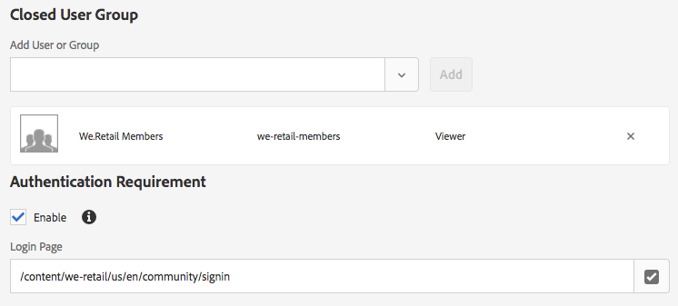

# Grupos de usuarios cerrados{#using-closed-user-groups-with-aem-assets}

Grupos cerrados de usuarios (CUG) es una función que se utiliza para restringir el acceso al contenido a un grupo seleccionado de usuarios en un sitio publicado. Este vídeo muestra cómo se pueden utilizar los grupos de usuarios cerrados con Adobe Experience Manager Assets para restringir el acceso a una carpeta específica de recursos. La compatibilidad con los grupos de usuarios cerrados con AEM Assets se introdujo por primera vez en AEM 6.4.

>[!VIDEO](https://video.tv.adobe.com/v/22155?quality=9&learn=on)

## Grupo de usuarios cerrado (CUG) con AEM Assets

* Diseñado para restringir el acceso a los recursos en una instancia de AEM Publish.
* Concede acceso de lectura a un conjunto de usuarios/grupos.
* El CUG solo se puede configurar a nivel de carpeta. El CUG no se puede establecer en recursos individuales.
* Las directivas de CUG se heredan automáticamente por cualquier subcarpeta o recurso aplicado.
* Las subcarpetas pueden anular las directivas de CUG estableciendo una nueva directiva de CUG. Esto debe utilizarse con moderación y no se considera una práctica recomendada.

## Representación de CUG en el JCR {#cug-representation-in-the-jcr}



El grupo de miembros de We.Retail se ha agregado como un grupo de usuarios cerrado a la carpeta: /content/dam/we-retail/es/beta-products

Se aplica una mezcla de **rep:CugMixin** a la carpeta **/content/dam/we-Retail/en/beta-products**. Se agrega un nodo de **rep:cugPolicy** debajo de la carpeta y se especifica we-Retail-members como principal. Otra combinación de **granite:AuthenticationRequired** se aplica a la carpeta beta-products y la propiedad** granite:loginPath** especifica la página de inicio de sesión que se utilizará si un usuario no está autenticado e intenta solicitar un recurso debajo de la carpeta **beta-products**.

Descripción de JCR a continuación:

```xml
/beta-products
    - jcr:primaryType = sling:Folder
    - jcr:mixinTypes = rep:CugMixin, granite:AuthenticationRequired
    - granite:loginPath = /content/we-retail/us/en/community/signin
    + rep:cugPolicy
         - jcr:primaryType = rep:CugPolicy
         - rep:principalNames = we-retail-members
```

## Grupos de usuarios cerrados vs. Listas de Controles de acceso {#closed-user-groups-vs-access-control-lists}

Tanto los grupos de usuarios cerrados (CUG) como las Listas de Control de acceso (ACL) se utilizan para controlar el acceso al contenido en AEM y en función de los usuarios y grupos de seguridad AEM. Sin embargo, la aplicación e implementación de estas características es muy diferente. La siguiente tabla resume las distinciones entre las dos características.

|  | ACL | CUG |
| ----------------- | -------------------------------------------------------------------------------------------------------------------------------- | ----------------------------------------------------------------------------------------------------------------------------- |
| Uso previsto | Configure y aplique permisos para el contenido en la instancia de AEM **actual**. | Configure las directivas de CUG para el contenido en AEM instancia **de autor**. Aplique directivas de CUG para el contenido en AEM **instancia de publicación**. |
| Niveles de permisos | Define permisos concedidos o denegados para usuarios o grupos en todos los niveles: Leer, Modificar, Crear, Eliminar, Leer ACL, Editar ACL, Replicar. | Concede acceso de lectura a un conjunto de usuarios/grupos. Niega el acceso de lectura a todos los demás usuarios/grupos. |
| Replicación | Las ACL no se replican con contenido. | Las políticas de CUG se replican con contenido. |

## Vínculos de soporte {#supporting-links}

* [Administración de recursos y grupos de usuarios cerrados](https://helpx.adobe.com/experience-manager/6-5/assets/using/managing-assets-touch-ui.html#ClosedUserGroup)
* [Creación de un grupo de usuarios cerrado](https://helpx.adobe.com/experience-manager/6-5/sites/administering/using/cug.html)
* [Documentación Del Grupo De Usuarios Cerrado Oak](https://jackrabbit.apache.org/oak/docs/security/authorization/cug.html)
