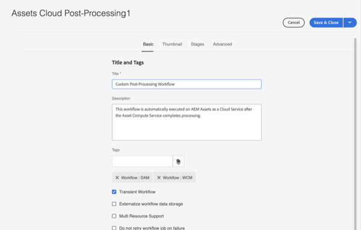
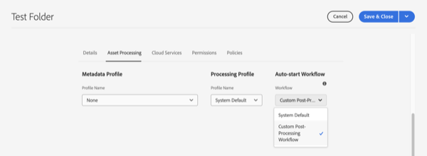

# Flujos de trabajo de inicio automático

AEM Los flujos de trabajo de inicio automático amplían el procesamiento de los recursos en el as a Cloud Service invocando automáticamente el flujo de trabajo personalizado al cargar o al volver a procesar una vez que se ha completado el procesamiento del recurso.

>[!VIDEO](https://video.tv.adobe.com/v/37323?quality=12&learn=on)

>[!NOTE]
>
>Utilice flujos de trabajo de inicio automático para personalizar el posprocesamiento de los recursos en lugar de utilizar iniciadores de flujo de trabajo. Los flujos de trabajo de inicio automático son _solamente_ se invoca una vez que un recurso se completa el procesamiento en lugar de iniciar, que se pueden invocar varias veces durante el procesamiento del recurso.

## Personalización del flujo de trabajo de posprocesamiento

Para personalizar el flujo de trabajo de procesamiento posterior, copie el procesamiento posterior predeterminado de Assets Cloud [modelo de flujo de trabajo](../../foundation/workflow/use-the-workflow-editor.md).

1. Comience en la pantalla Modelos de flujo de trabajo navegando hasta _Herramientas_ > _Flujo de trabajo_ > _Modelos_
2. Busque y seleccione el _Procesamiento posterior de Assets Cloud_ modelo de flujo de trabajo 
   
3. Seleccione el _Copiar_ para crear el flujo de trabajo personalizado
4. Seleccione su modelo de flujo de trabajo ahora (al que se llamará _Procesamiento posterior de Assets Cloud1_) y haga clic en _Editar_ para editar el flujo de trabajo
5. En Propiedades del flujo de trabajo, asigne un nombre significativo al flujo de trabajo de posprocesamiento personalizado 
   
6. Añada los pasos para satisfacer sus necesidades comerciales, en este caso añadiendo una tarea cuando los recursos se hayan completado el procesamiento. Asegúrese de que el último paso del flujo de trabajo sea siempre el siguiente _Flujo de trabajo completado_ escalón 
   

   >[!NOTE]
   >
   >Los flujos de trabajo de inicio automático se ejecutan con cada carga o reprocesamiento de recursos, por lo que debe tener en cuenta cuidadosamente la ampliación y las implicaciones de los pasos del flujo de trabajo, especialmente para operaciones por lotes como [Importaciones masivas](../../cloud-service/migration/bulk-import.md) o migraciones.

7. Seleccione el _Sincronización_ para guardar los cambios y sincronizar el modelo de flujo de trabajo

## Uso de un flujo de trabajo de posprocesamiento personalizado

El procesamiento posterior personalizado se configura en carpetas. Para configurar un flujo de trabajo de posprocesamiento personalizado en una carpeta:

1. Seleccione la carpeta para la que desea configurar el flujo de trabajo y edite las propiedades de la carpeta
2. Cambie a la _Procesamiento de recursos_ pestaña
3. Seleccione el flujo de trabajo de posprocesamiento personalizado en la _Flujo de trabajo de inicio automático_ cuadro de selección 
   
4. Guarde los cambios

Ahora el flujo de trabajo de procesamiento posterior personalizado se ejecutará para todos los recursos cargados o reprocesados en esa carpeta.
