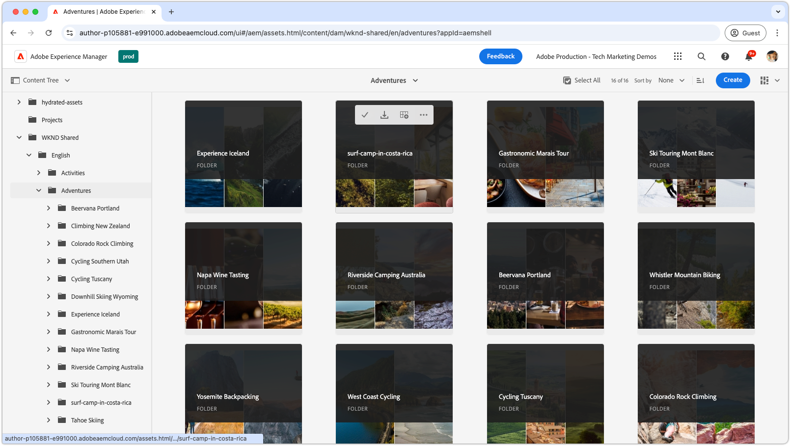

# Listas de reproducción de vídeo para la vista Administrador

{align="center"}

Explore estas listas de reproducción para dominar la vista de administración de as a Cloud Service de los AEM Assets, que abarca la configuración, la optimización, el uso y la integración perfecta con los flujos de trabajo creativos. Obtenga la información que necesita para tener éxito con AEM Assets as a Cloud Service.

## Configurar la vista de administrador

Empiece con la configuración y los ajustes esenciales para que as a Cloud Service de los AEM Assets funcione sin problemas en su equipo y proyectos.

<!-- CARDS

* https://experienceleague.adobe.com/en/playlists/experience-manager-all-configure-administrative-access
* https://experienceleague.adobe.com/en/playlists/experience-manager-assets-configure-administrators

-->
<!-- START CARDS HTML - DO NOT MODIFY BY HAND -->

    

        

            

                <figure class="image x-is-16by9">
                    
                </figure>
            

            

                

                    

                        <a href="https://experienceleague.adobe.com/en/playlists/experience-manager-all-configure-administrative-access" target="_blank" rel="referrer" title="Configuración del acceso administrativo a Experience Manager">Configurar el acceso administrativo a Experience Manager</a>
                    

                    
Explore cómo se autentican los usuarios con Adobe IMS para AEM as a Cloud Service y cómo se utilizan los usuarios de IMS de Adobe, los grupos de usuarios y los perfiles de producto para controlar el acceso a AEM y sus funciones y funcionalidades.

                

                <a href="https://experienceleague.adobe.com/en/playlists/experience-manager-all-configure-administrative-access" target="_blank" rel="referrer" class="spectrum-Button spectrum-Button--outline spectrum-Button--primary spectrum-Button--sizeM" style="align-self: flex-start; margin-top: 1rem;">
                    Ver
                </a>
            

        

    

    

        

            

                <figure class="image x-is-16by9">
                    
                </figure>
            

            

                

                    

                        <a href="https://experienceleague.adobe.com/en/playlists/experience-manager-assets-configure-administrators" target="_blank" rel="referrer" title="Configuración de AEM Assets">Configurar AEM Assets</a>
                    

                    
Aprenda a crear una base sólida para la implementación de AEM Assets configurando los principales problemas, desde la configuración de una arquitectura de contenido y taxonomía de línea base hasta la personalización de metadatos y el procesamiento de recursos.

                

                <a href="https://experienceleague.adobe.com/en/playlists/experience-manager-assets-configure-administrators" target="_blank" rel="referrer" class="spectrum-Button spectrum-Button--outline spectrum-Button--primary spectrum-Button--sizeM" style="align-self: flex-start; margin-top: 1rem;">
                    Ver
                </a>
            

        

    

<!-- END CARDS HTML - DO NOT MODIFY BY HAND -->

## Introducción a la vista de administrador

Navegue por la interfaz de administración como un profesional, aprenda las herramientas y técnicas para administrar los recursos de forma eficaz.

<!-- CARDS

* https://experienceleague.adobe.com/en/playlists/experience-manager-assets-get-started-business-users  
* https://experienceleague.adobe.com/en/playlists/experience-manager-assets-understand-metadata
* https://experienceleague.adobe.com/en/playlists/experience-manager-assets-optimize-search
* https://experienceleague.adobe.com/en/playlists/experience-manager-assets-use-smart-tags

-->
<!-- START CARDS HTML - DO NOT MODIFY BY HAND -->

    

        

            

                <figure class="image x-is-16by9">
                    
                </figure>
            

            

                

                    

                        <a href="https://experienceleague.adobe.com/en/playlists/experience-manager-assets-get-started-business-users" target="_blank" rel="referrer" title="Introducción a la vista de administración de AEM Assets para usuarios empresariales">Introducción a la vista de administración de AEM Assets para usuarios empresariales</a>
                    

                    
Explore los conceptos básicos de la vista de administración de AEM Assets, incluida la navegación, cómo se organizan y modelan los recursos, junto con las operaciones básicas como crear, actualizar y eliminar.

                

                <a href="https://experienceleague.adobe.com/en/playlists/experience-manager-assets-get-started-business-users" target="_blank" rel="referrer" class="spectrum-Button spectrum-Button--outline spectrum-Button--primary spectrum-Button--sizeM" style="align-self: flex-start; margin-top: 1rem;">
                    Ver
                </a>
            

        

    

    

        

            

                <figure class="image x-is-16by9">
                    
                </figure>
            

            

                

                    

                        <a href="https://experienceleague.adobe.com/en/playlists/experience-manager-assets-understand-metadata" target="_blank" rel="referrer" title="Explicación de los metadatos de recursos en AEM Assets">Comprender los metadatos de recursos en los AEM Assets</a>
                    

                    
Obtenga todo lo que necesita saber sobre los metadatos de recursos de los AEM Assets.

                

                <a href="https://experienceleague.adobe.com/en/playlists/experience-manager-assets-understand-metadata" target="_blank" rel="referrer" class="spectrum-Button spectrum-Button--outline spectrum-Button--primary spectrum-Button--sizeM" style="align-self: flex-start; margin-top: 1rem;">
                    Ver
                </a>
            

        

    

    

        

            

                <figure class="image x-is-16by9">
                    
                </figure>
            

            

                

                    

                        <a href="https://experienceleague.adobe.com/en/playlists/experience-manager-assets-optimize-search" target="_blank" rel="referrer" title="Optimización de la búsqueda en AEM Assets">Optimizar la búsqueda en AEM Assets</a>
                    

                    
Aprenda a optimizar la experiencia de búsqueda en AEM Assets

                

                <a href="https://experienceleague.adobe.com/en/playlists/experience-manager-assets-optimize-search" target="_blank" rel="referrer" class="spectrum-Button spectrum-Button--outline spectrum-Button--primary spectrum-Button--sizeM" style="align-self: flex-start; margin-top: 1rem;">
                    Ver
                </a>
            

        

    

    

        

            

                <figure class="image x-is-16by9">
                    
                </figure>
            

            

                

                    

                        <a href="https://experienceleague.adobe.com/en/playlists/experience-manager-assets-use-smart-tags" target="_blank" rel="referrer" title="Uso de etiquetas inteligentes para mejorar la detección de recursos">Use etiquetas inteligentes para mejorar la detección de recursos</a>
                    

                    
Aprenda a utilizar etiquetas inteligentes en AEM Assets para que sus recursos sean reconocibles.

                

                <a href="https://experienceleague.adobe.com/en/playlists/experience-manager-assets-use-smart-tags" target="_blank" rel="referrer" class="spectrum-Button spectrum-Button--outline spectrum-Button--primary spectrum-Button--sizeM" style="align-self: flex-start; margin-top: 1rem;">
                    Ver
                </a>
            

        

    

<!-- END CARDS HTML - DO NOT MODIFY BY HAND -->

## Conexión de flujos de trabajo creativos con AEM Assets

Desbloquee la colaboración sin problemas integrando AEM Assets as a Cloud Service con sus herramientas creativas, lo que garantiza flujos de trabajo coherentes y eficientes.

<!-- CARDS

* https://experienceleague.adobe.com/en/playlists/experience-manager-assets-create-renditions-content-automation
* https://experienceleague.adobe.com/en/playlists/experience-manager-assets-use-creative-operations-with-content-automation

-->
<!-- START CARDS HTML - DO NOT MODIFY BY HAND -->

    

        

            

                <figure class="image x-is-16by9">
                    
                </figure>
            

            

                

                    

                        <a href="https://experienceleague.adobe.com/en/playlists/experience-manager-assets-create-renditions-content-automation" target="_blank" rel="referrer" title="Creación de representaciones personalizadas con la automatización de contenido de AEM">Crear representaciones personalizadas con la automatización de contenido de AEM</a>
                    

                    
Descubra cómo utilizar el complemento de automatización de contenido para integrar Adobe Experience Manager Assets as a Cloud Service con las API de servicio de Adobe Creative Cloud para un procesamiento eficiente de los recursos.

                

                <a href="https://experienceleague.adobe.com/en/playlists/experience-manager-assets-create-renditions-content-automation" target="_blank" rel="referrer" class="spectrum-Button spectrum-Button--outline spectrum-Button--primary spectrum-Button--sizeM" style="align-self: flex-start; margin-top: 1rem;">
                    Ver
                </a>
            

        

    

    

        

            

                <figure class="image x-is-16by9">
                    
                </figure>
            

            

                

                    

                        <a href="https://experienceleague.adobe.com/en/playlists/experience-manager-assets-use-creative-operations-with-content-automation" target="_blank" rel="referrer" title="Uso de operaciones de Creative con la automatización de contenido de AEM Assets">Usar operaciones de Creative con automatización de contenido para AEM Assets</a>
                    

                    
Aprenda a utilizar el complemento de automatización de contenido para realizar operaciones de Creative Cloud en Adobe Experience Manager Assets.

                

                <a href="https://experienceleague.adobe.com/en/playlists/experience-manager-assets-use-creative-operations-with-content-automation" target="_blank" rel="referrer" class="spectrum-Button spectrum-Button--outline spectrum-Button--primary spectrum-Button--sizeM" style="align-self: flex-start; margin-top: 1rem;">
                    Ver
                </a>
            

        

    

<!-- END CARDS HTML - DO NOT MODIFY BY HAND -->

