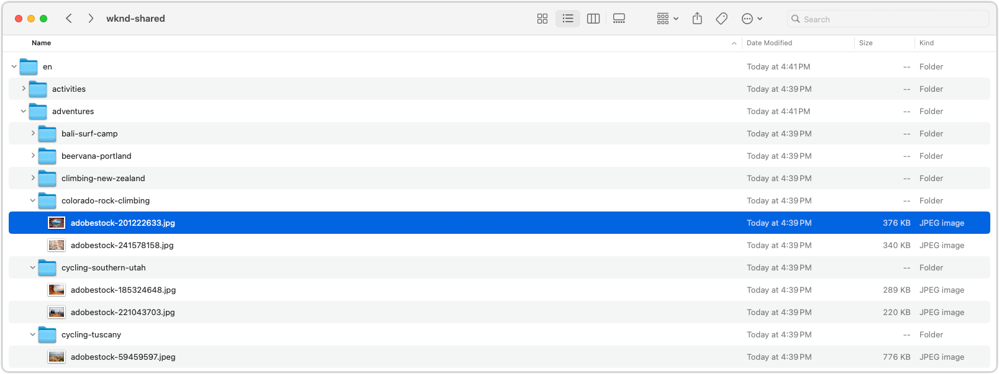

# Exportar recursos

Obtenga información sobre cómo exportar recursos al equipo local mediante un script personalizable de Node.js. Este script de exportación proporciona un ejemplo de cómo descargar recursos de AEM mediante programación utilizando las API HTTP de [AEM Assets](https://experienceleague.adobe.com/en/docs/experience-manager-cloud-service/content/assets/admin/mac-api-assets), centrándose específicamente en las representaciones originales para garantizar la máxima calidad. Está diseñado para replicar la estructura de carpetas de los AEM Assets en la unidad local, lo que facilita la realización de copias de seguridad o la migración de recursos.

La secuencia de comandos solo descarga las representaciones originales del recurso, sin los metadatos asociados, a menos que dichos metadatos se hayan incrustado en el recurso como XMP. Esto significa que la información descriptiva, las categorizaciones o las etiquetas almacenadas en AEM pero no integradas en los archivos de recursos no se incluyen en la descarga. También se pueden descargar otras representaciones modificando la secuencia de comandos para incluirlas. Asegúrese de que tiene espacio suficiente para almacenar los recursos exportados.

El script se suele ejecutar con AEM Author, pero también se puede ejecutar con AEM Publish, siempre y cuando los puntos finales de la API HTTP de los AEM Assets y las representaciones de recursos sean accesibles a través de Dispatcher.

Antes de ejecutar el script, debe configurarlo con la URL de la instancia de AEM, las credenciales de usuario (token de acceso) y la ruta de acceso a la carpeta que desea exportar.

## Exportar script

El script, escrito como módulo de JavaScript, forma parte de un proyecto Node.js, ya que depende de `node-fetch`. Puede [descargar el proyecto como archivo zip](./assets/export/export-aem-assets-script.zip) o copiar el script siguiente en un proyecto Node.js vacío de tipo `module` y ejecutar `npm install node-fetch` para instalar la dependencia.

Este script recorre el árbol de carpetas de los AEM Assets y descarga los recursos y las carpetas en una carpeta local de su equipo. Utiliza la [API HTTP de AEM Assets](https://experienceleague.adobe.com/en/docs/experience-manager-cloud-service/content/assets/admin/mac-api-assets) para recuperar los datos de carpetas y recursos, y descarga las representaciones originales de los recursos.

```javascript
// export-assets.js

import fetch from 'node-fetch';
import { promises as fs } from 'fs';
import path from 'path';

// Do not process the contents of these well-known AEM system folders
const SKIP_FOLDERS = ['/content/dam/appdata', '/content/dam/projects', '/content/dam/_CSS', '/content/dam/_DMSAMPLE' ];

/**
 * Determine if the folder should be processed based on the entity and AEM path.
 * 
 * @param {Object} entity the AEM entity that should represent a folder returned from AEM Assets HTTP API
 * @param {String} aemPath the path in AEM of this source
 * @returns true if the entity should be processed, false otherwise
 */
function isValidFolder(entity, aemPath) {
    if (aemPath === '/content/dam') {
        // Always allow processing /content/dam 
        return true;
    } else if (!entity.class.includes('assets/folder')) {
        return false;
    } if (SKIP_FOLDERS.find((path) => path === aemPath)) {
        return false;
    } else if (entity.properties.hidden) {
        return false;
    }
    
    return true;
}

/**
 * Determine if the entity is downloadable.
 * @param {Object} entity the AEM entity that should represent an asset returned from AEM Assets HTTP API
 * @returns true if the entity is downloadable, false otherwise
 */
function isDownloadable(entity) {
    if (entity.class.includes('assets/folder')) {
        return false;
    } else if (entity.properties.contentFragment) {
        return false;
    }

    return true;
}

/**
 * Helper function to get the link from the entity based on the relationship name.
 * @param {Object} entity the entity from the AEM Assets HTTP API
 * @param {String} rel the relationship name
 * @returns 
 */
function getLink(entity, rel) {
    return entity.links.find(link => link.rel.includes(rel));
}

/**
 * Helper function to fetch JSON data from the AEM Assets HTTP API.
 * @param {String} url the AEM Assets HTTP API URL to fetch data from
 * @returns the JSON response of the AEM Assets HTTP API
 */
async function fetchJSON(url) {
    const response = await fetch(url, {
        method: 'GET',
        headers: {
            'Authorization': `Bearer ${AEM_ACCESS_TOKEN}`,
            'Content-Type': 'application/json'
        }
    });

    if (!response.ok) {
        throw new Error(`Error: ${response.status}`);
    }

    return response.json();
}

/**
 * Helper function to download a file from AEM Assets.
 * @param {String} url the URL of the asset rendition to download
 * @param {String} outputPath the local path to save the downloaded file
 */
async function downloadFile(url, outputPath) {
    const response = await fetch(url, {
        method: 'GET',
        headers: {
            'Authorization': `Bearer ${AEM_ACCESS_TOKEN}`,
        }
    });

    if (!response.ok) {
        throw new Error(`Failed to download file: ${response.statusText}`);
    }

    const arrayBuffer = await response.arrayBuffer();
    await fs.writeFile(outputPath, Buffer.from(arrayBuffer));

    console.log(`Downloaded asset: ${outputPath}`);
}

/**
 * Main entry
 * @param {Object} options the options for downloading assets
 * @param {String} options.folderUrl the URL of the AEM folder to download
 * @param {String} options.localPath the local path to save the downloaded assets
 * @param {String} options.aemPath the AEM path of the folder to download
 */
async function downloadAssets({apiUrl, localPath = LOCAL_DOWNLOAD_FOLDER, aemPath = '/content/dam'}) {    
    if (!apiUrl) {
        // Handle the initial call to the script, which should just provide the AEM path
        // Construct the proper AEM Assets HTTP API URL as it uses a truncated AEM path
        const prefix = "/content/dam/";
        let apiPath = aemPath.startsWith(prefix) ? aemPath.substring(prefix.length) : aemPath;    

        if (!apiPath.startsWith('/')) {
            apiPath = '/' + apiPath;
        }

        apiUrl = `${AEM_HOST}/api/assets.json${apiPath}`
    }
    
    const data = await fetchJSON(apiUrl);
    const entities = data.entities || [];

    // Process folders first
    for (const folder of entities.filter(entity => entity.class.includes('assets/folder'))) {
        const newLocalPath = path.join(localPath, folder.properties.name);
        const newAemPath = path.join(aemPath, folder.properties.name);

        if (!isValidFolder(folder, newAemPath)) {
            continue;
        }

        await fs.mkdir(newLocalPath, { recursive: true });
    
        await downloadAssets({
            apiUrl: getLink(folder, 'self')?.href, 
            localPath: newLocalPath, 
            aemPath: newAemPath
        });
    }

    let downloads = [];

    // Process assets
    for (const asset of entities.filter(entity => entity.class.includes('assets/asset'))) {
        const assetLocalPath = path.join(localPath, asset.properties.name);
        if (isDownloadable(asset)) {
            downloads.push(downloadFile(getLink(asset, 'content')?.href, assetLocalPath));
        }

        // Process in batches of MAX_CONCURRENT_DOWNLOADS
        if (downloads.length >= MAX_CONCURRENT_DOWNLOADS) {
            await Promise.all(downloads);
            downloads = [];
        }
    }

    // Wait for the remaining downloads to finish
    await Promise.all(downloads);
    downloads = [];

    // Handle pagination
    const nextUrl = getLink(data, 'next');
    if (nextUrl) {
        await downloadAssets({
            apiUrl: nextUrl?.href,
            localPath,
            aemPath
        });
    }
}

/***** SCRIPT CONFIGURATION *****/

// AEM host is the URL of the AEM environment to download the assets from
const AEM_HOST = 'https://author-p123-e456.adobeaemcloud.com';

// AEM access token used to access the AEM host. 
// This access token must have read access to the folders and assets to download.
const AEM_ACCESS_TOKEN = "eyJhbGciOiJS...zCprYZD0rSjg6g";

// The root folder in AEM to download assets from.
const AEM_ASSETS_FOLDER = '/content/dam/wknd-shared';

// The local folder to save the downloaded assets.
const LOCAL_DOWNLOAD_FOLDER = './exported-assets';

// The number of maximum concurrent downloads to avoid overwhelming the client or server. 10 is typically a good value.
const MAX_CONCURRENT_DOWNLOADS = 10;

/***** SCRIPT ENTRY POINT *****/

console.time('Download AEM assets');

await downloadAssets({
    aemPath: AEM_ASSETS_FOLDER, 
    localPath: LOCAL_DOWNLOAD_FOLDER
}).catch(console.error);

console.timeEnd('Download AEM assets');
```

## Configuración de la exportación

Con el script descargado, actualice las variables de configuración en la parte inferior del script.

El `AEM_ACCESS_TOKEN` se puede obtener siguiendo los pasos del tutorial de [Autenticación basada en tokens en AEM as a Cloud Service](https://experienceleague.adobe.com/en/docs/experience-manager-learn/getting-started-with-aem-headless/authentication/overview). A menudo, el token de desarrollador de 24 horas es suficiente, siempre que la exportación tarde menos de 24 horas en completarse y el usuario que genera el token tenga acceso de lectura a los recursos que desea exportar.

```javascript
...
/***** SCRIPT CONFIGURATION *****/

// AEM host is the URL of the AEM environment to download the assets from
const AEM_HOST = 'https://author-p123-e456.adobeaemcloud.com';

// AEM access token used to access the AEM host. 
// This access token must have read access to the folders and assets to download.
const AEM_ACCESS_TOKEN = "eyJhbGciOiJS...zCprYZD0rSjg6g";

// The root folder in AEM to download assets from.
const AEM_ASSETS_FOLDER = '/content/dam/wknd-shared';

// The local folder to save the downloaded assets.
const LOCAL_DOWNLOAD_FOLDER = './export-assets';

// The number of maximum concurrent downloads to avoid overwhelming the client or server. 10 is typically a good value.
const MAX_CONCURRENT_DOWNLOADS = 10;
```

## Exportación de recursos

Ejecute el script mediante Node.js para exportar los recursos al equipo local.

Según el número de recursos y sus tamaños, la secuencia de comandos puede tardar algún tiempo en completarse. A medida que se ejecuta el script, [registra el progreso](#output) en la consola.

```shell
$ node export-assets.js
```

## Exportar salida

El script de exportación registra el progreso en la consola, indicando los recursos que se descargan. Cuando la secuencia de comandos se completa, los recursos se guardan en la carpeta local especificada en la configuración y el registro finaliza con el tiempo total necesario para descargar los recursos.

```plaintext
...
Downloaded asset: exported-assets/wknd-shared/en/magazine/skitouring/skitouring3sjoeberg.jpg
Downloaded asset: exported-assets/wknd-shared/en/magazine/skitouring/skitouring5sjoeberg.jpg
Downloaded asset: exported-assets/wknd-shared/en/magazine/skitouring/skitouring6sjoeberg.jpg
Downloaded asset: exported-assets/wknd-shared/en/magazine/western-australia/wa_camping_adobe.pdf
Downloaded asset: exported-assets/wknd-shared/en/magazine/western-australia/adobestock-156407519.jpeg
Downloaded asset: exported-assets/wknd-shared/en/magazine/western-australia/adobe-waadobe-wa-mg-3094.jpg
Downloaded asset: exported-assets/wknd-shared/en/magazine/western-australia/adobe-waadobe-wa-mg-3851.jpg
Downloaded asset: exported-assets/wknd-shared/en/magazine/western-australia/adobe-waadobe-wa-b6a7083.jpg
Downloaded asset: exported-assets/wknd-shared/en/magazine/western-australia/adobe-waadobe-wa-b6a6978.jpg
Download AEM assets: 24.770s
```

Los recursos exportados se pueden encontrar en la carpeta local especificada en la configuración `LOCAL_DOWNLOAD_FOLDER`. La estructura de carpetas refleja la estructura de carpetas de los AEM Assets, con los recursos descargados en las subcarpetas correspondientes. Estos archivos se pueden cargar a [proveedores de almacenamiento en la nube compatibles](https://experienceleague.adobe.com/en/docs/experience-manager-cloud-service/content/assets/assets-view/bulk-import-assets-view), para [importarlos en lotes](https://experienceleague.adobe.com/en/docs/experience-manager-learn/cloud-service/migration/bulk-import) a otras instancias de AEM o para realizar copias de seguridad.


