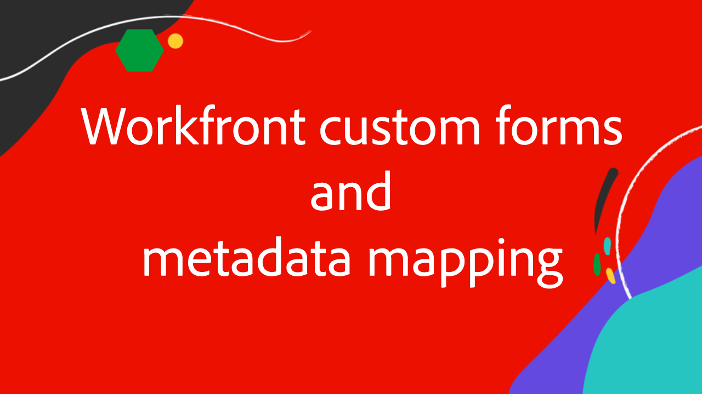
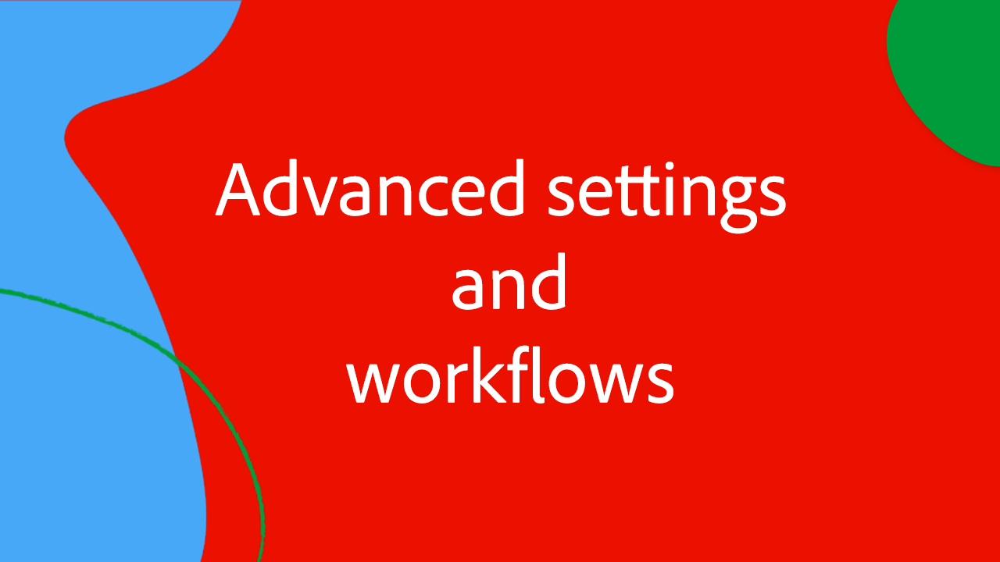

# Workfront para conector mejorado de Experience Manager Serie de expertos

Únase a los expertos de Workfront y Experience Manager Assets de Adobe en esta serie de vídeos de cuatro partes, mientras muestran y analizan los detalles del conector mejorado de Workfront para Experience Manager.

Esta serie de cuatro partes de expertos sigue a un grupo de expertos en Adobe -desde gestores de productos hasta consultores y asociados en el Adobe- que analizan:

1. [Realización de las configuraciones de configuración iniciales en Workfront y AEM](./setup.md)
2. [Configuración de la sincronización de metadatos entre formularios personalizados y AEM de Workfront](./custom-forms.md)
3. [Uso de etiquetas de AEM, carpetas vinculadas a proyectos, vínculos a recursos de Adobe y esquemas de metadatos de carpetas para maximizar el valor](./aem-tags-project-linked-folders-and-folder-metadata.md)
4. [Uso del flujo de trabajo AEM avanzado para optimizar los procesos empresariales en AEM y Workfront, y en otros ajustes avanzados](./advanced-settings-and-workflows.md)

<table>
  <td>
      
      

         <a href="./setup.md"><strong>Configuración inicial</strong></a>
          <em>Parte 1/4</em>
      

      

         
         Obtenga información sobre cómo configurar y realizar la configuración inicial del conector mejorado de Workfront for Experience Manager.
      

   </td>
   <!-- Workfront custom forms and metadata mapping -->
   <td>
      
      

         <a href="./custom-forms.md"><strong>Asignación de metadatos y formularios personalizados de Workfront</strong></a>
          <em>Parte 2/4</em>
      

      

         
         Obtenga información sobre los formularios personalizados de Workfront y cómo se asignan a esquemas de metadatos de Experience Manager Assets para sincronizar datos.
      

    </td>
    <!-- AEM Tags, project linked folders, and folder metadata -->
    <td>
      
      

         <a href="./aem-tags-project-linked-folders-and-folder-metadata.md"><strong>Etiquetas de AEM, carpetas vinculadas a proyectos y metadatos de carpetas</strong></a>
          <em>Parte 3/4</em> 
      

      

         
            Obtenga información sobre cómo dirigir AEM taxonomía desde Workfront, utilizar carpetas vinculadas a proyectos y datos para AEM metadatos de carpetas de recursos.
      

   </td>   
   <!-- Advanced workflows -->
    <td>
      
      

         <a href="./advanced-settings-and-workflows.md"><strong>Configuración y flujos de trabajo avanzados</strong></a>
          <em>Parte 4/4</em>
      

      

         
            Obtenga información sobre la configuración avanzada de Workfront para AEM conector mejorado y gestione la sincronización de datos mediante flujos de trabajo avanzados.
      

   </td>
  </tr>  
</tbody></table>

