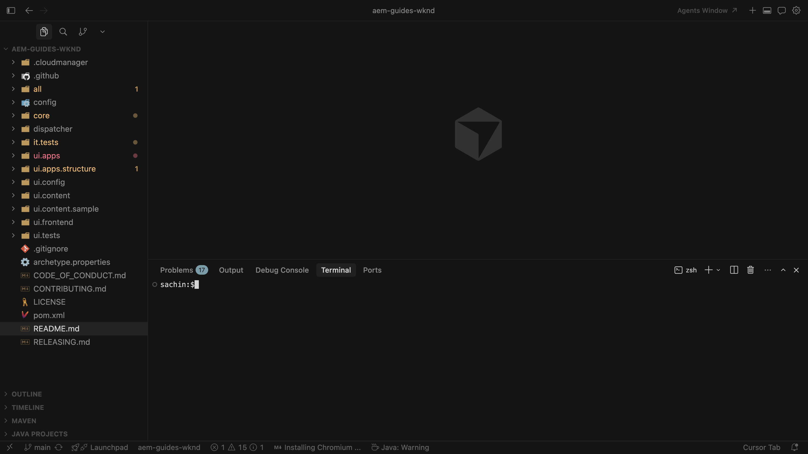

# Configurar las aptitudes de agente de AEM

Aprenda a configurar las habilidades de agente de AEM para el desarrollo asistido por IA.

Cuando solicita a un agente de codificación a través de un IDE con tecnología de IA que trabaje en tareas de desarrollo de AEM, puede utilizar las **habilidades del agente de AEM** directrices de procedimiento de Adobe en lugar de depender únicamente de la formación de modelos genéricos o lo que pueda deducir de su repositorio solo.

Adobe proporciona las aptitudes de agente de AEM a través del repositorio [Adobe Skills](https://github.com/adobe/skills). Consulte también [Desarrollo asistido por IA](../overview.md) para ver cómo Adobe ayuda con el desarrollo asistido por IA.

En este tutorial, instalará las habilidades en un clon local del [proyecto WKND Sites](https://github.com/adobe/aem-guides-wknd). Puede seguir los mismos pasos para su propio proyecto de AEM as a Cloud Service.

>[!VIDEO](https://video.tv.adobe.com/v/3484940/?learn=on&enablevpops)

## Requisitos previos

Para seguir este tutorial, necesita lo siguiente:

- Un clon local del [proyecto WKND Sites](https://github.com/adobe/aem-guides-wknd) o su propio proyecto de AEM as a Cloud Service.
- Un IDE con tecnología de IA, como Cursor o Visual Studio Code con el copiloto de GitHub.

## Instalar habilidades del agente de AEM

Instale las aptitudes del agente de AEM con el comando `npx` (requiere [Node.js](https://nodejs.org/) para que `npx` esté disponible). Para ver otras opciones de instalación, como los complementos de código Claude o la extensión CLI de GitHub, consulte la sección [Instalación](https://github.com/adobe/skills/tree/main#installation) en el repositorio de habilidades de Adobe.

1. Clonar el [proyecto de sitios WKND](https://github.com/adobe/aem-guides-wknd) localmente:

   ```shell
   $ git clone https://github.com/adobe/aem-guides-wknd.git
   ```

1. Abra el proyecto clonado en el IDE con tecnología de IA (por ejemplo, Cursor) y abra el terminal integrado.
   

1. Ejecute el siguiente comando para añadir las aptitudes del agente de AEM para el cursor:

   ```shell
   $ npx skills add https://github.com/adobe/skills/tree/main/plugins/aem/cloud-service --agent cursor
   ```

   Para otros tipos de agentes, consulte la sección [Instalación](https://github.com/adobe/skills/tree/main#installation) en el repositorio de aptitudes de Adobe.

1. Cuando se le solicite, elija qué aptitudes de agente de AEM desea instalar.
   

   Seleccione la habilidad **secure-agents-md** para que el instalador pueda crear los archivos **AGENTS.md** y **CLAUDE.md** en la raíz del repositorio. Esa aptitud de bootstrap inspecciona su proyecto, por ejemplo, la raíz `pom.xml` y los módulos, y genera una guía de agente personalizada.

   Si **AGENTS.md** ya existe, **no** se sobrescribirá.

1. Elija el ámbito de instalación. Para este tutorial, el ámbito **Proyecto** es típico, por lo que los archivos de aptitudes se encuentran en el repositorio.
   

1. Confirme la instalación en `.agents/skills`. Debería ver **SKILLS.md** y las carpetas de recursos y referencias relacionadas.
   

1. Cuando Adobe añada o actualice aptitudes, utilice la CLI para añadirlas, actualizarlas, eliminarlas o enumerarlas. Para ver todos los comandos:

   ```shell
   $ npx skills --help
   ```

   

## Casos de uso

<!-- 
CARDS
{target = _self}

* ../use-cases/component-development.md    
    {title = Create AEM Component with AI-assisted development}
    {description = Learn how to use AI-assisted development to develop AEM components.}
    {image = ../assets/component-development/review-generated-code.png}
    {cta = Create AEM Component}
-->
<!-- START CARDS HTML - DO NOT MODIFY BY HAND -->
<div class="columns">
    <div class="column is-half-tablet is-half-desktop is-one-third-widescreen" aria-label="Create AEM Component with AI-assisted development">
        <div class="card" style="height: 100%; display: flex; flex-direction: column; height: 100%;">
            <div class="card-image">
                <figure class="image x-is-16by9">
                    <a href="../use-cases/component-development.md" title="Creación de un componente de AEM con desarrollo asistido por IA" target="_self" rel="referrer">
                        
                    </a>
                </figure>
            </div>
            <div class="card-content is-padded-small" style="display: flex; flex-direction: column; flex-grow: 1; justify-content: space-between;">
                <div class="top-card-content">
                    <p class="headline is-size-6 has-text-weight-bold">
                        <a href="../use-cases/component-development.md" target="_self" rel="referrer" title="Creación de un componente de AEM con desarrollo asistido por IA">Crear componente de AEM con desarrollo asistido por IA</a>
                    </p>
                    <p class="is-size-6">Aprenda a utilizar el desarrollo asistido por IA para desarrollar componentes de AEM.</p>
                </div>
                <a href="../use-cases/component-development.md" target="_self" rel="referrer" class="spectrum-Button spectrum-Button--outline spectrum-Button--primary spectrum-Button--sizeM" style="align-self: flex-start; margin-top: 1rem;">
                    <span class="spectrum-Button-label has-no-wrap has-text-weight-bold">Crear componente de AEM</span>
                </a>
            </div>
        </div>
    </div>
</div>
<!-- END CARDS HTML - DO NOT MODIFY BY HAND -->

## Recursos adicionales

- [Desarrollo local con herramientas de IA](https://experienceleague.adobe.com/es/docs/experience-manager-cloud-service/content/ai-in-aem/local-development-with-ai-tools)

- [Aptitudes de Adobe para agentes de codificación de IA](https://github.com/adobe/skills)

- [AGENTS.md](https://agents.md/)

- [Aptitudes de agente](https://agentskills.io/home)
