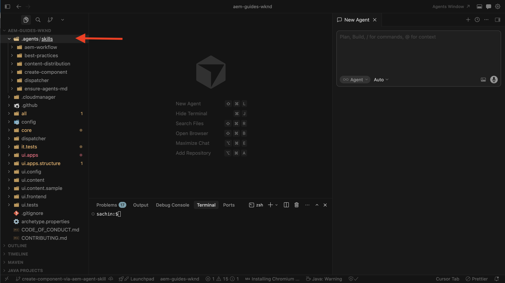
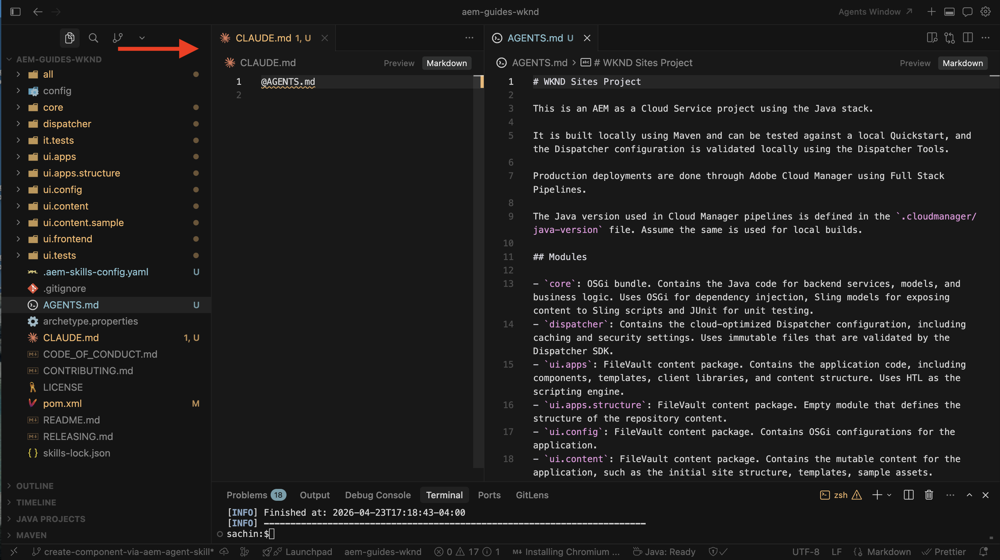

# Desarrollo de componentes con habilidades de agente de AEM

Aprenda a desarrollar un componente de AEM con las habilidades de agente de AEM como parte de [desarrollo asistido por IA](../overview.md).

En este tutorial, utilizará lenguaje natural en un IDE con tecnología de IA (por ejemplo, Cursor) para desarrollar un componente **Banner promocional** en el [Proyecto de sitios WKND](https://github.com/adobe/aem-guides-wknd). El agente de codificación aplica la aptitud de agente de AEM `create-component` para generar la implementación.

## Requisitos previos

Para seguir este tutorial, necesita lo siguiente:

- Un IDE con tecnología de IA, como Cursor o Visual Studio Code con el copiloto de GitHub.
- Un clon local del [proyecto WKND Sites](https://github.com/adobe/aem-guides-wknd), creado e implementado en una instancia de _AEM SDK local_.
- Se han instalado _aptitudes de agente de AEM_ en ese proyecto. Si aún no lo ha hecho, complete [Configurar las aptitudes de agente de AEM](../setup/agent-skills.md).

## Requisito de componente

Supongamos que el equipo de WKND desea mostrar un banner de promoción en la página principal y la referencia de diseño es la siguiente:


Los autores deben poder establecer los campos _Etiqueta de promoción_, _Etiqueta de CTA_ y _Vínculo de CTA_ en el cuadro de diálogo del componente.

La referencia de diseño es una captura de pantalla obtenida mediante malla metálica, maqueta o marcado estático.

## Desarrollar el componente

1. Abra el proyecto WKND en el IDE. Confirme que las aptitudes de agente de AEM están presentes (por ejemplo, en `.agents/skills`) y, a continuación, inicie un nuevo chat de agente.
   

1. Introduzca una solicitud como la siguiente. Adjunte la captura de pantalla de diseño del componente (obtenida mediante malla metálica, maqueta o captura estática de marcado) si su IDE admite imágenes en el chat:

   ```text
   Create a WKND Promo Banner Component. Please see attached screenshot for design reference.
   
   Dialog specification are:
   
   1. Promo Label - Textfield, required
   2. CTA Text - Textfield, required
   3. CTA Link - Pathfield, required
   ```

1. El agente de codificación utiliza la aptitud de agente de AEM `create-component` para generar el componente. Revise el HTL, el modelo Sling, el XML de diálogo y los archivos relacionados propuestos.
   

>[!TIP]
>
>En lugar de proporcionar la referencia de diseño como captura de pantalla, también puede proporcionar un diseño Figma a través del [servidor Figma MCP](https://www.figma.com/mcp-catalog/) para generar el componente. La aptitud de `create-component` admite la [integración de diseño Figma](https://github.com/adobe/skills/blob/main/plugins/aem/cloud-service/skills/create-component/references/figma-design-rules.md)


1. Implemente el componente en la instancia local de AEM/SDK.

   ```shell
   $ mvn clean install -PautoInstallSinglePackage
   ```

1. En la creación, coloque el titular de la promoción en la página principal y valide el comportamiento. Refine la implementación si aún difiere de la referencia de diseño.
   

1. Revise el componente recién creado publicando la página o viendo como publicado.
   

Enhorabuena. Ha creado correctamente un nuevo componente de AEM con Habilidades de agente de AEM como parte del desarrollo asistido por IA.

## Más allá de componentes simples

Este tutorial utiliza un componente simple. La misma aptitud de `create-component` también admite casos más completos, incluidos:

- Campos múltiples y campos de cuadros de diálogo anidados
- Extensiones de componentes principales de AEM (incluidos los patrones de fusión de recursos de Sling)
- URL de marco o archivo Figma para diseño y estilo, cuando el servidor Figma MCP (por ejemplo, `plugin-figma-figma`) está habilitado en su IDE

Para tipos de campo, patrones de diálogo, reglas de Figma y ejemplos, lea `SKILL.md` en la carpeta de aptitudes instalada, por ejemplo, `.agents/skills/create-component/SKILL.md`.

Para obtener información general, rutas de instalación por IDE y solución de problemas, consulte [Agente de desarrollo de componentes de AEM](https://github.com/adobe/skills/blob/main/plugins/aem/cloud-service/skills/create-component/README.md) en el repositorio de habilidades de Adobe.

## AGENTS.md

Antes de finalizar, vamos a comprender cómo se generó AGENTS.md como parte de la creación del componente.

Para proyectos de AEM as a Cloud Service, la aptitud de arranque `ensure-agents-md` (seleccionada durante la [configuración de aptitudes de agente de AEM](../setup/agent-skills.md)) crea `AGENTS.md` en la raíz del repositorio cuando **falta**. Utiliza lo que aprende del diseño del proyecto.

**no** sobrescribe un archivo `AGENTS.md` existente.

Creación de 

## Recursos adicionales

- [Desarrollo local con herramientas de IA](https://experienceleague.adobe.com/es/docs/experience-manager-cloud-service/content/ai-in-aem/local-development-with-ai-tools)

- [Aptitudes de Adobe para agentes de codificación de IA](https://github.com/adobe/skills)

- [AGENTS.md](https://agents.md/)

- [Aptitudes de agente](https://agentskills.io/home)
