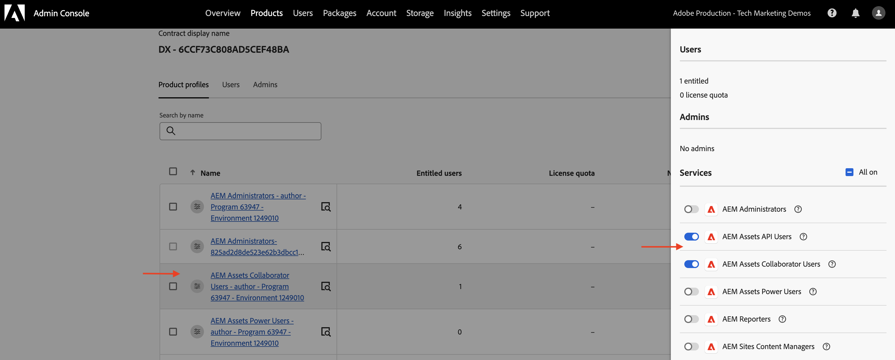
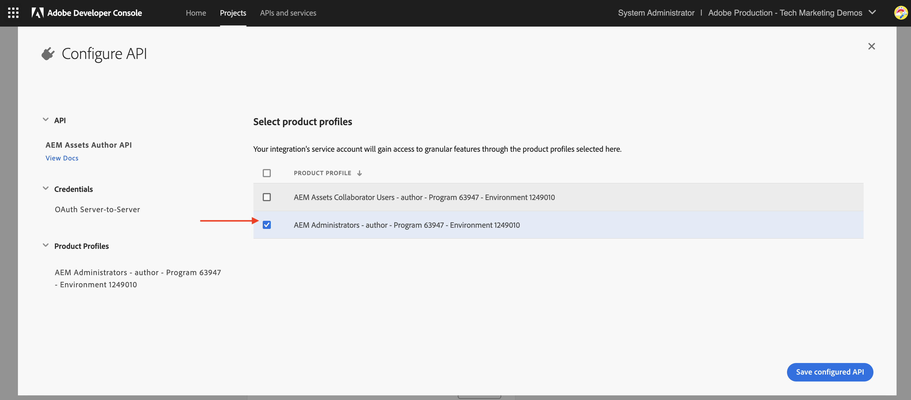

# Credenciales de API y administración de perfiles de producto

Obtenga información sobre cómo administrar _credenciales y perfil de producto_ para las API de AEM basadas en OpenAPI.

En este tutorial, aprenderá a añadir o eliminar:

- _Credenciales_: proporcione autenticación para una API de AEM.
- _Perfiles de producto_: proporcione permisos (o autorización) para que las credenciales tengan acceso a los recursos de AEM.

## Fondo

Cuando usa una API de AEM, necesita definir las _credenciales_ y el _perfil del producto_ en el proyecto de Adobe Developer Console (o ADC). En la siguiente captura de pantalla, puede ver las _credenciales_ y el _perfil de producto_ para una API de autor de AEM Assets:

Las _credenciales_ proporcionan el mecanismo de autenticación para la API. El _Perfil del producto_ concede _permisos (o autorización)_ a las credenciales, lo que proporciona acceso a los recursos de AEM. La solicitud de API puede ser en nombre de una aplicación o de un usuario.

Un perfil de producto está asociado con uno o más _servicios_. En AEM as a Cloud Service, un _servicio_ representa grupos de usuarios con Listas de control de acceso (ACL) predefinidas para los nodos del repositorio, lo que permite la administración granular de permisos.

Una vez invocada correctamente la API, se crea un usuario que representa las credenciales del proyecto ADC en el servicio de creación de AEM, junto con los grupos de usuarios que coinciden con la configuración del perfil de producto y los servicios.

En el escenario anterior, se crea el usuario `1323d2...` en el servicio de creación de AEM y es miembro de los grupos de usuarios `AEM Assets Collaborator Users - Service` y `AEM Assets Collaborator Users - author - Program XXX - Environment XXX`.

## Agregar o quitar credenciales

Las API de AEM admiten los siguientes tipos de credenciales para la autenticación:

1. **Servidor a servidor OAuth**: diseñado para interacciones máquina a máquina.
1. **Aplicación web OAuth**: diseñada para interacciones impulsadas por el usuario con un servidor back-end en la aplicación cliente.
1. **Aplicación de una sola página de OAuth**: diseñada para interacciones impulsadas por el usuario sin un servidor back-end en la aplicación cliente.

Puede admitir varios casos de uso utilizando diferentes tipos de credenciales.

Todas las credenciales se administran en el proyecto ADC.

>[!BEGINTABS]

>[!TAB Agregar credenciales]

Para agregar credenciales para una API de AEM, vaya a la sección **API** de su proyecto de ADC y haga clic en **Conectar otra credencial**. A continuación, siga las instrucciones de su tipo de credencial específico.

>[!TAB Quitar credenciales]

Para quitar una credencial de la API de AEM, selecciónela en la sección **API** de su proyecto de ADC y luego haga clic en **Eliminar credencial**.

>[!ENDTABS]

## Añadir o quitar perfiles de producto

El _perfil de producto_ proporciona los _permisos (o autorización)_ a las credenciales para acceder a los recursos de AEM. Los permisos proporcionados por el _Perfil del producto_ se basan en los _servicios_ asociados con el _Perfil del producto_. La mayoría de los _servicios_ proporcionan el permiso _READ_ a los recursos de AEM a través de los grupos de usuarios en la instancia de AEM que tienen el mismo nombre que _Servicio_.

Hay ocasiones en que las credenciales (también conocido como usuario de cuenta técnica) necesitan permisos adicionales como _Crear, Actualizar, Eliminar_ (CUD) de recursos de AEM. En estos casos, debe agregar un nuevo _Perfil del producto_ que esté asociado con los _servicios_ que proporcionan los permisos necesarios.

Por ejemplo, cuando la invocación de la API de autor de AEM Assets recibe un error [403 en solicitudes que no son de GET](../use-cases/invoke-api-using-oauth-s2s.md#403-error-for-non-get-requests), puede agregar **Administradores de AEM - autor - Programa XXX - Entorno XXX** _Perfil del producto_ para resolver el problema.

>[!CAUTION]
>
>El servicio **Administradores de AEM** proporciona acceso administrativo de _FULL_ a Experience Manager. También puede actualizar [permisos de servicios](./services-user-group-permission-management.md) para proporcionar solamente los permisos necesarios.

>[!BEGINTABS]

>[!TAB Agregar perfiles de producto]

Para agregar perfiles de producto para una API de AEM, haga clic en **Editar perfiles de producto** en la sección **API** del proyecto ADC, seleccione el perfil de producto deseado en el cuadro de diálogo **Configurar API** y guarde los cambios.

¡    

Seleccione el perfil de producto deseado (por ejemplo, **Administradores de AEM - autor - Programa XXX - Entorno XXX**) asociado con los servicios requeridos y, a continuación, guarde los cambios.

¡    

Tenga en cuenta que el perfil de producto **Administradores de AEM - autor - Programa XXX - Entorno XXX** está asociado con el servicio **Administradores de AEM** y con el servicio **Usuarios de API de AEM Assets**. Sin esta última opción, el perfil de producto no aparecerá en la lista de perfiles de producto disponibles.

¡    

La solicitud de **PATCH** para actualizar los metadatos del recurso debería funcionar ahora sin problemas.

¡    

>[!TAB Quitar perfiles de producto]

Para quitar los perfiles de producto de una API de AEM, haga clic en **Editar perfiles de producto** en la sección **API** del proyecto ADC, anule la selección del perfil de producto deseado en el cuadro de diálogo **Configurar API** y guarde los cambios.

>[!ENDTABS]

## Resumen

Ha aprendido a cambiar el mecanismo de autenticación y los permisos para las API de AEM usando _Credenciales y Perfil del producto_ en el proyecto de Adobe Developer Console (ADC).
