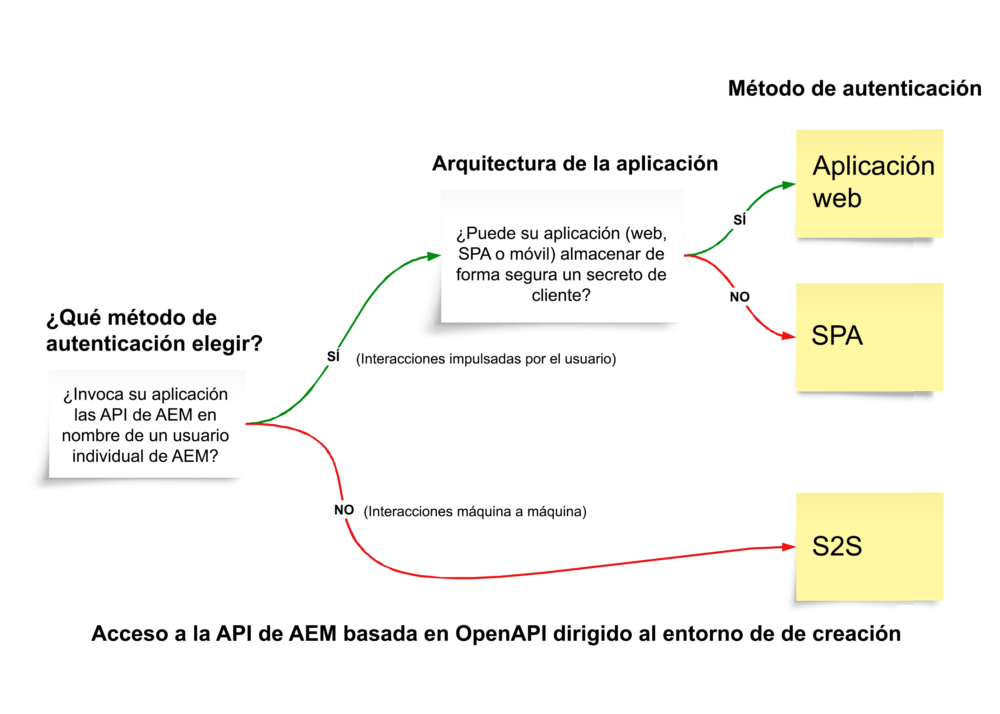

# API de AEM basadas en OpenAPI

>[!IMPORTANT]
>
>Las API de AEM basadas en OpenAPI solo están disponibles en AEM as a Cloud Service y no son compatibles con AEM 6.X.

Obtenga información sobre las API de AEM basadas en OpenAPI, incluida la compatibilidad con la autenticación, los conceptos clave y cómo acceder a las API de Adobe.

La [especificación de OpenAPI](https://swagger.io/specification/) (conocida anteriormente como Swagger) es un estándar muy utilizado para definir las API de RESTful. AEM as a Cloud Service proporciona varias API basadas en la especificación OpenAPI (o simplemente API de AEM basadas en OpenAPI), lo que facilita la creación de aplicaciones personalizadas que interactúan con los tipos de servicio de autor o publicación de AEM. A continuación se indican algunos ejemplos:

**Sites**

- [API de Sites](https://developer.adobe.com/experience-cloud/experience-manager-apis/api/stable/sites/): API para trabajar con fragmentos de contenido.

**Recursos**

- [API de carpetas](https://developer.adobe.com/experience-cloud/experience-manager-apis/api/experimental/folders/): API para trabajar con carpetas, como crear, mostrar y eliminar carpetas.

- [API de autor de recursos](https://developer.adobe.com/experience-cloud/experience-manager-apis/api/experimental/assets/author/): API para trabajar con recursos y sus metadatos.

**Formularios**

- [API de comunicaciones de formularios](https://developer.adobe.com/experience-cloud/experience-manager-apis/api/experimental/document/): API para trabajar con formularios y documentos.

En futuras versiones, se añadirán más API de AEM basadas en OpenAPI para admitir casos de uso adicionales.

## Compatibilidad con la autenticación{#authentication-support}

Las API de AEM basadas en OpenAPI admiten la autenticación OAuth 2.0, incluidos los siguientes tipos de concesión:

- **Credencial de servidor a servidor OAuth**: ideal para servicios back-end que necesitan acceso a la API sin interacción del usuario. Utiliza el tipo de concesión _client_credentials_, lo que permite una administración segura del acceso a nivel de servidor. Para más información, consulte [Credencial de servidor a servidor de OAuth](https://developer.adobe.com/developer-console/docs/guides/authentication/ServerToServerAuthentication/#oauth-server-to-server-credential).

- **Credencial de la aplicación web de OAuth**: es adecuada para aplicaciones web con componentes de front-end y _back-end_ que acceden a las API de AEM en nombre de los usuarios. Utiliza el tipo de concesión _authorization_code_, donde el servidor back-end administra secretos y tókenes de forma segura. Para obtener más información, consulte [Credencial de la aplicación web de OAuth](https://developer.adobe.com/developer-console/docs/guides/authentication/UserAuthentication/implementation#oauth-web-app-credential).

- **Credencial de aplicación de una sola página de OAuth**: diseñada para las SPA que se ejecutan en el explorador y que necesitan acceder a las API en nombre de un usuario sin un servidor back-end. Utiliza el tipo de concesión _authorization_code_ y se basa en los mecanismos de seguridad del lado del cliente mediante PKCE (Proof Key for Code Exchange) para proteger el flujo del código de autorización. Para obtener más información, consulte [Credencial de aplicación de una sola página de OAuth](https://developer.adobe.com/developer-console/docs/guides/authentication/UserAuthentication/implementation#oauth-single-page-app-credential).

## Qué método de autenticación utilizar{#auth-method-decision}

A la hora de decidir qué método de autenticación utilizar, tenga en cuenta lo siguiente:

La autenticación de usuario (aplicación web o aplicación de una sola página) debe ser la opción predeterminada siempre que se trate de un contexto de usuario de AEM. Esto garantiza que todas las acciones del repositorio se atribuyan correctamente al usuario autenticado y que el usuario solo tenga acceso a los permisos que le corresponden.
El uso de servidor a servidor (o cuenta de sistema técnico) para realizar acciones en nombre de un usuario individual elude el modelo de seguridad e introduce riesgos como la escalada de privilegios y la auditoría inexacta.

## Diferencia entre las credenciales de servidor a servidor de OAuth, de aplicación web y de una sola página{#difference-between-oauth-server-to-server-vs-web-app-vs-single-page-app-credentials}

En la siguiente tabla se resumen las diferencias entre los tres métodos de autenticación de OAuth admitidos por las API de AEM basadas en OpenAPI:

|  | Servidor a servidor de OAuth | Aplicación web de OAuth | Aplicación de una sola página (SPA) de OAuth |
| --- | --- | --- | --- |
| **Finalidad de la autenticación** | Diseñado para las interacciones de equipo a equipo. | Diseñado para las interacciones basadas en el usuario en una aplicación web con _back-end_. | Diseñado para las interacciones basadas en el usuario en una _aplicación JavaScript del lado del cliente_. |
| **Comportamiento del token** | Emite tókenes de acceso que representan la propia aplicación de cliente. | Emite tókenes de acceso en nombre de un usuario autenticado _a través de un back-end_. | Emite tókenes de acceso en nombre de un usuario autenticado _a través de un flujo solo de front-end_. |
| **Casos de uso** | Servicios de back-end que necesitan acceso a la API sin interacción del usuario. | Las aplicaciones web con componentes de front-end y back-end que acceden a las API en nombre de los usuarios. | Aplicaciones de front-end puras (JavaScript) que acceden a las API en nombre de usuarios sin back-end. |
| **Consideraciones sobre la seguridad** | Almacene de forma segura credenciales confidenciales (`client_id`, `client_secret`) en sistemas back-end. | Después de la autenticación del usuario, se les concede su propio _token de acceso temporal a través de una llamada back-end_. Almacene de forma segura las credenciales confidenciales (`client_id`, `client_secret`) en sistemas back-end para intercambiar el código de autorización por el token de acceso. | Después de la autenticación del usuario, se les concede su propio _token de acceso temporal a través de una llamada de front-end_. No utiliza `client_secret`, ya que no es seguro almacenarlo en aplicaciones de front-end. Se basa en PKCE para intercambiar el código de autorización por el token de acceso. |
| **Tipo de concesión** | _client_credentials_ | _authorization_code_ | _authorization_code_ con **PKCE** |
| **Tipo de credencial de Adobe Developer Console** | Servidor a servidor de OAuth | Aplicación web de OAuth | Aplicación de una sola página de OAuth |
| **Tutorial** | [Invocar la API mediante la autenticación de servidor a servidor](./use-cases/invoke-api-using-oauth-s2s.md) | [Invocar la API mediante la autenticación de aplicación web](./use-cases/invoke-api-using-oauth-web-app.md) | [Invocar la API mediante la autenticación de aplicación de una sola página](./use-cases/invoke-api-using-oauth-single-page-app.md) |

## Acceso a las API de Adobe y conceptos relacionados{#accessing-adobe-apis-and-related-concepts}

Antes de acceder a las API de Adobe, es esencial comprender estas construcciones clave:

- **[Adobe Developer Console](https://developer.adobe.com/)**: es el centro para desarrolladores para acceder a las API de Adobe, SDK, eventos en tiempo real, funciones sin servidor y mucho más. Tenga en cuenta que es diferente de _AEM_ Developer Console, que se utiliza para depurar aplicaciones de AEM.

- **[Proyecto de Adobe Developer Console](https://developer.adobe.com/developer-console/docs/guides/projects/)**: lugar central para administrar las integraciones de la API, eventos y funciones de tiempo de ejecución. Aquí puede configurar las API, establecer la autenticación y generar las credenciales necesarias.

- **[Perfiles de producto](https://helpx.adobe.com/es/enterprise/using/manage-product-profiles.html?lang=es)**: los perfiles de producto proporcionan un ajuste preestablecido de permisos que le permite controlar el acceso de los usuarios o las aplicaciones a productos de Adobe como AEM, Adobe Target, Adobe Analytics y otros. Todos los productos de Adobe tienen perfiles de producto predefinidos asociados a ellos.

- **Servicios**: los servicios definen los permisos reales y están asociados al perfil del producto. Para reducir o aumentar el ajuste preestablecido de permisos, puede anular la selección de los servicios asociados al perfil del producto o bien seleccionarlos. Lo que le permite controlar el nivel de acceso al producto y a sus API. En AEM as a Cloud Service, los servicios representan grupos de usuarios con Listas de control de acceso (ACL) predefinidas para nodos del repositorio, lo que permite la administración detallada de los permisos.

## Introducción

Obtenga información sobre cómo configurar su entorno de AEM as a Cloud Service y un proyecto de Adobe Developer Console para habilitar el acceso a las API de AEM basadas en OpenAPI. Acceda también a la API de AEM mediante el explorador para comprobar la configuración y revisar la solicitud y la respuesta.

<!-- CARDS
{target = _self}

* ./setup.md
  {title = Set up OpenAPI-based AEM APIs}
  {description = Learn how to set up your AEM as a Cloud Service environment to enable access to the OpenAPI-based AEM APIs.}
  {image = ./assets/setup/OpenAPI-Setup.png}
-->
<!-- START CARDS HTML - DO NOT MODIFY BY HAND -->

    

        

            

                <figure class="image x-is-16by9">
                    
                </figure>
            

            

                

                    

                        <a href="./setup.md" target="_self" rel="referrer" title="Configurar las API de AEM basadas en OpenAPI">Configurar las API de AEM basadas en OpenAPI</a>
                    

                    
Aprenda a configurar su entorno de AEM as a Cloud Service para habilitar el acceso a las API de AEM basadas en OpenAPI.

                

                <a href="./setup.md" target="_self" rel="referrer" class="spectrum-Button spectrum-Button--outline spectrum-Button--primary spectrum-Button--sizeM" style="align-self: flex-start; margin-top: 1rem;">
                    Más información
                </a>
            

        

    

<!-- END CARDS HTML - DO NOT MODIFY BY HAND -->

## Tutoriales de la API

Aprenda a utilizar las API de AEM basadas en OpenAPI utilizando diferentes métodos de autenticación de OAuth:

<!-- CARDS
{target = _self}

* ./use-cases/invoke-api-using-oauth-s2s.md
  {title = Invoke API using Server-to-Server authentication}
  {description = Learn how to invoke OpenAPI-based AEM APIs from a custom NodeJS application using OAuth Server-to-Server authentication.}
  {image = ./assets/s2s/OAuth-S2S.png}
* ./use-cases/invoke-api-using-oauth-web-app.md
  {title = Invoke API using Web App authentication}
  {description = Learn how to invoke OpenAPI-based AEM APIs from a custom web application using OAuth Web App authentication.}
  {image = ./assets/web-app/OAuth-WebApp.png}
* ./use-cases/invoke-api-using-oauth-single-page-app.md
  {title = Invoke API using Single Page App authentication}
  {description = Learn how to invoke OpenAPI-based AEM APIs from a custom Single Page App (SPA) using OAuth Single Page App authentication.}
  {image = ./assets/spa/OAuth-SPA.png}  
-->
<!-- START CARDS HTML - DO NOT MODIFY BY HAND -->

    

        

            

                <figure class="image x-is-16by9">
                    
                </figure>
            

            

                

                    

                        <a href="./use-cases/invoke-api-using-oauth-s2s.md" target="_self" rel="referrer" title="Invocar la API mediante la autenticación de servidor a servidor">Invocar la API mediante la autenticación de servidor a servidor</a>
                    

                    
Obtenga información sobre cómo invocar las API de AEM basadas en OpenAPI desde una aplicación NodeJS personalizada mediante la autenticación de servidor a servidor de OAuth.

                

                <a href="./use-cases/invoke-api-using-oauth-s2s.md" target="_self" rel="referrer" class="spectrum-Button spectrum-Button--outline spectrum-Button--primary spectrum-Button--sizeM" style="align-self: flex-start; margin-top: 1rem;">
                    Más información
                </a>
            

        

    

    

        

            

                <figure class="image x-is-16by9">
                    
                </figure>
            

            

                

                    

                        <a href="./use-cases/invoke-api-using-oauth-web-app.md" target="_self" rel="referrer" title="Invocar la API mediante la autenticación de aplicación web">Invocar la API mediante la autenticación de aplicación web</a>
                    

                    
Obtenga información sobre cómo invocar las API de AEM basadas en OpenAPI desde una aplicación web personalizada mediante la autenticación de aplicación web de OAuth.

                

                <a href="./use-cases/invoke-api-using-oauth-web-app.md" target="_self" rel="referrer" class="spectrum-Button spectrum-Button--outline spectrum-Button--primary spectrum-Button--sizeM" style="align-self: flex-start; margin-top: 1rem;">
                    Más información
                </a>
            

        

    

    

        

            

                <figure class="image x-is-16by9">
                    
                </figure>
            

            

                

                    

                        <a href="./use-cases/invoke-api-using-oauth-single-page-app.md" target="_self" rel="referrer" title="Invocar la API mediante la autenticación de aplicación de una sola página">Invocar la API mediante la autenticación de aplicación de una sola página</a>
                    

                    
Obtenga información sobre cómo invocar las API de AEM basadas en OpenAPI desde una aplicación de una sola página (SPA) personalizada mediante la autenticación de aplicación de una sola página de OAuth.

                

                <a href="./use-cases/invoke-api-using-oauth-single-page-app.md" target="_self" rel="referrer" class="spectrum-Button spectrum-Button--outline spectrum-Button--primary spectrum-Button--sizeM" style="align-self: flex-start; margin-top: 1rem;">
                    Más información
                </a>
            

        

    

<!-- END CARDS HTML - DO NOT MODIFY BY HAND -->
