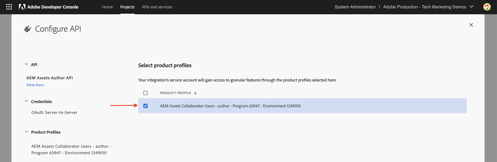

# Configurar las API de AEM basadas en OpenAPI

Aprenda a configurar su entorno de AEM as a Cloud Service para habilitar el acceso a las API de AEM basadas en OpenAPI.

En este ejemplo, la API de **AEM Assets** que usa el método de autenticación **Servidor a servidor** se usa para mostrar el proceso de configuración de las API de AEM basadas en OpenAPI. Se pueden seguir pasos similares para configurar [otras API de AEM basadas en OpenAPI](https://developer.adobe.com/experience-cloud/experience-manager-apis/#openapi-based-apis).

>[!VIDEO](https://video.tv.adobe.com/v/3457510?quality=12&learn=on)

El proceso de configuración de alto nivel incluye los siguientes pasos:

1. Modernización del entorno de AEM as a Cloud Service.
1. Habilite el acceso a las API de AEM.
1. Crear un proyecto de Adobe Developer Console (ADC).
1. Configurar el proyecto de ADC.
1. Configure la instancia de AEM para habilitar la comunicación del proyecto ADC.

## Requisitos previos

- Acceso al entorno de Cloud Manager y AEM as a Cloud Service
- Acceso a Adobe Developer Console (ADC).
- Proyecto de AEM para agregar o actualizar la configuración de la API en el archivo `api.yaml`.

## Modernización del entorno de AEM as a Cloud Service{#modernization-of-aem-as-a-cloud-service-environment}

La modernización del entorno de AEM as a Cloud Service es una **actividad única por entorno** que implica los siguientes pasos. Si ya ha modernizado su entorno de AEM as a Cloud Service, puede omitir este paso.

- Actualización a la versión de AEM **2024.10.18459.20241031T210302Z** o posterior.
- Añádale nuevos perfiles de producto si el entorno se creó antes de la versión 2024.10.18459.20241031T210302Z.

### Actualizar instancia de AEM{#update-aem-instance}

- Para actualizar la instancia de AEM, después de iniciar sesión en Adobe [Cloud Manager](https://my.cloudmanager.adobe.com/), vaya a la sección _Entornos_, seleccione el icono _puntos suspensivos_ junto al nombre del entorno y seleccione la opción **Actualizar**.


- Luego haga clic en el botón **Enviar** y ejecute la canalización de pila completa _sugerida_.


En mi caso, la canalización Fullstack se llama **Dev :: Fullstack-Deploy**, y el entorno AEM se llama **wknd-program-dev**. Sus nombres pueden ser diferentes.

### Añadir nuevos perfiles de producto{#add-new-product-profiles}

- Para agregar nuevos perfiles de producto a la instancia de AEM, en la sección [Entornos](https://my.cloudmanager.adobe.com/) de Adobe _Cloud Manager_, seleccione el icono de _puntos suspensivos_ junto al nombre del entorno y seleccione la opción **Agregar perfiles de producto**.


- Revise los perfiles de producto agregados recientemente haciendo clic en el icono de _elipsis_ junto al nombre de entorno y seleccionando **Administrar acceso** > **Perfiles de autor**.

- La ventana _Admin Console_ muestra los perfiles de producto agregados recientemente. Según sus derechos de AEM, como AEM Assets, AEM Sites, AEM Forms, etc., puede ver diferentes perfiles de producto. Por ejemplo, en mi caso, tengo derechos de AEM Assets y Sites, por lo que veo los siguientes perfiles de producto.


- Los pasos anteriores completan la modernización del entorno de AEM as a Cloud Service.

## Habilitar el acceso a las API de AEM{#enable-aem-apis-access}

La presencia de _nuevos perfiles de producto_ habilita el acceso a la API de AEM basada en OpenAPI en [Adobe Developer Console (ADC)](https://developer.adobe.com/). Sin estos perfiles de producto, no puede configurar las API de AEM basadas en OpenAPI en Adobe Developer Console (ADC).

Los perfiles de producto agregados recientemente están asociados con _Servicios_ que representan _grupos de usuarios de AEM con Listas de control de acceso (ACL) predefinidas_. Los _servicios_ se utilizan para controlar el nivel de acceso a las API de AEM. También puede seleccionar o deseleccionar los _servicios_ asociados con el perfil de producto para reducir o aumentar el nivel de acceso.

Revise la asociación haciendo clic en el icono _Ver detalles_ junto al nombre del perfil del producto. En la siguiente captura de pantalla, puede ver la asociación de **AEM Sites Content Managers - author - Program XXX - Environment XXX** Product Profile con el servicio **AEM Sites Content Managers**. Revisar otros perfiles de producto y sus asociaciones con los servicios.


### Habilitar el acceso a las API de AEM Assets{#enable-aem-assets-apis-access}

En este ejemplo, la API de **AEM Assets** se usa para mostrar el proceso de configuración de las API de AEM basadas en OpenAPI. Sin embargo, de manera predeterminada, el servicio **Usuarios de la API de AEM Assets** no está asociado con ningún perfil de producto. Debe asociarlo con el perfil de producto deseado.

Asociémoslo con los **Usuarios colaboradores de AEM Assets recién agregados - autor - Programa XXX - Entorno XXX** Perfil de producto o cualquier otro Perfil de producto que desee usar para el acceso a la API de AEM Assets.


### Habilitar la autenticación de servidor a servidor

Para habilitar la autenticación de servidor a servidor para las API de AEM deseadas basadas en OpenAPI, el usuario que configura la integración con Adobe Developer Console (ADC) debe agregarse como Desarrollador al _Perfil de producto_ donde está asociado el _Servicio_.

Por ejemplo, para habilitar la autenticación de servidor a servidor para la API de AEM Assets, se debe agregar el usuario como desarrollador a **Usuarios de AEM Assets Collaborator - autor - Programa XXX - Entorno XXX** _Perfil del producto_.


Después de esta asociación, la _API de autor de recursos_ del proyecto ADC puede configurar la autenticación de servidor a servidor deseada y asociar la cuenta de autenticación del proyecto ADC (creada en el siguiente paso) con el perfil de producto.

>[!IMPORTANT]
>
>El paso anterior es fundamental para habilitar la autenticación de servidor a servidor para la API de AEM deseada. Sin esta asociación, la API de AEM no se puede utilizar con el método de autenticación servidor a servidor.

Al realizar todos los pasos anteriores, ha preparado el entorno de AEM as a Cloud Service para habilitar el acceso a las API de AEM basadas en OpenAPI. A continuación, debe crear el proyecto de Adobe Developer Console (ADC) para configurar las API de AEM basadas en OpenAPI.

## Crear proyecto de Adobe Developer Console (ADC){#adc-project}

El proyecto de Adobe Developer Console (ADC) se utiliza para configurar las API de AEM basadas en OpenAPI. Recuerde que [Adobe Developer Console (ADC)](./overview.md#accessing-adobe-apis-and-related-concepts) es el centro para desarrolladores para acceder a las API de Adobe, los SDK, los eventos en tiempo real, las funciones sin servidor y mucho más.

El proyecto ADC se utiliza para agregar las API deseadas, configurar su autenticación y asociar la cuenta de autenticación con el perfil de producto.

Para crear un proyecto de ADC:

1. Inicie sesión en [Adobe Developer Console](https://developer.adobe.com/console) con su Adobe ID.

   

1. En la sección _Inicio rápido_, haga clic en el botón **Crear nuevo proyecto**.

   

1. Crea un nuevo proyecto con el nombre predeterminado.

   

1. Edite el nombre del proyecto haciendo clic en el botón **Editar proyecto** en la esquina superior derecha. Proporcione un nombre descriptivo y haga clic en **Guardar**.

   

## Configurar proyecto de ADC{#configure-adc-project}

Después de crear el proyecto de ADC, debe agregar las API de AEM deseadas, configurar su autenticación y asociar la cuenta de autenticación con el perfil de producto.

En este caso, la API de **AEM Assets** se usa para mostrar el proceso de configuración de las API de AEM basadas en OpenAPI. Sin embargo, puede seguir pasos similares para agregar otras API de AEM basadas en OpenAPI como **AEM Sites API**, **AEM Forms API**, etc. Los derechos de AEM determinan las API disponibles en Adobe Developer Console (ADC).

1. Para agregar las API de AEM, haga clic en el botón **Agregar API**.

   

1. En el cuadro de diálogo _Agregar API_, filtre por _Experience Cloud_ y seleccione la API de AEM que desee. Por ejemplo, en este caso, la _API de autor de recursos_ está seleccionada.

   

   >[!TIP]
   >
   >    Si la **tarjeta de la API de AEM** deseada está deshabilitada y _¿Por qué está deshabilitada?La información de_ muestra el mensaje **Se requiere licencia**. Una de las razones podría ser que NO ha modernizado su entorno de AEM as a Cloud Service. Consulte [Modernización del entorno de AEM as a Cloud Service](#modernization-of-aem-as-a-cloud-service-environment) para obtener más información.

1. A continuación, en el cuadro de diálogo _Configurar API_, seleccione la opción de autenticación que desee. Por ejemplo, en este caso, la opción de autenticación **Servidor a servidor** está seleccionada.

   

   La autenticación de servidor a servidor es ideal para los servicios back-end que necesitan acceso a API sin interacción del usuario. Las opciones de autenticación Aplicación web y Aplicación de una sola página son adecuadas para las aplicaciones que necesitan acceso a la API en nombre de los usuarios. Para obtener más información, consulte [Diferencia entre OAuth servidor a servidor vs aplicación web vs. credenciales de aplicación de una sola página](./overview.md#difference-between-oauth-server-to-server-vs-web-app-vs-single-page-app-credentials).

   >[!TIP]
   >
   >Si no ve la opción Autenticación de servidor a servidor, significa que el usuario que configura la integración no se agrega como Desarrollador al Perfil de producto donde está asociado el servicio. Consulte [Habilitar la autenticación de servidor a servidor](#enable-server-to-server-authentication) para obtener más información.


1. Si es necesario, puede cambiar el nombre de la API para facilitar la identificación. Para fines de demostración, se utiliza el nombre predeterminado.

   

1. En este caso, el método de autenticación es **OAuth Server-to-Server**, por lo que debe asociar la cuenta de autenticación con el perfil de producto. Seleccione el perfil de producto **Usuarios colaboradores de AEM Assets - Autor - Programa XXX - Entorno XXX** y haga clic en **Guardar**.

   

1. Revise la configuración de autenticación y la API de AEM.

   

   

Si elige el método de autenticación **OAuth Web App** o **OAuth Single Page App**, no se solicita la asociación del perfil de producto, pero se requiere el URI de redireccionamiento de la aplicación. El URI de redireccionamiento de la aplicación se utiliza para redirigir al usuario a la aplicación después de la autenticación con un código de autorización. Los tutoriales de casos de uso relevantes describen estas configuraciones específicas de autenticación.

## Configure la instancia de AEM para habilitar la comunicación del proyecto de ADC{#configure-aem-instance}

A continuación, debe configurar la instancia de AEM para habilitar la comunicación anterior del proyecto ADC. Con esta configuración, el ID de cliente del proyecto ADC NO puede comunicarse con la instancia de AEM y provoca un error 403 prohibido. Considere esta configuración como una regla del cortafuegos para permitir que solo los ID de cliente permitidos se comuniquen con la instancia de AEM.

Vamos a seguir los pasos para configurar la instancia de AEM para habilitar la comunicación anterior del proyecto ADC.

1. En el equipo local, vaya al proyecto de AEM (o clónelo si aún no lo ha hecho) y busque la carpeta `config`.

1. En AEM Project, busque o cree el archivo `api.yaml` en la carpeta `config`. En mi caso, el [proyecto WKND Sites de AEM](https://github.com/adobe/aem-guides-wknd) se usa para mostrar el proceso de configuración de las API de AEM basadas en OpenAPI.

   

1. Agregue la siguiente configuración al archivo `api.yaml` para permitir que el ClientID del proyecto ADC se comunique con la instancia de AEM.

   ```yaml
   kind: "API"
   version: "1.0"
   metadata: 
       envTypes: ["dev", "stage", "prod"]
   data:
       allowedClientIDs:
           author:
           - "<ADC Project's Credentials ClientID>"
   ```

   Reemplace `<ADC Project's Credentials ClientID>` por el ClientID real del valor Credentials del proyecto ADC. El extremo de API que se usa en este tutorial solo está disponible en el nivel de creación, pero para otras API, la configuración yaml también puede tener un nodo _publish_ o _preview_.

   >[!CAUTION]
   >
   > Para fines de demostración, se utiliza el mismo ClientID para todos los entornos. Se recomienda utilizar ClientID independiente por entorno (dev, stage, prod) para mejorar la seguridad y el control.

1. Confirme los cambios de configuración e inserte los cambios en el repositorio Git remoto al que está conectada la canalización de Cloud Manager.

1. Implemente los cambios anteriores mediante la [Canalización de configuración](https://experienceleague.adobe.com/en/docs/experience-manager-cloud-service/content/implementing/using-cloud-manager/cicd-pipelines/introduction-ci-cd-pipelines#config-deployment-pipeline) en Cloud Manager.

   

Tenga en cuenta que el archivo `api.yaml` también se puede instalar en un [RDE](https://experienceleague.adobe.com/en/docs/experience-manager-learn/cloud-service/developing/rde/overview), [con herramientas de línea de comandos](https://experienceleague.adobe.com/en/docs/experience-manager-learn/cloud-service/developing/rde/how-to-use#deploy-configuration-yaml-files). Esto resulta útil para probar los cambios de configuración antes de implementarlos en el entorno de producción.

## Próximos pasos

Una vez configurada la instancia de AEM para habilitar la comunicación del proyecto ADC, puede empezar a utilizar las API de AEM basadas en OpenAPI. Aprenda a utilizar las API de AEM basadas en OpenAPI utilizando diferentes métodos de autenticación de OAuth:

<!-- CARDS
{target = _self}

* ./use-cases/invoke-api-using-oauth-s2s.md
  {title = Invoke API using Server-to-Server authentication}
  {description = Learn how to invoke OpenAPI-based AEM APIs from a custom NodeJS application using OAuth Server-to-Server authentication.}
  {image = ./assets/s2s/OAuth-S2S.png}
* ./use-cases/invoke-api-using-oauth-web-app.md
  {title = Invoke API using Web App authentication}
  {description = Learn how to invoke OpenAPI-based AEM APIs from a custom web application using OAuth Web App authentication.}
  {image = ./assets/web-app/OAuth-WebApp.png}
* ./use-cases/invoke-api-using-oauth-single-page-app.md
  {title = Invoke API using Single Page App authentication}
  {description = Learn how to invoke OpenAPI-based AEM APIs from a custom Single Page App (SPA) using OAuth 2.0 PKCE flow.}
  {image = ./assets/spa/OAuth-SPA.png}  
-->
<!-- START CARDS HTML - DO NOT MODIFY BY HAND -->
<div class="columns">
    <div class="column is-half-tablet is-half-desktop is-one-third-widescreen" aria-label="Invoke API using Server-to-Server authentication">
        <div class="card" style="height: 100%; display: flex; flex-direction: column; height: 100%;">
            <div class="card-image">
                <figure class="image x-is-16by9">
                    <a href="./use-cases/invoke-api-using-oauth-s2s.md" title="Invocar la API mediante la autenticación de servidor a servidor" target="_self" rel="referrer">
                        
                    </a>
                </figure>
            </div>
            <div class="card-content is-padded-small" style="display: flex; flex-direction: column; flex-grow: 1; justify-content: space-between;">
                <div class="top-card-content">
                    <p class="headline is-size-6 has-text-weight-bold">
                        <a href="./use-cases/invoke-api-using-oauth-s2s.md" target="_self" rel="referrer" title="Invocar la API mediante la autenticación de servidor a servidor">Invocar la API mediante la autenticación de servidor a servidor</a>
                    </p>
                    <p class="is-size-6">Obtenga información sobre cómo invocar las API de AEM basadas en OpenAPI desde una aplicación NodeJS personalizada mediante la autenticación de servidor a servidor de OAuth.</p>
                </div>
                <a href="./use-cases/invoke-api-using-oauth-s2s.md" target="_self" rel="referrer" class="spectrum-Button spectrum-Button--outline spectrum-Button--primary spectrum-Button--sizeM" style="align-self: flex-start; margin-top: 1rem;">
                    <span class="spectrum-Button-label has-no-wrap has-text-weight-bold">Más información</span>
                </a>
            </div>
        </div>
    </div>
    <div class="column is-half-tablet is-half-desktop is-one-third-widescreen" aria-label="Invoke API using Web App authentication">
        <div class="card" style="height: 100%; display: flex; flex-direction: column; height: 100%;">
            <div class="card-image">
                <figure class="image x-is-16by9">
                    <a href="./use-cases/invoke-api-using-oauth-web-app.md" title="Invocar la API mediante la autenticación de aplicación web" target="_self" rel="referrer">
                        
                    </a>
                </figure>
            </div>
            <div class="card-content is-padded-small" style="display: flex; flex-direction: column; flex-grow: 1; justify-content: space-between;">
                <div class="top-card-content">
                    <p class="headline is-size-6 has-text-weight-bold">
                        <a href="./use-cases/invoke-api-using-oauth-web-app.md" target="_self" rel="referrer" title="Invocar la API mediante la autenticación de aplicación web">Invocar la API mediante la autenticación de aplicación web</a>
                    </p>
                    <p class="is-size-6">Obtenga información sobre cómo invocar las API de AEM basadas en OpenAPI desde una aplicación web personalizada mediante la autenticación de aplicación web de OAuth.</p>
                </div>
                <a href="./use-cases/invoke-api-using-oauth-web-app.md" target="_self" rel="referrer" class="spectrum-Button spectrum-Button--outline spectrum-Button--primary spectrum-Button--sizeM" style="align-self: flex-start; margin-top: 1rem;">
                    <span class="spectrum-Button-label has-no-wrap has-text-weight-bold">Más información</span>
                </a>
            </div>
        </div>
    </div>
    <div class="column is-half-tablet is-half-desktop is-one-third-widescreen" aria-label="Invoke API using Single Page App authentication">
        <div class="card" style="height: 100%; display: flex; flex-direction: column; height: 100%;">
            <div class="card-image">
                <figure class="image x-is-16by9">
                    <a href="./use-cases/invoke-api-using-oauth-single-page-app.md" title="Invocar la API mediante la autenticación de aplicación de una sola página" target="_self" rel="referrer">
                        
                    </a>
                </figure>
            </div>
            <div class="card-content is-padded-small" style="display: flex; flex-direction: column; flex-grow: 1; justify-content: space-between;">
                <div class="top-card-content">
                    <p class="headline is-size-6 has-text-weight-bold">
                        <a href="./use-cases/invoke-api-using-oauth-single-page-app.md" target="_self" rel="referrer" title="Invocar la API mediante la autenticación de aplicación de una sola página">Invocar la API mediante la autenticación de aplicación de una sola página</a>
                    </p>
                    <p class="is-size-6">Aprenda a invocar las API de AEM basadas en OpenAPI desde una aplicación de una sola página (SPA) personalizada mediante el flujo PKCE de OAuth 2.0.</p>
                </div>
                <a href="./use-cases/invoke-api-using-oauth-single-page-app.md" target="_self" rel="referrer" class="spectrum-Button spectrum-Button--outline spectrum-Button--primary spectrum-Button--sizeM" style="align-self: flex-start; margin-top: 1rem;">
                    <span class="spectrum-Button-label has-no-wrap has-text-weight-bold">Más información</span>
                </a>
            </div>
        </div>
    </div>
</div>
<!-- END CARDS HTML - DO NOT MODIFY BY HAND -->
