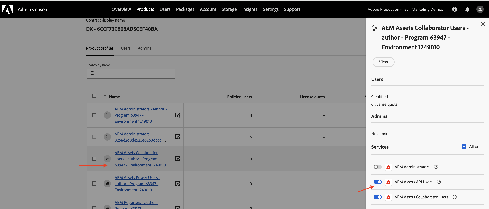

# Configurar las API de AEM basadas en OpenAPI

Aprenda a configurar su entorno de AEM as a Cloud Service para habilitar el acceso a las API de AEM basadas en OpenAPI.

>[!AVAILABILITY]
>
>Las API de AEM basadas en API abiertas están disponibles como parte de un programa de acceso anticipado. Si está interesado en acceder a ellos, le recomendamos que envíe un correo electrónico a [aem-apis@adobe.com](mailto:aem-apis@adobe.com) con una descripción de su caso de uso.

>[!VIDEO](https://video.tv.adobe.com/v/3457510?quality=12&learn=on)


El proceso de configuración de alto nivel incluye los siguientes pasos:

1. Modernización del entorno de AEM as a Cloud Service.
1. Habilite el acceso a las API de AEM.
1. Crear un proyecto de Adobe Developer Console (ADC).
1. Configurar proyecto de ADC
1. Configure la instancia de AEM para habilitar la comunicación del proyecto ADC.

## Modernización del entorno de AEM as a Cloud Service{#modernization-of-aem-as-a-cloud-service-environment}

La modernización del entorno de AEM as a Cloud Service es una actividad única por entorno que implica los siguientes pasos:

- Actualización a la versión de AEM **2024.10.18459.20241031T210302Z** o posterior.
- Añádale nuevos perfiles de producto si el entorno se ha creado antes de la versión 2024.10.18459.20241031T210302Z.

### Actualizar instancia de AEM{#update-aem-instance}

Para actualizar la instancia de AEM, en la sección _Entornos_ de Adobe [Cloud Manager](https://my.cloudmanager.adobe.com/), seleccione el icono de _puntos suspensivos_ junto al nombre del entorno y seleccione la opción **Actualizar**.


Luego haga clic en el botón **Enviar** y ejecute la canalización de pila completa _sugerida_.


En mi caso, la canalización Fullstack se llama **Dev :: Fullstack-Deploy**, y el entorno AEM se llama **wknd-program-dev**. Sus nombres pueden ser diferentes.

### añadir nuevos perfiles de producto{#add-new-product-profiles}

Para añadir nuevos perfiles de producto al instancia de AEM, en la sección Entornos de Adobe Systems [Cloud Manager](https://my.cloudmanager.adobe.com/), seleccione el icono de _puntos suspensivos_ junto al nombre del entorno y seleccione la opción añadir perfiles **de** producto.__


Para revisar los perfiles de producto agregados recientemente, haga clic en el icono de _elipsis_ junto al nombre del entorno y seleccione **Administrar acceso** > **Perfiles de autor**.

La ventana _Admin Console_ muestra los perfiles de producto agregados recientemente.


Los pasos anteriores completan la modernización del entorno de AEM as a Cloud Service.

## Habilitar el acceso a las API de AEM{#enable-aem-apis-access}

La presencia de los nuevos perfiles _de producto permite el acceso a API_ de AEM basadas en OpenAPI en la consola de desarrollador de Adobe Systems (ADC). Recuerde que [Adobe Systems Developer Console (ADC)](./overview.md#accessing-adobe-apis-and-related-concepts) es el centro de desarrolladores para acceder a API de Adobe Systems, SDK, eventos en tiempo real, funciones sin servidor y más.

Los perfiles de producto agregados recientemente están asociados con _Servicios_ que representan _grupos de usuarios de AEM con Listas de control de acceso (ACL) predefinidas_. Los _servicios_ se utilizan para controlar el nivel de acceso a las API de AEM.

También puede seleccionar o deseleccionar los _servicios_ asociados con el perfil de producto para reducir o aumentar el nivel de acceso.

Revise la asociación haciendo clic en el icono _Ver detalles_ junto al nombre del perfil del producto.


De forma predeterminada, el servicio de usuarios de API **de Recursos AEM no está asociado a ningún perfil de** producto. Vamos a asociarlo con el recién agregado **Recursos AEM Usuarios colaboradores - autor - Programa XXX - Entorno XXX** Perfil de producto. Después de esta asociación, la API _de Autor de recursos del_ proyecto ADC puede configurar la autenticación de servidor a servidor deseada y asociar el cuenta de autenticación del proyecto ADC (creado en el paso siguiente) con el perfil de producto.



>[!IMPORTANT]
>
>El paso anterior es esencial para habilitar la autenticación de servidor a servidor para la API de Recursos AEM. Sin esta asociación, la API Recursos AEM no se puede utilizar con el método de autenticación de servidor a servidor.

## Crear proyecto de Adobe Developer Console (ADC){#adc-project}

El proyecto ADC se utiliza para agregar las API deseadas, configurar su autenticación y asociar la cuenta de autenticación con el perfil de producto.

Para crear un proyecto de ADC:

1. Inicie sesión en [Adobe Developer Console](https://developer.adobe.com/console) con su Adobe ID.

   

1. En la sección _Inicio rápido_, haga clic en el botón **Crear nuevo proyecto**.

   

1. Crea un nuevo proyecto con el nombre predeterminado.

   

1. Edite el nombre del proyecto haciendo clic en el botón **Editar proyecto** en la esquina superior derecha. Proporcione un nombre descriptivo y haga clic en **Guardar**.

   

## Configurar proyecto de ADC{#configure-adc-project}

Después de crear el proyecto ADC, debe agregar las API de AEM deseadas, configurar su autenticación y asociar el cuenta de autenticación con el perfil de producto.

1. Para agregar AEM API, haga clic en el botón API **de** añadir.

   

1. En el cuadro de _diálogo API_ añadir, filtre por _Experience Cloud_ y seleccione la API AEM que desee. Por ejemplo, en este caso, la _API de autor de recursos_ está seleccionada.

   

1. A continuación, en el cuadro de diálogo _Configurar API_, seleccione la opción de autenticación que desee. Por ejemplo, en este caso, la opción de autenticación **Servidor a servidor** está seleccionada.

   

   La autenticación de servidor a servidor es ideal para los servicios back-end que necesitan acceso a API sin interacción del usuario. Las opciones de autenticación Aplicación web y Aplicación de una sola página son adecuadas para las aplicaciones que necesitan acceso a la API en nombre de los usuarios. Para obtener más información, consulte [Diferencia entre OAuth servidor a servidor vs aplicación web vs. credenciales de aplicación de una sola página](./overview.md#difference-between-oauth-server-to-server-vs-web-app-vs-single-page-app-credentials).

1. Si es necesario, puede cambiar el nombre de la API para facilitar la identificación. Para fines de demostración, se utiliza el nombre predeterminado.

   

1. En este caso, el método de autenticación es **OAuth Server-to-Server**, por lo que debe asociar la cuenta de autenticación con el perfil de producto. Seleccione el perfil de producto **Usuarios colaboradores de AEM Assets - Autor - Programa XXX - Entorno XXX** y haga clic en **Guardar**.

   

1. Revise la configuración de autenticación y la API de AEM.

   

   

Si elige el método de autenticación **OAuth Web App** o **OAuth Single Page App**, no se solicita la asociación del perfil de producto, pero se requiere el URI de redireccionamiento de la aplicación. El URI de redireccionamiento de la aplicación se utiliza para redirigir al usuario a la aplicación después de la autenticación con un código de autorización. Los tutoriales de casos de uso relevantes describen estas configuraciones específicas de autenticación.

## Configure la instancia de AEM para habilitar la comunicación del proyecto de ADC{#configure-aem-instance}

Para habilitar la comunicación del ID de cliente del proyecto ADC con la instancia de AEM, debe configurar la instancia de AEM.

Se realiza definiendo la configuración de API en el archivo `config.yaml` de
Abra el proyecto de AEM e impleméntelo usando la canalización de configuración en Cloud Manager.

1. En AEM Project, busque o cree el archivo `config.yaml` en la carpeta `config`.

   

1. Agregue la siguiente configuración al archivo `config.yaml`.

   ```yaml
   kind: "API"
   version: "1.0"
   metadata: 
       envTypes: ["dev", "stage", "prod"]
   data:
       allowedClientIDs:
           author:
           - "<ADC Project's Credentials ClientID>"
   ```

   Reemplace `<ADC Project's Credentials ClientID>` por el ClientID real del valor Credentials del proyecto ADC. El extremo de API que se usa en este tutorial solo está disponible en el nivel de creación, pero para otras API, la configuración yaml también puede tener un nodo _publish_ o _preview_.

   >[!CAUTION]
   >
   > Para fines de demostración, se utiliza el mismo ClientID para todos los entornos. Se recomienda utilizar ClientID separado por entorno (dev, fase, prod) para mejorar la seguridad y el control.

1. Confirme los cambios de configuración y envíelos al Git remoto al repositorio al que está conectada la canalización de Cloud Manager.

1. Implemente los cambios anteriores mediante la canalización de configuración de Cloud Manager. Tenga en cuenta que el `config.yaml` archivo también se puede instalar en un RDE, utilizando herramientas de línea de comandos.

   

## Pasos siguientes

Una vez configurada la instancia de AEM para habilitar la comunicación del proyecto ADC, puede empezar a utilizar las API de AEM basadas en OpenAPI. Aprenda a utilizar las API de AEM basadas en OpenAPI utilizando diferentes métodos de autenticación de OAuth:

<!-- CARDS
{target = _self}

* ./use-cases/invoke-api-using-oauth-s2s.md
  {title = Invoke API using Server-to-Server authentication}
  {description = Learn how to invoke OpenAPI-based AEM APIs from a custom NodeJS application using OAuth Server-to-Server authentication.}
  {image = ./assets/s2s/OAuth-S2S.png}
* ./use-cases/invoke-api-using-oauth-web-app.md
  {title = Invoke API using Web App authentication}
  {description = Learn how to invoke OpenAPI-based AEM APIs from a custom web application using OAuth Web App authentication.}
  {image = ./assets/web-app/OAuth-WebApp.png}
* ./use-cases/invoke-api-using-oauth-single-page-app.md
  {title = Invoke API using Single Page App authentication}
  {description = Learn how to invoke OpenAPI-based AEM APIs from a custom Single Page App (SPA) using OAuth 2.0 PKCE flow.}
  {image = ./assets/spa/OAuth-SPA.png}  
-->
<!-- START CARDS HTML - DO NOT MODIFY BY HAND -->
<div class="columns">
    <div class="column is-half-tablet is-half-desktop is-one-third-widescreen" aria-label="Invoke API using Server-to-Server authentication">
        <div class="card" style="height: 100%; display: flex; flex-direction: column; height: 100%;">
            <div class="card-image">
                <figure class="image x-is-16by9">
                    <a href="./use-cases/invoke-api-using-oauth-s2s.md" title="Invocar la API mediante la autenticación de servidor a servidor" target="_self" rel="referrer">
                        
                    </a>
                </figure>
            </div>
            <div class="card-content is-padded-small" style="display: flex; flex-direction: column; flex-grow: 1; justify-content: space-between;">
                <div class="top-card-content">
                    <p class="headline is-size-6 has-text-weight-bold">
                        <a href="./use-cases/invoke-api-using-oauth-s2s.md" target="_self" rel="referrer" title="Invocar API mediante la autenticación de servidor a servidor">Invocar API mediante autenticación de servidor a servidor</a>
                    </p>
                    <p class="is-size-6">Obtenga información sobre cómo invocar las API de AEM basadas en OpenAPI desde una aplicación NodeJS personalizada mediante la autenticación de servidor a servidor OAuth.</p>
                </div>
                <a href="./use-cases/invoke-api-using-oauth-s2s.md" target="_self" rel="referrer" class="spectrum-Button spectrum-Button--outline spectrum-Button--primary spectrum-Button--sizeM" style="align-self: flex-start; margin-top: 1rem;">
                    <span class="spectrum-Button-label has-no-wrap has-text-weight-bold">Más información</span>
                </a>
            </div>
        </div>
    </div>
    <div class="column is-half-tablet is-half-desktop is-one-third-widescreen" aria-label="Invoke API using Web App authentication">
        <div class="card" style="height: 100%; display: flex; flex-direction: column; height: 100%;">
            <div class="card-image">
                <figure class="image x-is-16by9">
                    <a href="./use-cases/invoke-api-using-oauth-web-app.md" title="Invocar la API mediante la autenticación de aplicación web" target="_self" rel="referrer">
                        
                    </a>
                </figure>
            </div>
            <div class="card-content is-padded-small" style="display: flex; flex-direction: column; flex-grow: 1; justify-content: space-between;">
                <div class="top-card-content">
                    <p class="headline is-size-6 has-text-weight-bold">
                        <a href="./use-cases/invoke-api-using-oauth-web-app.md" target="_self" rel="referrer" title="Invocar la API mediante la autenticación de aplicación web">Invocar API mediante autenticación de aplicación web</a>
                    </p>
                    <p class="is-size-6">Obtenga información sobre cómo invocar las API de AEM basadas en OpenAPI desde una aplicación web personalizada mediante la autenticación de aplicación web de OAuth.</p>
                </div>
                <a href="./use-cases/invoke-api-using-oauth-web-app.md" target="_self" rel="referrer" class="spectrum-Button spectrum-Button--outline spectrum-Button--primary spectrum-Button--sizeM" style="align-self: flex-start; margin-top: 1rem;">
                    <span class="spectrum-Button-label has-no-wrap has-text-weight-bold">Más información</span>
                </a>
            </div>
        </div>
    </div>
    <div class="column is-half-tablet is-half-desktop is-one-third-widescreen" aria-label="Invoke API using Single Page App authentication">
        <div class="card" style="height: 100%; display: flex; flex-direction: column; height: 100%;">
            <div class="card-image">
                <figure class="image x-is-16by9">
                    <a href="./use-cases/invoke-api-using-oauth-single-page-app.md" title="Invocar la API mediante la autenticación de aplicación de una sola página" target="_self" rel="referrer">
                        
                    </a>
                </figure>
            </div>
            <div class="card-content is-padded-small" style="display: flex; flex-direction: column; flex-grow: 1; justify-content: space-between;">
                <div class="top-card-content">
                    <p class="headline is-size-6 has-text-weight-bold">
                        <a href="./use-cases/invoke-api-using-oauth-single-page-app.md" target="_self" rel="referrer" title="Invocar la API mediante la autenticación de aplicación de una sola página">Invocar API mediante autenticación de aplicación de una sola página</a>
                    </p>
                    <p class="is-size-6">Aprenda a invocar las API de AEM basadas en OpenAPI desde una aplicación de una sola página (SPA) personalizada mediante el flujo PKCE de OAuth 2.0.</p>
                </div>
                <a href="./use-cases/invoke-api-using-oauth-single-page-app.md" target="_self" rel="referrer" class="spectrum-Button spectrum-Button--outline spectrum-Button--primary spectrum-Button--sizeM" style="align-self: flex-start; margin-top: 1rem;">
                    <span class="spectrum-Button-label has-no-wrap has-text-weight-bold">Más información</span>
                </a>
            </div>
        </div>
    </div>
</div>
<!-- END CARDS HTML - DO NOT MODIFY BY HAND -->
