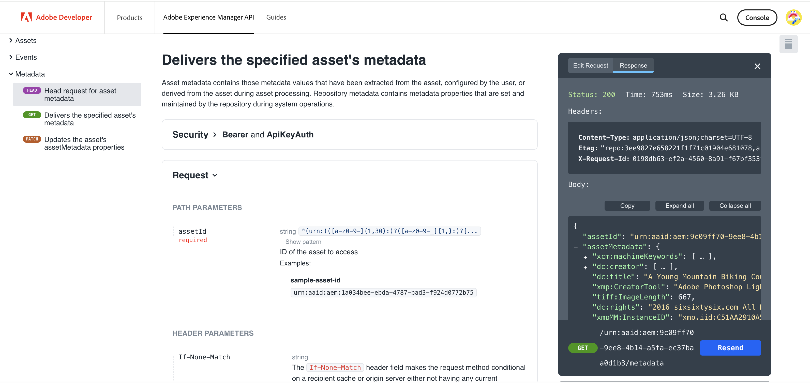
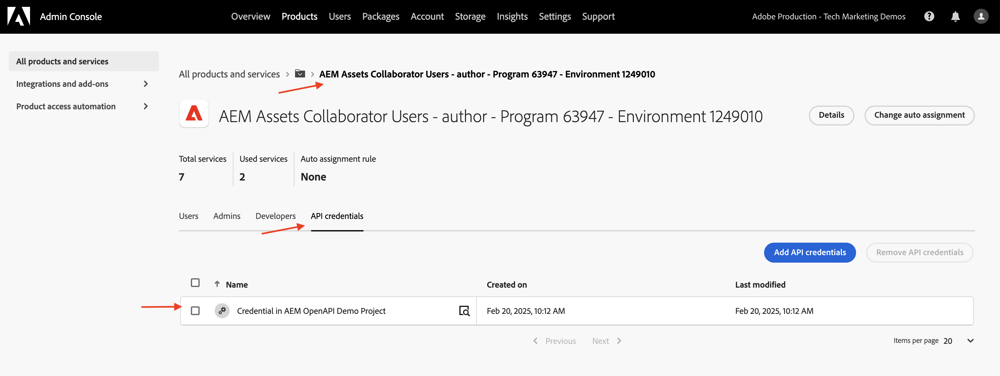

# Invocar las API de AEM basadas en OpenAPI mediante la autenticación de servidor a servidor OAuth

Aprenda a invocar las API de AEM basadas en OpenAPI en AEM as a Cloud Service desde aplicaciones personalizadas mediante la autenticación _OAuth de servidor a servidor_.

La autenticación de servidor a servidor OAuth es ideal para los servicios back-end que necesitan acceso a API sin interacción del usuario. Utiliza el tipo de concesión OAuth 2.0 _client_credentials_ para autenticar la aplicación cliente.

>[!AVAILABILITY]
>
>Las API de AEM basadas en API abiertas están disponibles como parte de un programa de acceso anticipado. Si está interesado en acceder a ellos, le recomendamos que envíe un correo electrónico a [aem-apis@adobe.com](mailto:aem-apis@adobe.com) con una descripción de su caso de uso.

## Lo que aprende{#what-you-learn}

En este tutorial, aprenderá a:

- Configure un proyecto de Adobe Developer Console (ADC) para acceder a la API de Assets Author mediante _Autenticación de servidor a servidor OAuth_.

- Desarrolle una aplicación NodeJS de ejemplo que llame a la API de autor de Assets para recuperar metadatos de un recurso específico.

Antes de empezar, asegúrese de revisar lo siguiente:

- [Acceso a las API de Adobe y conceptos relacionados](../overview.md#accessing-adobe-apis-and-related-concepts).
- [Configurar las API de AEM basadas en OpenAPI](../setup.md) artículo.

## Requisitos previos

Para completar este tutorial, necesita lo siguiente:

- Entorno de AEM as a Cloud Service modernizado con lo siguiente:
   - Versión de AEM `2024.10.18459.20241031T210302Z` o posterior.
   - Nuevos perfiles de producto de estilo (si el entorno se creó antes de noviembre de 2024)

  Consulte [Configurar las API de AEM basadas en OpenAPI](../setup.md) para obtener más información.

- El proyecto de muestra [WKND Sites](https://github.com/adobe/aem-guides-wknd?#aem-wknd-sites-project) debe implementarse en él.

- Acceso a [Adobe Developer Console](https://developer.adobe.com/developer-console/docs/guides/getting-started/).

- Instale [Node.js](https://nodejs.org/en/) en el equipo local para ejecutar la aplicación NodeJS de ejemplo.

## Pasos de desarrollo

Los pasos de desarrollo de alto nivel son los siguientes:

1. Configurar proyecto de ADC
   1. Añadir la API de autor de Assets
   1. Configure su método de autenticación como OAuth Server-to-Server
   1. Asociar el perfil de producto con la configuración de autenticación
1. Configure la instancia de AEM para habilitar la comunicación del proyecto de ADC
1. Desarrollar una aplicación NodeJS de ejemplo
1. Verificar el flujo de extremo a extremo

## Configurar proyecto de ADC

El paso para configurar el proyecto ADC está _repetido_ desde las [API de configuración de AEM basadas en OpenAPI](../setup.md). Se repite para agregar la API de autor de Assets y configurar su método de autenticación como servidor a servidor de OAuth.

1. En [Adobe Developer Console](https://developer.adobe.com/console/projects), abra el proyecto que desee.

1. Para agregar las API de AEM, haga clic en el botón **Agregar API**.

   

1. En el cuadro de diálogo _Agregar API_, filtre por _Experience Cloud_, seleccione la tarjeta **API de autor de AEM Assets** y haga clic en **Siguiente**.

   

1. A continuación, en el diálogo _Configurar API_, seleccione la opción de autenticación **Servidor a servidor** y haga clic en **Siguiente**. La autenticación de servidor a servidor es ideal para los servicios back-end que necesitan acceso a API sin interacción del usuario.

   

1. Cambie el nombre de la credencial para facilitar la identificación (si es necesario) y haga clic en **Siguiente**. Para fines de demostración, se utiliza el nombre predeterminado.

   

1. Seleccione el perfil de producto **Usuarios colaboradores de AEM Assets - Autor - Programa XXX - Entorno XXX** y haga clic en **Guardar**. Como puede ver, solo está disponible para su selección el perfil de producto asociado al servicio de usuarios de la API de AEM Assets.

   

1. Revise la configuración de autenticación y la API de AEM.

   

   

## Configuración de la instancia de AEM para habilitar la comunicación del proyecto ADC

Siga las instrucciones del artículo [Configuración de las API de AEM basadas en OpenAPI](../setup.md#configure-the-aem-instance-to-enable-adc-project-communication) para configurar la instancia de AEM para habilitar la comunicación del proyecto ADC.

## Desarrollar una aplicación NodeJS de ejemplo

Desarrollemos una aplicación NodeJS de ejemplo que llame a la API de autor de Assets.

Puede utilizar otros lenguajes de programación como Java, Python, etc. para desarrollar la aplicación.

Para hacer pruebas, puede usar [Postman](https://www.postman.com/), [curl](https://curl.se/) o cualquier otro cliente REST para invocar las API de AEM.

### Revisión de la API

Antes de desarrollar la aplicación, vamos a revisar [el extremo ](https://developer.adobe.com/experience-cloud/experience-manager-apis/api/experimental/../assets/author/#operation/getAssetMetadata) de los metadatos del recurso especificado desde la _API de autor de Assets_. La sintaxis de la API es:

```http
GET https://{bucket}.adobeaemcloud.com/adobe/../assets/{assetId}/metadata
```

Para recuperar los metadatos de un recurso específico, necesita los valores `bucket` y `assetId`. `bucket` es el nombre de instancia de AEM sin el nombre de dominio de Adobe (.adobeaemcloud.com), por ejemplo, `author-p63947-e1420428`.

`assetId` es el UUID JCR del recurso con el prefijo `urn:aaid:aem:`, por ejemplo, `urn:aaid:aem:a200faf1-6d12-4abc-bc16-1b9a21f870da`. Existen varias formas de obtener `assetId`:

- Anexe la extensión de la ruta de acceso del recurso de AEM `.json` para obtener los metadatos del recurso. Por ejemplo, `https://author-p63947-e1420429.adobeaemcloud.com/content/dam/wknd-shared/en/adventures/cycling-southern-utah/adobestock-221043703.jpg.json` y busque la propiedad `jcr:uuid`.

- También puede obtener `assetId` si inspecciona el recurso en el inspector de elementos del explorador. Busque el atributo `data-id="urn:aaid:aem:..."`.

  

### Invocar la API mediante el explorador

Antes de desarrollar la aplicación, invoquemos la API con la función **Probarla** en la [documentación de la API](https://developer.adobe.com/experience-cloud/experience-manager-apis/api/experimental/assets/author/).

1. Abra [la documentación de la API de autor de Assets](https://developer.adobe.com/experience-cloud/experience-manager-apis/api/experimental/assets/author/) en el explorador.

1. Expanda la sección _Metadatos_ y haga clic en la opción **Entrega los metadatos del recurso especificado**.

1. En el panel derecho, haga clic en el botón **Probarlo**.
   

1. Introduzca los siguientes valores:

   | Sección | Parámetro | Valor |
   | --- | --- | --- |
   |  | cubo | El nombre de instancia de AEM sin el nombre de dominio de Adobe (.adobeaemcloud.com), por ejemplo, `author-p63947-e1420428`. |
   | **Seguridad** | Token de portador | Utilice el token de acceso de la credencial de servidor a servidor OAuth del proyecto ADC. |
   | **Seguridad** | X-Api-Key | Utilice el valor `ClientID` de la credencial de servidor a servidor OAuth del proyecto ADC. |
   | **Parámetros** | assetId | El identificador único del recurso en AEM, por ejemplo, `urn:aaid:aem:a200faf1-6d12-4abc-bc16-1b9a21f870da` |
   | **Parámetros** | X-Adobe-Accept-Experimental | 1 |

   

   

1. Haga clic en **Enviar** para invocar la API y revise la respuesta en la pestaña **Respuesta**.

   

Los pasos anteriores confirman la modernización del entorno de AEM as a Cloud Service, lo que permite el acceso a las API de AEM. También confirma la configuración correcta del proyecto ADC y la comunicación de ID de cliente de credencial de servidor a servidor OAuth con la instancia de autor de AEM.

### Aplicación NodeJS de muestra

Vamos a desarrollar una aplicación NodeJS de ejemplo.

Para desarrollar la aplicación, puede usar las instrucciones _Ejecutar-la-aplicación-de-ejemplo_ o _Desarrollo-paso-a-paso_.

>[!BEGINTABS]

>[!TAB Ejecutar-la-aplicación-de-ejemplo]

1. Descargue el archivo zip de la aplicación [demo-nodejs-app-to-invoke-aem-openapi](../assets/s2s/demo-nodejs-app-to-invoke-aem-openapi.zip) de muestra y extráigalo.

1. Vaya a la carpeta extraída e instale las dependencias.

   ```bash
   $ npm install
   ```

1. Reemplace los marcadores de posición del archivo `.env` por los valores reales de la credencial de servidor a servidor OAuth del proyecto ADC.

1. Reemplazar `<BUCKETNAME>` y `<ASSETID>` en el archivo `src/index.js` con los valores reales.

1. Ejecute la aplicación NodeJS.

   ```bash
   $ node src/index.js
   ```

>[!TAB Desarrollo paso a paso]

1. Cree un nuevo proyecto de NodeJS.

   ```bash
   $ mkdir demo-nodejs-app-to-invoke-aem-openapi
   $ cd demo-nodejs-app-to-invoke-aem-openapi
   $ npm init -y
   ```

1. Instale la biblioteca _fetch_ y _dotenv_ para realizar solicitudes HTTP y leer las variables de entorno respectivamente.

   ```bash
   $ npm install node-fetch
   $ npm install dotenv
   ```

1. Abra el proyecto en su editor de código favorito y actualice el archivo `package.json` para agregar `type` a `module`.

   ```json
   {
       ...
       "version": "1.0.0",
       "type": "module",
       "main": "index.js",
       ...
   }
   ```

1. Cree el archivo `.env` y agregue la configuración siguiente. Reemplace los marcadores de posición por los valores reales de la credencial de servidor a servidor OAuth del proyecto ADC.

   ```properties
   CLIENT_ID=<ADC Project OAuth Server-to-Server credential ClientID>
   CLIENT_SECRET=<ADC Project OAuth Server-to-Server credential Client Secret>
   SCOPES=<ADC Project OAuth Server-to-Server credential Scopes>
   ```

1. Cree el archivo `src/index.js`, agregue el código siguiente y reemplace `<BUCKETNAME>` y `<ASSETID>` por los valores reales.

   ```javascript
   // Import the dotenv configuration to load environment variables from the .env file
   import "dotenv/config";
   
   // Import the fetch function to make HTTP requests
   import fetch from "node-fetch";
   
   // REPLACE THE FOLLOWING VALUES WITH YOUR OWN
   const bucket = "<BUCKETNAME>"; // Bucket name is the AEM instance name (e.g. author-p63947-e1420428)
   const assetId = "<ASSETID>"; // Asset ID is the unique identifier for the asset in AEM (e.g. urn:aaid:aem:a200faf1-6d12-4abc-bc16-1b9a21f870da). You can get it by inspecting the asset in browser's element inspector, look for data-id="urn:aaid:aem:..."
   
   // Load environment variables for authentication
   const clientId = process.env.CLIENT_ID; // Adobe IMS client ID
   const clientSecret = process.env.CLIENT_SECRET; // Adobe IMS client secret
   const scopes = process.env.SCOPES; // Scope for the API access
   
   // Adobe IMS endpoint for obtaining an access token
   const adobeIMSV3TokenEndpointURL =
   "https://ims-na1.adobelogin.com/ims/token/v3";
   
   // Function to obtain an access token from Adobe IMS
   const getAccessToken = async () => {
       console.log("Getting access token from IMS"); // Log process initiation
       //console.log("Client ID: " + clientId); // Display client ID for debugging purposes
   
       // Configure the HTTP POST request to fetch the access token
       const options = {
           method: "POST",
           headers: {
           "Content-Type": "application/x-www-form-urlencoded", // Specify form data content type
           },
           // Send client ID, client secret, and scopes as the request body
           body: `grant_type=client_credentials&client_id=${clientId}&client_secret=${clientSecret}&scope=${scopes}`,
       };
   
       // Make the HTTP request to fetch the access token
       const response = await fetch(adobeIMSV3TokenEndpointURL, options);
   
       //console.log("Response status: " + response.status); // Log the HTTP status for debugging
   
       const responseJSON = await response.json(); // Parse the JSON response
   
       console.log("Access token received"); // Log success message
   
       // Return the access token
       return responseJSON.access_token;
   };
   
   // Function to retrieve metadata for a specific asset from AEM
   const getAssetMetadat = async () => {
       // Fetch the access token using the getAccessToken function
       const accessToken = await getAccessToken();
   
       console.log("Getting asset metadata from AEM");
   
       // Invoke the Assets Author API to retrieve metadata for a specific asset
       const resp = await fetch(
           `https://${bucket}.adobeaemcloud.com/adobe/../assets/${assetId}/metadata`, // Construct the URL with bucket and asset ID
           {
           method: "GET",
           headers: {
               "If-None-Match": "string", // Header to handle caching (not critical for this tutorial)
               "X-Adobe-Accept-Experimental": "1", // Header to enable experimental Adobe API features
               Authorization: "Bearer " + accessToken, // Provide the access token for authorization
               "X-Api-Key": clientId, // Include the OAuth S2S ClientId for identification
           },
           }
       );
   
       const data = await resp.json(); // Parse the JSON response
   
       console.log("Asset metadata received"); // Log success message
       console.log(data); // Display the retrieved metadata
   };
   
   // Call the getAssets function to start the process
   getAssetMetadat();
   ```

1. Ejecute la aplicación NodeJS.

   ```bash
   $ node src/index.js
   ```

>[!ENDTABS]

### Respuesta de API

Una vez ejecutada correctamente, la respuesta de la API se muestra en la consola. La respuesta contiene los metadatos del recurso especificado.

```json
{
  "assetId": "urn:aaid:aem:9c09ff70-9ee8-4b14-a5fa-ec37baa0d1b3",
  "assetMetadata": {    
    ...
    "dc:title": "A Young Mountain Biking Couple Takes A Minute To Take In The Scenery",
    "xmp:CreatorTool": "Adobe Photoshop Lightroom Classic 7.5 (Macintosh)",
    ...
  },
  "repositoryMetadata": {
    ...
    "repo:name": "adobestock-221043703.jpg",
    "repo:path": "/content/dam/wknd-shared/en/adventures/cycling-southern-utah/adobestock-221043703.jpg",
    "repo:state": "ACTIVE",
    ...
  }
}
```

¡Enhorabuena! Ha invocado correctamente las API de AEM basadas en OpenAPI desde la aplicación personalizada mediante la autenticación de servidor a servidor OAuth.

### Revisar el código de la aplicación

Las llamadas clave desde el código de aplicación NodeJS de ejemplo son:

1. **Autenticación IMS**: obtiene un token de acceso mediante la configuración de credenciales de servidor a servidor OAuth en el proyecto ADC.

   ```javascript
   // Function to obtain an access token from Adobe IMS
   const getAccessToken = async () => {
   
       // Configure the HTTP POST request to fetch the access token
       const options = {
           method: "POST",
           headers: {
           "Content-Type": "application/x-www-form-urlencoded", // Specify form data content type
           },
           // Send client ID, client secret, and scopes as the request body
           body: `grant_type=client_credentials&client_id=${clientId}&client_secret=${clientSecret}&scope=${scopes}`,
       };
   
       // Make the HTTP request to fetch the access token from Adobe IMS token endpoint https://ims-na1.adobelogin.com/ims/token/v3
       const response = await fetch(adobeIMSV3TokenEndpointURL, options);
   
       const responseJSON = await response.json(); // Parse the JSON response
   
       // Return the access token
       return responseJSON.access_token;
   };
   ...
   ```

1. **Invocación de API**: invoca la API de autor de Assets para recuperar los metadatos de un recurso específico al proporcionar el token de acceso para la autorización.

   ```javascript
   // Function to retrieve metadata for a specific asset from AEM
   const getAssetMetadat = async () => {
       // Fetch the access token using the getAccessToken function
       const accessToken = await getAccessToken();
   
       console.log("Getting asset metadata from AEM");
   
       // Invoke the Assets Author API to retrieve metadata for a specific asset
       const resp = await fetch(
           `https://${bucket}.adobeaemcloud.com/adobe/../assets/${assetId}/metadata`, // Construct the URL with bucket and asset ID
           {
           method: "GET",
           headers: {
               "If-None-Match": "string", // Header to handle caching (not critical for this tutorial)
               "X-Adobe-Accept-Experimental": "1", // Header to enable experimental Adobe API features
               Authorization: "Bearer " + accessToken, // Provide the access token for authorization
               "X-Api-Key": clientId, // Include the OAuth S2S ClientId for identification
           },
           }
       );
   
       const data = await resp.json(); // Parse the JSON response
   
       console.log("Asset metadata received"); // Log success message
       console.log(data); // Display the retrieved metadata
   };
   ...
   ```

## Bajo el capó

Tras la invocación correcta de la API, se crea un usuario que representa la credencial de servidor a servidor OAuth del proyecto ADC en el servicio de creación de AEM, junto con los grupos de usuarios que coinciden con la configuración del perfil de producto y los servicios. El _usuario de cuenta técnica_ está asociado con el perfil de producto y el grupo de usuarios _Servicios_, que tiene los permisos necesarios para _LEER_ los metadatos del recurso.

Para comprobar la creación de usuarios y grupos de usuarios de la cuenta técnica, siga estos pasos:

- En el proyecto ADC, vaya a la configuración de credenciales de **OAuth Server-to-Server**. Tenga en cuenta el valor de **Correo electrónico técnico de la cuenta**.

  

- En el servicio de creación de AEM, vaya a **Herramientas** > **Seguridad** > **Usuarios** y busque el valor **Correo electrónico de cuenta técnica**.

  

- Haga clic en el usuario de la cuenta técnica para ver los detalles del usuario, como la pertenencia a **Grupos**. Como se muestra a continuación, el usuario de la cuenta técnica está asociado con los grupos de usuarios **Usuarios colaboradores de AEM Assets - Autor - Programa XXX - Entorno XXX** y **Usuarios colaboradores de AEM Assets - Servicio**.

  

- Tenga en cuenta que el usuario de la cuenta técnica está asociado con el perfil de producto **Usuarios de AEM Assets Collaborator: autor: Programa XXX: Entorno XXX**. El perfil de producto está asociado con los servicios **Usuarios de API de AEM Assets** y **Usuarios de colaboradores de AEM Assets**.

  

- La asociación de usuarios de cuenta técnica y perfil de productos se puede comprobar en la ficha **Credenciales de API** de **Perfiles de productos**.

  

## Error 403 para solicitudes que no son de GET

Para _LEER_ los metadatos del recurso, el usuario de la cuenta técnica creada para la credencial de servidor a servidor OAuth tiene los permisos necesarios a través del grupo de usuarios Servicios (por ejemplo, Usuarios de AEM Assets de Collaborator: Servicio).

Sin embargo, para _crear, actualizar, eliminar_ (CUD) los metadatos del recurso, el usuario de la cuenta técnica requiere permisos adicionales. Puede verificarlo invocando la API con una solicitud que no sea de GET (por ejemplo, PATCH, DELETE) y observando la respuesta de error 403.

Invoquemos la solicitud _PATCH_ para actualizar los metadatos del recurso y observar la respuesta de error 403.

- Abra [la documentación de la API de autor de Assets](https://developer.adobe.com/experience-cloud/experience-manager-apis/api/experimental/assets/author/) en el explorador.

- Introduzca los siguientes valores:

  | Sección | Parámetro | Valor |
  | --- | --- | --- |
  | **Cubo** |  | El nombre de instancia de AEM sin el nombre de dominio de Adobe (.adobeaemcloud.com), por ejemplo, `author-p63947-e1420428`. |
  | **Seguridad** | Token de portador | Utilice el token de acceso de la credencial de servidor a servidor OAuth del proyecto ADC. |
  | **Seguridad** | X-Api-Key | Utilice el valor `ClientID` de la credencial de servidor a servidor OAuth del proyecto ADC. |
  | **Cuerpo** |  | `[{ "op": "add", "path": "foo","value": "bar"}]` |
  | **Parámetros** | assetId | El identificador único del recurso en AEM, por ejemplo, `urn:aaid:aem:a200faf1-6d12-4abc-bc16-1b9a21f870da` |
  | **Parámetros** | X-Adobe-Accept-Experimental | * |
  | **Parámetros** | X-Adobe-Accept-Experimental | 1 |

- Haga clic en **Enviar** para invocar la solicitud de _PATCH_ y observar la respuesta de error 403.

  

Para corregir el error 403, tiene dos opciones:

- En el proyecto ADC, actualice el perfil de producto asociado de la credencial de servidor a servidor OAuth con un perfil de producto apropiado que tenga los permisos necesarios para _crear, actualizar, eliminar_ (CUD) los metadatos del recurso, por ejemplo, **Administradores de AEM - autor - Programa XXX - Entorno XXX**. Para obtener más información, consulte el artículo [Cómo: credenciales conectadas de la API y administración del perfil de producto](../how-to/credentials-and-product-profile-management.md).

- Con AEM Project, actualice los permisos del grupo de usuarios del servicio AEM AEM Assets asociado (por ejemplo, Usuarios de Collaborator - Servicio) en AEM Author para permitir _Crear, actualizar, eliminar_ (CUD) de los metadatos del recurso. Para obtener más información, consulte el artículo [Cómo: administración de permisos de grupos de usuarios del servicio AEM](../how-to/services-user-group-permission-management.md).

## Resumen

En este tutorial, ha aprendido a invocar las API de AEM basadas en OpenAPI desde aplicaciones personalizadas. Ha habilitado el acceso a las API de AEM, y ha creado y configurado un proyecto de Adobe Developer Console (ADC).
En el proyecto de ADC, ha añadido las API de AEM, ha configurado su tipo de autenticación y ha asociado el perfil de producto. También configuró la instancia de AEM para habilitar la comunicación del proyecto ADC y desarrolló una aplicación NodeJS de ejemplo que llama a la API de autor de Assets.

## Recursos adicionales

- [Guía de implementación de credenciales de servidor a servidor de OAuth](https://developer.adobe.com/developer-console/docs/guides/authentication/ServerToServerAuthentication/implementation/)