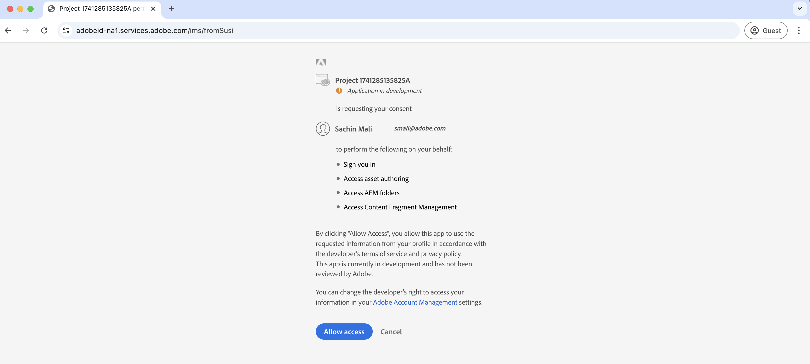
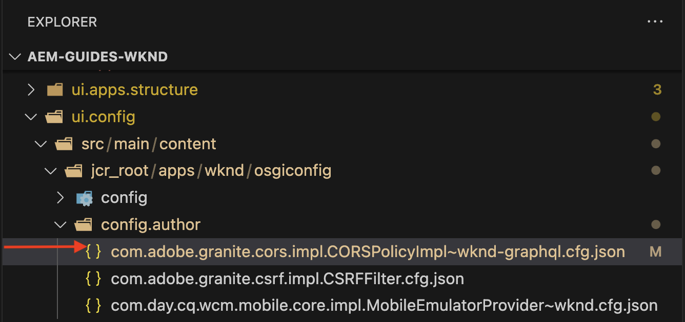
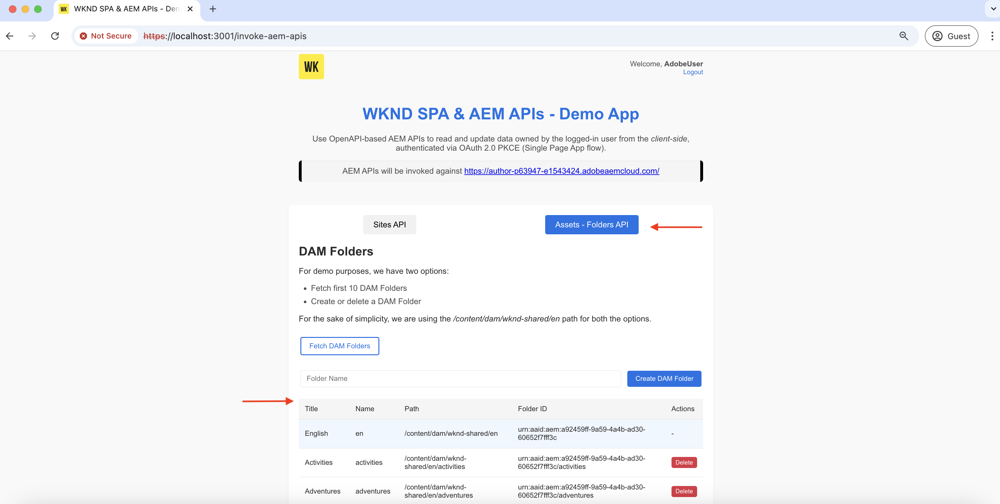

# Invocar las API de AEM basadas en OpenAPI mediante la aplicación de una sola página de OAuth

Aprenda a invocar las API de AEM basadas en OpenAPI en AEM as a Cloud Service mediante **Autenticación de aplicación de una sola página de OAuth**. Sigue el flujo PKCE (clave de prueba para intercambio de código) de OAuth 2.0 para la autenticación basada en usuario en una aplicación de una sola página (SPA).

La autenticación de aplicación de una sola página de OAuth es ideal para aplicaciones basadas en JavaScript que se ejecutan en el explorador. Si carecen de un servidor back-end o necesitan recuperar tokens de acceso para interactuar con las API de AEM en nombre de un usuario.

El flujo PKCE amplía el tipo de concesión OAuth 2.0 _authorization_code_, lo que mejora la seguridad al evitar la interceptación del código de autorización. Para obtener más información, consulte la sección [Diferencia entre OAuth Server-to-Server vs Web App vs Single Page App credentials](../overview.md#difference-between-oauth-server-to-server-vs-web-app-vs-single-page-app-credentials).

>[!AVAILABILITY]
>
>Las API de AEM basadas en API abiertas están disponibles como parte de un programa de acceso anticipado. Si está interesado en acceder a ellos, le recomendamos que envíe un correo electrónico a [aem-apis@adobe.com](mailto:aem-apis@adobe.com) con una descripción de su caso de uso.

## Lo que aprende{#what-you-learn}

En este tutorial, aprenderá a:

- Configure un proyecto de Adobe Developer Console (ADC) para acceder a las API de AEM basadas en OpenAPI mediante la autenticación _Aplicación de una sola página OAuth_ o conocida comúnmente como _flujo PKCE de OAuth 2.0_.

- Implemente el flujo de autenticación de aplicación de una sola página de OAuth en una SPA personalizada.
   - Autenticación de usuario de IMS y autorización de aplicaciones.
   - Recuperación de token de acceso mediante el flujo PKCE de OAuth 2.0.
   - Utilice el token de acceso para invocar las API de AEM basadas en OpenAPI.

Antes de empezar, asegúrese de revisar lo siguiente:

- [Acceso a las API de Adobe y conceptos relacionados](../overview.md#accessing-adobe-apis-and-related-concepts).
- [Configurar las API de AEM basadas en OpenAPI](../setup.md) artículo.

## Información general de la SPA de WKND y flujo funcional{#wknd-spa-overview-and-functional-flow}

Vamos a explorar qué es el SPA de WKND, cómo se crea y cómo funciona.

La SPA de WKND es una **aplicación de una sola página basada en React** que muestra cómo obtener de forma segura un token de acceso específico del usuario e interactuar con las API de AEM directamente desde el lado del cliente. Implementa el flujo de autenticación OAuth 2.0 PKCE a través de Adobe IMS e integra dos API clave de AEM:

1. **API de sitios**: para acceder a modelos de fragmentos de contenido
1. **API de Assets**: para administrar carpetas DAM

El proyecto de Adobe Developer Console (ADC) está configurado para habilitar la autenticación de aplicación de una sola página de OAuth, proporcionando el **client_id** necesario para iniciar el flujo PKCE de OAuth 2.0.

>[!IMPORTANT]
>
>El proyecto ADC NO proporciona un _client_secret_. En su lugar, el SPA genera un _code_verifier_ y un _code_Challenge_ para intercambiar de forma segura el código de autorización por un _token de acceso_. Elimina la necesidad de almacenar un secreto de cliente en el lado del cliente, lo que mejora la seguridad.

El diagrama siguiente ilustra el flujo funcional de la SPA de WKND _obteniendo el token de acceso específico del usuario para invocar las API de AEM basadas en OpenAPI_:


1. La SPA inicia el flujo de autenticación dirigiendo al usuario al sistema Identity Management de Adobe (IMS) mediante una solicitud de autorización.
1. Como parte de la solicitud de autorización, la SPA envía _client_id_, _redirect_uri_ y _code_Challenge_ a IMS, siguiendo el flujo PKCE de OAuth 2.0. La SPA genera un _code_verifier_ al azar, crea un hash con SHA-256 y Base64 codifica el resultado para crear el _code_Challenge_.
1. El IMS autentica al usuario y, tras la autenticación correcta, emite un _authorization_code_, que se devuelve al SPA mediante el _redirect_uri_.
1. El SPA intercambia el _authorization_code_ por un _token de acceso_ al enviar una petición POST al extremo del token de IMS. Incluye el _code_verifier_ en la solicitud para validar el _code_Challenge_ enviado anteriormente. Esto garantiza que la solicitud de autorización (paso 2) y la solicitud de token (paso 4) estén vinculadas al mismo flujo de autenticación, lo que evita ataques de interceptación.
1. El IMS valida _code_verifier_ y devuelve el _token de acceso_ específico del usuario.
1. El SPA incluye el _token de acceso_ en solicitudes de API a AEM para autenticar y recuperar contenido específico del usuario.

La SPA de WKND es una aplicación basada en [React](https://react.dev/) y usa el contexto [React Context](https://react.dev/reference/react/createContext) para la administración del estado de autenticación, [React Router](https://reactrouter.com/home) para la navegación.

Otros marcos de SPA como Angular, Vue o JavaScript convencional se pueden utilizar para crear SPA que se integren con las API de Adobe mediante los enfoques ilustrados en este tutorial.

## Cómo utilizar este tutorial{#how-to-use-this-tutorial}

Este tutorial se puede abordar de dos maneras:

- [Revise los fragmentos de código de clave SPA](#review-spa-key-code-snippets): Comprenda el flujo de autenticación de la aplicación de una sola página de OAuth y explore las implementaciones de llamadas de API clave en la SPA de WKND.
- [Configurar y ejecutar el SPA](#setup-and-run-the-spa): siga las instrucciones paso a paso para configurar y ejecutar el SPA de WKND en su equipo local.

Elija la ruta que mejor se adapte a sus necesidades.

## Revisar fragmentos de código de clave SPA{#review-spa-key-code-snippets}

Vamos a profundizar en los fragmentos de código clave del SPA de WKND que muestran cómo:

- Obtenga un token de acceso específico del usuario mediante el flujo de autenticación de la aplicación de una sola página de OAuth.

- Invoque las API de AEM basadas en OpenAPI directamente desde el lado del cliente.

Estos fragmentos le ayudan a comprender el proceso de autenticación y las interacciones de la API dentro de la SPA.

### Descarga del código SPA{#download-the-spa-code}

1. Descargue el archivo zip de la [API de WKND SPA y AEM - Aplicación de demostración](../assets/spa/wknd-spa-with-aemapis-demo.zip) y extráigalo.

1. Vaya a la carpeta extraída y abra el archivo `.env.example` en su editor de código favorito. Revise los parámetros de configuración necesarios.

   ```plaintext
   ########################################################################
   # Adobe IMS, Adobe Developer Console (ADC), and AEM as a Cloud Service Information
   ########################################################################
   # Adobe IMS OAuth endpoints
   REACT_APP_ADOBE_IMS_AUTHORIZATION_ENDPOINT=https://ims-na1.adobelogin.com/ims/authorize/v2
   REACT_APP_ADOBE_IMS_TOKEN_ENDPOINT=https://ims-na1.adobelogin.com/ims/token/v3
   
   # Adobe Developer Console (ADC) Project's OAuth Single-Page App credential
   REACT_APP_ADC_CLIENT_ID=<ADC Project OAuth Single-Page App credential ClientID>
   REACT_APP_ADC_SCOPES=<ADC Project OAuth Single-Page App credential Scopes>
   
   # AEM Assets Information
   REACT_APP_AEM_ASSET_HOSTNAME=<AEMCS Hostname, e.g., https://author-p63947-e1502138.adobeaemcloud.com/>
   
   ################################################
   # Single Page Application Information
   ################################################
   
   # Enable HTTPS for local development
   HTTPS=true
   PORT=3001
   
   # SSL Certificate and Key for local development 
   SSL_CRT_FILE=./ssl/server.crt
   SSL_KEY_FILE=./ssl/server.key
   
   # The URL to which the user will be redirected after the OAuth flow is complete
   REACT_APP_REDIRECT_URI=https://localhost:3000/callback
   ```

   Debe reemplazar los marcadores de posición con los valores reales del proyecto de Adobe Developer Console (ADC) y de la instancia de AEM as a Cloud Service Assets.

### Autenticación de usuario de IMS y autorización de SPA{#ims-user-authentication-and-spa-authorization}

Exploremos el código que administra la autenticación de usuario de IMS y la autorización de SPA. Para recuperar modelos de fragmentos de contenido y carpetas DAM, el usuario debe autenticarse con Adobe IMS y conceder permiso al SPA de WKND para acceder a las API de AEM en su nombre.

Durante el inicio de sesión inicial, se solicita al usuario que proporcione el consentimiento, lo que permite que la SPA de WKND acceda de forma segura a los recursos necesarios.



1. En el archivo `src/context/IMSAuthContext.js`, la función `login` inicia el flujo de autenticación de usuarios y autorización de aplicaciones de IMS. Genera un `code_verifier` y un `code_challenge` aleatorios para intercambiar de forma segura el `code` por un token de acceso. `code_verifier` se almacena en el almacenamiento local para su uso posterior. Como se mencionó anteriormente, la SPA no almacena ni utiliza `client_secret`, genera una sobre la marcha y la utiliza en dos pasos: `authorize` y `token` solicitudes.

   ```javascript
   ...
   const login = async () => {
       try {
           const codeVerifier = generateCodeVerifier();
           const codeChallenge = generateCodeChallenge(codeVerifier);
   
           localStorage.setItem(STORAGE_KEYS.CODE_VERIFIER, codeVerifier);
   
           const params = new URLSearchParams(
               getAuthParams(AUTH_METHODS.S256, codeChallenge, codeVerifier)
           );
   
           window.location.href = `${
               APP_CONFIG.adobe.ims.authorizationEndpoint //https://ims-na1.adobelogin.com/ims/authorize/v2
           }?${params.toString()}`;
       } catch (error) {
           console.error("Login initialization failed:", error);
           throw error;
       }
   };
   ...
   
   // Generate a random code verifier
   export function generateCodeVerifier() {
       const array = new Uint8Array(32);
       window.crypto.getRandomValues(array);
       const wordArray = CryptoJS.lib.WordArray.create(array);
       return base64URLEncode(wordArray);
   }
   
   // Generate code challenge using SHA-256
   export function generateCodeChallenge(codeVerifier) {
       const hash = CryptoJS.SHA256(codeVerifier);
       return base64URLEncode(hash);
   }
   
   // Get authorization URL parameters
   const getAuthParams = useCallback((method, codeChallenge, codeVerifier) => {
       const baseParams = {
           client_id: APP_CONFIG.adobe.adc.clientId, // ADC Project OAuth Single-Page App credential ClientID
           scope: APP_CONFIG.adobe.adc.scopes, // ADC Project OAuth Single-Page App credential Scopes
           response_type: "code",
           redirect_uri: APP_CONFIG.adobe.spa.redirectUri, // SPA redirect URI https://localhost:3000/callback
           code_challenge_method: method, // S256 or plain
       };
   
       return {
           ...baseParams,
           code_challenge:
               method === AUTH_METHODS.S256 ? codeChallenge : codeVerifier,
           };
   }, []);    
   ...
   ```

   Si el usuario no está autenticado en Adobe IMS, se muestra la página de inicio de sesión de Adobe ID pidiéndole que se autentique.

   Si ya se ha autenticado, se redirigirá al usuario al _redirect_uri_ especificado de la SPA de WKND con un _authorization_code_.

### Recuperación de token de acceso mediante el flujo PKCE de OAuth 2.0{#access-token-retrieval-using-oauth-20-pkce-flow}

La SPA de WKND intercambia de forma segura _authorization_code_ con el IMS de Adobe por un token de acceso específico del usuario mediante _client_id_ y _code_verifier_.

1. En el archivo `src/context/IMSAuthContext.js`, la función `exchangeCodeForToken` intercambia _authorization_code_ por un token de acceso específico del usuario.

   ```javascript
   ...
   // Handle the callback from the Adobe IMS authorization endpoint
   const handleCallback = async (code) => {
       if (authState.isProcessingCallback) return;
   
       try {
           updateAuthState({ isProcessingCallback: true });
   
           const data = await exchangeCodeForToken(code);
   
           if (data.access_token) {
               handleStorageToken(data.access_token);
               localStorage.removeItem(STORAGE_KEYS.CODE_VERIFIER);
           }
       } catch (error) {
           console.error("Error exchanging code for token:", error);
           throw error;
       } finally {
           updateAuthState({ isProcessingCallback: false });
       }
   };
   
   ...
   // Exchange the authorization code for an access token
   const exchangeCodeForToken = useCallback(async (code) => {
       const codeVerifier = localStorage.getItem(STORAGE_KEYS.CODE_VERIFIER);
   
       if (!codeVerifier) {
           throw new Error("No code verifier found");
       }
   
       //https://ims-na1.adobelogin.com/ims/token/v3
       const response = await fetch(APP_CONFIG.adobe.ims.tokenEndpoint, {
           method: "POST",
           headers: { "Content-Type": "application/x-www-form-urlencoded" },
           body: new URLSearchParams({
               grant_type: "authorization_code",
               client_id: APP_CONFIG.adobe.adc.clientId, // ADC Project OAuth Single-Page App credential ClientID
               code_verifier: codeVerifier, // Code verifier generated during login
               code, // Authorization code received from the IMS
               redirect_uri: `${window.location.origin}/callback`,
           }),
       });
   
       if (!response.ok) {
           throw new Error("Token request failed");
       }
   
       return response.json();
   }, []);
   
   const handleStorageToken = useCallback(
       (token) => {
           if (token) {
               localStorage.setItem(STORAGE_KEYS.ACCESS_TOKEN, token);
               updateAuthState({ isLoggedIn: true, accessToken: token });
           }
       },
       [updateAuthState]
   );
   ...
   ```

   El token de acceso se almacena en el almacenamiento local del explorador y se utiliza en las llamadas de API posteriores a las API de AEM.

### Acceso a las API de AEM basadas en OpenAPI mediante el token de acceso{#accessing-openapi-based-aem-apis-using-the-access-token}

La SPA de WKND utiliza el token de acceso específico del usuario para invocar los modelos de fragmento de contenido y los extremos de la API de las carpetas DAM.

En el archivo `src/components/InvokeAemApis.js`, la función `fetchContentFragmentModels` muestra cómo utilizar el token de acceso para invocar las API de AEM basadas en OpenAPI desde el lado del cliente.

```javascript
    ...
  // Fetch Content Fragment Models
  const fetchContentFragmentModels = useCallback(async () => {
    try {
      updateState({ isLoading: true, error: null });
      const data = await makeApiRequest({
        endpoint: `${API_PATHS.CF_MODELS}?cursor=0&limit=10&projection=summary`,
      });
      updateState({ cfModels: data.items });
    } catch (err) {
      updateState({ error: err.message });
      console.error("Error fetching CF models:", err);
    } finally {
      updateState({ isLoading: false });
    }
  }, [makeApiRequest, updateState]);

  // Common API request helper
  const makeApiRequest = useCallback(
    async ({ endpoint, method = "GET", passAPIKey = false, body = null }) => {
    
      // Get the access token from the local storage
      const token = localStorage.getItem("adobe_ims_access_token");
      if (!token) {
        throw new Error("No access token available. Please login again.");
      }

      const headers = {
        Authorization: `Bearer ${token}`,
        "Content-Type": "application/json",
        ...(passAPIKey && { "x-api-key": APP_CONFIG.adobe.adc.clientId }),
      };

      const response = await fetch(
        `${APP_CONFIG.adobe.aem.hostname}${endpoint}`,
        {
          method,
          headers,
          ...(body && { body: JSON.stringify(body) }),
        }
      );

      if (!response.ok) {
        throw new Error(`API request failed: ${response.statusText}`);
      }

      return method === "DELETE" ? null : response.json();
    },
    []
  );
  ...
```

## Configuración y ejecución de la SPA{#setup-and-run-the-spa}

Vamos a configurar y ejecutar la SPA de WKND en el equipo local para comprender el flujo de autenticación de la aplicación de una sola página de OAuth y las llamadas de API.

### Requisitos previos{#prerequisites}

Para completar este tutorial, necesita lo siguiente:

- Entorno de AEM as a Cloud Service modernizado con lo siguiente:
   - Versión de AEM `2024.10.18459.20241031T210302Z` o posterior.
   - Nuevos perfiles de producto de estilo (si el entorno se creó antes de noviembre de 2024)

  Consulte el artículo [Configurar las API de AEM basadas en OpenAPI](../setup.md) para obtener más información.

- El proyecto de muestra [WKND Sites](https://github.com/adobe/aem-guides-wknd?#aem-wknd-sites-project) debe implementarse en él.

- Acceso a [Adobe Developer Console](https://developer.adobe.com/developer-console/docs/guides/getting-started/).

- Instale [Node.js](https://nodejs.org/en/) en el equipo local para ejecutar la aplicación NodeJS de ejemplo.

### Pasos de desarrollo{#development-steps}

Los pasos de desarrollo de alto nivel son los siguientes:

1. Configurar proyecto de ADC
   1. Añadir las API de Assets y Sites.
   1. Configure las credenciales de la aplicación OAuth Single Page.
1. Configuración de la instancia de AEM
   1. Para habilitar la comunicación del proyecto ADC
   1. Para permitir que la SPA acceda a las API de AEM configurando la configuración de CORS.
1. Configure y ejecute el SPA de WKND en el equipo local
1. Verificar el flujo de extremo a extremo

### Configurar proyecto de ADC{#configure-adc-project}

El paso para configurar el proyecto ADC está _repetido_ desde las [API de configuración de AEM basadas en OpenAPI](../setup.md). Se repite para agregar la API de Assets y Sites y configurar su método de autenticación como aplicación de una sola página de OAuth.

1. En [Adobe Developer Console](https://developer.adobe.com/console/projects), abra el proyecto que desee.

1. Para agregar las API de AEM, haga clic en el botón **Agregar API**.

   

1. En el cuadro de diálogo _Agregar API_, filtre por _Experience Cloud_, seleccione la tarjeta de administración de contenido de **AEM CS Sites** y haga clic en **Siguiente**.

   

1. A continuación, en el diálogo _Configurar API_, seleccione la opción de autenticación **Autenticación de usuario** y haga clic en **Siguiente**.

   

1. En el siguiente cuadro de diálogo _Configurar API_, seleccione la opción de autenticación **Aplicación de una sola página OAuth** y haga clic en **Siguiente**.

   

1. En el cuadro de diálogo _Configurar aplicación de una sola página de OAuth_, escriba los siguientes detalles y haga clic en **Siguiente**.
   - URI de redirección predeterminado: `https://localhost:3001/callback`
   - Patrón de URI de redirección: `https://localhost:3001/callback`

   

1. Revise los ámbitos disponibles y haga clic en **Guardar la API configurada**.

   

1. Repita los pasos anteriores para agregar la API de autor de **AEM Assets**.

1. Revise la configuración de autenticación y la API de AEM.

   

   

### Configuración de la instancia de AEM para habilitar la comunicación del proyecto ADC{#configure-aem-instance-to-enable-adc-project-communication}

Siga las instrucciones del artículo [Configuración de las API de AEM basadas en OpenAPI](../setup.md#configure-the-aem-instance-to-enable-adc-project-communication) para configurar la instancia de AEM para habilitar la comunicación del proyecto ADC.

### Configuración de AEM CORS{#aem-cors-configuration}

El Intercambio de Recursos de Origen Cruzado (CORS) de AEM as a Cloud Service facilita las propiedades web que no son de AEM para hacer llamadas del lado del cliente basadas en el explorador a las API de AEM.

1. En AEM Project, busque o cree el archivo `com.adobe.granite.cors.impl.CORSPolicyImpl~wknd-graphql.cfg.json` en la carpeta `/ui.config/src/main/content/jcr_root/apps/wknd/osgiconfig/config.author/`.

   

1. Añada la siguiente configuración al archivo.

   ```json
   {
       "alloworigin":[
         ""
       ],
       "alloworiginregexp":[
         "https://localhost:.*",
         "http://localhost:.*"
       ],
       "allowedpaths": [
         "/adobe/sites/.*",
         "/graphql/execute.json.*",
         "/content/_cq_graphql/wknd-shared/endpoint.json",
         "/content/experience-fragments/.*"
       ],
       "supportedheaders": [
         "Origin",
         "Accept",
         "X-Requested-With",
         "Content-Type",
         "Access-Control-Request-Method",
         "Access-Control-Request-Headers",
         "Authorization"
       ],
       "supportedmethods":[
         "GET",
         "HEAD",
         "POST"
       ],
       "maxage:Integer": 1800,
       "supportscredentials": true,
       "exposedheaders":[ "" ]
   }
   ```

1. Confirme los cambios de configuración e inserte los cambios en el repositorio Git remoto al que está conectada la canalización de Cloud Manager.

1. Implemente los cambios anteriores mediante la canalización FullStack en Cloud Manager.

### Configuración y ejecución de la SPA{#configure-and-run-the-spa}

1. Descargue el archivo zip de la [API de WKND SPA y AEM - Aplicación de demostración](../assets/spa/wknd-spa-with-aemapis-demo.zip) y extráigalo.

1. Vaya a la carpeta extraída y copie el archivo de `.env.example` en `.env`.

1. Actualice el archivo `.env` con los parámetros de configuración requeridos del proyecto de Adobe Developer Console (ADC) y el entorno de AEM as a Cloud Service. Por ejemplo:

   ```plaintext
   ########################################################################
   # Adobe IMS, Adobe Developer Console (ADC), and AEM as a Cloud Service Information
   ########################################################################
   # Adobe IMS OAuth endpoints
   REACT_APP_ADOBE_IMS_AUTHORIZATION_ENDPOINT=https://ims-na1.adobelogin.com/ims/authorize/v2
   REACT_APP_ADOBE_IMS_TOKEN_ENDPOINT=https://ims-na1.adobelogin.com/ims/token/v3
   REACT_APP_ADOBE_IMS_USERINFO_ENDPOINT=https://ims-na1.adobelogin.com/ims/userinfo/v2
   
   # Adobe Developer Console (ADC) Project's OAuth Single-Page App credential
   REACT_APP_ADC_CLIENT_ID=ddsfs455a4a440c48c7474687c96945d
   REACT_APP_ADC_SCOPES=AdobeID,openid,aem.folders,aem.assets.author,aem.fragments.management
   
   # AEM Assets Information
   REACT_APP_AEM_ASSET_HOSTNAME=https://author-p69647-e1453424.adobeaemcloud.com/
   
   ################################################
   # Single Page Application Information
   ################################################
   
   # Enable HTTPS for local development
   HTTPS=true
   PORT=3001
   
   # SSL Certificate and Key for local development 
   SSL_CRT_FILE=./ssl/server.crt
   SSL_KEY_FILE=./ssl/server.key
   
   # The URL to which the user will be redirected after the OAuth flow is complete
   REACT_APP_REDIRECT_URI=https://localhost:3000/callback
   ```

1. Abra un terminal y vaya a la carpeta extraída. Instale las dependencias necesarias e inicie la SPA de WKND con el siguiente comando.

   ```bash
   $ npm install
   $ npm start
   ```

### Verificar el flujo de extremo a extremo{#verify-the-end-to-end-flow}

1. Abra un explorador y vaya a `https://localhost:3001` para acceder a la SPA de WKND. Acepte la advertencia de certificado firmado automáticamente.

   

1. Haga clic en el botón **Inicio de sesión de Adobe IMS** para iniciar el flujo de autenticación de la aplicación de una sola página de OAuth.

1. Autentique con el IMS de Adobe y proporcione el consentimiento para permitir que el SPA de WKND acceda a los recursos en su nombre.

1. Una vez autenticado correctamente, se le redirigirá de nuevo a la ruta `/invoke-aem-apis` de la SPA de WKND y el token de acceso se almacenará en el almacenamiento local del explorador.

   

1. Desde la ruta `https://localhost:3001/invoke-aem-apis`, haga clic en el botón **Buscar modelos de fragmentos de contenido** para invocar la API de modelos de fragmentos de contenido. La SPA muestra la lista de modelos de fragmento de contenido.

   

1. Del mismo modo, en la pestaña **Assets - Folders API**, puede enumerar, crear y eliminar carpetas DAM.

   

1. En las herramientas para desarrolladores del explorador, puede inspeccionar las solicitudes y respuestas de red para comprender las llamadas de API.

   

>[!IMPORTANT]
>
>Si el usuario autenticado carece de los permisos necesarios para enumerar, crear o eliminar recursos de AEM, las llamadas a la API dan el error 403 Prohibido. Garantiza que, aunque el usuario esté autenticado y posea un token de acceso IMS válido, no pueda acceder a los recursos de AEM sin los permisos necesarios.

### Revisión del código de SPA{#review-the-spa-code}

Revisemos la estructura de código de alto nivel y los principales puntos de entrada del SPA de WKND. La SPA se crea utilizando el marco de trabajo React y utiliza la API de contexto React para la autenticación y la administración de estado.

1. El archivo `src/App.js` es el punto de entrada principal de la SPA de WKND. El componente Aplicación ajusta toda la aplicación e inicializa el contexto `IMSAuthProvider`.

1. `src/context/IMSAuthContext.js` crea IMSAuthContext de Adobe para proporcionar el estado de autenticación a los componentes secundarios. Incluye las funciones de inicio de sesión, cierre de sesión y handleCallback para iniciar el flujo de autenticación de la aplicación de una sola página de OAuth.

1. La carpeta `src/components` contiene varios componentes para mostrar las llamadas de API a las API de AEM. El componente `InvokeAemApis.js` muestra cómo utilizar el token de acceso para invocar las API de AEM.

1. El archivo `src/config/config.js` carga las variables de entorno del archivo `.env` y las exporta para su uso en la aplicación.

1. El archivo `src/utils/auth.js` contiene funciones de utilidad para generar el verificador de código y el desafío de código para el flujo PKCE de OAuth 2.0.

1. La carpeta `ssl` contiene el certificado autofirmado y los archivos de clave para ejecutar el proxy HTTP SSL local.

Puede desarrollar o integrar la SPA existente con las API de Adobe utilizando los enfoques ilustrados en este tutorial.

## Resumen{#summary}

En este tutorial, ha aprendido a invocar las API de AEM basadas en OpenAPI en AEM as a Cloud Service mediante la autenticación basada en el usuario desde una aplicación de una sola página (SPA) a través del flujo PKCE de OAuth 2.0.

## Recursos adicionales{#additional-resources}

- [Guía de implementación de autenticación de usuario](https://developer.adobe.com/developer-console/docs/guides/authentication/UserAuthentication/implementation/)
- [Solicitud de autorización](https://developer.adobe.com/developer-console/docs/guides/authentication/UserAuthentication/IMS/#authorize-request)
- [Obteniendo tokens de acceso](https://developer.adobe.com/developer-console/docs/guides/authentication/UserAuthentication/IMS/#fetching-access-tokens)
