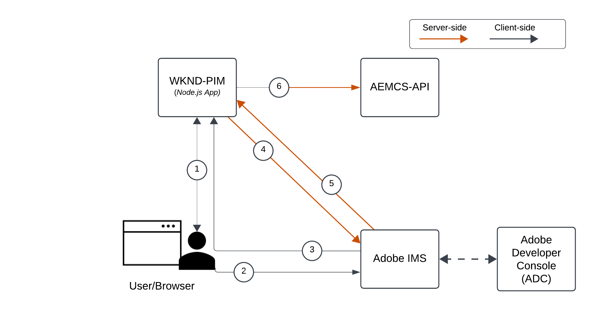
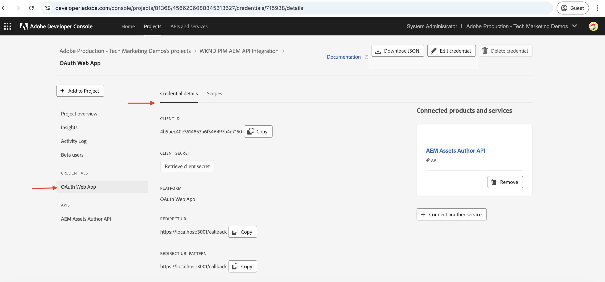
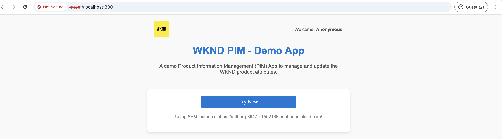

# Invocar las API de AEM basadas en OpenAPI mediante la autenticación de aplicación web de OAuth

Obtenga información sobre cómo invocar las API de AEM basadas en OpenAPI en AEM as a Cloud Service mediante la autenticación basada en usuario desde una aplicación web personalizada que utiliza OAuth Web App.

La autenticación de la aplicación web de OAuth es ideal para aplicaciones web con componentes de front-end y _backend_ que necesitan **acceder a las API de AEM en nombre de un usuario**. Utiliza el tipo de concesión OAuth 2.0 _authorization_code_ para obtener un token de acceso de parte del usuario para acceder a las API de AEM. Para obtener más información, consulte [Diferencia entre OAuth Server-to-Server y las credenciales de la aplicación web/aplicación de una sola página de OAuth](../overview.md#difference-between-oauth-server-to-server-and-oauth-web-appsingle-page-app-credentials).

>[!AVAILABILITY]
>
>Las API de AEM basadas en API abiertas están disponibles como parte de un programa de acceso anticipado. Si está interesado en acceder a ellos, le recomendamos que envíe un correo electrónico a [aem-apis@adobe.com](mailto:aem-apis@adobe.com) con una descripción de su caso de uso.

## Lo que aprende{#what-you-learn}

En este tutorial, aprenderá a:

- Configure un proyecto de Adobe Developer Console (ADC) para acceder a la API de autor de Assets mediante la autenticación _OAuth Web App_.

- Implemente el flujo de autenticación de la aplicación web de OAuth en una aplicación web personalizada.
   - Autenticación de usuario de IMS y autorización de aplicaciones.
   - Recuperación de token de acceso específico del usuario.
   - Acceso a las API de AEM basadas en OpenAPI mediante el token de acceso específico del usuario.

Antes de empezar, asegúrese de revisar lo siguiente:

- [Acceso a las API de Adobe y conceptos relacionados](../overview.md#accessing-adobe-apis-and-related-concepts).
- [Configurar las API de AEM basadas en OpenAPI](../setup.md) artículo.

## Aplicación web de ejemplo: información general y flujo funcional de WKND-PIM

Vamos a comprender la aplicación web de ejemplo, la administración de la información del producto (PIM) de WKND y su flujo funcional.

La aplicación WKND PIM es una aplicación web de ejemplo diseñada para administrar atributos de producto y sus metadatos de recursos almacenados en AEM as a Cloud Service. Este ejemplo muestra cómo las aplicaciones web se pueden integrar perfectamente con las API de Adobe para ofrecer flujos de trabajo eficientes y centrados en el usuario.

El proyecto de Adobe Developer Console (ADC) está configurado para acceder a la API de autor de Assets mediante la autenticación de la aplicación web de OAuth. Proporciona los _client_id_ y _client_secret_ necesarios a la aplicación web WKND-PIM para iniciar el flujo de concesión de _authorization_code_.

>[!VIDEO](https://video.tv.adobe.com/v/3442757?quality=12&learn=on)


El diagrama siguiente ilustra el flujo funcional de la aplicación web WKND-PIM _que obtiene tokens de acceso específicos del usuario para interactuar con la API de autor de Assets_.



1. La aplicación web inicia el proceso redireccionando al usuario al sistema Identity Management de Adobe (IMS) para la autenticación.
1. Junto con el redireccionamiento, la aplicación web pasa los _client_id_ y _redirect_uri_ necesarios al IMS.
1. IMS autentica al usuario y lo devuelve al _redirect_uri_ especificado con un _authorization_code_.
1. La aplicación web intercambia el _authorization_code_ con IMS por un token de acceso específico del usuario, usando su _client_id_ y su _client_secret_.
1. Una vez validado correctamente, IMS emite el _token de acceso_ específico del usuario.
1. La aplicación web usa de forma segura el _token de acceso_ para interactuar con la API de autor de Assets, lo que permite al usuario recuperar o actualizar los metadatos de los recursos del producto.

La aplicación web WKND-PIM se ha desarrollado con [Node.js](https://nodejs.org/en) y [Express](https://expressjs.com/). Express actúa como el servidor que administra de forma segura los secretos privados y los tokens de acceso específicos del usuario.

Se pueden utilizar otras pilas web (Java, Python, basadas en .NET, etc.) para crear aplicaciones web que se integren con las API de Adobe mediante los enfoques ilustrados en este tutorial.

## Cómo utilizar este tutorial{#how-to-use-this-tutorial}

Puede [Revisar los fragmentos de código de clave de la aplicación web](#review-web-app-key-code-snippets) para comprender el flujo de autenticación de la aplicación web de OAuth y los fragmentos de código de las llamadas a la API utilizados en la aplicación web WKND-PIM. O bien, vaya directamente a la sección [Configurar y ejecutar la aplicación web](#setup-run-web-app) para configurar y ejecutar la aplicación web WKND-PIM en su equipo local y comprender el flujo de autenticación de la aplicación web de OAuth y las llamadas a la API.

## Revisar fragmentos de código de clave de aplicación web{#review-web-app-key-code-snippets}

Revisemos los fragmentos de código clave utilizados en la aplicación web WKND-PIM para comprender el flujo de autenticación de la aplicación web de OAuth y las llamadas a la API.

### Descargar el código de la aplicación web WKND-PIM

1. Descargue el archivo zip de la aplicación web [WKND-PIM](../assets/web-app/wknd-pim-demo-web-app.zip) y extráigalo.

1. Vaya a la carpeta extraída y abra el archivo `.env.example` en su editor de código favorito. Revise los parámetros de configuración necesarios.

   ```plaintext
   ########################################################################
   # Adobe IMS, Adobe Developer Console (ADC), and AEM Assets Information
   ########################################################################
   # Adobe IMS OAuth endpoints
   ADOBE_IMS_AUTHORIZATION_ENDPOINT=https://ims-na1.adobelogin.com/ims/authorize/v2
   ADOBE_IMS_TOKEN_ENDPOINT=https://ims-na1.adobelogin.com/ims/token/v3
   ADOBE_IMS_USERINFO_ENDPOINT=https://ims-na1.adobelogin.com/ims/userinfo/v2
   
   # Adobe Developer Console (ADC) Project's OAuth Web App credential
   ADC_CLIENT_ID=<ADC Project OAuth Server-to-Server credential ClientID>
   ADC_CLIENT_SECRET=<ADC Project OAuth Server-to-Server credential Client Secret>
   ADC_SCOPES=<ADC Project OAuth Server-to-Server credential Scopes>
   
   # AEM Assets Information
   AEM_ASSET_HOSTNAME=<AEM Assets Hostname, e.g., https://author-p63947-e1502138.adobeaemcloud.com/>
   AEM_ASSET_IDS=< AEM Asset IDs Comma Seperated, e.g., urn:aaid:aem:9f20a8ce-934a-4560-8720-250e529fbb17,urn:aaid:aem:6e0123cd-8a67-4d1f-b721-1b3da987d831>
   
   ################################################
   # Web App Information
   ################################################
   # The port number on which this server (web app) will run
   PORT = 3000
   
   # The URL to which the user will be redirected after the OAuth flow is complete
   REDIRECT_URI=https://localhost:3001/callback
   
   # The Express (express-session) uses this secret to encrypt and verify the authenticity of that cookie
   EXPRESS_SESSION_SECRET=<Express Session Secret>
   ```

   Debe reemplazar los marcadores de posición con los valores reales del proyecto de Adobe Developer Console (ADC) y de la instancia de AEM as a Cloud Service Assets.

### Autenticación de usuario de IMS y autorización de aplicaciones

Revisemos el código que inicia la autenticación de usuario de IMS y la autorización de la aplicación. Para revisar o actualizar los metadatos del recurso, el usuario debe autenticarse con el IMS de Adobe y autorizar a la aplicación web WKND-PIM para acceder a la API de autor de Assets en su nombre.

En el primer intento de inicio de sesión, el usuario debe proporcionar el consentimiento para permitir que la aplicación web WKND-PIM acceda a la API de autor de Assets en su nombre.


1. El archivo `routes/update-product-attributes.js` comprueba si la [sesión rápida](https://www.npmjs.com/package/express-session) del usuario tiene un token de acceso. Si no es así, redirige al usuario a la ruta `/auth`.

   ```javascript
   ...
   // The update-product-attributes route, shows the product attributes form with tabs
   router.get("/update-product-attributes", async (req, res) => {
     // Check if the user is authenticated, if not redirect to the auth route
     if (!req.session.accessToken) {
         return res.redirect("/auth");
     }
     ...
   });
   ```

1. En el archivo `routes/adobe-ims-auth.js`, la ruta `/auth` inicia el flujo de autenticación de usuarios y autorización de aplicaciones de IMS. Observe los parámetros _client_id_, _redirect_uri_ y _response_type_ pasados al extremo de autorización de Adobe IMS.

   ```javascript
   ...
   // Route to initiate Adobe IMS user authentication
   router.get("/auth", (req, res) => {
     // Redirect user to Adobe IMS authorization endpoint
     try {
         // Constructing the authorization URL
         const params = new URLSearchParams({
         client_id: adobeADCConfig.clientId,
         redirect_uri: redirectUri,
         response_type: "code",
         });
   
         // Append scopes if defined in configuration
         if (adobeADCConfig?.scopes) params.append("scope", adobeADCConfig.scopes);
   
         // Redirect user to Adobe IMS authorization URL
         const imsAuthorizationUrl = `${
         adobeIMSConfig.authorizationEndpoint
         }?${params.toString()}`;
   
         res.redirect(imsAuthorizationUrl);
     } catch (error) {
         console.error("Error initiating Adobe IMS authentication:", error);
         res.status(500).send("Unable to initiate authentication");
     }
   });
   ...
   ```

Si el usuario no está autenticado en Adobe IMS, se muestra la página de inicio de sesión de Adobe ID pidiéndole que se autentique.

Si ya se ha autenticado, se redirigirá al usuario al _redirect_uri_ especificado de la aplicación web WKND-PIM con un _authorization_code_.

### Recuperación de token de acceso

La aplicación web WKND-PIM intercambia de forma segura el _authorization_code_ con el Adobe IMS por un token de acceso específico del usuario mediante los valores _client_id_ y _client_secret_ de la credencial de la aplicación web OAuth del proyecto ADC.

En el archivo `routes/adobe-ims-auth.js`, la ruta `/callback` intercambia el _authorization_code_ con el Adobe IMS por un token de acceso específico del usuario.

```javascript
...
// Callback route to exchange authorization code for access token
router.get("/callback", async (req, res) => {
  // Extracting authorization code from the query parameters
  const authorizationCode = req.query.code;

  if (!authorizationCode) {
    return res.status(400).send("Missing authorization code");
  }

  // Exchange authorization code for access token
  try {
    // Fetch access token from Adobe IMS token endpoint
    const response = await fetch(adobeIMSConfig.tokenEndpoint, {
      method: "POST",
      headers: {
        "Content-Type": "application/x-www-form-urlencoded",
        Authorization: `Basic ${Buffer.from(
          `${adobeADCConfig.clientId}:${adobeADCConfig.clientSecret}`
        ).toString("base64")}`,
      },
      body: new URLSearchParams({
        code: authorizationCode,
        grant_type: "authorization_code",
      }),
    });

    if (!response.ok) {
      console.error("Failed to fetch access token:", response.statusText);
      return res.status(500).send("Failed to fetch access token");
    }

    const data = await response.json();

    if (!data.access_token) {
      console.error("Access token missing in the response:", data);
      return res.status(500).send("Invalid response from token endpoint");
    }

    // For debugging purposes
    console.log("Access token:", data.access_token);

    // Store the access token in the session
    req.session.accessToken = data.access_token;

    // Redirect user to update product attributes
    res.redirect("/update-product-attributes");
  } catch (error) {
    console.error("Error exchanging authorization code:", error);
    res.status(500).send("Error during token exchange");
  }
});
```

El token de acceso se almacena en la [sesión exprés](https://www.npmjs.com/package/express-session) para solicitudes posteriores a la API de autor de Assets.

### Acceso a las API de AEM basadas en OpenAPI mediante el token de acceso

La aplicación web WKND-PIM utiliza de forma segura el token de acceso específico del usuario para interactuar con la API de autor de Assets, lo que permite al usuario recuperar o actualizar los metadatos de los recursos del producto.

En el archivo `routes/invoke-aem-apis.js`, las rutas `/api/getAEMAssetMetadata` y `/api/updateAEMAssetMetadata` invocan las API de autor de Assets mediante el token de acceso.

```javascript
...
// API Route: Get AEM Asset Metadata
router.get("/api/getAEMAssetMetadata", async (req, res) => {
  const assetId = req.query.assetId;
  const bucketName = getBucketName(aemAssetsConfig.hostname);

  if (!assetId || !bucketName) {
    return res.status(400).json({ error: "Missing AEM Information" });
  }

  // Get the access token from the session
  const accessToken = req.session.accessToken;

  if (!accessToken) {
    return res.status(401).json({ error: "Not Authenticated with Adobe IMS" });
  }

  try {
    const assetMetadata = await invokeGetAssetMetadataAPI(
      bucketName,
      assetId,
      accessToken
    );

    const filteredMetadata = getFilteredMetadata(JSON.parse(assetMetadata));
    res.status(200).json(filteredMetadata);
  } catch (error) {
    console.error("Error getting asset metadata:", error.message);
    res.status(500).json({ error: `Internal Server Error: ${error.message}` });
  }
});

// Helper function to invoke the AEM API to get asset metadata
async function invokeGetAssetMetadataAPI(bucketName, assetId, accessToken) {
  const apiUrl = `https://${bucketName}.adobeaemcloud.com/adobe/assets/${assetId}/metadata`;


  // For debugging purposes
  console.log("API URL:", apiUrl);
  console.log("Access Token:", accessToken);
  console.log("API Key:", adobeADCConfig.clientId);

  try {
    const response = await fetch(apiUrl, {
      method: "GET",
      headers: {
        "If-None-Match": "string",
        "X-Adobe-Accept-Experimental": "1",
        Authorization: `Bearer ${accessToken}`,
        "X-Api-Key": adobeADCConfig.clientId,
      },
    });

    console.log("Response Status:", response.status);

    if (!response.ok) {
      throw new Error(`AEM API Error: ${response.statusText}`);
    }

    return await response.text();
  } catch (error) {
    throw new Error(`Failed to fetch asset metadata: ${error.message}`);
  }
}

// Helper function to filter the metadata properties like pim: and dc:
function getFilteredMetadata(data) {
  if (!data || !data.assetMetadata) {
    throw new Error("Invalid metadata structure received from API");
  }

  const properties = data.assetMetadata;
  return Object.keys(properties).reduce((filtered, key) => {
    if (
      key.startsWith("pim:") ||
      key === "dc:title" ||
      key === "dc:description"
    ) {
      filtered[key] = properties[key];
    }
    return filtered;
  }, {});
}

// API Route: Update AEM Asset Metadata
router.post("/api/updateAEMAssetMetadata", async (req, res) => {
  const { assetId, metadata } = req.body;

  if (!assetId || !metadata || typeof metadata !== "object") {
    return res.status(400).json({ error: "Invalid or Missing Metadata" });
  }

  const bucketName = getBucketName(aemAssetsConfig.hostname);
  if (!bucketName) {
    return res.status(400).json({ error: "Missing AEM Information" });
  }

  const accessToken = req.session.accessToken;
  if (!accessToken) {
    return res.status(401).json({ error: "Not Authenticated with Adobe IMS" });
  }

  try {
    const updatedMetadata = await invokePatchAssetMetadataAPI(
      bucketName,
      assetId,
      metadata,
      accessToken
    );
    res.status(200).json(updatedMetadata);
  } catch (error) {
    console.error("Error updating asset metadata:", error.message);
    res.status(500).json({ error: `Internal Server Error: ${error.message}` });
  }
});

// Helper function to invoke the AEM API to update asset metadata
async function invokePatchAssetMetadataAPI(
  bucketName,
  assetId,
  metadata,
  accessToken
) {
  const apiUrl = `https://${bucketName}.adobeaemcloud.com/adobe/assets/${assetId}/metadata`;
  const headers = {
    "Content-Type": "application/json-patch+json",
    "If-Match": "*",
    "X-Adobe-Accept-Experimental": "1",
    Authorization: `Bearer ${accessToken}`,
    "X-Api-Key": adobeADCConfig.clientId,
  };

  try {
    const response = await fetch(apiUrl, {
      method: "PATCH",
      headers,
      body: JSON.stringify(getTransformedMetadata(metadata)),
    });

    if (!response.ok) {
      throw new Error(`AEM API Error: ${response.statusText}`);
    }

    return await response.json();
  } catch (error) {
    throw new Error(`Failed to update asset metadata: ${error.message}`);
  }
}

// Helper function to transform metadata into JSON Patch format, e.g. [{ op: "add", path: "dc:title", value: "New Title" }]
function getTransformedMetadata(metadata) {
  return Object.keys(metadata).map((key) => ({
    op: "add",
    path: `/${key}`,
    value: metadata[key],
  }));
}
```

Las llamadas a la API de AEM basadas en OpenAPI se realizan desde el lado del servidor (software intermedio Express) y no directamente desde el lado del cliente (explorador) para garantizar que el token de acceso se administre de forma segura y no esté expuesto al lado del cliente.

### Actualización del token de acceso

Para actualizar el token de acceso antes de que caduque, puede implementar el flujo del token de actualización. Sin embargo, para que el tutorial sea sencillo, la aplicación web WKND-PIM no implementa el flujo del token de actualización.


>[!TIP]
>
>Puede seguir la siguiente sección para probar la aplicación web WKND-PIM en su equipo local y obtener experiencia práctica con el flujo de autenticación de la aplicación web de OAuth y las llamadas a la API.

## Configuración y ejecución de la aplicación web

Vamos a configurar y ejecutar la aplicación web WKND-PIM en el equipo local para comprender el flujo de autenticación de la aplicación web de OAuth y las llamadas de API.

### Requisitos previos

Para completar este tutorial, necesita lo siguiente:

- Entorno de AEM as a Cloud Service modernizado con lo siguiente:
   - Versión de AEM `2024.10.18459.20241031T210302Z` o posterior.
   - Nuevos perfiles de producto de estilo (si el entorno se creó antes de noviembre de 2024)

  Consulte [Configurar las API de AEM basadas en OpenAPI](../setup.md) para obtener más información.

- El proyecto de muestra [WKND Sites](https://github.com/adobe/aem-guides-wknd?#aem-wknd-sites-project) debe implementarse en él.

- Acceso a [Adobe Developer Console](https://developer.adobe.com/developer-console/docs/guides/getting-started/).

- Instale [Node.js](https://nodejs.org/en/) en el equipo local para ejecutar la aplicación NodeJS de ejemplo.

- Instale un [proxy-ssl-local](https://www.npmjs.com/package/local-ssl-proxy#local-ssl-proxy) en su equipo local para crear un proxy HTTP SSL local usando un certificado autofirmado.


### Pasos de desarrollo

Los pasos de desarrollo de alto nivel son los siguientes:

1. Configurar proyecto de ADC
   1. Añadir la API de autor de Assets
   1. Configurar las credenciales de la aplicación web OAuth
1. Configure la instancia de AEM para habilitar la comunicación del proyecto de ADC
1. En AEM, cree y aplique un esquema de metadatos de recurso
1. Configurar y ejecutar la aplicación web WKND-PIM
1. Verificar el flujo de extremo a extremo

### Configurar proyecto de ADC

El paso para configurar el proyecto ADC está _repetido_ desde las [API de configuración de AEM basadas en OpenAPI](../setup.md). Se repite para agregar la API de autor de Assets y configurar su método de autenticación como aplicación web de OAuth.

1. En [Adobe Developer Console](https://developer.adobe.com/console/projects), abra el proyecto que desee.

1. Para agregar las API de AEM, haga clic en el botón **Agregar API**.

   

1. En el cuadro de diálogo _Agregar API_, filtre por _Experience Cloud_, seleccione la tarjeta **API de autor de AEM Assets** y haga clic en **Siguiente**.

   

1. A continuación, en el diálogo _Configurar API_, seleccione la opción de autenticación **Autenticación de usuario** y haga clic en **Siguiente**.

   

1. En el siguiente cuadro de diálogo _Configurar API_, seleccione la opción de autenticación **OAuth Web App** y haga clic en **Siguiente**.

   

1. En el cuadro de diálogo _Configurar aplicación web de OAuth_, escriba los siguientes detalles y haga clic en **Siguiente**.
   - URI de redirección predeterminado: `https://localhost:3001/callback`
   - Patrón de URI de redirección: `https://localhost:3001/callback`

   

1. Revise los ámbitos disponibles y haga clic en **Guardar la API configurada**.

   

1. Revise la configuración de autenticación y la API de AEM.

   

   

### Configuración de la instancia de AEM para habilitar la comunicación del proyecto ADC

Siga las instrucciones del artículo [Configuración de las API de AEM basadas en OpenAPI](../setup.md#configure-the-aem-instance-to-enable-adc-project-communication) para configurar la instancia de AEM para habilitar la comunicación del proyecto ADC.

### Crear y aplicar esquema de metadatos de recursos

De forma predeterminada, el proyecto de WKND Sites no tiene el esquema de metadatos de recurso necesario para mostrar los atributos del producto. Vamos a crear y aplicar el esquema de metadatos del recurso a una carpeta de recursos en la instancia de AEM.

1. Inicie sesión en la instancia de AEM as a Cloud Service Asset. Con la [vista de recursos](https://experienceleague.adobe.com/en/docs/experience-manager-learn/assets/authoring/switch-views), vaya a la carpeta `/content/dam/wknd-shared/en`.

   

1. Cree un **PIM** y, dentro de él, cree la carpeta **Camping**, luego cargue [imágenes de muestra](../assets/web-app/camping-gear-imgs.zip) en la carpeta **Camping**.

   

A continuación, vamos a crear el esquema de metadatos específico del atributo PIM y aplicarlo a la carpeta **PIM**.

1. Vaya a la opción **Configuración** > **Forms de metadatos** desde el carril izquierdo y haga clic en el botón **Crear**.

1. En el cuadro de diálogo **Crear formulario de metadatos**, escriba los siguientes detalles y haga clic en **Crear**.
   - Nombre: `PIM`
   - Usar estructura de formulario existente como plantilla: `Check`
   - Elegir entre: `default`

   

1. Haga clic en el icono **+** para agregar una nueva pestaña **PIM** y agregar componentes de **Texto de una sola línea**. Los nombres de las propiedades de metadatos deben comenzar con el prefijo `pim:`.

   

   | Etiqueta | Marcador de posición | Propiedad de metadatos |
   | --- | --- | --- |
   | SKU | Introducir ID de SKU | `pim:sku` |
   | Tipo de producto | Por ejemplo, mochila, tienda, chaqueta | `pim:productType` |
   | Categoría de productos | Por ejemplo, acampada, senderismo, escalada | `pim:productCategory` |
   | Fabricante | Introducir nombre del fabricante | `pim:manufacturer` |
   | Modelo | Introducir nombre de modelo | `pim:model` |
   | Nombre de marca | Introducir nombre de marca | `pim:brandName` |

1. Haga clic en **Guardar** y **Cerrar** para guardar el formulario de metadatos.

1. Finalmente, aplique el esquema de metadatos **PIM** a la carpeta **PIM**.

   

Con los pasos anteriores, los recursos de la carpeta **PIM** están listos para almacenar los metadatos de atributos del producto.

### Configurar y ejecutar la aplicación web WKND-PIM

1. Descargue el archivo zip de la aplicación web [WKND-PIM](../assets/web-app/wknd-pim-demo-web-app.zip) y extráigalo.

1. Vaya a la carpeta extraída y copie el archivo de `.env.example` en `.env`.

1. Actualice el archivo `.env` con los parámetros de configuración requeridos del proyecto de Adobe Developer Console (ADC) y de la instancia de AEM as a Cloud Service Assets.

   ```plaintext
   ########################################################################
   # Adobe IMS, Adobe Developer Console (ADC), and AEM Assets Information
   ########################################################################
   # Adobe IMS OAuth endpoints
   ADOBE_IMS_AUTHORIZATION_ENDPOINT=https://ims-na1.adobelogin.com/ims/authorize/v2
   ADOBE_IMS_TOKEN_ENDPOINT=https://ims-na1.adobelogin.com/ims/token/v3
   ADOBE_IMS_USERINFO_ENDPOINT=https://ims-na1.adobelogin.com/ims/userinfo/v2
   
   # Adobe Developer Console (ADC) Project OAuth Web App credential
   ADC_CLIENT_ID=e1adsfsd59384320bbe4f9298f00b7ab
   ADC_CLIENT_SECRET=p8e-Mdfgfdsg43RHugVRTEOyWlmEU5m
   ADC_SCOPES=AdobeID,openid,aem.folders,aem.assets.author
   
   # AEM Assets Information
   AEM_ASSET_HOSTNAME=https://author-p3947-e1542138.adobeaemcloud.com/
   AEM_ASSET_IDS=urn:aaid:aem:aa689a9f-04da-4fbb-b460-74a5b6a69090,urn:aaid:aem:e4fdb6f6-1007-4e84-9726-a9522931786a
   
   ################################################
   # Web App Information
   ################################################
   # The port number on which this server (web app) will run
   PORT = 3000
   
   # The URL to which the user will be redirected after the OAuth flow is complete
   REDIRECT_URI=http://localhost:3000/auth/callback
   
   # The Express (express-session) uses this secret to encrypt and verify the authenticity of that cookie
   # For demonstration purposes, this is a simple secret. In production, you should use a strong secret
   EXPRESS_SESSION_SECRET=1234554321
   ```

   `AEM_ASSET_IDS` son el valor de propiedad `jcr:uuid` de las imágenes cargadas en la carpeta **Camping**. Consulte esta [sección](./invoke-api-using-oauth-s2s.md#review-the-api) para obtener más información.

1. Abra un terminal y vaya a la carpeta extraída. Instale las dependencias necesarias mediante el siguiente comando.

   ```bash
   $ npm install
   ```

1. Inicie la aplicación web WKND-PIM con el siguiente comando.

   ```bash
   $ npm start
   ```

1. Ejecute el proxy HTTP SSL local con el siguiente comando.

   ```bash
   $ local-ssl-proxy --source 3001 --target 3000 --cert ./ssl/server.crt --key ./ssl/server.key
   ```

   El proxy HTTP SSL local se utiliza porque IMS requiere que el URI de redirección sea HTTPS.

### Verificar el flujo de extremo a extremo

1. Abra un explorador y vaya a `https://localhost:3001` para acceder a la aplicación web WKND-PIM. Acepte la advertencia de certificado firmado automáticamente.

   

1. Haga clic en **Probar ahora** para revisar y actualizar los metadatos de atributos del producto. Inicia el flujo de autenticación del usuario de IMS y autorización de la aplicación.

1. Inicie sesión con sus credenciales de Adobe ID y proporcione el consentimiento para permitir que la aplicación web WKND-PIM acceda a la API de autor de Assets en su nombre.

1. En la ruta/página `https://localhost:3001/update-product-attributes`, haga clic en la pestaña **Atributos de recursos de AEM**. En el menú desplegable **ID de recurso**, seleccione un ID de recurso para ver los metadatos del recurso.

   

1. Actualice los metadatos del recurso y haga clic en **Actualizar atributos del recurso de AEM** para actualizar los metadatos del recurso.

   

>[!IMPORTANT]
>
>Si el usuario autenticado carece de los permisos necesarios para revisar o actualizar los metadatos de los recursos, las API de AEM basadas en OpenAPI devuelven un error 403 prohibido. Garantiza que, aunque el usuario esté autenticado y posea un token de acceso IMS válido, no pueda acceder a los recursos de AEM sin los permisos necesarios.


### Revisar el código de la aplicación

Revisemos la estructura de código de alto nivel y los principales puntos de entrada de la aplicación web WKND-PIM. La aplicación se desarrolla con Node.js + Express.

1. `app.js` es el punto de entrada principal de la aplicación. Inicializa la aplicación Express, configura la sesión y monta las rutas.

1. La carpeta `public` contiene recursos estáticos como CSS, JavaScript e imágenes. El archivo `script.js` contiene el código JavaScript del lado del cliente para interactuar con las rutas Express `/api/getAEMAssetMetadata` y `/api/updateAEMAssetMetadata`.

1. La carpeta `routes` contiene las rutas rápidas:
   1. `index.js`: la ruta principal que procesa la página principal.
   1. `update-product-attributes.js`: la ruta que procesa el formulario de atributos de productos con fichas, también comprueba la sesión rápida para el token de acceso.
   1. `adobe-ims-auth.js`: la ruta que inicia el flujo de autenticación de usuario y autorización de aplicaciones de Adobe IMS.
   1. `invoke-aem-apis.js`: la ruta que invoca las API de AEM basadas en OpenAPI que utilizan el token de acceso específico del usuario.

1. La carpeta `views` contiene las plantillas EJS para procesar las páginas de HTML.

1. La carpeta `utils` contiene las funciones de utilidad.

1. La carpeta `ssl` contiene el certificado autofirmado y los archivos de clave para ejecutar el proxy HTTP SSL local.

Puede desarrollar o integrar la aplicación web existente con las API de Adobe mediante otras tecnologías del lado del servidor como Java, Python o .NET.

## Resumen

En este tutorial, ha aprendido a invocar las API de AEM basadas en OpenAPI en AEM as a Cloud Service desde una aplicación web personalizada mediante la autenticación de aplicación web de OAuth. Ha revisado los fragmentos de código clave utilizados en la aplicación web WKND-PIM para comprender el flujo de autenticación de la aplicación web de OAuth.

Puede utilizar el tutorial como referencia para integrar las API de AEM basadas en OpenAPI con sus aplicaciones web personalizadas para ofrecer flujos de trabajo eficientes y centrados en el usuario.

## Recursos adicionales

- [Guía de implementación de autenticación de usuario](https://developer.adobe.com/developer-console/docs/guides/authentication/UserAuthentication/implementation/)
- [Solicitud de autorización](https://developer.adobe.com/developer-console/docs/guides/authentication/UserAuthentication/IMS/#authorize-request)
- [Obteniendo tokens de acceso](https://developer.adobe.com/developer-console/docs/guides/authentication/UserAuthentication/IMS/#fetching-access-tokens)
- [Actualizando tokens de acceso](https://developer.adobe.com/developer-console/docs/guides/authentication/UserAuthentication/IMS/#refreshing-access-tokens)

