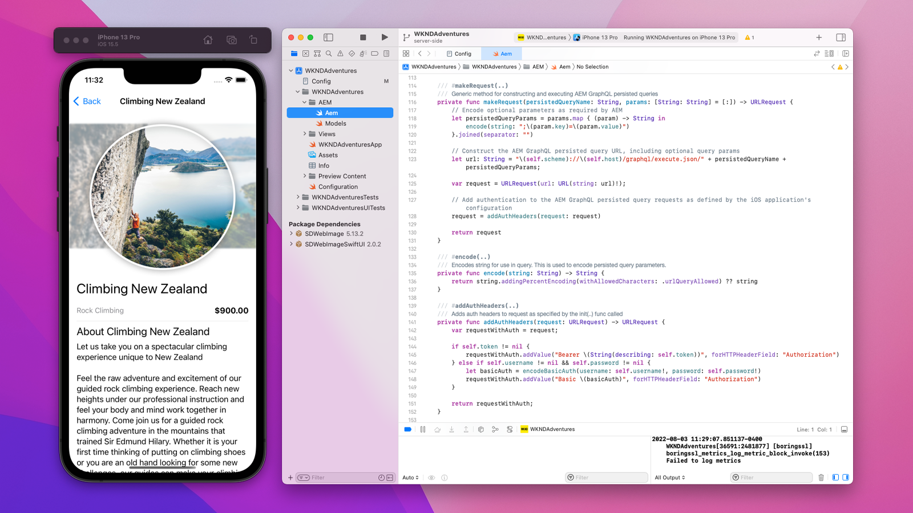

# Resumen de API de AEM{#aem-apis-overview}

Obtenga información sobre los distintos tipos de API en Adobe Experience Manager (AEM) y comprenda qué API elegir para su integración.

Para crear, leer, actualizar y eliminar contenido, recursos y formularios en AEM, los desarrolladores pueden utilizar una amplia gama de API. Estas API permiten a los desarrolladores crear aplicaciones personalizadas que interactúen con AEM.

Vamos a explorar los diferentes tipos de API en AEM y comprender qué API elegir para su integración.

## Tipos de API de AEM{#types-of-aem-apis}

AEM ofrece las siguientes API para interactuar con sus tipos de servicio de autor y publicación.

| Tipo de API de AEM | Descripción | Disponibilidad | Caso práctico | Ejemplos de API |
| --- | --- | --- | --- | --- |
| API de AEM basadas en OpenAPI | API estandarizadas y legibles por el equipo para Assets, Sites y Forms. | **Solo AEM as a Cloud Service** | Desarrollo con API en primer lugar, aplicaciones modernas | [API de autor de Assets](https://developer.adobe.com/experience-cloud/experience-manager-apis/api/experimental/assets/author/), [API de carpetas](https://developer.adobe.com/experience-cloud/experience-manager-apis/api/experimental/folders/), [API de AEM Sites](https://developer.adobe.com/experience-cloud/experience-manager-apis/api/stable/sites/), [API de servicios de documentos de Forms](https://developer.adobe.com/experience-cloud/experience-manager-apis/api/experimental/document/) y otras |
| API de RESTful | Puntos finales REST tradicionales para interactuar con recursos de AEM. | AEM 6.X, AEM as a Cloud Service | Operaciones CRUD, aplicaciones modernas | [API HTTP de Assets](https://experienceleague.adobe.com/es/docs/experience-manager-cloud-service/content/assets/admin/mac-api-assets), [API REST de flujo de trabajo](https://experienceleague.adobe.com/es/docs/experience-manager-65/content/implementing/developing/extending-aem/extending-workflows/workflows-program-interaction#using-the-workflow-rest-api), [exportador JSON para servicios de contenido](https://experienceleague.adobe.com/es/docs/experience-manager-cloud-service/content/implementing/developing/full-stack/components-templates/json-exporter) y otros |
| API de GraphQL | Optimizado para recuperar contenido estructurado de forma eficaz con consultas flexibles. | AEM 6.X, AEM as a Cloud Service | CMS sin encabezado, SPA, aplicaciones móviles | [API de GraphQL](https://experienceleague.adobe.com/es/docs/experience-manager-cloud-service/content/headless/graphql-api/content-fragments) |
| API tradicionales (no RESTful) | Las API más antiguas, como JCR, modelos Sling, Query Builder y otras. | AEM 6.X, AEM as a Cloud Service | Integraciones heredadas, compatibilidad con versiones anteriores | [API de Query Builder](https://experienceleague.adobe.com/es/docs/experience-manager-cloud-service/content/implementing/developing/full-stack/search/query-builder-api) y otras |

Para obtener más información, consulte la página [API de Adobe Experience Manager as a Cloud Service](https://developer.adobe.com/experience-cloud/experience-manager-apis/).

## Qué API elegir{#which-api-to-choose}

Al seleccionar una API para la integración, tenga en cuenta los siguientes factores:

- **Caso de uso**: Determine si la API de AEM admite su caso de uso. Siempre que sea posible, _use las API de AEM basadas en OpenAPI_, ya que proporcionan un enfoque estandarizado y moderno para interactuar con AEM. Si las API basadas en OpenAPI no están disponibles, considere la posibilidad de utilizar las API de RESTful o las API de GraphQL y, como último recurso, las API tradicionales.

- **Compatibilidad**: Asegúrese de que la API seleccionada sea compatible con su versión de AEM. Por ejemplo, _las API de AEM basadas en OpenAPI son exclusivas de AEM as a Cloud Service_ y no están disponibles en AEM 6.X.

- **Tipo de servicio de AEM: autor vs. publicación**: la elección de la API también depende de si se ejecuta en el servicio de autor o publicación, ya que sus modelos de acceso son diferentes. El servicio AEM Author se utiliza para crear contenido y siempre requiere autenticación. El servicio de publicación de AEM se utiliza para la entrega de contenido y es posible que no requiera autenticación, según el caso de uso.

- **Autenticación**: Compruebe que la API admite el método de autenticación que planea usar. Por ejemplo:
   - **API de AEM basadas en OpenAPI**: admiten la autenticación OAuth 2.0, incluidas las credenciales de cliente (servidor a servidor), el código de autorización (aplicación web) y la clave de revisión para los tipos de concesión de intercambio de código (aplicación de una sola página). Otras API de AEM no admiten la autenticación OAuth 2.0.
   - **API RESTful**: admite la autenticación de token web JSON (JWT), también conocida como autenticación basada en token.

## Diferencia entre el token web JSON (JWT) y OAuth 2.0{#difference-between-jwt-and-oauth}

Vamos a comparar el token web JSON (JWT) y OAuth 2.0, dos mecanismos de autenticación comunes utilizados en las API de AEM:

| Característica | Token web JSON (JWT) | OAuth 2.0 |
| --- | --- | --- |
| Utilizado en | API de RESTful | API de AEM basadas en OpenAPI (no admitidas en RESTful ni en otras API) |
| Función | Autenticación de servicio | Autenticación de usuarios o servicios |
| Interacción del usuario | No se requiere interacción del usuario | Interacción de usuario necesaria para los tipos de concesión de código de autorización y aplicación de una sola página |
| Más Adecuado Para | Llamadas de API de servidor a servidor | Acceso seguro y permitido para aplicaciones y usuarios |
| Información necesaria | Clave privada para firmar JWT | ID de cliente y secreto de cliente para OAuth 2.0 |
| Caducidad del token | De corta duración, a menudo necesita actualización | El token de acceso es de corta duración. El token de actualización es de larga duración y se utiliza para obtener un nuevo token de acceso |
| Administración de credenciales | [AEM Developer Console](https://experienceleague.adobe.com/es/docs/experience-manager-learn/cloud-service/debugging/debugging-aem-as-a-cloud-service/developer-console) | [Adobe Developer Console](https://developer.adobe.com/developer-console/) |

## API de AEM basadas en OpenAPI

Obtenga más información acerca de las API de AEM basadas en OpenAPI y los conceptos importantes para acceder a las API de Adobe en la guía [API de AEM basadas en OpenAPI](./openapis/overview.md).

### Casos de uso

<!-- CARDS
{target = _self}

* ./openapis/use-cases/invoke-api-using-oauth-s2s.md
  {title = Invoke API using Server-to-Server authentication}
  {description = Learn how to invoke OpenAPI-based AEM APIs from a custom NodeJS application using OAuth Server-to-Server authentication.}
  {image = ./openapis/assets/s2s/OAuth-S2S.png}
* ./openapis/use-cases/invoke-api-using-oauth-web-app.md
  {title = Invoke API using Web App authentication}
  {description = Learn how to invoke OpenAPI-based AEM APIs from a custom web application using OAuth Web App authentication.}
  {image = ./openapis/assets/web-app/OAuth-WebApp.png} 
* ./openapis/use-cases/invoke-api-using-oauth-single-page-app.md
  {title = Invoke API using OAuth Single Page App}
  {description = Learn how to invoke OpenAPI-based AEM APIs from a custom Single Page App (SPA) using OAuth 2.0 PKCE flow.}
  {image = ./openapis/assets/spa/OAuth-SPA.png}
-->
<!-- START CARDS HTML - DO NOT MODIFY BY HAND -->

    

        

            

                <figure class="image x-is-16by9">
                    
                </figure>
            

            

                

                    

                        <a href="./openapis/use-cases/invoke-api-using-oauth-s2s.md" target="_self" rel="referrer" title="Invocar la API mediante la autenticación de servidor a servidor">Invocar la API mediante la autenticación de servidor a servidor</a>
                    

                    
Obtenga información sobre cómo invocar las API de AEM basadas en OpenAPI desde una aplicación NodeJS personalizada mediante la autenticación de servidor a servidor de OAuth.

                

                <a href="./openapis/use-cases/invoke-api-using-oauth-s2s.md" target="_self" rel="referrer" class="spectrum-Button spectrum-Button--outline spectrum-Button--primary spectrum-Button--sizeM" style="align-self: flex-start; margin-top: 1rem;">
                    Más información
                </a>
            

        

    

    

        

            

                <figure class="image x-is-16by9">
                    
                </figure>
            

            

                

                    

                        <a href="./openapis/use-cases/invoke-api-using-oauth-web-app.md" target="_self" rel="referrer" title="Invocar la API mediante la autenticación de aplicación web">Invocar la API mediante la autenticación de aplicación web</a>
                    

                    
Obtenga información sobre cómo invocar las API de AEM basadas en OpenAPI desde una aplicación web personalizada mediante la autenticación de aplicación web de OAuth.

                

                <a href="./openapis/use-cases/invoke-api-using-oauth-web-app.md" target="_self" rel="referrer" class="spectrum-Button spectrum-Button--outline spectrum-Button--primary spectrum-Button--sizeM" style="align-self: flex-start; margin-top: 1rem;">
                    Más información
                </a>
            

        

    

    

        

            

                <figure class="image x-is-16by9">
                    
                </figure>
            

            

                

                    

                        <a href="./openapis/use-cases/invoke-api-using-oauth-single-page-app.md" target="_self" rel="referrer" title="Invocar la API mediante la aplicación de una sola página de OAuth">Invocar API mediante la aplicación de una sola página de OAuth</a>
                    

                    
Aprenda a invocar las API de AEM basadas en OpenAPI desde una aplicación de una sola página (SPA) personalizada mediante el flujo PKCE de OAuth 2.0.

                

                <a href="./openapis/use-cases/invoke-api-using-oauth-single-page-app.md" target="_self" rel="referrer" class="spectrum-Button spectrum-Button--outline spectrum-Button--primary spectrum-Button--sizeM" style="align-self: flex-start; margin-top: 1rem;">
                    Más información
                </a>
            

        

    

<!-- END CARDS HTML - DO NOT MODIFY BY HAND -->

## API de GraphQL: ejemplos

Obtenga más información acerca de las API de GraphQL y cómo usarlas en [Introducción a AEM sin encabezado: GraphQL](https://experienceleague.adobe.com/es/docs/experience-manager-learn/getting-started-with-aem-headless/graphql/overview)

### Casos de uso

<!-- CARDS
{target = _self}

* https://experienceleague.adobe.com/es/docs/experience-manager-learn/getting-started-with-aem-headless/deployments/spa#example-single-page-app
  {title = Single Page Application (SPA)}
  {description = Learn how to build a Single Page Application (SPA) that fetches content from AEM using GraphQL APIs.}
  {image = ./assets/react-app-card.png}
* https://experienceleague.adobe.com/es/docs/experience-manager-learn/getting-started-with-aem-headless/deployments/mobile#example-mobile-apps
  {title = Mobile App}
  {description = Learn how to build a mobile app that fetches content from AEM using GraphQL APIs.}
  {image = ./assets/ios-app-card.png}
* https://experienceleague.adobe.com/es/docs/experience-manager-learn/getting-started-with-aem-headless/deployments/web-component#example-web-component
  {title = Web Component}
  {description = Learn how to build a web component that fetches content from AEM using GraphQL APIs.}
  {image = ./assets/web-component-card.png}
-->
<!-- START CARDS HTML - DO NOT MODIFY BY HAND -->

    

        

            

                <figure class="image x-is-16by9">
                    
                </figure>
            

            

                

                    

                        <a href="https://experienceleague.adobe.com/es/docs/experience-manager-learn/getting-started-with-aem-headless/deployments/spa#example-single-page-app" target="_self" rel="referrer" title="Aplicación de una sola página (SPA)">Aplicación de una sola página (SPA)</a>
                    

                    
Obtenga información sobre cómo crear una aplicación de una sola página (SPA) que obtenga contenido de AEM mediante las API de GraphQL.

                

                <a href="https://experienceleague.adobe.com/es/docs/experience-manager-learn/getting-started-with-aem-headless/deployments/spa#example-single-page-app" target="_self" rel="referrer" class="spectrum-Button spectrum-Button--outline spectrum-Button--primary spectrum-Button--sizeM" style="align-self: flex-start; margin-top: 1rem;">
                    Más información
                </a>
            

        

    

    

        

            

                <figure class="image x-is-16by9">
                    
                </figure>
            

            

                

                    

                        <a href="https://experienceleague.adobe.com/es/docs/experience-manager-learn/getting-started-with-aem-headless/deployments/mobile#example-mobile-apps" target="_self" rel="referrer" title="Aplicación móvil">Aplicación móvil</a>
                    

                    
Obtenga información sobre cómo crear una aplicación móvil que recupere contenido de AEM mediante las API de GraphQL.

                

                <a href="https://experienceleague.adobe.com/es/docs/experience-manager-learn/getting-started-with-aem-headless/deployments/mobile#example-mobile-apps" target="_self" rel="referrer" class="spectrum-Button spectrum-Button--outline spectrum-Button--primary spectrum-Button--sizeM" style="align-self: flex-start; margin-top: 1rem;">
                    Más información
                </a>
            

        

    

    

        

            

                <figure class="image x-is-16by9">
                    
                </figure>
            

            

                

                    

                        <a href="https://experienceleague.adobe.com/es/docs/experience-manager-learn/getting-started-with-aem-headless/deployments/web-component#example-web-component" target="_self" rel="referrer" title="Componente web">Componente web</a>
                    

                    
Obtenga información sobre cómo crear un componente web que obtenga contenido de AEM mediante las API de GraphQL.

                

                <a href="https://experienceleague.adobe.com/es/docs/experience-manager-learn/getting-started-with-aem-headless/deployments/web-component#example-web-component" target="_self" rel="referrer" class="spectrum-Button spectrum-Button--outline spectrum-Button--primary spectrum-Button--sizeM" style="align-self: flex-start; margin-top: 1rem;">
                    Más información
                </a>
            

        

    

<!-- END CARDS HTML - DO NOT MODIFY BY HAND -->

## API de RESTful: ejemplos

Obtenga más información acerca de las API de RESTful, como la [API HTTP de Assets](https://experienceleague.adobe.com/es/docs/experience-manager-cloud-service/content/assets/admin/mac-api-assets) y el [Exportador JSON](https://experienceleague.adobe.com/es/docs/experience-manager-cloud-service/content/implementing/developing/full-stack/components-templates/json-exporter).

### Casos de uso

<!-- CARDS
{target = _self}

* https://experienceleague.adobe.com/es/docs/experience-manager-learn/getting-started-with-aem-headless/content-services/overview
  {title = Using Content Services for Headless App}
  {description = Learn how to build a native mobile app that fetches content from AEM using Content Services RESTful APIs.}
  {image = ./assets/RESTful-Content-Service.png}
* https://experienceleague.adobe.com/es/docs/experience-manager-learn/getting-started-with-aem-headless/authentication/overview
  {title = Token-based Authentication for RESTful APIs}
  {description = Learn how to invoke RESTful APIs using JSON Web Token (JWT) authentication.}
  {image = ./assets/RESTful-TokenAuth.png}
-->
<!-- START CARDS HTML - DO NOT MODIFY BY HAND -->

    

        

            

                <figure class="image x-is-16by9">
                    
                </figure>
            

            

                

                    

                        <a href="https://experienceleague.adobe.com/es/docs/experience-manager-learn/getting-started-with-aem-headless/content-services/overview" target="_self" rel="referrer" title="Uso de servicios de contenido para aplicaciones sin encabezado">Uso de servicios de contenido para la aplicación sin encabezado</a>
                    

                    
Aprenda a crear una aplicación móvil nativa que recupere contenido de AEM mediante las API de RESTful de servicios de contenido.

                

                <a href="https://experienceleague.adobe.com/es/docs/experience-manager-learn/getting-started-with-aem-headless/content-services/overview" target="_self" rel="referrer" class="spectrum-Button spectrum-Button--outline spectrum-Button--primary spectrum-Button--sizeM" style="align-self: flex-start; margin-top: 1rem;">
                    Más información
                </a>
            

        

    

    

        

            

                <figure class="image x-is-16by9">
                    
                </figure>
            

            

                

                    

                        <a href="https://experienceleague.adobe.com/es/docs/experience-manager-learn/getting-started-with-aem-headless/authentication/overview" target="_self" rel="referrer" title="Autenticación basada en tokens para API de RESTful">Autenticación basada en tokens para API RESTful</a>
                    

                    
Obtenga información sobre cómo invocar las API de RESTful mediante la autenticación de token web JSON (JWT).

                

                <a href="https://experienceleague.adobe.com/es/docs/experience-manager-learn/getting-started-with-aem-headless/authentication/overview" target="_self" rel="referrer" class="spectrum-Button spectrum-Button--outline spectrum-Button--primary spectrum-Button--sizeM" style="align-self: flex-start; margin-top: 1rem;">
                    Más información
                </a>
            

        

    

<!-- END CARDS HTML - DO NOT MODIFY BY HAND -->

