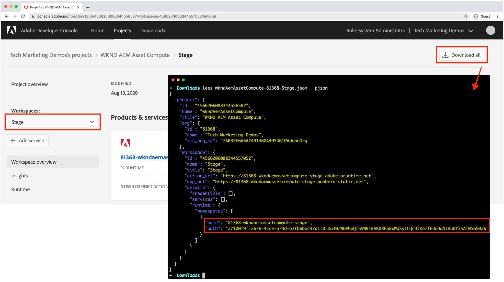

# Implementación en Adobe I/O Runtime

Los proyectos de asset compute, y los trabajadores que contienen, deben implementarse en Adobe I/O Runtime a través de la CLI de Adobe I/O que utilizará AEM as a Cloud Service.

Al implementar en Adobe I/O Runtime para que los servicios de autor de AEM as a Cloud Service lo utilicen, solo se requieren dos variables de entorno:

+ `AIO_runtime_namespace` señala el Workspace de App Builder para implementar en
+ `AIO_runtime_auth` son las credenciales de autenticación de App Builder Workspace

AEM as a Cloud Service proporciona implícitamente las demás variables estándar definidas en el archivo `.env` cuando invoca al trabajador de Asset compute.

## Espacio de trabajo Desarrollo

Dado que este proyecto se generó usando `aio app init` usando el área de trabajo `Development`, `AIO_runtime_namespace` se establece automáticamente en `81368-wkndaemassetcompute-development` con el `AIO_runtime_auth` coincidente en nuestro archivo `.env` local.  Si existe un archivo `.env` en el directorio utilizado para emitir el comando deploy, se usan sus valores, a menos que se reemplacen mediante una exportación de variables a nivel del sistema operativo, que es la forma en que se segmentan los espacios de trabajo [stage y production](#stage-and-production).


Para implementar en el área de trabajo, defina en el archivo de proyectos `.env`:

1. Abra la línea de comandos en la raíz del proyecto de Asset compute
1. Ejecutar el comando `aio app deploy`
1. Ejecute el comando `aio app get-url` para obtener la dirección URL del trabajador y usarla en el perfil de procesamiento de AEM as a Cloud Service para hacer referencia a este trabajador de Asset compute personalizado. Si el proyecto contiene varios trabajadores, se muestran las direcciones URL discretas de cada trabajador.

Si los entornos de desarrollo local y de desarrollo de AEM as a Cloud Service utilizan implementaciones de Asset compute independientes, las implementaciones para el desarrollo de AEM as a Cloud Service se pueden administrar de la misma manera que las [implementaciones de ensayo y producción](#stage-and-production).

## Espacios de trabajo de fase y producción{#stage-and-production}

La implementación en los espacios de trabajo de fase y producción se suele realizar mediante el sistema de CI/CD que elija. El proyecto de Asset compute debe implementarse en cada Workspace (fase y producción) de forma independiente.

La configuración de variables de entorno verdaderas reemplaza los valores de las variables con el mismo nombre en `.env`.


El enfoque general, automatizado normalmente por un sistema de CI/CD, para la implementación en entornos de ensayo y producción es el siguiente:

1. Asegúrese de que el módulo npm de CLI de Adobe I/O [y el complemento de Asset compute](../set-up/development-environment.md#aio) estén instalados
1. Consulte el proyecto de Asset compute para implementar desde Git
1. Configure las variables de entorno con los valores que correspondan al espacio de trabajo de destino (fase o producción).
   + Las dos variables requeridas son `AIO_runtime_namespace` y `AIO_runtime_auth` y se obtienen por área de trabajo en Adobe I/O Developer Console mediante la característica __Descargar todo__ de Workspace.



Los valores de estas claves se pueden configurar emitiendo comandos de exportación desde la línea de comandos:

```
$ export AIO_runtime_namespace=81368-wkndaemassetcompute-stage
$ export AIO_runtime_auth=27100f9f-2676-4cce-b73d-b3fb6bac47d1:0tDu307W6MboQf5VWB1BAK0RHp8xWqSy1CQc3lKe7f63o3aNtAu0Y3nAmN56502W
```

Si los trabajadores de Asset compute requieren otras variables, como el almacenamiento en la nube, también deben exportarse como variables de entorno.

1. Una vez que todas las variables de entorno estén configuradas para que el espacio de trabajo de destino las implemente, ejecute el comando deploy:
   + `aio app deploy`
1. Las URL de trabajo a las que hace referencia el perfil de procesamiento de AEM as a Cloud Service también están disponibles a través de:
   + `aio app get-url`.

Si la versión del proyecto de Asset compute cambia, las direcciones URL de trabajo también cambian para reflejar la nueva versión, y la URL deberá actualizarse en los perfiles de procesamiento.

## aprovisionamiento de API de Workspace{#workspace-api-provisioning}

Al [configurar el proyecto App Builder en el Adobe I/O](../set-up/app-builder.md) para admitir el desarrollo local, se creó un nuevo área de trabajo de desarrollo y se agregaron __eventos de Asset compute, E/S__ y __API de administración de eventos de E/S__.

Las API __Asset compute, eventos de E/S__ y __API de administración de eventos de E/S__ solo se agregan explícitamente a los espacios de trabajo utilizados para el desarrollo local. Los espacios de trabajo que se integran (exclusivamente) con entornos de AEM as a Cloud Service __no__ necesitan que se agreguen estas API explícitamente, ya que las API están disponibles de forma natural para AEM as a Cloud Service.
