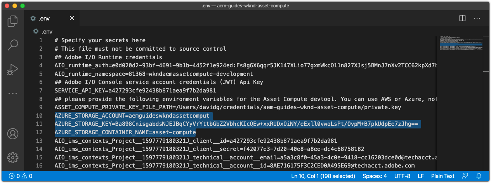

# Configuración de las variables de entorno


Antes de comenzar el desarrollo de los trabajadores de Asset Compute, asegúrese de que el proyecto esté configurado con información de Adobe I/O y almacenamiento en la nube. Esta información se almacena en el `.env` del proyecto, que solo se utiliza para el desarrollo local y no se guarda en Git. El archivo `.env` proporciona una forma cómoda de exponer pares de claves y valores al entorno de desarrollo local de Asset Compute. Cuando [implementa](../deploy/runtime.md) los trabajadores de Asset Compute en Adobe I/O Runtime, el archivo `.env` no se utiliza, sino que se pasa un subconjunto de valores a través de variables de entorno. También se pueden almacenar otros parámetros personalizados y secretos en el archivo `.env` , como credenciales de desarrollo para servicios web de terceros.

## Haga referencia a `private.key`


Abra el archivo `.env`, quite la marca de comentario de la clave `ASSET_COMPUTE_PRIVATE_KEY_FILE_PATH` y proporcione la ruta absoluta de su sistema de archivos al `private.key` que se asocia con el certificado público agregado al proyecto FireFly de Adobe I/O.

+ Si Adobe I/O generó el par de claves, este se descargó automáticamente como parte del `config.zip`.
+ Si ha proporcionado la clave pública a Adobe I/O, también debe poseer la clave privada coincidente.
+ Si no tiene estos pares de claves, puede generar nuevos pares de claves o cargar nuevas claves públicas en la parte inferior de:
   [https://console.adobe.com](https://console.adobe.io)  > Su proyecto de Asset Compute Firefly > Workspaces @ Development > Cuenta de servicio (JWT).

Recuerde que el archivo `private.key` no se debe registrar en Git porque contiene secretos, sino que se debe almacenar en un lugar seguro fuera del proyecto.

Por ejemplo, en macOS esto puede tener el siguiente aspecto:

```
...
ASSET_COMPUTE_PRIVATE_KEY_FILE_PATH=/Users/example-user/credentials/aem-guides-wknd-asset-compute/private.key
...
```

## Configuración de las credenciales de Cloud Storage

El desarrollo local de los trabajadores de Asset Compute requiere acceso a [almacenamiento en la nube](../set-up/accounts-and-services.md#cloud-storage). Las credenciales de almacenamiento en la nube utilizadas para el desarrollo local se proporcionan en el archivo `.env` .

Este tutorial prefiere el uso de Azure Blob Storage, sin embargo Amazon S3 y sus claves correspondientes en el archivo `.env` pueden utilizarse en su lugar.

### Uso del almacenamiento del blob de Azure

Descomente y rellene las claves siguientes en el archivo `.env` y rellénelas con los valores del almacenamiento en la nube aprovisionado que se encuentra en Azure Portal.


1. Valor de la clave `AZURE_STORAGE_CONTAINER_NAME`
1. Valor de la clave `AZURE_STORAGE_ACCOUNT`
1. Valor de la clave `AZURE_STORAGE_KEY`

Por ejemplo, puede tener el siguiente aspecto (solo valores para ilustración):

```
...
AZURE_STORAGE_ACCOUNT=aemguideswkndassetcomput
AZURE_STORAGE_KEY=Va9CnisgdbdsNJEJBqXDyNbYppbGbZ2V...OUNY/eExll0vwoLsPt/OvbM+B7pkUdpEe7zJhg==
AZURE_STORAGE_CONTAINER_NAME=asset-compute
...
```

El archivo resultante `.env` tiene el siguiente aspecto:



Si NO utiliza Microsoft Azure Blob Storage, elimine o deje estos comentarios (prefiriendo `#`).

### Uso del almacenamiento en la nube de Amazon S3{#amazon-s3}

Si está utilizando el almacenamiento en la nube de Amazon S3, quite la marca de comentario y rellene las claves siguientes en el archivo `.env`.

Por ejemplo, puede tener el siguiente aspecto (solo valores para ilustración):

```
...
S3_BUCKET=aemguideswkndassetcompute
AWS_ACCESS_KEY_ID=KKIXZLZYNLXJLV24PLO6
AWS_SECRET_ACCESS_KEY=Ba898CnisgabdsNJEJBqCYyVrYttbGbZ2...OiNYExll0vwoLsPtOv
AWS_REGION=us-east-1
...
```

## Validación de la configuración del proyecto

Una vez configurado el proyecto de Asset Compute generado, valide la configuración antes de realizar cambios en el código para asegurarse de que se proporcionan los servicios de soporte, en los archivos `.env` .

Para iniciar Asset Compute Development Tool para el proyecto Asset Compute:

1. Abra una línea de comandos en la raíz del proyecto de Asset Compute (en el código VS esto se puede abrir directamente en el IDE a través de Terminal > Nuevo terminal) y ejecute el comando:

   ```
   $ aio app run
   ```

1. La herramienta de desarrollo de cómputo de recursos local se abrirá en su explorador web predeterminado en __http://localhost:9000__.

   

1. Vea los mensajes de error en la salida de la línea de comandos y en el explorador web a medida que se inicializa la herramienta de desarrollo.
1. Para detener la herramienta de desarrollo de Asset Compute, pulse `Ctrl-C` en la ventana que ejecutó `aio app run` para finalizar el proceso.

## Solución de problemas

+ [La herramienta de desarrollo no se puede iniciar debido a la falta de private.key](../troubleshooting.md#missing-private-key)
