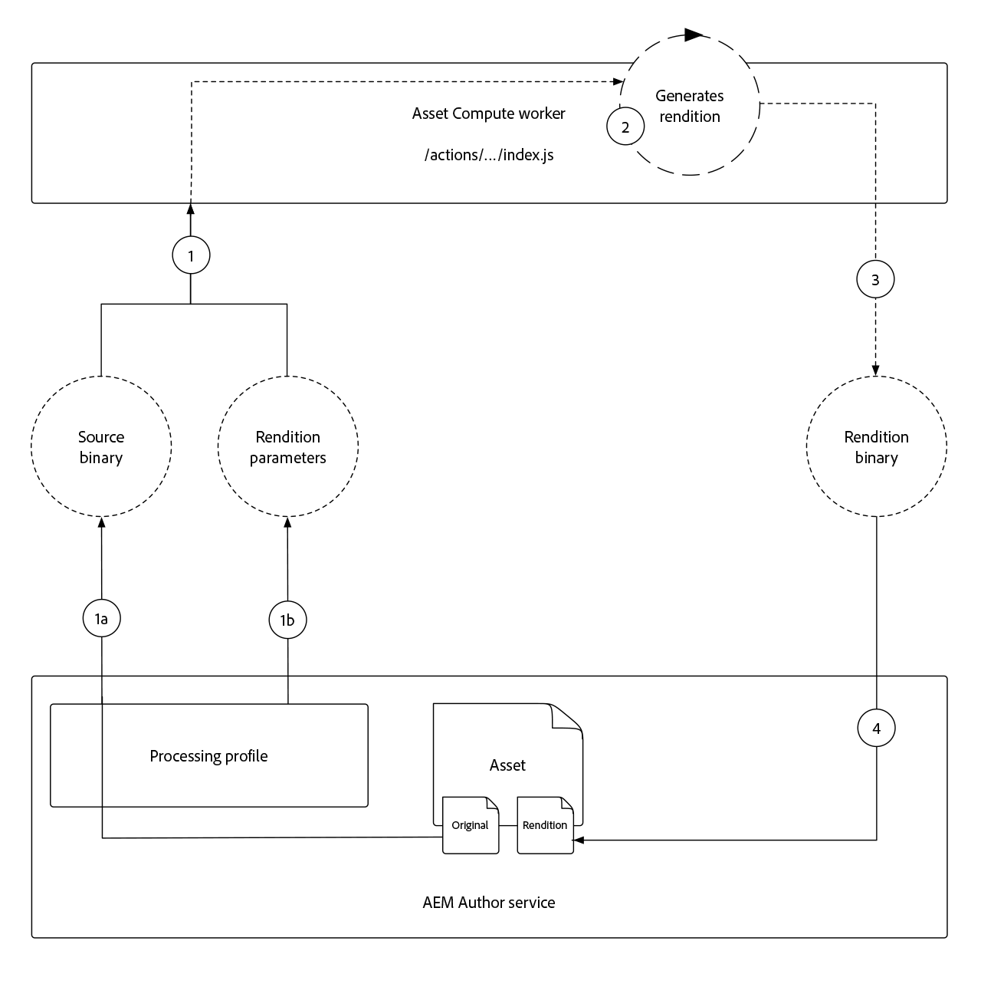

# Desarrollar un trabajador de cómputo de recursos

Los trabajadores de Asset Compute son el núcleo de una aplicación de Asset Compute, ya que proporcionan una funcionalidad personalizada que realiza u orquesta el trabajo realizado en un recurso para crear una nueva representación.

El proyecto de cálculo de recursos genera automáticamente un programa de trabajo simple que copia el binario original del recurso en una representación con nombre, sin ninguna transformación. En este tutorial modificaremos este programa de trabajo para realizar una representación más interesante, para ilustrar el poder de los trabajadores de Asset Compute.

Crearemos un programa de trabajo de cómputo de recursos que generará una nueva representación de imagen horizontal, que cubrirá el espacio vacío a la izquierda y a la derecha de la representación de recursos con una versión borrosa del recurso. Se parametrizará la anchura, la altura y el desenfoque de la representación final.

## Explicación de la ejecución de un trabajador de cómputo de recursos

Los trabajadores de Asset Compute implementan el contrato de API de trabajo de Asset Compute SDK, que simplemente es:

+ __Entrada:__ Parámetros y binario de recursos originales de un recurso AEM
+ __Salida:__ Una o varias representaciones que se van a agregar al recurso AEM



1. Cuando se invoca a un trabajador de cómputo de recursos desde el servicio AEM Author, se compara con un recurso AEM mediante un Perfil de procesamiento. El binario original __(1a)__ del recurso se pasa al programa de trabajo mediante el parámetro `source` de la función de rellamada de representación y __(1b)__ cualquier parámetro definido en el Perfil de procesamiento mediante el conjunto `rendition.instructions` de parámetros.
1. El código de trabajo Cálculo de recursos transforma el binario de origen proporcionado en __(1a)__ en función de los parámetros proporcionados por __(1b)__ para generar una representación del binario de origen.
   + En este tutorial, la representación se crea &quot;en proceso&quot;, lo que significa que el trabajador compone la representación; sin embargo, el binario de origen se puede enviar también a otras API de servicios Web para la generación de representaciones.
1. El trabajador de cómputo de recursos guarda la representación binaria de la representación en la `rendition.path` que está disponible para guardarse en el servicio de AEM Author.
1. Una vez finalizados, los datos binarios escritos en `rendition.path` se exponen a través del servicio de creación de AEM como una representación del recurso AEM en el que se invocó el trabajador de cómputo de recursos.

## Anatomía de un trabajador

Todos los trabajadores de Asset Compute siguen la misma estructura básica y el mismo contrato de entrada y salida.

```javascript
'use strict';

// Any npm module imports used by the worker
const { worker, SourceCorruptError } = require('@adobe/asset-compute-sdk');
const fs = require('fs').promises;

/**
Exports the worker implemented by a custom rendition callback function, which parametrizes the input/output contract for the worker.
 + `source` represents the asset's original binary used as the input for the worker.
 + `rendition` represents the worker's output, which is the creation of a new asset rendition.
 + `params` are optional parameters, which map to additional key/value pairs, including a sub `auth` object that contains Adobe I/O access credentials.
**/
exports.main = worker(async (source, rendition, params) => {
    // Perform any necessary source (input) checks
    const stats = await fs.stat(source.path);
    if (stats.size === 0) {
        // Throw appropriate errors whenever an erring condition is met
        throw new SourceCorruptError('source file is empty');
    }

    // Access any custom parameters provided via the Processing Profile configuration
    let param1 = rendition.instructions.exampleParam;

    /** 
    Perform all work needed to transform the source into the rendition.
    
    The source data can be accessed:
        + In the worker via a file available at `source.path`
        + Or via a presigned GET URL at `source.url`
    **/
    if (success) {
        // A successful worker must write some data back to `renditions.path`. 
        // This example performs a trivial 1:1 copy of the source binary to the rendition
        await fs.copyFile(source.path, rendition.path);
    } else {
        // Upon failure an Asset Compute Error (exported by @adobe/asset-compute-commons) should be thrown.
        throw new GenericError("An error occurred!", "example-worker");
    }
});

/**
Optionally create helper classes or functions the worker's rendition callback function invokes to help organize code.

Code shared across workers, or to complex to be managed in a single file, can be broken out across supporting JavaScript files in the project and imported normally into the worker. 
**/
function customHelperFunctions() { ... }
```

## Abrir el archivo index.js de trabajo


1. Asegúrese de que el proyecto de cálculo de recursos esté abierto en el código VS
1. Navegar a la `/actions/worker` carpeta
1. Open the `index.js` file

Este es el archivo JavaScript de trabajo que modificaremos en este tutorial.

## Instalación e importación de módulos npm compatibles

Como aplicaciones de Node.js, las aplicaciones de Asset Compute se benefician del sólido ecosistema [del módulo](https://npmjs.com)npm. Para aprovechar los módulos npm primero debemos instalarlos en nuestro proyecto de la aplicación Asset Compute.

En este programa de trabajo, aprovechamos el [jimp](https://www.npmjs.com/package/jimp) para crear y manipular la imagen de representación directamente en el código Node.js.

>[!WARNING]
>
>Asset Compute no admite todos los módulos npm para la manipulación de recursos. módulos npm que se basan en las existentes de otras aplicaciones como ImageMagick o bibliotecas dependientes del sistema operativo. Es mejor limitar el uso de módulos npm solo de JavaScript.

1. Abra la línea de comandos en la raíz del proyecto de cómputo de recursos (esto se puede hacer en Código VS mediante __Terminal > Nuevo terminal__) y ejecute el comando:

   ```
   $ npm install jimp
   ```

1. Importe el `jimp` módulo en el código de trabajo para que pueda utilizarse mediante el objeto `Jimp` JavaScript.
Actualice las `require` directivas en la parte superior del programa de trabajo `index.js` para importar el `Jimp` objeto desde el `jimp` módulo:

   ```javascript
   'use strict';
   
   const { Jimp } = require('jimp');
   const { worker, SourceCorruptError } = require('@adobe/asset-compute-sdk');
   const fs = require('fs').promises;
   
   exports.main = worker(async (source, rendition, params) => {
       // Check handle a corrupt input source
       const stats = await fs.stat(source.path);
       if (stats.size === 0) {
           throw new SourceCorruptError('source file is empty');
       }
   
       // Do work here
   });
   ```

## Parámetros de lectura

Los trabajadores de Asset Compute pueden leer parámetros que se pueden pasar a través de Perfiles de procesamiento definidos en AEM como un servicio de Cloud Service Author. Los parámetros se pasan al programa de trabajo a través del `rendition.instructions` objeto.

Se pueden leer accediendo `rendition.instructions.<parameterName>` al código de trabajo.

Aquí leeremos los valores predeterminados de las representaciones configurables `SIZE``BRIGHTNESS` y `CONTRAST`, si no se ha proporcionado ninguno mediante el Perfil de procesamiento. Tenga en cuenta que `renditions.instructions` se pasan como cadenas cuando se invocan desde AEM como Perfiles de procesamiento de Cloud Service, por lo que debe asegurarse de que se transforman en los tipos de datos correctos en el código de trabajo.

```javascript
'use strict';

const { Jimp } = require('jimp');
const { worker, SourceCorruptError } = require('@adobe/asset-compute-sdk');
const fs = require('fs').promises;

exports.main = worker(async (source, rendition, params) => {
    const stats = await fs.stat(source.path);
    if (stats.size === 0) {
        throw new SourceCorruptError('source file is empty');
    }

    // Read in parameters and set defaults if parameters are provided
    // Processing Profiles pass in instructions as Strings, so make sure to parse to correct data types
    const SIZE = parseInt(rendition.instructions.size) || 800; 
    const CONTRAST = parseFloat(rendition.instructions.contrast) || 0;
    const BRIGHTNESS = parseFloat(rendition.instructions.brightness) || 0;

    // Do work here
}
```

## Errores de activación{#errors}

Los trabajadores de Asset Compute pueden encontrar situaciones que resulten en errores. El SDK de cómputo de recursos de Adobe proporciona [un conjunto de errores](https://github.com/adobe/asset-compute-commons#asset-compute-errors) predefinidos que se pueden generar cuando se encuentran estas situaciones. Si no se aplica ningún tipo de error específico, `GenericError` se puede usar o se `ClientErrors` puede definir una personalización específica.

Antes de empezar a procesar la representación, compruebe que todos los parámetros son válidos y compatibles en el contexto de este programa de trabajo:

+ Asegúrese de que los parámetros de instrucciones de representación para `SIZE`, `CONTRAST`y `BRIGHTNESS` son válidos. Si no es así, genere un error personalizado `RenditionInstructionsError`.
   + En la parte inferior de este archivo se define una `RenditionInstructionsError` clase personalizada que se extiende `ClientError` . El uso de un error personalizado específico resulta útil al [escribir pruebas](../test-debug/test.md) para el programa de trabajo.

```javascript
'use strict';

const { Jimp } = require('jimp');
// Import the Asset Compute SDK provided `ClientError` 
const { worker, SourceCorruptError, ClientError } = require('@adobe/asset-compute-sdk');
const fs = require('fs').promises;

exports.main = worker(async (source, rendition, params) => {
    const stats = await fs.stat(source.path);
    if (stats.size === 0) {
        throw new SourceCorruptError('source file is empty');
    }

    // Read in parameters and set defaults if parameters are provided
    const SIZE = parseInt(rendition.instructions.size) || 800; 
    const CONTRAST = parseFloat(rendition.instructions.contrast) || 0;
    const BRIGHTNESS = parseFloat(rendition.instructions.brightness) || 0;

    if (SIZE <= 10 || SIZE >= 10000) {
        // Ensure size is within allowable bounds
        throw new RenditionInstructionsError("'size' must be between 10 and 1,0000");
    } else if (CONTRAST <= -1 || CONTRAST >= 1) {
        // Ensure contrast is valid value
        throw new RenditionInstructionsError("'contrast' must between -1 and 1");
    } else if (BRIGHTNESS <= -1 || BRIGHTNESS >= 1) {
        // Ensure contrast is valid value
        throw new RenditionInstructionsError("'brightness' must between -1 and 1");
    }

    // Do work here
}

// Create a new ClientError to handle invalid rendition.instructions values
class RenditionInstructionsError extends ClientError {
    constructor(message) {
        // Provide a:
        // + message: describing the nature of this erring condition
        // + name: the name of the error; usually same as class name
        // + reason: a short, searchable, unique error token that identifies this error
        super(message, "RenditionInstructionsError", "rendition_instructions_error");

        // Capture the strack trace
        Error.captureStackTrace(this, RenditionInstructionsError);
    }
}
```

## Creación de la representación

Con los parámetros leídos, saneados y validados, el código se escribe para generar la representación. El pseudocódigo para la generación de representaciones es el siguiente:

1. Cree un nuevo `renditionImage` lienzo en dimensiones cuadradas especificadas mediante el `size` parámetro .
1. Crear un `image` objeto a partir del binario del recurso de origen
1. Utilice la biblioteca __Jimp__ para transformar la imagen:
   + Recortar la imagen original en un cuadrado centrado
   + Cortar un círculo desde el centro de la imagen &quot;al cuadrado&quot;
   + Escalar para ajustarse a las dimensiones definidas por el valor del `SIZE` parámetro
   + Ajustar el contraste en función del valor del `CONTRAST` parámetro
   + Ajustar el brillo en función del valor del `BRIGHTNESS` parámetro
1. Colocar las transformadas `image` en el centro del `renditionImage` fondo transparente
1. Escriba el compuesto `renditionImage` para `rendition.path` que pueda volver a guardarse en AEM como una representación de recursos.

Este código emplea las API de [Jimp](https://github.com/oliver-moran/jimp#jimp) para realizar estas transformaciones de imagen.

Los trabajadores de Asset Compute deben terminar su trabajo sincrónicamente y `rendition.path` se deben volver a escribir completamente antes de que el trabajador `renditionCallback` finalice. Esto requiere que las llamadas a funciones asincrónicas se hagan sincrónicas con el `await` operador. Si no está familiarizado con las funciones asincrónicas de JavaScript y con cómo ejecutarlas de manera sincrónica, familiarícese con el operador [de espera de](https://developer.mozilla.org/en-US/docs/Web/JavaScript/Reference/Operators/await)JavaScript.

El trabajador terminado `index.js` debería tener el siguiente aspecto:

```javascript
'use strict';

const Jimp = require('jimp');
const { worker, SourceCorruptError, ClientError } = require('@adobe/asset-compute-sdk');
const fs = require('fs').promises;

exports.main = worker(async (source, rendition, params) => {
    const stats = await fs.stat(source.path);
    if (stats.size === 0) {
        throw new SourceCorruptError('source file is empty');
    }

    const SIZE = parseInt(rendition.instructions.size) || 800; 
    const CONTRAST = parseFloat(rendition.instructions.contrast) || 0;
    const BRIGHTNESS = parseFloat(rendition.instructions.brightness) || 0;

    if (SIZE <= 10 || SIZE >= 10000) {
        throw new RenditionInstructionsError("'size' must be between 10 and 10,000");
    } else if (CONTRAST <= -1 || CONTRAST >= 1) {
        throw new RenditionInstructionsError("'contrast' must between -1 and 1");
    } else if (BRIGHTNESS <= -1 || BRIGHTNESS >= 1) {
        throw new RenditionInstructionsError("'brightness' must between -1 and 1");
    }

    // Create target rendition image of the target size with a transparent background (0x0)
    let renditionImage =  new Jimp(SIZE, SIZE, 0x0);

    // Read and perform transformations on the source binary image
    let image = await Jimp.read(source.path);

    // Crop a circle from the source asset, and then apply contrast and brightness using Jimp
    image.crop(
            image.bitmap.width < image.bitmap.height ? 0 : (image.bitmap.width - image.bitmap.height) / 2,
            image.bitmap.width < image.bitmap.height ? (image.bitmap.height - image.bitmap.width) / 2 : 0,
            image.bitmap.width < image.bitmap.height ? image.bitmap.width : image.bitmap.height,
            image.bitmap.width < image.bitmap.height ? image.bitmap.width : image.bitmap.height
        )   
        .circle()
        .scaleToFit(SIZE, SIZE)
        .contrast(CONTRAST)
        .brightness(BRIGHTNESS);

    // Place the transformed image onto the transparent renditionImage to save as PNG
    renditionImage.composite(image, 0, 0)

    // Write the final transformed image to the asset's rendition
    renditionImage.write(rendition.path);
});

// Custom error used for renditions.instructions parameter checking
class RenditionInstructionsError extends ClientError {
    constructor(message) {
        super(message, "RenditionInstructionsError", "rendition_instructions_error");
        Error.captureStackTrace(this, RenditionInstructionsError);
    }
}
```

## Ejecución del trabajador

Ahora que el código de trabajo está completo y se ha registrado y configurado previamente en [manifest.yml](./manifest.md), se puede ejecutar usando la herramienta de desarrollo de cómputo de recursos local para ver los resultados.

1. Desde la raíz del proyecto de cómputo de recursos
1. Ejecutar `app aio run`
1. Espere a que la herramienta de desarrollo de cómputo de recursos se abra en una ventana nueva
1. En __Seleccionar un archivo...__ desplegable, seleccione una imagen de muestra para procesar
   + Seleccione un archivo de imagen de ejemplo para utilizarlo como binario de recursos de origen
   + Si todavía no hay ninguno, toque el botón __(+)__ a la izquierda, cargue un archivo de imagen [de](../assets/samples/sample-file.jpg) ejemplo y actualice la ventana del explorador Herramientas de desarrollo
1. Actualice `"name": "rendition.png"` como este programa de trabajo para generar un PNG transparente.
   + Tenga en cuenta que este parámetro &quot;name&quot; solo se utiliza para la herramienta de desarrollo y no se debe confiar en él.

   ```json
   {
       "renditions": [
           {
               "worker": "...",
               "name": "rendition.png"
           }
       ]
   }
   ```
1. Toque __Ejecutar__ y espere a que se genere la representación
1. La sección __Representaciones__ previsualización la representación generada. Toque la previsualización de representación para descargar la representación completa

   

### Ejecutar el trabajo con parámetros

Los parámetros, pasados a través de las configuraciones de Perfil de procesamiento, se pueden simular en las herramientas de desarrollo de cómputo de recursos proporcionándolos como pares de clave/valor en el parámetro de representación JSON.

>[!WARNING]
>
>Durante el desarrollo local, los valores se pueden pasar usando varios tipos de datos, cuando se pasan desde AEM como Perfiles de procesamiento de Cloud Service como cadenas, por lo que debe asegurarse de que se analizan los tipos de datos correctos si es necesario.
> Por ejemplo, la `crop(width, height)` función de Jimp requiere que sus parámetros sean `int`propios. Si no `parseInt(rendition.instructions.size)` se analiza en un int, la llamada a `jimp.crop(SIZE, SIZE)` fallará, ya que los parámetros serán de tipo &#39;String&#39; incompatible.

Nuestro código acepta parámetros para:

+ `size` define el tamaño de la representación (altura y anchura como enteros)
+ `contrast` define el ajuste de contraste, debe estar entre -1 y 1, como flotantes
+ `brightness`  define el ajuste brillante, debe estar entre -1 y 1, como flotantes

Se leen en el programa de trabajo `index.js` mediante:

+ `const SIZE = parseInt(rendition.instructions.size) || 800`
+ `const CONTRAST = parseFloat(rendition.instructions.contrast) || 0`
+ `const BRIGHTNESS = parseFloat(rendition.instructions.brightness) || 0`

1. Actualice los parámetros de representación para personalizar el tamaño, el contraste y el brillo.

   ```json
   {
       "renditions": [
           {
               "worker": "...",
               "name": "rendition.png",
               "size": "450",
               "contrast": "0.30",
               "brightness": "0.15"
           }
       ]
   }
   ```

1. Toque __Ejecutar__ nuevamente
1. Toque la previsualización de representación para descargar y revisar la representación generada. Observe sus dimensiones y cómo se han cambiado el contraste y el brillo en comparación con la representación predeterminada.

   

1. Cargue otras imágenes en la lista desplegable del archivo ____ de origen e intente ejecutar el programa de trabajo en su contra con parámetros diferentes.

## Solución de problemas

### La representación se devuelve parcialmente dibujada

+ __Error__: La representación se procesa de forma incompleta cuando el tamaño total del archivo de representación es grande

   

+ __Causa__: La `renditionCallback` función del trabajador se está cerrando antes de que la representación se pueda escribir completamente en `rendition.path`.
+ __Resolución__: Revise el código de trabajo personalizado y asegúrese de que todas las llamadas asincrónicas sean sincrónicas.
