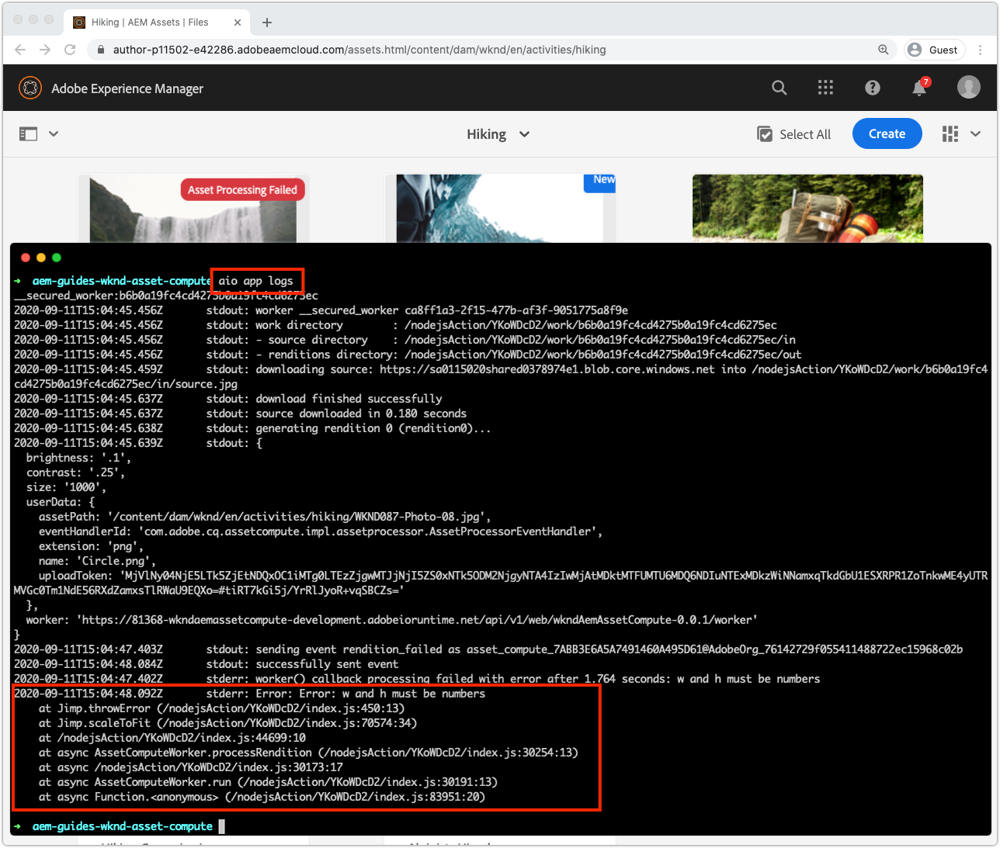

# Depurar un trabajador de Asset compute

Los trabajadores de asset compute se pueden depurar de varias maneras, desde simples sentencias de registro de depuración, hasta el código VS adjunto como depurador remoto, hasta la extracción de registros para activaciones en Adobe I/O Runtime iniciadas desde AEM como Cloud Service.

## Registro

La forma más básica de depurar los trabajadores de Assets computes utiliza las sentencias `console.log(..)` tradicionales en el código de trabajo. El objeto `console` de JavaScript es un objeto global implícito, por lo que no es necesario importarlo ni exigirlo, ya que siempre está presente en todos los contextos.

Estas sentencias de registro están disponibles para su revisión de forma diferente en función de cómo se ejecuta el programa de trabajo de Asset compute:

+ Desde `aio app run`, los registros se imprimen hasta la salida estándar y los [Registros de Activación](../develop/development-tool.md) de la herramienta de desarrollo
   
+ Desde `aio app test`, los registros se imprimen en `/build/test-results/test-worker/test.log`
   
+ Mediante `wskdebug`, las sentencias de registro se imprimen en la consola de depuración de código VS (Vista > Consola de depuración), salida estándar
   
+ Utilizando `aio app logs`, las sentencias de registro se imprimen en la salida del registro de activaciones

## Depuración remota mediante el depurador adjunto

>[!WARNING]
>
>Usar Microsoft Visual Studio Code 1.48.0 o bueno para la compatibilidad con wskdebug

El módulo npm [wskdebug](https://www.npmjs.com/package/@openwhisk/wskdebug) admite la asociación de un depurador a los trabajadores de Asset compute, incluida la capacidad de establecer puntos de interrupción en el código VS y de pasar por el código.

>[!VIDEO](https://video.tv.adobe.com/v/40383/?quality=12&learn=on)

_Pulsación de depuración de un trabajador de Asset compute mediante wskdebug (sin audio)_

1. Asegúrese de que los módulos [wskdebug](../set-up/development-environment.md#wskdebug) y [ngrok](../set-up/development-environment.md#ngork) npm están instalados
1. Asegúrese de que [Docker Desktop y las imágenes de Docker](../set-up/development-environment.md#docker) compatibles están instaladas y en ejecución
1. Cierre todas las instancias activas de la herramienta de desarrollo.
1. Implemente el código más reciente mediante `aio app deploy` y registre el nombre de la acción implementada (nombre entre `[...]`). Esto se utilizará para actualizar el `launch.json` en el paso 8.

   ```
   ℹ Info: Deploying package [wkndAemAssetCompute-0.0.1]...
   ```
1. Inicio de una nueva instancia de la Herramienta de desarrollo de Assets computes mediante el comando `npx adobe-asset-compute devtool`
1. En Código VS, toque el icono de depuración en el panel de navegación izquierdo
   + Si se le solicita, toque __crear un archivo launch.json > Node.js__ para crear un nuevo archivo `launch.json`.
   + De lo contrario, toque el icono __Engranaje__ a la derecha del menú desplegable __Iniciar Programa__ para abrir el `launch.json` existente en el editor.
1. Añada la siguiente configuración de objeto JSON en la matriz `configurations`:

   ```json
   {
       "type": "pwa-node",
       "request": "launch",
       "name": "wskdebug",
       "attachSimplePort": 0,
       "runtimeExecutable": "wskdebug",
       "args": [
           "wkndAemAssetCompute-0.0.1/__secured_worker",  // Version must match your Asset Compute worker's version
           "${workspaceFolder}/actions/worker/index.js",  // Points to your worker
           "-l",
           "--ngrok"
       ],
       "localRoot": "${workspaceFolder}",
       "remoteRoot": "/code",
       "outputCapture": "std",
       "timeout": 30000
   }
   ```

1. Seleccione el nuevo __wskdebug__ en la lista desplegable
1. Toque el botón verde __Ejecutar__ a la izquierda del menú desplegable __wskdebug__
1. Abra `/actions/worker/index.js` y toque a la izquierda de los números de línea para agregar puntos de interrupción 1. Acceda a la ventana del explorador Web Herramienta de desarrollo de Assets computes abierta en el paso 6
1. Toque el botón __Ejecutar__ para ejecutar el programa de trabajo
1. Vuelva al código VS, a `/actions/worker/index.js` y avance por el código
1. Para salir de la herramienta de desarrollo depurable, toque `Ctrl-C` en el terminal que ejecutó el comando `npx adobe-asset-compute devtool` en el paso 6

## Acceso a registros desde Adobe I/O Runtime{#aio-app-logs}

[AEM como Cloud Service aprovecha a los trabajadores de Asset compute mediante Procesamiento de ](../deploy/processing-profiles.md) perfiles invocándolos directamente en Adobe I/O Runtime. Dado que estas invocaciones no implican desarrollo local, sus ejecuciones no se pueden depurar con herramientas locales como la herramienta de desarrollo de Assets computes o wskdebug. En su lugar, la CLI de Adobe I/O se puede utilizar para recuperar registros del trabajador ejecutado en un espacio de trabajo concreto en Adobe I/O Runtime.

1. Asegúrese de que las [variables de entorno específicas del espacio de trabajo](../deploy/runtime.md) se configuran mediante `AIO_runtime_namespace` y `AIO_runtime_auth`, según el espacio de trabajo que requiere depuración.
1. Desde la línea de comandos, ejecute `aio app logs`
   + Si el área de trabajo está experimentando un tráfico intenso, expanda el número de registros de activación mediante el indicador `--limit`:
      `$ aio app logs --limit=25`
1. Los registros de activaciones más recientes (hasta `--limit`) se devolverán como resultado del comando para su revisión.

   

## Solución de problemas

+ [El depurador no se adjunta](../troubleshooting.md#debugger-does-not-attach)
+ [Puntos de interrupción que no se pausan](../troubleshooting.md#breakpoints-no-pausing)
+ [El depurador de código VS no está adjunto](../troubleshooting.md#vs-code-debugger-not-attached)
+ [El depurador de código VS se adjunta después de iniciarse la ejecución del trabajo](../troubleshooting.md#vs-code-debugger-attached-after-worker-execution-began)
+ [Se agotó el tiempo de espera del trabajador durante la depuración](../troubleshooting.md#worker-times-out-while-debugging)
+ [No se puede terminar el proceso de depuración](../troubleshooting.md#cannot-terminate-debugger-process)
