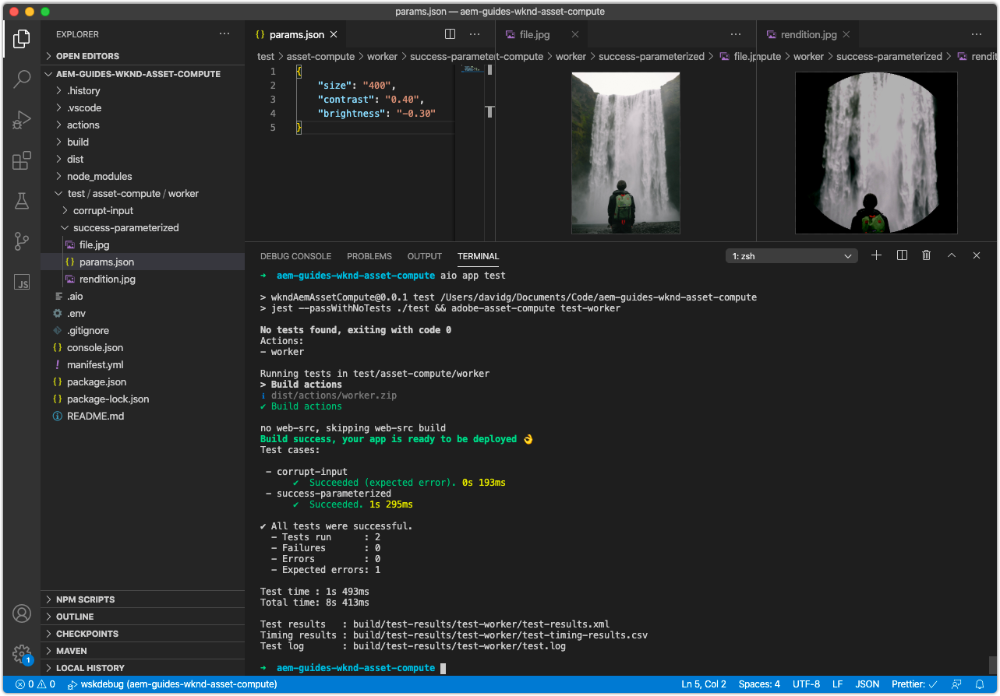

# Prueba de un trabajador de Asset Compute

El proyecto de Asset Compute define un patrón para crear y ejecutar fácilmente [pruebas de los trabajadores de Asset Compute](https://experienceleague.adobe.com/docs/asset-compute/using/extend/test-custom-application.html).

## Anatomía de una prueba de trabajo

Las pruebas de los trabajadores de Asset Compute se dividen en grupos de pruebas y, dentro de cada grupo de pruebas, en uno o más casos de prueba que afirman una condición que se debe probar.

La estructura de las pruebas en un proyecto de Asset Compute es la siguiente:

```
/actions/<worker-name>/index.js
...
/test/
  asset-compute/
    <worker-name>/           <--- Test suite for the worker, must match the yaml key for this worker in manifest.yml
        <test-case-1>/       <--- Specific test case 
            file.jpg         <--- Input file (ie. `source.path` or `source.url`)
            params.json      <--- Parameters (ie. `rendition.instructions`)
            rendition.png    <--- Expected output file (ie. `rendition.path`)
        <test-case-2>/       <--- Another specific test case for this worker
            ...
```

Cada conversión de prueba puede tener los siguientes archivos:

+ `file.<extension>`
   + Archivo Source para probar (la extensión puede ser cualquier cosa excepto `.link`)
   + Requerido
+ `rendition.<extension>`
   + Representación esperada
   + Necesario, excepto para la prueba de errores
+ `params.json`
   + Las instrucciones JSON de una sola representación
   + Opcional
+ `validate`
   + Secuencia de comandos que obtiene rutas de acceso de archivos de representación esperadas y reales como argumentos y que debe devolver el código de salida 0 si el resultado es correcto, o un código de salida distinto de cero si la validación o comparación fallan.
   + Opcional, toma como valor predeterminado el comando `diff`
   + Use un script de shell que ajuste un comando de ejecución de docker para usar diferentes herramientas de validación
+ `mock-<host-name>.json`
   + Respuestas HTTP con formato JSON para [burlar llamadas de servicio externas](https://www.mock-server.com/mock_server/creating_expectations.html).
   + Opcional, sólo se utiliza si el código de trabajo realiza sus propias solicitudes HTTP

## Escritura de un caso de prueba

Este caso de prueba afirma que la entrada parametrizada (`params.json`) para el archivo de entrada (`file.jpg`) genera la representación PNG esperada (`rendition.png`).

1. En primer lugar, elimine el caso de pruebas `simple-worker` generado automáticamente en `/test/asset-compute/simple-worker`, ya que no es válido, ya que el trabajador ya no copia el origen en la representación.
1. Cree una nueva carpeta de caso de prueba en `/test/asset-compute/worker/success-parameterized` para probar una ejecución correcta del trabajador que genera una representación PNG.
1. En la carpeta `success-parameterized`, agregue el [archivo de entrada](./assets/test/success-parameterized/file.jpg) de prueba para este caso de prueba y asígnele el nombre `file.jpg`.
1. En la carpeta `success-parameterized`, agregue un nuevo archivo denominado `params.json` que defina los parámetros de entrada del trabajador:

   ```json
   { 
       "size": "400",
       "contrast": "0.25",
       "brightness": "-0.50"
   }
   ```

   Son los mismos valores o claves pasados a la [definición de perfil de Asset Compute de la herramienta de desarrollo](../develop/development-tool.md), menos la clave `worker`.

1. Agregue el [archivo de representación](./assets/test/success-parameterized/rendition.png) esperado a este caso de prueba y asígnele el nombre `rendition.png`. Este archivo representa la salida esperada del trabajador para la entrada dada `file.jpg`.
1. Desde la línea de comandos, ejecute las pruebas en la raíz del proyecto ejecutando `aio app test`
   + Asegúrese de que [Docker Desktop](../set-up/development-environment.md#docker) y las imágenes de Docker compatibles estén instalados e iniciados
   + Finalice cualquier instancia de la herramienta de desarrollo en ejecución



## Escribir un caso de prueba de comprobación de errores

Este caso de prueba prueba prueba para asegurarse de que el trabajador genera el error apropiado cuando el parámetro `contrast` se establece en un valor no válido.

1. Cree una nueva carpeta de casos de prueba en `/test/asset-compute/worker/error-contrast` para probar una ejecución errónea del trabajador debido a un valor de parámetro `contrast` no válido.
1. En la carpeta `error-contrast`, agregue el [archivo de entrada](./assets/test/error-contrast/file.jpg) de prueba para este caso de prueba y asígnele el nombre `file.jpg`. El contenido de este archivo no es relevante para esta prueba. Solo necesita existir para superar la comprobación de &quot;Origen dañado&quot;, para alcanzar las comprobaciones de validez de `rendition.instructions` que valida este caso de prueba.
1. En la carpeta `error-contrast`, agregue un nuevo archivo denominado `params.json` que defina los parámetros de entrada del trabajador con el contenido:

   ```json
   {
       "contrast": "10",
       "errorReason": "rendition_instructions_error"
   }
   ```

   + Establezca `contrast` parámetros en `10`, un valor no válido, ya que el contraste debe estar entre -1 y 1, para arrojar un `RenditionInstructionsError`.
   + Afirmar que el error apropiado se produce en las pruebas estableciendo la clave `errorReason` en el &quot;motivo&quot; asociado con el error esperado. Este parámetro de contraste no válido genera el [error personalizado](../develop/worker.md#errors), `RenditionInstructionsError`, por lo que se establece el `errorReason` en el motivo de este error, o `rendition_instructions_error` para afirmar que se ha producido.

1. Dado que no se debe generar ninguna representación durante una ejecución errónea, no es necesario ningún archivo de `rendition.<extension>`.
1. Ejecute el grupo de pruebas desde la raíz del proyecto ejecutando el comando `aio app test`
   + Asegúrese de que [Docker Desktop](../set-up/development-environment.md#docker) y las imágenes de Docker compatibles estén instalados e iniciados
   + Finalice cualquier instancia de la herramienta de desarrollo en ejecución


## Casos de prueba en Github

Los casos de prueba finales están disponibles en Github en:

+ [aem-guides-wknd-asset-compute/test/asset-compute/worker](https://github.com/adobe/aem-guides-wknd-asset-compute/tree/master/test/asset-compute/worker)

## Solución de problemas

+ [No se ha generado ninguna representación durante la ejecución de la prueba](../troubleshooting.md#test-no-rendition-generated)
+ [La prueba genera una representación incorrecta](../troubleshooting.md#tests-generates-incorrect-rendition)
