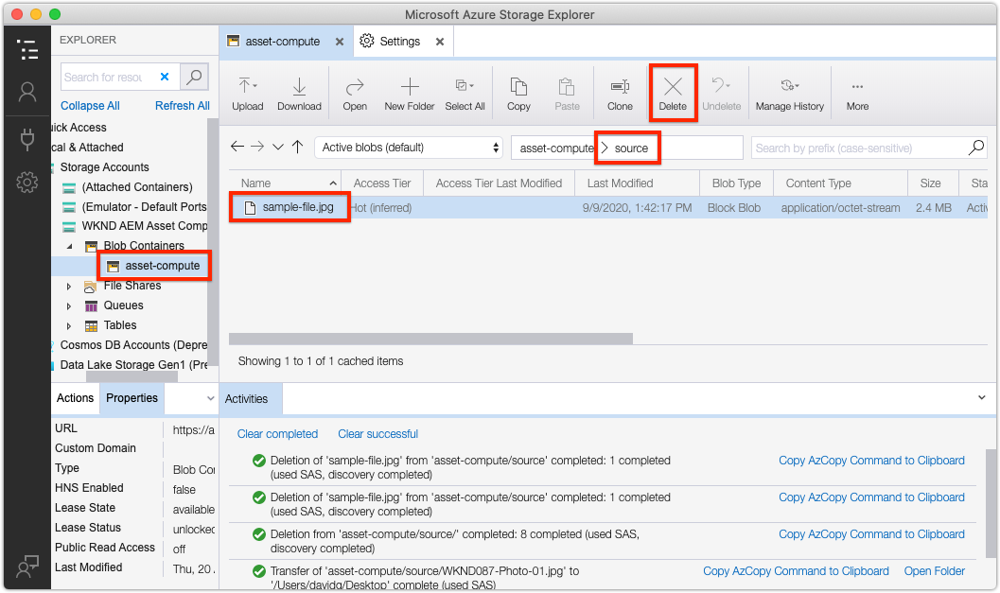

# Resolución de problemas de extensibilidad de cálculos de recursos

A continuación se muestra un índice de problemas y errores comunes, junto con las resoluciones, que se pueden encontrar al desarrollar e implementar los trabajadores personalizados de Asset Compute para AEM Assets.

## Desarrollar{#develop}

### La representación se devuelve parcialmente dibujada/dañada{#rendition-returned-partially-drawn-or-corrupt}

+ __Error__: La representación se procesa de forma incompleta (cuando una imagen está dañada) o no se puede abrir.

   

+ __Causa__: La `renditionCallback` función del trabajador se está cerrando antes de que la representación se pueda escribir completamente en `rendition.path`.
+ __Resolución__: Revise el código de trabajo personalizado y asegúrese de que todas las llamadas asincrónicas se hacen sincrónicas mediante `await`.

## Herramienta de desarrollo{#development-tool}

### Sangría de YAML incorrecta en manifest.yml{#incorrect-yaml-indentation}

+ __Error:__ YAMLException: sangría incorrecta de una entrada de asignación en la línea X, columna Y: (mediante salida estándar desde `aio app run` comando)
+ __Causa:__ Los archivos Yaml distinguen entre espacios en blanco, es probable que la sangría sea incorrecta.
+ __Resolución:__ Revise `manifest.yml` y asegúrese de que toda la sangría es correcta.

### el límite de memorySize está establecido en demasiado bajo{#memorysize-limit-is-set-too-low}

+ __Error:__  OpenWhiskError del servidor de desarrollo local: PUT https://adobeioruntime.net/api/v1/namespaces/xxx-xxx-xxx/actions/xxx-0.0.1/__secured_workeroverwrite=true HTTP 400 devuelto (solicitud incorrecta) —> &quot;El contenido de la solicitud tenía un formato incorrecto:error de requisito: memoria 64 MB por debajo del umbral permitido de 134217728 B&quot;
+ __Causa:__ Se estableció un `memorySize` límite para el trabajador en el `manifest.yml` umbral por debajo del umbral mínimo permitido tal como se indica en el mensaje de error en bytes.
+ __Resolución:__  Revise los `memorySize` límites en el `manifest.yml` y asegúrese de que son todos superiores al umbral mínimo permitido.

### La herramienta de desarrollo no puede inicio debido a la falta de private.key{#missing-private-key}

+ __Error:__ Error del servidor de desarrollo local: Faltan los archivos necesarios en validatePrivateKeyFile.... (a través de la salida estándar del `aio app run` comando)
+ __Causa:__ El `ASSET_COMPUTE_PRIVATE_KEY_FILE_PATH` valor del `.env` archivo no apunta a `private.key` o no `private.key` es legible por el usuario actual.
+ __Resolución:__ Revise el `ASSET_COMPUTE_PRIVATE_KEY_FILE_PATH` valor del `.env` archivo y asegúrese de que contiene la ruta completa y absoluta al `private.key` archivo del sistema de archivos.

### Lista desplegable de archivos de origen incorrecta{#source-files-dropdown-incorrect}

La herramienta de desarrollo de cómputo de recursos puede introducir un estado en el que extrae datos antiguos y se nota más en la lista desplegable de archivos __de__ origen que muestra elementos incorrectos.

+ __Error:__ La lista desplegable de archivos de origen muestra elementos incorrectos.
+ __Causa:__ El estado del explorador en caché antiguo hace que
+ __Resolución:__ En el navegador, borre por completo el &quot;estado de la aplicación&quot; de la ficha del navegador, la caché del navegador, el almacenamiento local y el programa de trabajo del servicio.

### Falta el parámetro de consulta devToolToken o no es válido{#missing-or-invalid-devtooltoken-query-parameter}

+ __Error:__ Notificación &quot;no autorizada&quot; en Asset Compute Development Tool
+ __Causa:__ `devToolToken` falta o no es válido
+ __Resolución:__ Cierre la ventana del navegador de la herramienta de desarrollo de cómputo de recursos, finalice los procesos de la herramienta de desarrollo que se ejecuten iniciados mediante el `aio app run` comando y vuelva a utilizar la herramienta de desarrollo de inicios (mediante `aio app run`).

### No se pueden quitar los archivos de origen{#unable-to-remove-source-files}

+ __Error:__ No hay forma de eliminar los archivos de origen agregados de la interfaz de usuario de las herramientas de desarrollo
+ __Causa:__ Esta funcionalidad no se ha implementado
+ __Resolución:__ Inicie sesión en el proveedor de almacenamiento de nube con las credenciales definidas en `.env`. Busque el contenedor que utilizan las herramientas de desarrollo (también especificadas en `.env`), desplácese hasta la carpeta de __origen__ y elimine las imágenes de origen. Es posible que tenga que realizar los pasos descritos en la lista desplegable Archivos [de origen incorrectos](#source-files-dropdown-incorrect) si los archivos de origen eliminados siguen mostrándose en la lista desplegable, ya que se pueden almacenar en caché localmente en el &quot;estado de la aplicación&quot; de las herramientas de desarrollo.

   

## Probar{#test}

### No se generó ninguna representación durante la ejecución de la prueba{#test-no-rendition-generated}

+ __Error:__ Error: No se generó ninguna representación.
+ __Causa:__ El programa de trabajo no pudo generar una representación debido a un error inesperado, como un error de sintaxis de JavaScript.
+ __Resolución:__ Revise la ejecución de la prueba `test.log` en `/build/test-results/test-worker/test.log`. Busque la sección de este archivo correspondiente al caso de prueba fallido y revise los errores.

   

### La prueba genera una representación incorrecta que provoca que la prueba falle{#tests-generates-incorrect-rendition}

+ __Error:__ Error: La representación &#39;rendition.xxx&#39; no es la esperada.
+ __Causa:__ El programa de trabajo genera una representación que no es la misma que la `rendition.<extension>` proporcionada en el caso de prueba.
   + Si el `rendition.<extension>` archivo esperado no se crea de la misma manera que la representación generada localmente en el caso de prueba, la prueba puede fallar, ya que puede haber alguna diferencia en los bits. Por ejemplo, si el trabajador de cómputo de recursos cambia el contraste mediante API y el resultado esperado se crea ajustando el contraste en Adobe Photoshop CC, los archivos pueden aparecer del mismo modo, pero las variaciones menores en los bits pueden ser diferentes.
+ __Resolución:__ Revise el resultado de la representación de la prueba navegando hasta `/build/test-worker/<worker-name>/<test-run-timestamp>/<test-case>/rendition.<extension>`y compárelo con el archivo de representación esperado en el caso de prueba. Para crear un recurso esperado exacto, haga lo siguiente:
   + Utilice la herramienta de desarrollo para generar una representación, validar que sea correcta y utilizarla como archivo de representación esperado
   + O bien, valide el archivo generado por la prueba en `/build/test-worker/<worker-name>/<test-run-timestamp>/<test-case>/rendition.<extension>`, valide que es correcto y utilícelo como archivo de representación esperado

## Depurar


### El depurador no se adjunta{#debugger-does-not-attach}

+ __Error__: Error al procesar el inicio: Error: No se pudo conectar al destinatario de depuración en...
+ __Causa__: Docker Desktop no se está ejecutando en el sistema local. Para verificar esto, revise la consola de depuración de código VS (Vista > Consola de depuración) y confirme que se ha producido este error.
+ __Resolución__: Inicio [Docker Desktop y confirme que las imágenes de acoplamiento necesarias están instaladas](./set-up/development-environment.md#docker).

### Puntos de interrupción que no se pausan{#breakpoints-no-pausing}

+ __Error__: Al ejecutar el trabajador de cálculo de recursos desde la herramienta de desarrollo depurable, VS Code no se pausa en los puntos de interrupción.

#### El depurador de código VS no está adjunto{#vs-code-debugger-not-attached}

+ __Causa:__ El depurador de código VS se detuvo o desconectó.
+ __Resolución:__ Reinicie el depurador de código VS y verifique que se adjunta, mirando la consola de salida de depuración de código VS (Vista > Consola de depuración)

#### El depurador de código VS se adjunta después de iniciarse la ejecución del trabajo{#vs-code-debugger-attached-after-worker-execution-began}

+ __Causa:__ El depurador de código VS no se adjuntó antes de tocar __Ejecutar__ en la herramienta de desarrollo.
+ __Resolución:__ Asegúrese de que el depurador se ha conectado mediante la revisión de la consola de depuración de VS Code (Vista > Consola de depuración) y, a continuación, vuelva a ejecutar el programa de trabajo de Asset Compute desde la herramienta de desarrollo.

### Se agotó el tiempo de espera del trabajador durante la depuración{#worker-times-out-while-debugging}

+ __Error__: La consola de depuración informa de que la acción se agotará en -XXX milisegundos&quot; o de que la previsualización de representación de la herramienta de desarrollo de cómputo de [](./develop/development-tool.md) recursos gira indefinidamente o
+ __Causa__: Se ha superado el tiempo de espera de trabajo definido en [manifest.yml](./develop/manifest.md) durante la depuración.
+ __Resolución__: Aumente temporalmente el tiempo de espera del programa de trabajo en [manifest.yml](./develop/manifest.md) o acelere las actividades de depuración.

### No se puede terminar el proceso de depuración{#cannot-terminate-debugger-process}

+ __Error__: `Ctrl-C` en la línea de comandos no termina el proceso de depuración (`npx adobe-asset-compute devtool`).
+ __Causa__: Un error en `@adobe/aio-cli-plugin-asset-compute` 1.3.x `Ctrl-C` no se reconoce como un comando de finalización.
+ __Resolución__: Actualización `@adobe/aio-cli-plugin-asset-compute` a la versión 1.4.1+

   ```
   $ aio update
   ```

   

## Implementar{#deploy}

### Falta la representación personalizada del recurso en AEM{#custom-rendition-missing-from-asset}

+ __Error:__ Los recursos nuevos y reprocesados se procesan correctamente, pero faltan la representación personalizada

#### Perfil de procesamiento no aplicado a la carpeta antecesora

+ __Causa:__ El recurso no existe en una carpeta con el Perfil de procesamiento que utiliza el programa de trabajo personalizado
+ __Resolución:__ Aplicar el Perfil de procesamiento a una carpeta antecesora del recurso

#### Perfil de procesamiento sustituido por un Perfil de procesamiento inferior

+ __Causa:__ El recurso existe debajo de una carpeta con el Perfil de procesamiento de trabajador personalizado aplicado, pero se ha aplicado un Perfil de procesamiento diferente que no utiliza el programa de trabajo de cliente entre dicha carpeta y el recurso.
+ __Resolución:__ Combinar o conciliar de otro modo los dos Perfiles de procesamiento y eliminar el Perfil de procesamiento intermedio

### El procesamiento de recursos falla en AEM{#asset-processing-fails}

+ __Error:__ Se muestra el distintivo Error en el procesamiento de recursos en el recurso
+ __Causa:__ Error al ejecutar el programa de trabajo personalizado
+ __Resolución:__ Siga las instrucciones para [depurar activaciones](./test-debug/debug.md#aio-app-logs) de Adobe I/O Runtime mediante `aio app logs`.


