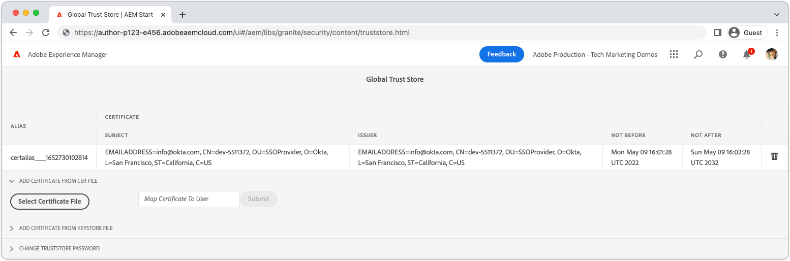

# Autenticación SAML 2.0{#saml-2-0-authentication}

Aprenda a configurar y autenticar usuarios finales (no AEM autores) en un IDP compatible con SAML 2.0 de su elección.

## ¿Qué SAML para AEM as a Cloud Service?

La integración de SAML 2.0 con AEM Publish (o Preview) permite a los usuarios finales de una experiencia web basada en AEM autenticarse en un IDP que no sea de Adobe (Proveedor de identidad) y acceder a AEM como usuario autorizado con nombre.

|  | AEM Author | AEM Publish |
|-----------------------|:----------:|:-----------:|
| Compatibilidad con SAML 2.0 | ü | š |

+++ Comprender el flujo de SAML 2.0 con AEM

El flujo típico de una integración SAML de AEM Publish es el siguiente:

1. El usuario realiza una solicitud a AEM Publish e indica que se requiere autenticación.
   + El usuario solicita un recurso protegido por CUG/ACL.
   + El usuario solicita un recurso que está sujeto a un requisito de autenticación.
   + El usuario sigue un vínculo a AEM punto final de inicio de sesión (p. ej. `/system/sling/login`) que solicita explícitamente la acción de inicio de sesión.
1. AEM realiza una solicitud de autentificación al IDP, solicitando al IDP que inicie el proceso de autenticación.
1. El usuario se autentica en IDP.
   + El IDP solicita las credenciales al usuario.
   + El usuario ya está autenticado con el IDP y no tiene que proporcionar más credenciales.
1. IDP genera una afirmación SAML que contiene los datos del usuario y la firma usando el certificado privado del IDP.
1. IDP envía la afirmación de SAML a través del POST HTTP, a través del navegador web del usuario, a AEM Publish.
1. AEM Publish recibe la afirmación SAML y valida la integridad y autenticidad de la afirmación SAML utilizando el certificado público IDP.
1. AEM Publish administra el registro de usuario AEM en función de la configuración OSGi de SAML 2.0 y el contenido de la aserción SAML.
   + Crea usuario
   + Sincroniza los atributos de usuario
   + Actualizaciones AEM pertenencia a grupos de usuarios
1. AEM Publish establece el AEM `login-token` en la respuesta HTTP, que se utiliza para autenticar solicitudes posteriores en AEM Publish.
1. AEM Publish redirige al usuario a la dirección URL en AEM Publish, tal como lo especifica el `saml_request_path` cookie.

+++

## Introducción a la configuración

>[!VIDEO](https://video.tv.adobe.com/v/343040/?quality=12&learn=on)

Este vídeo explica cómo configurar la integración de SAML 2.0 con AEM servicio de publicación as a Cloud Service y cómo usar Okta como IDP.

## Requisitos previos

A la hora de configurar la autenticación SAML 2.0, es necesario lo siguiente:

+ Acceso del administrador de implementación a Cloud Manager
+ AEM acceso del administrador a AEM entorno as a Cloud Service
+ Acceso del administrador al IDP
+ Opcionalmente, puede acceder a un par de claves pública y privada que se utiliza para cifrar cargas de SAML

SAML 2.0 solo es compatible para autenticar usuarios en AEM Publish o Preview. Para administrar la autenticación de AEM Author mediante y IDP, [integrar el IDP con Adobe IMS](https://helpx.adobe.com/es/enterprise/using/set-up-identity.html).


## Instalar el certificado público IDP en AEM

El certificado público del IDP se agrega a AEM Global Trust Store, y se usa para validar la afirmación SAML enviada por el IDP es válida.

+++Flujo de firma de aserción SAML


1. El usuario se autentica en IDP.
1. IDP genera una afirmación SAML que contiene los datos del usuario.
1. IDP firma la afirmación de SAML usando el certificado privado de IDP.
1. IDP inicia un POST HTTP del lado del cliente en el extremo SAML de AEM Publish (`.../saml_login`) que incluye la afirmación SAML firmada.
1. AEM Publish recibe el POST HTTP que contiene la afirmación SAML firmada, puede validar la firma mediante el certificado público IDP.

+++



1. Obtenga la variable __certificado público__ del IDP. Este certificado permite AEM validar la afirmación de SAML proporcionada a AEM por el IDP.

   El certificado está en formato PEM y debe parecerse a:

   ```
   -----BEGIN CERTIFICATE-----
   MIIC4jCBAcoCCQC33wnybT5QZDANBgkqhkiG9w0BAQsFADAyMQswCQYDVQQGEwJV
   ...
   m0eo2USlSRTVl7QHRTuiuSThHpLKQQ==
   -----END CERTIFICATE-----
   ```

1. Inicie sesión en AEM Author como administrador AEM.
1. Vaya a __Herramientas > Seguridad > Almacén de confianza__.
1. Cree o abra el almacén de confianza global. Si crea un almacén de confianza global, almacene la contraseña en algún lugar seguro.
1. Expandir __Añadir certificado del archivo CER__.
1. Select __Seleccionar archivo de certificado__ y cargue el archivo de certificado proporcionado por el IDP.
1. Leave __Asignar certificado al usuario__ en blanco.
1. Seleccione __Enviar__.
1. El certificado recién agregado aparece encima de la variable __Añadir certificado del archivo CRT__ para obtener más información.
1. Tenga en cuenta que __alias__, ya que este valor se utiliza en la variable [Configuración OSGi del gestor de autenticación SAML 2.0](#saml-2-0-authentication-handler-osgi-configuration).
1. Select __Guardar y cerrar__.

El almacén de confianza global está configurado con el certificado público del IDP en AEM Author, pero como SAML solo se utiliza en AEM Publish, el almacén de confianza global debe duplicarse en AEM Publish para que el certificado público IDP sea accesible allí.


1. Vaya a __Herramientas > Implementación > Paquetes__.
1. Creación de un paquete
   + Nombre del paquete: `Global Trust Store`
   + Versión: `1.0.0`
   + Agrupar: `com.your.company`
1. Edite el nuevo __Almacén de confianza global__ paquete.
1. Seleccione el __Filtros__ y agregue un filtro para la ruta raíz `/etc/truststore`.
1. Select __Listo__ y luego __Guardar__.
1. Seleccione el __Generar__ para la variable __Almacén de confianza global__ paquete.
1. Una vez creado, seleccione __Más__ > __Replicar__ para activar el nodo Almacén de confianza global (`/etc/truststore`) a AEM Publish.

## Instalar AEM par de claves pública y privada{#install-aem-public-private-key-pair}

_La instalación del par de claves pública y privada AEM es opcional_

AEM Publish puede configurarse para firmar AuthnRequests (en IDP) y cifrar aserciones SAML (en AEM). Esto se logra proporcionando una clave privada a AEM Publish y es una clave pública coincidente con el IDP.

+++ Comprender el flujo de firma AuthnRequest (opcional)

AuthnRequest (la solicitud al IDP desde AEM Publish que inicia el proceso de inicio de sesión) puede ser firmada por AEM Publish. Para ello, AEM Publish firma AuthnRequest utilizando la clave privada, que el IDP valida la firma utilizando la clave pública. Esto garantiza al IDP que AuthnRequest se inició, y que lo solicitó AEM Publish, y no un tercero malintencionado.


1. El usuario realiza una solicitud HTTP a AEM Publish que resulta en una solicitud de autenticación SAML al IDP.
1. AEM Publish genera la solicitud SAML para enviarla al IDP.
1. AEM Publish firma la solicitud SAML utilizando AEM clave privada.
1. AEM Publish inicia AuthnRequest, un redireccionamiento HTTP del lado del cliente al IDP que contiene la solicitud SAML firmada.
1. IDP recibe AuthnRequest y valida la firma utilizando AEM clave pública, lo que garantiza que AEM Publish inició AuthnRequest.
1. A continuación, AEM Publish valida la integridad y autenticidad de la afirmación SAML descifrada mediante el certificado público IDP.

+++

+++ Comprender el flujo de cifrado de afirmación SAML (opcional)

Toda la comunicación HTTP entre IDP y AEM Publish debe realizarse a través de HTTPS y, por lo tanto, ser segura de forma predeterminada. Sin embargo, según sea necesario, las afirmaciones de SAML pueden cifrarse en el caso de que se requiera confidencialidad adicional además de la proporcionada por HTTPS. Para ello, el IDP cifra los datos de aserción SAML utilizando la clave privada y AEM Publish descifra la aserción SAML utilizando la clave privada.


1. El usuario se autentica en IDP.
1. IDP genera una afirmación SAML que contiene los datos del usuario y la firma usando el certificado privado del IDP.
1. IDP cifra entonces la afirmación de SAML con AEM clave pública, que requiere la clave privada AEM para descifrar.
1. La afirmación de SAML cifrada se envía mediante el navegador web del usuario a AEM Publish.
1. AEM Publish recibe la afirmación SAML y la descifra mediante AEM clave privada.
1. IDP solicita al usuario que se autentique.

+++

Tanto la firma de AuthnRequest como el cifrado de aserción SAML son opcionales, aunque ambos están habilitados, usando la variable [Controlador de autenticación SAML 2.0, propiedad de configuración OSGi `useEncryption`](#saml-20-authenticationsaml-2-0-authentication), lo que significa que se pueden utilizar ambos o ninguno de ellos.


1. Obtenga la clave pública, la clave privada (PKCS#8 en formato DER) y el archivo de cadena de certificado (puede ser la clave pública) utilizados para firmar AuthnRequest y cifrar la aserción SAML. Normalmente, las claves las proporciona el equipo de seguridad de la organización de TI.

   + Se puede generar un par de claves con firma personal mediante __openssl__:

   ```
   $ openssl req -x509 -sha256 -days 365 -newkey rsa:4096 -keyout aem-private.key -out aem-public.crt
   
   # Provide a password (keep in safe place), and other requested certificate information
   
   # Convert the keys to AEM's required format 
   $ openssl rsa -in aem-private.key -outform der -out aem-private.der
   $ openssl pkcs8 -topk8 -inform der -nocrypt -in aem-private.der -outform der -out aem-private-pkcs8.der
   ```

1. Cargue la clave pública al IDP.
   + Al usar la variable `openssl` método anterior, la clave pública es la variable `aem-public.crt` archivo.
1. Inicie sesión en AEM Author como administrador AEM para cargar la clave privada.
1. Vaya a __Herramientas > Seguridad > Almacén de confianza__ y seleccione __authentication-service__ y seleccione __Propiedades__ en la barra de acciones superior.
1. Vaya a __Herramientas > Seguridad > Usuarios__ y seleccione __authentication-service__ y seleccione __Propiedades__ en la barra de acciones superior.
1. Seleccione el __Almacén de claves__ pestaña .
1. Cree o abra el almacén de claves. Si crea un almacén de claves, mantenga la contraseña segura.
1. Select __Añadir clave privada del archivo DER__ y añada la clave privada y el archivo de cadena a AEM:
   + __Alias__: Proporcione un nombre significativo, a menudo el nombre del IDP.
   + __Archivo de clave privada__: Cargue el archivo de clave privada (PKCS#8 en formato DER).
      + Al usar la variable `openssl` método anterior: `aem-private-pkcs8.der` file
   + __Seleccionar archivo de cadena de certificado__: Cargue el archivo de cadena que lo acompaña (puede ser la clave pública).
      + Al usar la variable `openssl` método anterior: `aem-public.crt` file
   + Seleccione __Enviar__
1. El certificado recién agregado aparece encima de la variable __Añadir certificado del archivo CRT__ para obtener más información.
   + Tenga en cuenta que __alias__ ya que se utiliza en la variable [Controlador de autenticación SAML 2.0 Configuración OSGi](#saml-20-authentication-handler-osgi-configuration)
1. Select __Guardar y cerrar__.
1. Select __authentication-service__ y seleccione __Activar__ en la barra de acciones superior.

## Configuración del controlador de autenticación SAML 2.0{#configure-saml-2-0-authentication-handler}

AEM configuración de SAML se realiza mediante la variable __Controlador de autenticación de Adobe Granite SAML 2.0__ Configuración de OSGi.
La configuración es una configuración de fábrica de OSGi, lo que significa que un único servicio de publicación as a Cloud Service AEM puede tener varias configuraciones de SAML que cubren árboles de recursos discretos del repositorio; esto resulta útil para implementaciones de AEM en varios sitios.

+++ Glosario de configuración OSGi del gestor de autenticación SAML 2.0

### Configuración OSGi del gestor de autenticación Adobe Granite SAML 2.0{#configure-saml-2-0-authentication-handler-osgi-configuration}

|  | Propiedad OSGi | Requerido | Formato del valor | Valor predeterminado | Descripción |
|-----------------------------------|-------------------------------|:--------:|:---------------------:|---------------------------|-------------|
| Rutas | `path` | š | Matriz de cadenas | `/` | AEM rutas para las que se utiliza este controlador de autenticación. |
| URL de IDP | `idpUrl` | š | Cadena |  | Dirección URL de IDP se envía la solicitud de autenticación SAML. |
| Alias de certificado IDP | `idpCertAlias` | š | Cadena |  | El alias del certificado IDP que se encuentra en el almacén de confianza global de AEM |
| Redireccionamiento HTTP IDP | `idpHttpRedirect` | ü | Booleano | `false` | Indica si un redireccionamiento HTTP a la URL de IDP en lugar de enviar una solicitud de autor. Establecer como `true` para la autenticación iniciada por IDP. |
| Identificador de IDP | `idpIdentifier` | ü | Cadena |  | Id. de IDP único para garantizar AEM exclusividad de los usuarios y grupos. Si está vacío, la variable `serviceProviderEntityId` se utiliza en su lugar. |
| URL del servicio de consumidor de aserción | `assertionConsumerServiceURL` | ü | Cadena |  | La variable `AssertionConsumerServiceURL` Atributo URL en AuthnRequest que especifica dónde se encuentra la variable `<Response>` se debe enviar a AEM. |
| Id. de entidad de SP | `serviceProviderEntityId` | š | Cadena |  | Identifica exclusivamente AEM al IDP; normalmente es el nombre de host AEM. |
| Cifrado SP | `useEncryption` | ü | Booleano | `true` | Indica si el IDP cifra las aserciones SAML. Requiere `spPrivateKeyAlias` y `keyStorePassword` para configurar. |
| Alias de clave privada SP | `spPrivateKeyAlias` | ü | Cadena |  | El alias de la clave privada en la variable `authentication-service` almacén de claves del usuario. Requerido si `useEncryption` está configurado como `true`. |
| Contraseña del almacén de claves SP | `keyStorePassword` | ü | Cadena |  | La contraseña del almacén de claves del usuario &#39;authentication-service&#39;. Requerido si `useEncryption` está configurado como `true`. |
| Redireccionamiento predeterminado | `defaultRedirectUrl` | ü | Cadena | `/` | La dirección URL de redireccionamiento predeterminada después de la autenticación correcta. Puede ser relativo al host de AEM (por ejemplo, `/content/wknd/us/en/html`). |
| Atributo de ID de usuario | `userIDAttribute` | ü | Cadena | `uid` | Nombre del atributo de afirmación SAML que contiene el ID de usuario del usuario AEM. Deje vacío para usar la variable `Subject:NameId`. |
| Creación automática de usuarios AEM | `createUser` | ü | Booleano | `true` | Indica si AEM usuarios se crean en una autenticación correcta. |
| AEM ruta intermedia del usuario | `userIntermediatePath` | ü | Cadena |  | Al crear usuarios AEM, este valor se utiliza como ruta intermedia (por ejemplo, `/home/users/<userIntermediatePath>/jane@wknd.com`). Requiere `createUser` para configurar como `true`. |
| AEM atributos de usuario | `synchronizeAttributes` | ü | Matriz de cadenas |  | Lista de asignaciones de atributos SAML que se van a almacenar en el usuario AEM, con el formato `[ "saml-attribute-name=path/relative/to/user/node" ]` (por ejemplo, `[ "firstName=profile/givenName" ]`). Consulte la [lista completa de atributos de AEM nativos](#aem-user-attributes). |
| Agregar usuarios a AEM grupos | `addGroupMemberships` | ü | Booleano | `true` | Indica si un usuario AEM se agrega automáticamente a AEM grupos de usuarios después de la autenticación correcta. |
| AEM atributo de pertenencia a un grupo | `groupMembershipAttribute` | ü | Cadena | `groupMembership` | El nombre del atributo de afirmación SAML que contiene una lista de AEM grupos de usuarios a los que se debe agregar el usuario. Requiere `addGroupMemberships` para configurar como `true`. |
| Grupos de AEM predeterminados | `defaultGroups` | ü | Matriz de cadenas |  | Siempre se agrega una lista de AEM grupos de usuarios usuarios autenticados a (por ejemplo, `[ "wknd-user" ]`). Requiere `addGroupMemberships` para configurar como `true`. |
| Formato NameIDPolicy | `nameIdFormat` | ü | Cadena | `urn:oasis:names:tc:SAML:2.0:nameid-format:transient` | El valor del parámetro de formato NameIDPolicy que se enviará en el mensaje AuthnRequest . |
| Respuesta SAML de almacenamiento | `storeSAMLResponse` | ü | Booleano | `false` | Indica si la variable `samlResponse` se almacena en el AEM `cq:User` nodo . |
| Gestión del cierre de sesión | `handleLogout` | ü | Booleano | `false` | Indica si la solicitud de cierre de sesión la gestiona este controlador de autenticación SAML. Requiere `logoutUrl` para configurar. |
| URL de cierre de sesión | `logoutUrl` | ü | Cadena |  | Dirección URL del IDP donde se envía la solicitud de cierre de sesión SAML. Requerido si `handleLogout` está configurado como `true`. |
| Tolerancia al reloj | `clockTolerance` | ü | Entero | `60` | El reloj IDP y AEM (SP) distorsionan la tolerancia al validar las aserciones SAML. |
| Método Digest | `digestMethod` | ü | Cadena | `http://www.w3.org/2001/04/xmlenc#sha256` | Algoritmo de compendio que utiliza el IDP al firmar un mensaje SAML. |
| método Signature | `signatureMethod` | ü | Cadena | `http://www.w3.org/2001/04/xmldsig-more#rsa-sha256` | Algoritmo de firma que utiliza el IDP al firmar un mensaje SAML. |
| Tipo de sincronización de identidad | `identitySyncType` | ü | `default` o `idp` | `default` | No cambiar `from` predeterminado para AEM as a Cloud Service. |
| Clasificación del servicio | `service.ranking` | ü | Entero | `5002` | Se prefieren configuraciones de clasificación más altas para las mismas `path`. |

### AEM atributos de usuario{#aem-user-attributes}

AEM utiliza los siguientes atributos de usuario, que se pueden rellenar mediante la variable `synchronizeAttributes` en la configuración OSGi del gestor de autenticación de Adobe Granite SAML 2.0.  Cualquier atributo IDP se puede sincronizar con cualquier propiedad de usuario AEM, sin embargo, la asignación a AEM usar propiedades de atributo (enumeradas a continuación) permite AEM usarlas de forma natural.

| Atributo de usuario | Ruta de propiedad relativa desde `rep:User` node |
|--------------------------------|--------------------------|
| Título (por ejemplo, `Mrs`) | `profile/title` |
| Nombre dado (es decir, nombre) | `profile/givenName` |
| Nombre de la familia (por ejemplo, apellidos) | `profile/familyName` |
| Puesto de trabajo | `profile/jobTitle` |
| Dirección de correo electrónico | `profile/email` |
| Dirección | `profile/street` |
| Ciudad | `profile/city` |
| Código postal | `profile/postalCode` |
| País | `profile/country` |
| Número de teléfono | `profile/phoneNumber` |
| Acerca de mí | `profile/aboutMe` |

+++

1. Cree un archivo de configuración OSGi en su proyecto en `/ui.config/src/main/content/jcr_root/wknd-examples/osgiconfig/config.publish/com.adobe.granite.auth.saml.SamlAuthenticationHandler~saml.cfg.json` y abra en su IDE.
   + Cambiar `/wknd-examples/` a su `/<project name>/`
   + El identificador después de la variable `~` en el nombre de archivo debe identificar de forma exclusiva esta configuración, por lo que puede ser el nombre del IDP, como `...~okta.cfg.json`. El valor debe ser alfanumérico con guiones.
1. Pegue el siguiente JSON en el `com.adobe.granite.auth.saml.SamlAuthenticationHandler~...cfg.json` y actualice la variable `wknd` hace referencia a según sea necesario.

   ```json
   {
       "path": [ "/content/wknd", "/content/dam/wknd" ], 
       "idpCertAlias": "$[env:SAML_IDP_CERT_ALIAS;default=certalias___1652125559800]",
       "idpIdentifier": "$[env:SAML_IDP_ID;default=http://www.okta.com/exk4z55r44Jz9C6am5d7]",
       "idpUrl": "$[env:SAML_IDP_URL;default=https://dev-5511372.okta.com/app/dev-5511372_aemasacloudservice_1/exk4z55r44Jz9C6am5d7/sso/saml]",
       "serviceProviderEntityId": "$[env:SAML_AEM_ID;default=https://publish-p123-e456.adobeaemcloud.com]",
       "useEncryption": false,
       "createUser": true,
       "userIntermediatePath": "wknd/idp",
       "synchronizeAttributes":[
           "firstName=profile/givenName"
       ],
       "addGroupMemberships": true,
       "defaultGroups": [ 
           "wknd-users"
       ]
   }
   ```

1. Actualice los valores según sea necesario en el proyecto. Consulte la __Glosario de configuración OSGi del gestor de autenticación SAML 2.0__ arriba para descripciones de propiedades de configuración
1. Se recomienda, pero no es obligatorio, utilizar las variables de entorno OSGi y los secretos, cuando los valores pueden cambiar fuera de sincronización con el ciclo de lanzamiento o cuando los valores difieren entre tipos de entorno/niveles de servicio similares. Los valores predeterminados se pueden configurar utilizando la variable `$[env:..;default=the-default-value]"` como se muestra arriba.

Configuraciones de OSGi por entorno (`config.publish.dev`, `config.publish.stage`y `config.publish.prod`) se puede definir con atributos específicos si la configuración de SAML varía según el entorno.

### Usar cifrado

When [cifrado de la afirmación AuthnRequest y SAML](#encrypting-the-authnrequest-and-saml-assertion), se requieren las siguientes propiedades: `useEncryption`, `spPrivateKeyAlias`y `keyStorePassword`. La variable `keyStorePassword` contiene una contraseña, por lo que el valor no debe almacenarse en el archivo de configuración OSGi, sino insertarse mediante [valores de configuración secreta](https://experienceleague.adobe.com/docs/experience-manager-cloud-service/content/implementing/deploying/configuring-osgi.html#secret-configuration-values)

+++Opcionalmente, actualice la configuración OSGi para que utilice el cifrado

1. Apertura `/ui.config/src/main/content/jcr_root/wknd-examples/osgiconfig/config.publish/com.adobe.granite.auth.saml.SamlAuthenticationHandler~saml.cfg.json` en su IDE.
1. Añadir las tres propiedades `useEncryption`, `spPrivateKeyAlias`y `keyStorePassword` como se muestra a continuación.

   ```json
   {
   "path": [ "/content/wknd", "/content/dam/wknd" ], 
   "idpCertAlias": "$[env:SAML_IDP_CERT_ALIAS;default=certalias___1234567890]",
   "idpIdentifier": "$[env:SAML_IDP_ID;default=http://www.okta.com/abcdef1235678]",
   "idpUrl": "$[env:SAML_IDP_URL;default=https://dev-5511372.okta.com/app/dev-123567890_aemasacloudservice_1/abcdef1235678/sso/saml]",
   "serviceProviderEntityId": "$[env:SAML_AEM_ID;default=https://publish-p123-e456.adobeaemcloud.com]",
   "useEncryption": true,
   "spPrivateKeyAlias": "$[env:SAML_AEM_KEYSTORE_ALIAS;default=aem-saml-encryption]",
   "keyStorePassword": "$[secret:SAML_AEM_KEYSTORE_PASSWORD]",
   "createUser": true,
   "userIntermediatePath": "wknd/idp"
   "synchronizeAttributes":[
       "firstName=profile/givenName"
   ],
   "addGroupMemberships": true,
   "defaultGroups": [ 
       "wknd-users"
   ]
   }
   ```

1. Las tres propiedades de configuración OSGi requeridas para el cifrado son:

+ `useEncryption` configure como `true`
+ `spPrivateKeyAlias` contiene el alias de entrada del almacén de claves para la clave privada utilizada por la integración SAML.
+ `keyStorePassword` contiene un [Variable de configuración secreta OSGi](https://experienceleague.adobe.com/docs/experience-manager-cloud-service/content/implementing/deploying/configuring-osgi.html#secret-configuration-values) que contiene el `authentication-service` contraseña del almacén de claves de usuario.

+++

## Configurar el filtro Referente

Durante el proceso de autenticación SAML, el IDP inicia un POST HTTP del lado del cliente en AEM Publish `.../saml_login` punto final. Si el IDP y AEM Publish existen en un origen diferente, AEM Publish __Filtro de referente__ se configura mediante la configuración OSGi para permitir HTTP POSTs desde el origen del IDP.

1. Cree (o edite) un archivo de configuración OSGi en su proyecto en `/ui.config/src/main/content/jcr_root/wknd-examples/osgiconfig/config.publish/org.apache.sling.security.impl.ReferrerFilter.cfg.json`.
   + Cambiar `/wknd-examples/` a su `/<project name>/`
1. Asegúrese de que la variable `allow.empty` el valor se establece en `true`, el `allow.hosts` (o si lo prefiere, `allow.hosts.regexp`) contiene el origen del IDP, y `filter.methods` incluye `POST`. La configuración OSGi debe ser similar a:

   ```json
   {
       "allow.empty": true,
       "allow.hosts.regexp": [ ],
       "allow.hosts": [ 
           "$[env:SAML_IDP_REFERRER;default=dev-123567890.okta.com]"
       ],
       "filter.methods": [
           "POST",
       ],
       "exclude.agents.regexp": [ ]
   }
   ```

AEM Publish admite una configuración de filtro de referente única, por lo que combine los requisitos de configuración de SAML con cualquier configuración existente.

Configuraciones de OSGi por entorno (`config.publish.dev`, `config.publish.stage`y `config.publish.prod`) se puede definir con atributos específicos si la variable `allow.hosts` (o `allow.hosts.regex`) varían entre entornos.

## Configurar el intercambio de recursos de origen cruzado (CORS)

Durante el proceso de autenticación SAML, el IDP inicia un POST HTTP del lado del cliente en AEM Publish `.../saml_login` punto final. Si el IDP y AEM Publish existen en diferentes hosts o dominios, AEM Publish __CRoss-Origin Resource Sharing (CORS)__ debe configurarse para permitir HTTP POST del host/dominio del IDP.

La solicitud de este POST HTTP `Origin` generalmente, el encabezado tiene un valor diferente al host de AEM Publish, lo que requiere la configuración de CORS.

Al probar la autenticación SAML en el SDK AEM local (`localhost:4503`), el IDP puede configurar el `Origin` Encabezado a `null`. Si es así, agregue `"null"` a `alloworigin` lista.

1. Cree un archivo de configuración OSGi en su proyecto en `/ui.config/src/main/content/jcr_root/wknd-examples/osgiconfig/config.publish/com.adobe.granite.cors.impl.CORSPolicyImpl~saml.cfg.json`
   + Cambiar `/wknd-examples/` al nombre del proyecto
   + El identificador después de la variable `~` en el nombre de archivo debe identificar de forma exclusiva esta configuración, por lo que puede ser el nombre del IDP, como `...CORSPolicyImpl~okta.cfg.json`. El valor debe ser alfanumérico con guiones.
1. Pegue el siguiente JSON en el `com.adobe.granite.cors.impl.CORSPolicyImpl~...cfg.json` archivo.

```json
{
    "alloworigin": [ 
        "$[env:SAML_IDP_ORIGIN;default=https://dev-1234567890.okta.com]", 
        "null"
    ],
    "allowedpaths": [ 
        ".*/saml_login"
    ],
    "supportedmethods": [ 
        "POST"
    ]
}
```

Configuraciones de OSGi por entorno (`config.publish.dev`, `config.publish.stage`y `config.publish.prod`) se puede definir con atributos específicos si la variable `alloworigin` y `allowedpaths` varía según el entorno.

## Configure AEM Dispatcher para permitir POST HTTP SAML

Después de la autenticación correcta para el IDP, el IDP orquestará un POST HTTP de vuelta a AEM registrado `/saml_login` punto final (configurado en el IDP). Este POST HTTP a `/saml_login` está bloqueado de forma predeterminada en Dispatcher, por lo que se debe permitir explícitamente mediante la siguiente regla de Dispatcher:

1. Apertura `dispatcher/src/conf.dispatcher.d/filters/filters.any` en su IDE.
1. Agregue a la parte inferior del archivo una regla de permiso para HTTP POST a las direcciones URL que terminen con `/saml_login`.

```
...

# Allow SAML HTTP POST to ../saml_login end points
/0190 { /type "allow" /method "POST" /url "*/saml_login" }
```

Si la reescritura de URL en el servidor web Apache está configurada (`dispatcher/src/conf.d/rewrites/rewrite.rules`), asegúrese de que las solicitudes a la variable `.../saml_login` los puntos finales no se manipulan accidentalmente.

## Habilitar la sincronización de datos

Los registros de usuario deben sincronizarse en el nivel de AEM Publish, una vez que el flujo de autenticación SAML crea un usuario en AEM Publish. Hasta [activar sincronización de datos](https://experienceleague.adobe.com/docs/experience-manager-cloud-service/content/sites/authoring/personalization/user-and-group-sync-for-publish-tier.html#data-synchronization), envíe una solicitud al servicio de asistencia al cliente de Adobe (a través de [Consola de administración](https://adminconsole.adobe.com) > Asistencia técnica) solicitando que se habilite.

## Implementación de la configuración de SAML

Las configuraciones de OSGi deben comprometerse con Git e implementarse en AEM as a Cloud Service mediante Cloud Manager.

```
$ git remote -v            
adobe   https://git.cloudmanager.adobe.com/myOrg/myCloudManagerGit/ (fetch)
adobe   https://git.cloudmanager.adobe.com/myOrg/myCloudManagerGit/ (push)
$ git add .
$ git commit -m "SAML 2.0 configurations"
$ git push adobe saml-auth:develop
```

Implemente la rama Git de Cloud Manager de Target (en este ejemplo, `develop`), utilizando una canalización de implementación de pila completa.
