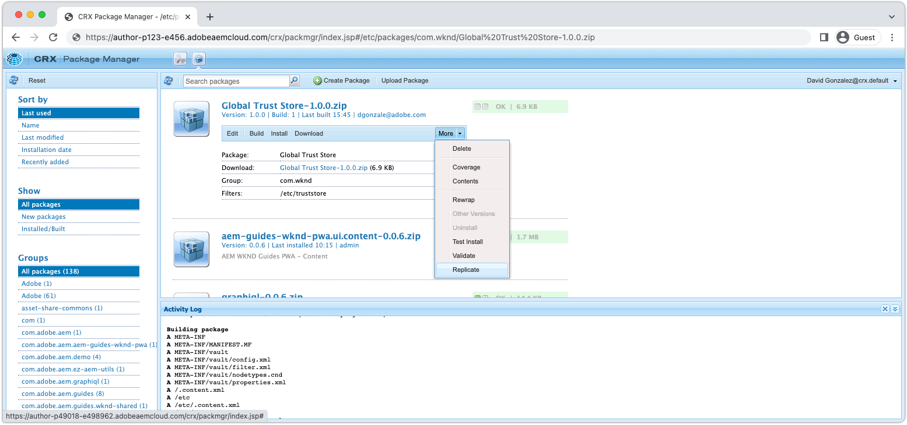
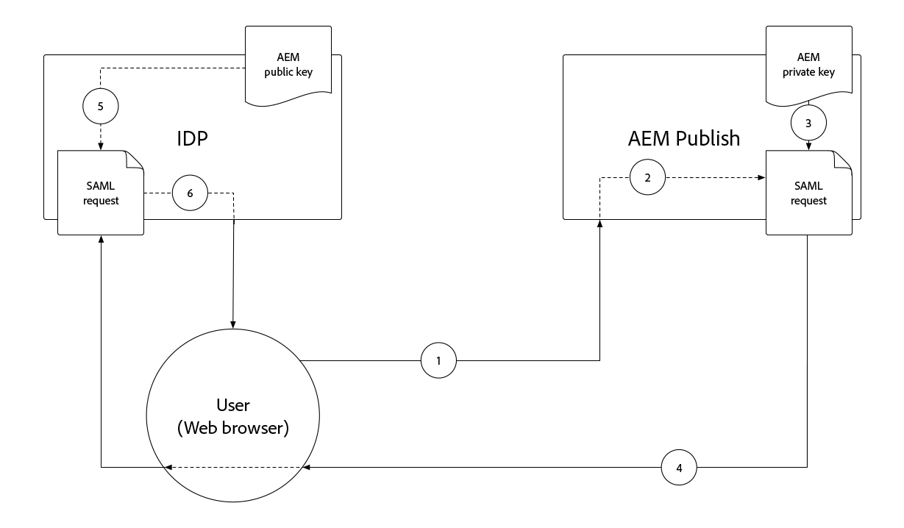

# Autenticación de SAML 2.0

Aprenda a configurar y autenticar usuarios finales (no AEM autores) en un IDP compatible con SAML 2.0 de su elección.

La integración de SAML 2.0 con AEM Publish (o Vista previa) permite a los usuarios finales de una experiencia web basada en AEM autenticarse en un IDP (proveedor de identidades) que no sea de Adobe y acceder a AEM como un usuario autorizado con nombre.

|                       | AEM Author | AEM Publish |
|-----------------------|:----------:|:-----------:|
| Compatibilidad con SAML 2.0 | ✘ | ✔ |

+++ Comprensión del flujo de SAML 2.0 con AEM

El flujo típico de una integración de AEM Publish SAML es el siguiente:

1. El usuario realiza una solicitud a AEM Publish que indica que se requiere autenticación.
   + El usuario solicita un recurso protegido por CUG/ACL.
   + El usuario solicita un recurso que está sujeto a un requisito de autenticación.
   + El usuario sigue un vínculo a AEM extremo de inicio de sesión (es decir, `/system/sling/login`) que solicita explícitamente la acción de inicio de sesión.
1. AEM realiza una solicitud de autenticación al IDP, solicitando al IDP que inicie el proceso de autenticación.
1. El usuario se autentica en IDP.
   + El IDP solicita credenciales al usuario.
   + El usuario ya se ha autenticado con el IDP y no tiene que proporcionar más credenciales.
1. IDP genera una aserción SAML que contiene los datos del usuario y la firma utilizando el certificado privado del IDP.
1. IDP envía la aserción de SAML a través del POST HTTP, a través del navegador web del usuario (RESPECTIVE_PROTECTED_PATH/saml_login), a AEM Publish.
1. AEM Publish recibe la aserción SAML y valida la integridad y autenticidad de la aserción SAML mediante el certificado público de IDP.
1. AEM Publish administra el registro de usuario AEM en función de la configuración OSGi de SAML 2.0 y el contenido de la aserción SAML.
   + Crea el usuario
   + Sincroniza atributos de usuario
   + Actualiza la pertenencia a grupos de usuarios de AEM
1. AEM Publish establece la cookie `login-token` de AEM en la respuesta HTTP, que se utiliza para autenticar solicitudes posteriores en AEM Publish.
1. AEM Publish redirige al usuario a la dirección URL en AEM Publish, tal y como se especifica en la cookie `saml_request_path`.

+++

## Descripción de la configuración

>[!VIDEO](https://video.tv.adobe.com/v/343040?quality=12&learn=on)

En este vídeo se explica cómo configurar la integración de SAML 2.0 con AEM como servicio de Publish de Cloud Service y cómo usar Okta como IDP.

## Requisitos previos

Se requiere lo siguiente al configurar la autenticación SAML 2.0:

+ Acceso del administrador de implementación a Cloud Manager
+ Acceso de administrador de AEM al entorno de AEM as a Cloud Service
+ Acceso de administrador al IDP
+ Opcionalmente, acceso a un par de claves pública y privada utilizado para cifrar cargas SAML
+ Páginas de AEM Sites (o árboles de páginas), publicadas en AEM Publish y [protegidas por grupos de usuarios cerrados (CUG)](https://experienceleague.adobe.com/es/docs/experience-manager-cloud-service/content/sites/authoring/sites-console/page-properties#permissions)

SAML 2.0 solo se admite para autenticar usuarios en AEM Publish o Preview. Para administrar la autenticación del autor de AEM que usa y IDP, [integre el IDP con Adobe IMS](https://helpx.adobe.com/es/enterprise/using/set-up-identity.html).

### Compatibilidad con el servicio Vista previa de AEM as a Cloud Service

SAML 2.0 es compatible con AEM as a Cloud Service, incluida la vista previa de AEM. Sin embargo, las configuraciones de SAML en AEM dependen de las configuraciones de OSGi, y tanto la Vista previa de AEM como la Publicación de AEM comparten la misma resolución del modo de ejecución OSGi (`config.publish`). Como resultado, no se pueden crear archivos de configuración SAML independientes para Vista previa y Publicación.

En su lugar, use [valores de configuración específicos del entorno](https://experienceleague.adobe.com/es/docs/experience-manager-cloud-service/content/implementing/deploying/configuring-osgi#environment-specific-configuration-values) en las configuraciones de OSGi y [establezca los valores de variables apropiados](https://experienceleague.adobe.com/es/docs/experience-manager-cloud-service/content/implementing/deploying/configuring-osgi#cloud-manager-api-format-for-setting-properties) para los entornos de vista previa y publicación.

## Instalación del certificado público IDP en AEM

El certificado público del IDP se añade al repositorio de confianza global de AEM y se utiliza para validar que la afirmación de SAML enviada por el IDP es válida.

+++Flujo de firma de aserción SAML


1. El usuario se autentica en IDP.
1. IDP genera una afirmación de SAML que contiene los datos del usuario.
1. IDP firma la afirmación de SAML usando el certificado privado de IDP.
1. IDP inicia un POST HTTP del lado del cliente en el extremo SAML de AEM Publish (`.../saml_login`) que incluye la afirmación de SAML firmada.
1. AEM Publish recibe el POST HTTP que contiene la afirmación de SAML firmada, puede validar la firma mediante el certificado público IDP.

+++


1. Obtenga el archivo de __certificado público__ del IDP. Este certificado AEM permite validar la aserción de SAML proporcionada a AEM por el IDP.

   El certificado está en formato PEM y debe tener el siguiente aspecto:

   ```
   -----BEGIN CERTIFICATE-----
   MIIC4jCBAcoCCQC33wnybT5QZDANBgkqhkiG9w0BAQsFADAyMQswCQYDVQQGEwJV
   ...
   m0eo2USlSRTVl7QHRTuiuSThHpLKQQ==
   -----END CERTIFICATE-----
   ```

1. Inicie sesión en AEM Author como administrador de AEM.
1. Vaya a __Herramientas > Seguridad > Almacén de confianza__.
1. Cree o abra el Almacén de confianza global. Si crea un almacén de confianza global, almacene la contraseña en un lugar seguro.
1. Expanda __Agregar certificado desde archivo CER__.
1. Seleccione __Seleccionar archivo de certificado__ y cargue el archivo de certificado proporcionado por el IDP.
1. Deje __Asignar certificado al usuario__ en blanco.
1. Seleccione __Enviar__.
1. El certificado recién agregado aparece encima de la sección __Agregar certificado del archivo CRT__.
1. Anote el __alias__, ya que este valor se usa en la configuración OSGi del [Controlador de autenticación de SAML 2.0](#saml-2-0-authentication-handler-osgi-configuration).
1. Seleccione __Guardar y cerrar__.

El almacén de confianza global está configurado con el certificado público del IDP en AEM autor, pero como SAML solo se utiliza en AEM Publish, el almacén de confianza global debe replicarse en AEM Publish para que se pueda acceder allí al certificado público de IDP.



1. Vaya a __Herramientas > Implementación > Paquetes__.
1. Creación de un paquete
   + Nombre del paquete: `Global Trust Store`
   + Versión: `1.0.0`
   + Grupo: `com.your.company`
1. Edite el nuevo paquete de __Almacén de confianza global__.
1. Seleccione la ficha __Filtros__ y agregue un filtro para la ruta raíz `/etc/truststore`.
1. Seleccione __Hecho__ y, a continuación, __Guardar__.
1. Seleccione el botón __Build__ para el paquete __Global Trust Store__.
1. Una vez generado, seleccione __Más__ > __Replicar__ para activar el nodo Almacén de confianza global (`/etc/truststore`) en AEM Publish.

## Crear almacén de claves del servicio de autenticación{#authentication-service-keystore}

_Es necesario crear un almacén de claves para el servicio de autenticación cuando la propiedad de configuración OSGi del controlador de autenticación [SAML 2.0 `handleLogout` está establecida en `true`](#saml-20-authenticationsaml-2-0-authentication) o cuando se requiere [cifrado de firma AuthnRequest/aserción SAML](#install-aem-public-private-key-pair)_

1. Inicie sesión en AEM autor como administrador de AEM para cargar la clave privada.
1. Vaya a __Herramientas > Seguridad > Usuarios__, seleccione el usuario __authentication-service__ y elija __Propiedades__ en la barra de acciones superior.
1. Seleccione la ficha __Almacén de claves__.
1. Cree o abra el almacén de claves. Si crea un almacén de claves, mantenga la contraseña a salvo.
   + Un almacén de claves [público/privado está instalado en este almacén de claves](#install-aem-public-private-key-pair) solo si se requiere cifrado de firma AuthnRequest/aserción SAML.
   + Si esta integración de SAML admite el cierre de sesión, pero no la firma AuthnRequest/aserción SAML, basta con un almacén de claves vacío.
1. Seleccione __Guardar y cerrar__.
1. Cree un paquete que contenga el usuario __authentication-service__ actualizado.

   _Usar la siguiente solución temporal mediante paquetes :_

   1. Vaya a __Herramientas > Implementación > Paquetes__.
   1. Creación de un paquete
      + Nombre del paquete: `Authentication Service`
      + Versión: `1.0.0`
      + Grupo: `com.your.company`
   1. Edite el nuevo paquete __Authentication Service Key Store__.
   1. Seleccione la ficha __Filtros__ y agregue un filtro para la ruta raíz `/home/users/system/cq:services/internal/security/<AUTHENTICATION SERVICE UUID>/keystore`.
      + Para encontrar `<AUTHENTICATION SERVICE UUID>`, vaya a __Herramientas > Seguridad > Usuarios__ y seleccione el usuario __authentication-service__. El UUID es la última parte de la dirección URL.
   1. Seleccione __Listo__ y luego __Guardar__.
   1. Seleccione el botón __Generar__ para el paquete de __Almacenamiento de claves del servicio de autenticación__.
   1. Una vez compilado, seleccione __Más__ > __Replicar__ para activar el almacén de claves del servicio de autenticación en AEM Publish.

## Instalación del par de claves pública y privada de AEM{#install-aem-public-private-key-pair}

_La instalación del par de claves pública y privada de AEM es opcional_

AEM Publish se puede configurar para firmar solicitudes de autenticación (a IDP) y cifrar aserciones de SAML (a AEM). Esto se logra proporcionando una clave privada a AEM Publish y haciendo coincidir la clave pública con el IDP.

+++ Comprender el flujo de firma de AuthnRequest (opcional)

AuthnRequest (la solicitud al IDP desde AEM Publish que inicia el proceso de inicio de sesión) puede firmarla AEM Publish. Para ello, AEM Publish firma AuthnRequest con la clave privada, de modo que el IDP valide la firma con la clave pública. Esto garantiza al IDP que AuthnRequest se inició y fue solicitado por AEM Publish, y no por un tercero malicioso.



1. El usuario realiza una solicitud HTTP a AEM Publish que resulta en una solicitud de autenticación SAML al IDP.
1. AEM Publish genera la solicitud SAML para enviarla al IDP.
1. AEM Publish firma la solicitud SAML con la clave privada de AEM.
1. AEM Publish inicia AuthnRequest, un redireccionamiento del lado del cliente HTTP al IDP que contiene la solicitud SAML firmada.
1. IDP recibe la AuthnRequest y valida la firma con la clave pública de AEM, lo que garantiza que AEM Publish inició la AuthnRequest.
1. AEM Publish valida la integridad y autenticidad de la aserción SAML descifrada mediante el certificado público de IDP.

+++

+++ Descripción del flujo de cifrado de aserciones de SAML (opcional)

Todas las comunicaciones HTTP entre IDP y AEM Publish deben ser a través de HTTPS y, por lo tanto, seguras de forma predeterminada. Sin embargo, según sea necesario, las afirmaciones de SAML pueden cifrarse en el caso de que se requiera confidencialidad adicional además de la proporcionada por HTTPS. Para ello, el IDP cifra los datos de aserción de SAML utilizando la clave privada y AEM Publish descifra la aserción de SAML utilizando la clave privada.


1. El usuario se autentica en IDP.
1. IDP genera una aserción SAML que contiene los datos del usuario y la firma utilizando el certificado privado del IDP.
1. A continuación, IDP cifra la aserción de SAML con AEM clave pública, que requiere la clave privada AEM para descifrarla.
1. La afirmación de SAML cifrada se envía a AEM Publish a través del explorador web del usuario.
1. AEM Publish recibe la afirmación de SAML y la descifra utilizando la clave privada de AEM.
1. IDP solicita al usuario que se autentique.

+++

Tanto la firma AuthnRequest como el cifrado de aserciones SAML son opcionales; sin embargo, ambos están habilitados mediante la propiedad de configuración OSGi del controlador de autenticación [SAML 2.0 `useEncryption`](#saml-20-authenticationsaml-2-0-authentication), lo que significa que ambos o ninguno se pueden usar.


1. Obtenga la clave pública, la clave privada (PKCS#8 en formato DER) y el archivo de cadena de certificados (puede ser la clave pública) que se utiliza para firmar AuthnRequest y cifrar la aserción SAML. Normalmente, las claves las proporciona el equipo de seguridad de la organización de TI.

   + Se puede generar un par de claves autofirmadas mediante __openssl__:

   ```
   $ openssl req -x509 -sha256 -days 365 -newkey rsa:4096 -keyout aem-private.key -out aem-public.crt
   
   # Provide a password (keep in safe place), and other requested certificate information
   
   # Convert the keys to AEM's required format 
   $ openssl rsa -in aem-private.key -outform der -out aem-private.der
   $ openssl pkcs8 -topk8 -inform der -nocrypt -in aem-private.der -outform der -out aem-private-pkcs8.der
   ```

1. Cargue la clave pública del IDP.
   + Utilizando el método `openssl` anterior, la clave pública es el archivo `aem-public.crt`.
1. Inicie sesión en AEM Author como administrador de AEM para cargar la clave privada.
1. Vaya a __Herramientas > Seguridad > Almacén de confianza__, seleccione el usuario __servicio de autenticación__ y seleccione __Propiedades__ en la barra de acciones superior.
1. Vaya a __Herramientas > Seguridad > Usuarios__, seleccione el usuario __authentication-service__ y seleccione __Propiedades__ en la barra de acciones superior.
1. Seleccione la pestaña __Keystore__.
1. Cree o abra el almacén de claves. Si crea un almacén de claves, mantenga la contraseña a salvo.
1. Seleccione __Agregar clave privada desde el archivo DER__ y agregue la clave privada y el archivo de cadena a AEM:
   + __Alias__: proporcione un nombre significativo, a menudo el nombre del IDP.
   + __Archivo de clave privada__: cargue el archivo de clave privada (PKCS#8 en formato DER).
      + Utilizando el método `openssl` anterior, este es el archivo `aem-private-pkcs8.der`
   + __Seleccionar archivo de cadena de certificados__: cargue el archivo de cadena adjunto (puede ser la clave pública).
      + Utilizando el método `openssl` anterior, este es el archivo `aem-public.crt`
   + Seleccionar __Enviar__
1. El certificado recién agregado aparece encima de la sección __Agregar certificado del archivo CRT__.
   + Tome nota del __alias__, ya que se utiliza en la [configuración OSGi del controlador de autenticación SAML 2.0](#saml-20-authentication-handler-osgi-configuration)
1. Seleccione __Guardar y cerrar__.
1. Cree un paquete que contenga el usuario __Authentication-service__ actualizado.

   _Usar la siguiente solución temporal mediante paquetes :_

   1. Vaya a __Herramientas > Implementación > Paquetes__.
   1. Creación de un paquete
      + Nombre del paquete: `Authentication Service`
      + Versión: `1.0.0`
      + Grupo: `com.your.company`
   1. Edite el nuevo paquete __Authentication Service Key Store__.
   1. Seleccione la ficha __Filtros__ y agregue un filtro para la ruta raíz `/home/users/system/cq:services/internal/security/<AUTHENTICATION SERVICE UUID>/keystore`.
      + Se puede encontrar `<AUTHENTICATION SERVICE UUID>` navegando a __Herramientas > Seguridad > Usuarios__ y seleccionando el usuario __servicio de autenticación__. El UUID es la última parte de la URL.
   1. Seleccione __Listo__ y luego __Guardar__.
   1. Seleccione el botón __Generar__ para el paquete de __Almacenamiento de claves del servicio de autenticación__.
   1. Una vez compilado, seleccione __Más__ > __Replicar__ para activar el almacén de claves del servicio de autenticación en AEM Publish.

## Configurar el controlador de autenticación SAML 2.0{#configure-saml-2-0-authentication-handler}

La configuración de SAML de AEM se realiza a través de la configuración OSGi __Controlador de autenticación Adobe Granite SAML 2.0__.
La configuración es una configuración de fábrica de OSGi, lo que significa que un solo servicio de publicación de AEM as a Cloud Service puede tener varias configuraciones de SAML que cubran árboles de recursos discretos del repositorio; esto resulta útil para implementaciones de AEM de varios sitios.

+++ Glosario de configuración OSGi del Controlador de autenticación SAML 2.0

### Configuración OSGi del Controlador de autenticación SAML 2.0 de Adobe Granite{#configure-saml-2-0-authentication-handler-osgi-configuration}

|                                   | Propiedad OSGi | Necesario | Formato de valor | Valor predeterminado | Descripción |
|-----------------------------------|-------------------------------|:--------:|:---------------------:|---------------------------|-------------|
| Rutas | `path` | ✔ | Matriz de cadenas | `/` | Rutas de AEM para las que se utiliza este controlador de autenticación. |
| URL de IDP | `idpUrl` | ✔ | Cadena |                           | URL de IDP: se envía la solicitud de autenticación de SAML. |
| Alias de certificado de IDP | `idpCertAlias` | ✔ | Cadena |                           | Alias del certificado IDP encontrado en el repositorio de confianza global de AEM |
| Redirección HTTP de IDP | `idpHttpRedirect` | ✘ | Booleano | `false` | Indica si hay una redirección HTTP a la dirección URL de IDP en lugar de enviar una solicitud AuthnRequest. Establecido en `true` para la autenticación iniciada por IDP. |
| Identificador de IDP | `idpIdentifier` | ✘ | Cadena |                           | ID de IDP único para garantizar la exclusividad de usuarios y grupos de AEM. Si está vacío, se utiliza `serviceProviderEntityId` en su lugar. |
| URL de servicio de consumidor de aserción | `assertionConsumerServiceURL` | ✘ | Cadena |                           | Atributo de URL `AssertionConsumerServiceURL` en AuthnRequest que especifica dónde se debe enviar el mensaje `<Response>` a AEM. |
| ID de entidad de SP | `serviceProviderEntityId` | ✔ | Cadena |                           | Identifica de forma exclusiva a AEM con el IDP; normalmente es el nombre de host de AEM. |
| Cifrado SP | `useEncryption` | ✘ | Booleano | `true` | Indica si el IDP cifra las afirmaciones de SAML. Requiere que se establezcan `spPrivateKeyAlias` y `keyStorePassword`. |
| Alias de clave privada SP | `spPrivateKeyAlias` | ✘ | Cadena |                           | Alias de la clave privada en el almacén de claves del usuario `authentication-service`. Obligatorio si `useEncryption` está establecido en `true`. |
| Contraseña de almacenamiento de claves SP | `keyStorePassword` | ✘ | Cadena |                           | La contraseña del almacén de claves del usuario de &#39;authentication-service&#39;. Obligatorio si `useEncryption` está establecido en `true`. |
| Redirección predeterminada | `defaultRedirectUrl` | ✘ | Cadena | `/` | La URL de redireccionamiento predeterminada después de la autenticación correcta. Puede ser relativo al host de AEM (por ejemplo, `/content/wknd/us/en/html`). |
| Atributo de ID de usuario | `userIDAttribute` | ✘ | Cadena | `uid` | Nombre del atributo de afirmación de SAML que contiene el ID de usuario del usuario de AEM. Dejar vacío para utilizar `Subject:NameId`. |
| Crear automáticamente usuarios de AEM | `createUser` | ✘ | Booleano | `true` | Indica si los usuarios de AEM se crean con una autenticación correcta. |
| ruta intermedia de usuario AEM | `userIntermediatePath` | ✘ | Cadena |                           | Al crear usuarios de AEM, este valor se utiliza como ruta de acceso intermedia (por ejemplo, `/home/users/<userIntermediatePath>/jane@wknd.com`). Requiere que `createUser` se establezca en `true`. |
| atributos de usuario de AEM | `synchronizeAttributes` | ✘ | Matriz de cadena |                           | Lista de asignaciones de atributos SAML que se almacenarán en el usuario de AEM, con el formato `[ "saml-attribute-name=path/relative/to/user/node" ]` (por ejemplo, `[ "firstName=profile/givenName" ]`). Ver la [lista completa de atributos nativos de AEM](#aem-user-attributes). |
| Añadir usuario a grupos de AEM | `addGroupMemberships` | ✘ | Booleano | `true` | Indica si se agrega automáticamente un usuario de AEM a los grupos de usuarios de AEM después de la autenticación correcta. |
| atributo de pertenencia a grupo de AEM | `groupMembershipAttribute` | ✘ | Cadena | `groupMembership` | Nombre del atributo de afirmación de SAML que contiene una lista de grupos de usuarios de AEM a los que se debe agregar el usuario. Requiere que `addGroupMemberships` se establezca en `true`. |
| Grupos de AEM predeterminados | `defaultGroups` | ✘ | Matriz de cadenas |                           | Siempre se agrega una lista de usuarios autenticados de grupos de usuarios de AEM a (por ejemplo, `[ "wknd-user" ]`). Requiere que `addGroupMemberships` se establezca en `true`. |
| Formato de directiva de IDP de nombre | `nameIdFormat` | ✘ | Cadena | `urn:oasis:names:tc:SAML:2.0:nameid-format:transient` | Valor del parámetro de formato NameIDPolicy que se enviará en el mensaje AuthnRequest. |
| Almacenar respuesta de SAML | `storeSAMLResponse` | ✘ | Booleano | `false` | Indica si el valor `samlResponse` está almacenado en el nodo AEM `cq:User`. |
| Cierre de sesión del control | `handleLogout` | ✘ | Booleano | `false` | Indica si este controlador de autenticación SAML administra la solicitud de cierre de sesión. Requiere que se establezca `logoutUrl`. |
| URL de desconexión | `logoutUrl` | ✘ | Cadena |                           | URL de IDP a la que se envía la solicitud de cierre de sesión de SAML. Obligatorio si `handleLogout` está establecido en `true`. |
| Tolerancia del reloj | `clockTolerance` | ✘ | Entero | `60` | La tolerancia de sesgo de reloj de IDP y AEM (SP) al validar afirmaciones de SAML. |
| Método de resumen | `digestMethod` | ✘ | Cadena | `http://www.w3.org/2001/04/xmlenc#sha256` | Algoritmo de resumen que utiliza el IDP al firmar un mensaje SAML. |
| Método de firma | `signatureMethod` | ✘ | Cadena | `http://www.w3.org/2001/04/xmldsig-more#rsa-sha256` | Algoritmo de firma que utiliza el IDP al firmar un mensaje SAML. |
| Tipo de sincronización de identidad | `identitySyncType` | ✘ | `default` o `idp` | `default` | No cambie el valor predeterminado `from` para AEM as a Cloud Service. |
| Clasificación del servicio | `service.ranking` | ✘ | Entero | `5002` | Se prefieren configuraciones de clasificación más alta para el mismo `path`. |

### Atributos de usuario de AEM{#aem-user-attributes}

AEM utiliza los siguientes atributos de usuario, que se pueden rellenar mediante la propiedad `synchronizeAttributes` en la configuración OSGi del Controlador de autenticación SAML 2.0 de Adobe Granite.  Cualquier atributo IDP se puede sincronizar con cualquier propiedad de usuario de AEM, pero la asignación a las propiedades de atributo de uso de AEM (enumeradas a continuación) permite que AEM los utilice de forma natural.

| Atributo de usuario | Ruta de acceso de propiedad relativa del nodo `rep:User` |
|--------------------------------|--------------------------|
| Título (por ejemplo, `Mrs`) | `profile/title` |
| Nombre dado (es decir, nombre) | `profile/givenName` |
| Apellido (es decir, apellido) | `profile/familyName` |
| Título de trabajo | `profile/jobTitle` |
| Dirección de correo electrónico | `profile/email` |
| Dirección | `profile/street` |
| Ciudad | `profile/city` |
| Código postal | `profile/postalCode` |
| País | `profile/country` |
| Número de teléfono | `profile/phoneNumber` |
| Acerca de mí | `profile/aboutMe` |

+++

1. Cree un archivo de configuración OSGi en el proyecto en `/ui.config/src/main/content/jcr_root/wknd-examples/osgiconfig/config.publish/com.adobe.granite.auth.saml.SamlAuthenticationHandler~saml.cfg.json` y abra en su IDE.
   + Cambiar `/wknd-examples/` a `/<project name>/`
   + El identificador después de `~` en el nombre del archivo debe identificar esta configuración de forma única, por lo que puede ser el nombre del IDP, como `...~okta.cfg.json`. El valor debe ser alfanumérico con guiones.
1. Pegue el siguiente JSON en el archivo `com.adobe.granite.auth.saml.SamlAuthenticationHandler~...cfg.json` y actualice las referencias `wknd` según sea necesario.

   ```json
   {
       "path": [ "/content/wknd", "/content/dam/wknd" ], 
       "idpCertAlias": "$[env:SAML_IDP_CERT_ALIAS;default=certalias___1652125559800]",
       "idpIdentifier": "$[env:SAML_IDP_ID;default=http://www.okta.com/exk4z55r44Jz9C6am5d7]",
       "idpUrl": "$[env:SAML_IDP_URL;default=https://dev-5511372.okta.com/app/dev-5511372_aemasacloudservice_1/exk4z55r44Jz9C6am5d7/sso/saml]",
       "serviceProviderEntityId": "$[env:SAML_AEM_ID;default=https://publish-p123-e456.adobeaemcloud.com]",
       "useEncryption": false,
       "createUser": true,
       "userIntermediatePath": "wknd/idp",
       "synchronizeAttributes":[
           "firstName=profile/givenName"
       ],
       "addGroupMemberships": true,
       "defaultGroups": [ 
           "wknd-users"
       ]
   }
   ```

1. Actualice los valores según lo requiera el proyecto. Consulte el __glosario de configuración de OSGi del controlador de autenticación SAML 2.0__ anterior para obtener descripciones de propiedades de configuración. `path` debe contener los árboles de contenido protegidos por Grupos de usuarios cerrados (CUG) y requerir autenticación. Este controlador de autenticación debe ser responsable de proteger.
1. Se recomienda, pero no es obligatorio, utilizar variables y secretos de entorno OSGi, cuando los valores pueden cambiar sin estar sincronizados con el ciclo de lanzamiento o cuando los valores difieren entre tipos de entorno/niveles de servicio similares. Los valores predeterminados se pueden establecer con la sintaxis `$[env:..;default=the-default-value]"`, como se muestra arriba.

Las configuraciones de OSGi por entorno (`config.publish.dev`, `config.publish.stage` y `config.publish.prod`) se pueden definir con atributos específicos si la configuración de SAML varía entre entornos.

### Usar cifrado

Al [cifrar AuthnRequest y la aserción SAML](#encrypting-the-authnrequest-and-saml-assertion), se requieren las siguientes propiedades: `useEncryption`, `spPrivateKeyAlias` y `keyStorePassword`. El `keyStorePassword` contiene una contraseña; por lo tanto, el valor no debe almacenarse en el archivo de configuración OSGi, sino insertarse usando [valores de configuración secretos](https://experienceleague.adobe.com/docs/experience-manager-cloud-service/content/implementing/deploying/configuring-osgi.html?lang=es#secret-configuration-values)

+++Opcionalmente, actualice la configuración OSGi para utilizar el cifrado

1. Abra `/ui.config/src/main/content/jcr_root/wknd-examples/osgiconfig/config.publish/com.adobe.granite.auth.saml.SamlAuthenticationHandler~saml.cfg.json` en su IDE.
1. Agregue las tres propiedades `useEncryption`, `spPrivateKeyAlias` y `keyStorePassword` como se muestra a continuación.

   ```json
   {
   "path": [ "/content/wknd", "/content/dam/wknd" ], 
   "idpCertAlias": "$[env:SAML_IDP_CERT_ALIAS;default=certalias___1234567890]",
   "idpIdentifier": "$[env:SAML_IDP_ID;default=http://www.okta.com/abcdef1235678]",
   "idpUrl": "$[env:SAML_IDP_URL;default=https://dev-5511372.okta.com/app/dev-123567890_aemasacloudservice_1/abcdef1235678/sso/saml]",
   "serviceProviderEntityId": "$[env:SAML_AEM_ID;default=https://publish-p123-e456.adobeaemcloud.com]",
   "useEncryption": true,
   "spPrivateKeyAlias": "$[env:SAML_AEM_KEYSTORE_ALIAS;default=aem-saml-encryption]",
   "keyStorePassword": "$[secret:SAML_AEM_KEYSTORE_PASSWORD]",
   "createUser": true,
   "userIntermediatePath": "wknd/idp"
   "synchronizeAttributes":[
       "firstName=profile/givenName"
   ],
   "addGroupMemberships": true,
   "defaultGroups": [ 
       "wknd-users"
   ]
   }
   ```

1. Las tres propiedades de configuración OSGi necesarias para el cifrado son:

+ `useEncryption` se estableció en `true`
+ `spPrivateKeyAlias` contiene el alias de entrada del almacén de claves para la clave privada utilizada por la integración de SAML.
+ `keyStorePassword` contiene una [variable de configuración secreta OSGi](https://experienceleague.adobe.com/docs/experience-manager-cloud-service/content/implementing/deploying/configuring-osgi.html?lang=es#secret-configuration-values) que contiene la contraseña del almacén de claves de usuario `authentication-service`.

+++

## Configurar el filtro de referente

Durante el proceso de autenticación SAML, el IDP inicia un POST HTTP del lado del cliente en el punto final `.../saml_login` de AEM Publish. Si el IDP y AEM Publish existen en un origen diferente, el __Filtro de referente__ de AEM Publish se configura mediante la configuración OSGi para permitir HTTP POST desde el origen del IDP.

1. Cree (o edite) un archivo de configuración OSGi en su proyecto en `/ui.config/src/main/content/jcr_root/wknd-examples/osgiconfig/config.publish/org.apache.sling.security.impl.ReferrerFilter.cfg.json`.
   + Cambiar `/wknd-examples/` a `/<project name>/`
1. Asegúrese de que el valor `allow.empty` esté establecido en `true`, de que `allow.hosts` (o, si lo prefiere, `allow.hosts.regexp`) contenga el origen del IDP y de que `filter.methods` incluya `POST`. La configuración de OSGi debe ser similar a:

   ```json
   {
       "allow.empty": true,
       "allow.hosts.regexp": [ ],
       "allow.hosts": [ 
           "$[env:SAML_IDP_REFERRER;default=dev-123567890.okta.com]"
       ],
       "filter.methods": [
           "POST",
       ],
       "exclude.agents.regexp": [ ]
   }
   ```

AEM Publish admite una sola configuración de filtro de referente, por lo que debe combinar los requisitos de configuración de SAML con cualquier configuración existente.

Las configuraciones de OSGi por entorno (`config.publish.dev`, `config.publish.stage` y `config.publish.prod`) se pueden definir con atributos específicos si `allow.hosts` (o `allow.hosts.regex`) varían entre entornos.

## Configuración del intercambio de recursos de origen cruzado (CORS)

Durante el proceso de autenticación SAML, el IDP inicia un POST HTTP del lado del cliente en el punto final `.../saml_login` de AEM Publish. Si el IDP y la publicación de AEM existen en hosts/dominios diferentes, el __intercambio de recursos de origen de CRoss (CORS)__ de AEM Publish debe configurarse para permitir HTTP POST desde el host/dominio del IDP.

El encabezado `Origin` de esta solicitud HTTP POST suele tener un valor diferente al host de publicación de AEM, por lo que requiere la configuración CORS.

Al probar la autenticación SAML en AEM SDK local (`localhost:4503`), el IDP puede establecer el encabezado `Origin` en `null`. Si es así, agregue `"null"` a la lista `alloworigin`.

1. Cree un archivo de configuración OSGi en su proyecto en `/ui.config/src/main/content/jcr_root/wknd-examples/osgiconfig/config.publish/com.adobe.granite.cors.impl.CORSPolicyImpl~saml.cfg.json`
   + Cambiar `/wknd-examples/` a su nombre de proyecto
   + El identificador después de `~` en el nombre de archivo debe identificar de forma exclusiva esta configuración, por lo que puede ser el nombre del IDP, como `...CORSPolicyImpl~okta.cfg.json`. El valor debe ser alfanumérico y contener guiones.
1. Pegue el siguiente JSON en el archivo `com.adobe.granite.cors.impl.CORSPolicyImpl~...cfg.json`.

```json
{
    "alloworigin": [ 
        "$[env:SAML_IDP_ORIGIN;default=https://dev-1234567890.okta.com]", 
        "null"
    ],
    "allowedpaths": [ 
        ".*/saml_login"
    ],
    "supportedmethods": [ 
        "POST"
    ]
}
```

Las configuraciones de OSGi por entorno (`config.publish.dev`, `config.publish.stage` y `config.publish.prod`) se pueden definir con atributos específicos si `alloworigin` y `allowedpaths` varían entre entornos.

## Configuración de AEM Dispatcher para permitir HTTP POST de SAML

Después de autenticarse correctamente en el IDP, el IDP orquestará un POST HTTP de vuelta al punto final `/saml_login` registrado de AEM (configurado en el IDP). Este POST HTTP para `/saml_login` está bloqueado de forma predeterminada en Dispatcher, por lo que debe permitirse explícitamente usando la siguiente regla de Dispatcher:

1. Abra `dispatcher/src/conf.dispatcher.d/filters/filters.any` en su IDE.
1. Agregue al final del archivo una regla de permiso para POST HTTP a direcciones URL que terminen con `/saml_login`.

```
...

# Allow SAML HTTP POST to ../saml_login end points
/0190 { /type "allow" /method "POST" /url "*/saml_login" }
```

>[!NOTE]
>Cuando implemente varias configuraciones de SAML en AEM para varias rutas protegidas y diferentes puntos de conexión de IDP, asegúrese de que el IDP publique en el punto de conexión RESPECTIVE_PROTECTED_PATH/saml_login para seleccionar la configuración de SAML adecuada en el lado de AEM. Si hay configuraciones de SAML duplicadas para la misma ruta protegida, la selección de la configuración de SAML se producirá aleatoriamente.

Si está configurada la reescritura de URL en el servidor web Apache (`dispatcher/src/conf.d/rewrites/rewrite.rules`), asegúrese de que las solicitudes a los puntos finales `.../saml_login` no se manipulen accidentalmente.

## Pertenencia a grupo dinámico

La pertenencia a grupos dinámicos es una característica de [Apache Jackrabbit Oak](https://jackrabbit.apache.org/oak/docs/security/authentication/external/dynamic.html) que aumenta el rendimiento de la evaluación y el aprovisionamiento de grupos. En esta sección se describe cómo se almacenan los usuarios y grupos cuando se habilita esta función y cómo modificar la configuración del Controlador de autenticación SAML para habilitarlo para entornos nuevos o existentes.

### Cómo habilitar la pertenencia a grupos dinámicos para usuarios de SAML en nuevos entornos

Para mejorar significativamente el rendimiento de la evaluación de grupo en los nuevos entornos de AEM como Cloud Service, se recomienda activar la función de abono de grupo dinámico en los nuevos entornos.
Este paso también es necesario cuando se activa la sincronización de datos. Más detalles [aquí](https://experienceleague.adobe.com/es/docs/experience-manager-cloud-service/content/sites/authoring/personalization/user-and-group-sync-for-publish-tier) .
Para ello, añada la siguiente propiedad al archivo de configuración de OSGI:

`/apps/example/osgiconfig/config.publish/com.adobe.granite.auth.saml.SamlAuthenticationHandler~example.cfg.json`

Con esta configuración, los usuarios y grupos se crean como [usuarios externos de Oak](https://jackrabbit.apache.org/oak/docs/security/authentication/identitymanagement.html). En AEM, los usuarios y grupos externos tienen un(a) `rep:principalName` predeterminado compuesto(a) por `[user name];[idp]` o `[group name];[idp]`.
Observe que las Listas de control de acceso (ACL) están asociadas al nombre principal de los usuarios o grupos.
Al implementar esta configuración en una implementación existente en la que anteriormente `identitySyncType` no se especificaba ni se establecía en `default`, se crearán nuevos usuarios y grupos y se deberá aplicar ACL a estos nuevos usuarios y grupos. Tenga en cuenta que los grupos externos no pueden contener usuarios locales. [Repoinit](https://sling.apache.org/documentation/bundles/repository-initialization.html) se puede usar para crear ACL para grupos externos SAML, incluso si solo se crearán cuando el usuario inicie sesión.
Para evitar esta refactorización en ACL, se ha implementado una [característica de migración estándar](#automatic-migration-to-dynamic-group-membership-for-existing-environments).

### Almacenamiento de las suscripciones en grupos locales y externos con pertenencia a grupos dinámicos

En los grupos locales, los miembros del grupo se almacenan en el atributo oak: `rep:members`. El atributo contiene la lista de uid de cada miembro del grupo. Se pueden encontrar detalles adicionales [aquí](https://jackrabbit.apache.org/oak/docs/security/user/membership.html#member-representation-in-the-repository).
Ejemplo:

```
{
  "jcr:primaryType": "rep:Group",
  "rep:principalName": "operators",
  "rep:managedByIdp": "SAML",
  "rep:members": [
    "635afa1c-beeb-3262-83c4-38ea31e5549e",
    "5e496093-feb6-37e9-a2a1-7c87b1cec4b0",
    ...
  ],
   ...
}
```

Los grupos externos con pertenencia a grupo dinámico no almacenan ningún miembro en la entrada de grupo.
La pertenencia al grupo se almacena en las entradas de los usuarios. Encontrará documentación adicional [aquí](https://jackrabbit.apache.org/oak/docs/security/authentication/external/dynamic.html). Por ejemplo, este es el nodo de OAK para el grupo:

```
{
  "jcr:primaryType": "rep:Group",
  "jcr:mixinTypes": [
    "rep:AccessControllable"
  ],
  "jcr:createdBy": "",
  "jcr:created": "Tue Jul 16 2024 08:58:47 GMT+0000",
  "rep:principalName": "GROUP_1;aem-saml-idp-1",
  "rep:lastSynced": "Tue Jul 16 2024 08:58:47 GMT+0000",
  "jcr:uuid": "d9c6af8a-35c0-3064-899a-59af55455cd0",
  "rep:externalId": "GROUP_1;aem-saml-idp-1",
  "rep:authorizableId": "GROUP_1;aem-saml-idp-1"
}
```

Este es el nodo de un usuario miembro de ese grupo:

```
{
  "jcr:primaryType": "rep:User",
  "jcr:mixinTypes": [
    "rep:AccessControllable"
  ],
  "surname": "Test",
  "rep:principalName": "testUser",
  "rep:externalId": "test;aem-saml-idp-1",
  "rep:authorizableId": "test",
  "rep:externalPrincipalNames": [
    "projects-users;aem-saml-idp-1",
    "GROUP_2;aem-saml-idp-1",
    "GROUP_1;aem-saml-idp-1",
    "operators;aem-saml-idp-1"
  ],
  ...
}
```

### Habilitación de la pertenencia a grupos dinámicos para usuarios de SAML en entornos existentes

Como se explicó en la sección anterior, el formato de los usuarios y grupos externos es ligeramente diferente del utilizado para los usuarios y grupos locales. Es posible definir una nueva ACL para grupos externos y proporcionar nuevos usuarios externos, o utilizar la herramienta de migración como se describe a continuación.

#### Habilitación de la pertenencia a grupos dinámicos para los entornos existentes con usuarios externos

El controlador de autenticación SAML crea usuarios externos cuando se especifica la siguiente propiedad: `"identitySyncType": "idp"`. En este caso, se puede habilitar la pertenencia al grupo dinámico modificando esta propiedad a: `"identitySyncType": "idp_dynamic"`. No se requiere ninguna migración.

#### Migración automática a la pertenencia a grupos dinámicos para entornos existentes con usuarios locales

El controlador de autenticación SAML crea usuarios locales cuando se especifica la siguiente propiedad: `"identitySyncType": "default"`. También es el valor predeterminado cuando no se especifica la propiedad. En esta sección describimos los pasos que debe seguir el procedimiento de migración automática.

Cuando esta migración está habilitada, se realiza durante la autenticación del usuario y consiste en los siguientes pasos:
1. El usuario local se migra a un usuario externo mientras se mantiene el nombre de usuario original. Esto implica que los usuarios locales migrados, que ahora actúan como usuarios externos, conservan su nombre de usuario original en lugar de seguir la sintaxis de nomenclatura mencionada en la sección anterior. Se agregará una propiedad adicional llamada: `rep:externalId` con el valor de `[user name];[idp]`. No se modificó el usuario `PrincipalName`.
2. Para cada grupo externo recibido en la aserción SAML, se crea un grupo externo. Si existe un grupo local correspondiente, el grupo externo se agrega al grupo local como miembro.
3. El usuario se agrega como miembro del grupo externo.
4. A continuación, el usuario local se elimina de todos los grupos locales de Saml a los que era miembro. La propiedad OAK identifica los grupos locales de muestra: `rep:managedByIdp`. El controlador de autenticación Saml establece esta propiedad cuando el atributo `syncType` no se especifica o no se establece en `default`.

Por ejemplo, si antes de la migración `user1` es un usuario local y un miembro del grupo local `group1`, después de la migración se producirán los siguientes cambios:
`user1` se convierte en un usuario externo. El atributo `rep:externalId` se agrega a este perfil.
`user1` se convierte en miembro del grupo externo: `group1;idp`
`user1` ya no es un miembro directo del grupo local: `group1`
`group1;idp` es miembro del grupo local: `group1`.
`user1` es entonces miembro del grupo local: `group1` a través de la herencia

La pertenencia a grupos para grupos externos se almacena en el perfil de usuario de la propiedad `rep:externalPrincipalNames`

### Configuración de la migración automática a la pertenencia a grupos dinámicos

1. Habilite la propiedad `"identitySyncType": "idp_dynamic_simplified_id"` en el archivo de configuración OSGi de SAML: `com.adobe.granite.auth.saml.SamlAuthenticationHandler~...cfg.json` :
2. Configure el nuevo servicio OSGi con el PID de fábrica que comienza por: `com.adobe.granite.auth.saml.migration.SamlDynamicGroupMembershipMigration~`. Por ejemplo, un PID puede ser: `com.adobe.granite.auth.saml.migration.SamlDynamicGroupMembershipMigration~myIdP`. Establezca la siguiente propiedad:

```
{
  "idpIdentifier": "<value of IDP Identifier (idpIdentifier)" property from the "com.adobe.granite.auth.saml.SamlAuthenticationHandler" configuration to be migrated>"
}
```

Para migrar varias configuraciones de SAML, se deben crear varias configuraciones de fábrica de OSGi para `com.adobe.granite.auth.saml.migration.SamlDynamicGroupMembershipMigration`, cada una de las cuales especifique un `idpIdentifier` para migrar.

## Enlaces de inicio de sesión personalizados SAML

Para casos de uso avanzados, AEM admite el desarrollo de vínculos de inicio de sesión SAML personalizados, que son servicios OSGi que implementan la interfaz `com.adobe.granite.auth.saml.SamlLoginHook`. Estos vínculos se ejecutan durante el proceso de autenticación SAML y se pueden utilizar para implementar lógica personalizada, como aprovisionamiento de usuarios adicional o registro personalizado.

Para obtener más información sobre cómo desarrollar y registrar un gancho de inicio de sesión SAML personalizado, consulte la documentación de [Gancho de inicio de sesión SAML personalizado](https://experienceleague.adobe.com/docs/experience-manager-cloud-service/content/implementing/developing/custom-saml-login-hook.html).

## Implementación de la configuración SAML

Las configuraciones de OSGi deben enviarse a Git e implementarse en AEM as a Cloud Service mediante Cloud Manager.

```
$ git remote -v            
adobe   https://git.cloudmanager.adobe.com/myOrg/myCloudManagerGit/ (fetch)
adobe   https://git.cloudmanager.adobe.com/myOrg/myCloudManagerGit/ (push)
$ git add .
$ git commit -m "SAML 2.0 configurations"
$ git push adobe saml-auth:develop
```

Implemente la rama de Git de Cloud Manager de destino (en este ejemplo, `develop`) mediante una canalización de implementación de pila completa.

## Invocación de la autenticación SAML

El flujo de autenticación SAML se puede invocar desde una página web del sitio de AEM, creando vínculos especialmente diseñados o botones. Los parámetros que se describen a continuación se pueden configurar mediante programación según sea necesario, por ejemplo, un botón de inicio de sesión puede establecer `saml_request_path`, que es donde se lleva al usuario tras la autenticación SAML correcta, en diferentes páginas de AEM, según el contexto del botón.

## Almacenamiento en caché seguro mientras se usa SAML

En la instancia de publicación de AEM, la mayoría de las páginas se almacenan generalmente en caché. Sin embargo, para las rutas protegidas con SAML, el almacenamiento en caché debe deshabilitarse o el almacenamiento en caché seguro debe habilitarse mediante la configuración auth_checker. Para obtener más información, consulte los detalles proporcionados [aquí](https://experienceleague.adobe.com/es/docs/experience-manager-dispatcher/using/configuring/permissions-cache)

Tenga en cuenta que si almacena en caché rutas protegidas sin habilitar el auth_checker, puede experimentar un comportamiento impredecible.

### petición GET

La autenticación SAML se puede invocar creando una petición HTTP GET con el formato:

`HTTP GET /system/sling/login`

y proporcionando parámetros de consulta:

| Nombre del parámetro de consulta | Valor del parámetro de consulta |
|----------------------|-----------------------|
| `resource` | Cualquier ruta JCR, o subruta, que sea la escucha del controlador de autenticación SAML, tal como se define en la propiedad [OSGi del controlador de autenticación SAML 2.0 de Adobe Granite de la configuración &#x200B;](#configure-saml-2-0-authentication-handler) `path`. |
| `saml_request_path` | La ruta URL a la que debe dirigirse el usuario después de autenticarse correctamente en SAML. |

Por ejemplo, este vínculo de HTML almacenará en déclencheur el flujo de inicio de sesión de SAML y, una vez realizado correctamente, llevará al usuario a `/content/wknd/us/en/protected/page.html`. Estos parámetros de consulta se pueden establecer mediante programación según sea necesario.

```html
<a href="/system/sling/login?resource=/content/wknd&saml_request_path=/content/wknd/us/en/protected/page.html">
    Log in using SAML
</a>
```

## solicitud del POST

La autenticación SAML se puede invocar creando una solicitud de POST HTTP con el formato:

`HTTP POST /system/sling/login`

y proporcionar los datos del formulario:

| Nombre de datos de formulario | Valor de datos de formulario |
|----------------------|-----------------------|
| `resource` | Cualquier ruta JCR, o subruta, que sea la escucha del controlador de autenticación SAML, tal como se define en la propiedad [OSGi del controlador de autenticación SAML 2.0 de Adobe Granite de la configuración &#x200B;](#configure-saml-2-0-authentication-handler) `path`. |
| `saml_request_path` | La ruta URL a la que debe dirigirse el usuario después de autenticarse correctamente en SAML. |


Por ejemplo, este botón de HTML utilizará un POST HTTP para almacenar en déclencheur el flujo de inicio de sesión de SAML y, una vez realizado correctamente, llevar al usuario a `/content/wknd/us/en/protected/page.html`. Estos parámetros de datos de formulario se pueden definir mediante programación según sea necesario.

```html
<form action="/system/sling/login" method="POST">
    <input type="hidden" name="resource" value="/content/wknd">
    <input type="hidden" name="saml_request_path" value="/content/wknd/us/en/protected/page.html">
    <input type="submit" value="Log in using SAML">
</form>
```

### Configuración de Dispatcher

Tanto el método HTTP GET como el método POST requieren acceso de cliente a los extremos `/system/sling/login` de AEM y, por lo tanto, se deben permitir a través de AEM Dispatcher.

Permitir los patrones de URL necesarios en función de si se utiliza GET o POST

```
# Allow GET-based SAML authentication invocation
/0191 { /type "allow" /method "GET" /url "/system/sling/login" /query "*" }

# Allow POST-based SAML authentication invocation
/0192 { /type "allow" /method "POST" /url "/system/sling/login" }
```
