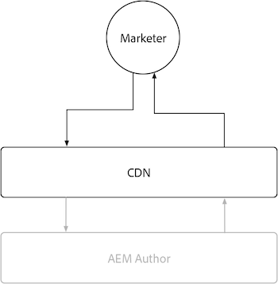

# AEM Author

AEM El autor tiene un almacenamiento en caché limitado debido a la naturaleza altamente dinámica y sensible a permisos del contenido que sirve. AEM En general, no se recomienda personalizar el almacenamiento en caché para el autor de la y, en su lugar, basarse en las configuraciones de caché proporcionadas por la Adobe para garantizar un buen rendimiento de la experiencia.

{align="center"}

AEM AEM Aunque se desaconseja personalizar el almacenamiento en caché en el Autor de la, resulta útil saber que el Autor tiene una CDN administrada por el Adobe AEM, pero no tiene un Dispatcher de la. AEM AEM AEM Recuerde que todas las configuraciones de Dispatcher de la se ignoran en Author, ya que no tiene un Dispatcher de la.

## La red de distribución de contenido (CDN)

AEM El servicio de creación de informes utiliza una CDN, pero su propósito es mejorar la entrega de recursos de productos y no debe configurarse exhaustivamente para permitir que funcione tal cual.

{align="center"}

AEM AEM La red de distribución de contenido (CDN) de autor de la se encuentra entre el usuario final, normalmente un experto en marketing o autor de contenido, y el autor de la. AEM Almacena en caché archivos inmutables, como recursos estáticos que alimentan la experiencia de creación de la, y no contenido creado.

AEM La CDN del autor no almacena en caché varios tipos de recursos que pueden ser de interés, como un [TTL personalizable en consultas persistentes](https://experienceleague.adobe.com/docs/experience-manager-cloud-service/content/headless/graphql-api/persisted-queries.html?author-instances), y a [TTL largo en bibliotecas de cliente personalizadas](https://experienceleague.adobe.com/docs/experience-manager-cloud-service/content/implementing/content-delivery/caching.html#client-side-libraries).

### Duración predeterminada de la caché

AEM Los siguientes recursos de cara al cliente se almacenan en caché mediante la red de distribución de contenido (CDN) del autor de la y tienen la siguiente duración de caché predeterminada:

| Tipo de contenido | Duración predeterminada de la caché de CDN |
|:------------ |:---------- |
| [Consultas persistentes (JSON)](https://experienceleague.adobe.com/docs/experience-manager-cloud-service/content/headless/graphql-api/persisted-queries.html?author-instances) | 1 minuto |
| [Bibliotecas de cliente (JS/CSS)](https://experienceleague.adobe.com/docs/experience-manager-cloud-service/content/implementing/content-delivery/caching.html#client-side-libraries) | 30 días |
| [Todo lo demás](https://experienceleague.adobe.com/docs/experience-manager-cloud-service/content/implementing/content-delivery/caching.html#other-content) | No almacenado en caché |

## Dispatcher de AEM

AEM AEM El servicio de creación de no incluye Dispatcher y solo utiliza el [CDN](#cdn) para el almacenamiento en caché.
