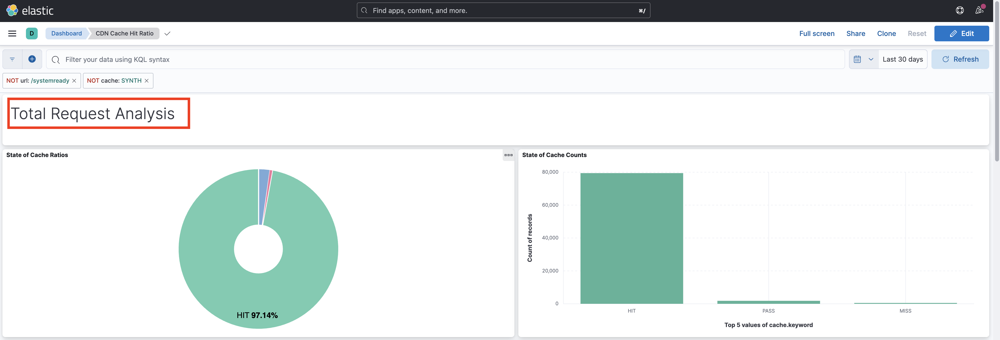

# Análisis de proporción de aciertos de caché de CDN

El contenido almacenado en caché en la CDN reduce la latencia experimentada por los usuarios del sitio web, que no necesitan esperar a que la solicitud vuelva a Apache/Dispatcher o a AEM Publish. Con esto en mente, vale la pena optimizar la proporción de visitas de caché de CDN para maximizar la cantidad de contenido almacenable en caché en la CDN.

Aprenda a analizar los **registros de CDN** proporcionados por AEM as a Cloud Service y a obtener perspectivas como **proporción de visitas en caché** y **URL principales de _MISS_ y _PASS_ tipos de caché**, con fines de optimización.

Los registros de CDN están disponibles en formato JSON, que contiene varios campos, incluidos `url`, `cache`. Para obtener más información, consulte [Formato de registro de CDN](https://experienceleague.adobe.com/docs/experience-manager-cloud-service/content/implementing/developing/logging.html?lang=es#cdn-log:~:text=Toggle%20Text%20Wrapping-,Log%20Format,-The%20CDN%20logs). El campo `cache` proporciona información sobre _el estado de la caché_ y sus valores posibles son HIT, MISS o PASS. Revisemos los detalles de los valores posibles.

| Valor posible de estado de caché   | Descripción |
|------------------------------------|:-----------------------------------------------------:|
| VISITA | Los datos solicitados están _encontrados en la caché de CDN y no requiere realizar una solicitud fetch_ al servidor de AEM. |
| SEÑORITA | Los datos solicitados son _no se encontraron en la caché de CDN y deben solicitarse_ al servidor de AEM. |
| PASE | Los datos solicitados están _explícitamente configurados para no almacenarse en caché_ y siempre se recuperarán del servidor de AEM. |

Para los fines de este tutorial, el [proyecto WKND de AEM](https://github.com/adobe/aem-guides-wknd) se ha implementado en el entorno de AEM as a Cloud Service y se ha activado una pequeña prueba de rendimiento con [Apache JMeter](https://jmeter.apache.org/).

Este tutorial está estructurado para guiarle a través del siguiente proceso:

1. Descarga de registros de CDN mediante Cloud Manager
1. Al analizar esos registros de CDN, se puede realizar con dos enfoques: un panel instalado localmente o un Splunk o Jupityer Notebook accedido de forma remota (para aquellos que obtienen la licencia de Adobe Experience Platform)
1. Optimizando la configuración de caché de CDN

## Descargar registros de CDN

Para descargar los registros de CDN, siga estos pasos:

1. Inicie sesión en Cloud Manager en [my.cloudmanager.adobe.com](https://my.cloudmanager.adobe.com/) y seleccione su organización y programa.

1. Para un entorno AEM CS deseado, seleccione **Descargar registros** en el menú de los tres puntos.

   {width="500" zoomable="yes"}

1. En el cuadro de diálogo **Descargar registros**, seleccione el servicio **Publicar** del menú desplegable y, a continuación, haga clic en el icono de descarga situado junto a la fila **CDN**.

   {width="500" zoomable="yes"}

Si el archivo de registro descargado es de _today_, la extensión de archivo es `.log`; de lo contrario, para los archivos de registro anteriores, la extensión es `.log.gz`.

## Analizar registros de CDN descargados

Para obtener información, como la proporción de visitas en caché y las direcciones URL principales de los tipos de caché MISS y PASS, analice el archivo de registro de CDN descargado. Estas perspectivas ayudan a optimizar la [configuración de caché de CDN](https://experienceleague.adobe.com/es/docs/experience-manager-cloud-service/content/implementing/content-delivery/caching) y a mejorar el rendimiento del sitio.

Para analizar los registros de CDN, este tutorial presenta tres opciones:

1. **Elasticsearch, Logstash y Kibana (ELK)**: las [herramientas de tablero ELK](https://github.com/adobe/AEMCS-CDN-Log-Analysis-Tooling/blob/main/ELK/README.md) se pueden instalar localmente.
1. **Splunk**: la [herramienta de tablero de Splunk](https://github.com/adobe/AEMCS-CDN-Log-Analysis-Tooling/blob/main/Splunk/README.md) requiere acceso a Splunk y [reenvío de registros de AEMCS habilitado](https://experienceleague.adobe.com/es/docs/experience-manager-cloud-service/content/implementing/developing/logging#splunk-logs) para ingerir los registros de CDN.
1. **Jupyter Notebook**: Se puede acceder a él de forma remota como parte de [Adobe Experience Platform](https://experienceleague.adobe.com/es/docs/experience-platform/data-science-workspace/jupyterlab/analyze-your-data) sin instalar software adicional, para clientes que tengan licencia de Adobe Experience Platform.

### Opción 1: Uso de herramientas de tablero ELK

La pila [ELK](https://www.elastic.co/elastic-stack) es un conjunto de herramientas que proporcionan una solución escalable para buscar, analizar y visualizar los datos. Consta de Elasticsearch, Logstash y Kibana.

Para identificar los detalles clave, usemos el proyecto [AEMCS-CDN-Log-Analysis-Tooling](https://github.com/adobe/AEMCS-CDN-Log-Analysis-Tooling). Este proyecto proporciona un contenedor Docker de la pila ELK y un panel preconfigurado de Kibana para analizar los registros de CDN.

1. Siga los pasos de [Cómo configurar el contenedor Docker ELK](https://github.com/adobe/AEMCS-CDN-Log-Analysis-Tooling/blob/main/ELK/README.md#how-to-set-up-the-elk-docker-containerhow-to-setup-the-elk-docker-container) y asegúrese de importar el **índice de aciertos de caché CDN** en el panel de Kibana.

1. Para identificar la proporción de visitas de caché de CDN y las direcciones URL principales, siga estos pasos:

   1. Copie los archivos de registro de CDN descargados dentro de la carpeta de registros específicos del entorno, por ejemplo, `ELK/logs/stage`.

   1. Abra el panel **Proporción de aciertos de caché de CDN** haciendo clic en el _menú de navegación > Analytics > Panel > Proporción de aciertos de caché de CDN_ de la esquina superior izquierda.

      {width="500" zoomable="yes"}

   1. Seleccione el intervalo de tiempo deseado en la esquina superior derecha.

      {width="500" zoomable="yes"}

   1. El panel **Proporción de aciertos de caché de CDN** se explica por sí mismo.

   1. La sección _Análisis de solicitudes totales_ muestra los siguientes detalles:
      - Proporciones de caché por tipo de caché
      - Recuentos de caché por tipo de caché

      {width="500" zoomable="yes"}

   1. El _análisis por tipos de solicitud o MIME_ muestra los siguientes detalles:
      - Proporciones de caché por tipo de caché
      - Recuentos de caché por tipo de caché
      - Principales URL de MISS y PASS

      {width="500" zoomable="yes"}

#### Filtrado por nombre de entorno o ID de programa

Para filtrar los registros ingeridos por nombre de entorno, siga los siguientes pasos:

1. En el panel CDN Cache Hit Ratio, haga clic en el icono **Agregar filtro**.

   {width="500" zoomable="yes"}

1. En el modal **Add filter**, seleccione el campo `aem_env_name.keyword` del menú desplegable, el operador `is` y el nombre de entorno deseado para el campo siguiente y, por último, haga clic en _Add filter_.

   {width="500" zoomable="yes"}

#### Filtrado por nombre de host

Para filtrar los registros ingeridos por nombre de host, siga los siguientes pasos:

1. En el panel CDN Cache Hit Ratio, haga clic en el icono **Agregar filtro**.

   {width="500" zoomable="yes"}

1. En el modal **Add filter**, seleccione el campo `host.keyword` del menú desplegable, el operador `is` y el nombre de host deseado para el campo siguiente y, por último, haga clic en _Add filter_.

   {width="500" zoomable="yes"}

Del mismo modo, agregue más filtros al panel en función de los requisitos de análisis.

### Opción 2: Usar las herramientas del panel de Splunk

[Splunk](https://www.splunk.com/) es una popular herramienta de análisis de registro que ayuda a agregar, analizar registros y crear visualizaciones con fines de supervisión y solución de problemas.

Para identificar los detalles clave, usemos el proyecto [AEMCS-CDN-Log-Analysis-Tooling](https://github.com/adobe/AEMCS-CDN-Log-Analysis-Tooling). Este proyecto proporciona un panel de Splunk para analizar los registros de CDN.

1. Siga los pasos de [Paneles de Splunk para el análisis de registro de CDN de AEM CS](https://github.com/adobe/AEMCS-CDN-Log-Analysis-Tooling/blob/main/Splunk/README.md) y asegúrese de importar el **índice de aciertos de caché de CDN** del panel de Splunk.
1. Si es necesario, actualiza los valores de filtro _Index, Source Type y other_ en el panel de Splunk.

   {width="500" zoomable="yes"}

>[!NOTE]
>
>La interfaz de usuario y los gráficos del tablero del fragmento difieren del tablero de ELK, sin embargo, los detalles clave son similares.

### Opción 3: Usar Jupyter Notebook

Para aquellos que prefieren no instalar software localmente (es decir, la herramienta de tablero ELK de la sección anterior), hay otra opción, pero requiere una licencia para Adobe Experience Platform.

[Jupyter Notebook](https://jupyter.org/) es una aplicación web de código abierto que le permite crear documentos que contienen código, texto y visualización. Se utiliza para la transformación, visualización y modelado estadístico de datos. Se puede tener acceso a él de forma remota [como parte de Adobe Experience Platform](https://experienceleague.adobe.com/es/docs/experience-platform/data-science-workspace/jupyterlab/analyze-your-data).

#### Descarga del archivo interactivo de Python Notebook

En primer lugar, descargue el archivo [AEM-as-a-CloudService - Análisis de registros de CDN - Jupyter Notebook](./assets/cdn-logs-analysis/aemcs_cdn_logs_analysis.ipynb), que le ayudará con el análisis de registros de CDN. Este archivo &quot;Interactive Python Notebook&quot; se explica por sí mismo, sin embargo, los aspectos destacados de cada sección son:

- **Instalar bibliotecas adicionales**: instala las bibliotecas de `termcolor` y `tabulate` Python.
- **Cargar registros de CDN**: carga el archivo de registro de CDN usando el valor de variable `log_file`; asegúrese de actualizar su valor. También transforma este registro de CDN en [Pandas DataFrame](https://pandas.pydata.org/docs/reference/frame.html).
- **Realizar análisis**: el primer bloque de código es _Mostrar resultado del análisis para el total, HTML, JS/CSS y solicitudes de imagen_; proporciona gráficos circulares, de barras y de porcentaje de proporción de aciertos de caché.
El segundo bloque de código es _Las cinco direcciones URL principales de solicitud MISS y PASS para HTML, JS/CSS e Image_; muestra las direcciones URL y sus recuentos en formato de tabla.

#### Ejecución de Jupyter Notebook

A continuación, ejecute Jupyter Notebook en Adobe Experience Platform siguiendo estos pasos:

1. Inicie sesión en [Adobe Experience Cloud](https://experience.adobe.com/), en la página de inicio > sección **Acceso rápido** > haga clic en **Experience Platform**

   {width="500" zoomable="yes"}

1. En la página de inicio de Adobe Experience Platform > Sección de ciencia de datos > , haga clic en el elemento de menú **Notebooks**. Para iniciar el entorno de Jupyter Notebooks, haga clic en la ficha **JupyterLab**.

   {width="500" zoomable="yes"}

1. En el menú de JupyterLab, usando el icono **Cargar archivos**, cargue el archivo de registro CDN descargado y el archivo `aemcs_cdn_logs_analysis.ipynb`.

   {width="500" zoomable="yes"}

1. Abra el archivo `aemcs_cdn_logs_analysis.ipynb` haciendo doble clic en él.

1. En la sección **Cargar archivo de registro de CDN** del bloc de notas, actualice el valor `log_file`.

   {width="500" zoomable="yes"}

1. Para ejecutar la celda seleccionada y avanzar, haga clic en el icono **Reproducir**.

   {width="500" zoomable="yes"}

1. Después de ejecutar **Mostrar resultado del análisis para las celdas de código de Total, HTML, JS/CSS y Solicitudes de imagen**, el resultado muestra los gráficos de porcentaje, barras y circulares de la proporción de visitas de caché.

   {width="500" zoomable="yes"}

1. Después de ejecutar las **5 principales URL de solicitud MISS y PASS para las celdas de código HTML, JS/CSS e Image**, el resultado muestra las 5 principales URL de solicitud MISS y PASS.

   {width="500" zoomable="yes"}

Puede mejorar Jupyter Notebook para analizar los registros de CDN en función de sus necesidades.

## Optimizando la configuración de caché de CDN

Después de analizar los registros de CDN, puede optimizar la configuración de la caché de CDN para mejorar el rendimiento del sitio. La práctica recomendada de AEM es tener una proporción de visitas de caché del 90 % o superior.

Para obtener más información, consulte [Optimizar la configuración de la caché de CDN](https://experienceleague.adobe.com/es/docs/experience-manager-cloud-service/content/implementing/content-delivery/caching).

El proyecto WKND de AEM tiene una configuración CDN de referencia. Para obtener más información, consulte [Configuración CDN](https://github.com/adobe/aem-guides-wknd/blob/main/dispatcher/src/conf.d/available_vhosts/wknd.vhost#L137-L190) del archivo `wknd.vhost`.
