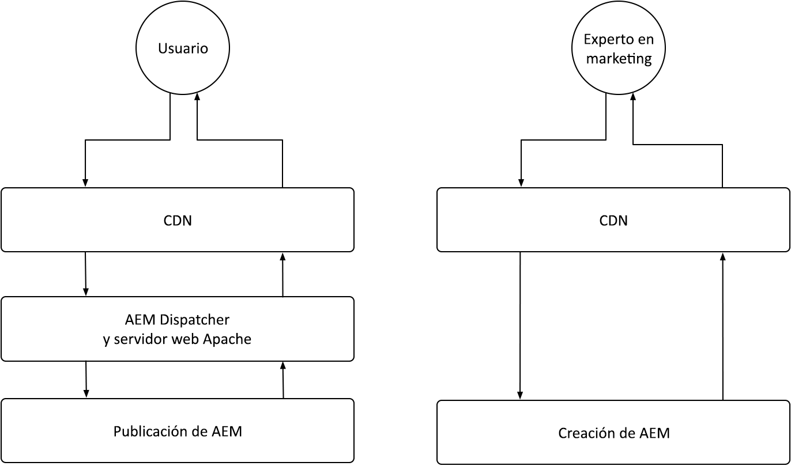
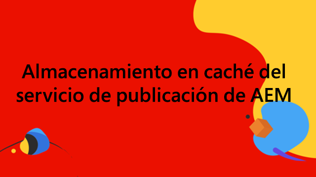
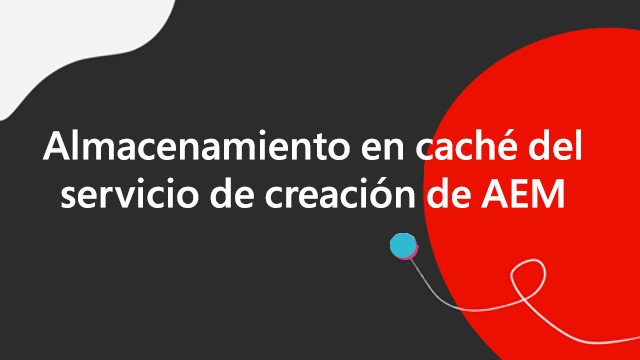

# AEM almacenamiento en caché as a Cloud Service

AEM En as a Cloud Service, comprender el almacenamiento en caché es crucial. El almacenamiento en caché implica almacenar y reutilizar los datos recuperados anteriormente para mejorar la eficacia del sistema y reducir los tiempos de carga. Este mecanismo acelera significativamente la entrega de contenido, aumenta el rendimiento del sitio web y optimiza la experiencia del usuario.

AEM as a Cloud Service tiene varias capas de almacenamiento en caché y estrategias que difieren entre los servicios de creación y publicación.

{align="center"}

## AEM almacenamiento en caché de

AEM as a Cloud Service AEM cuenta con una estrategia de almacenamiento en caché de varias capas sólida y configurable, que incluye una CDN, un Dispatcher y, opcionalmente, una CDN administrada por el cliente. AEM El almacenamiento en caché en todas las capas se puede ajustar para optimizar el rendimiento, lo que garantiza que solo ofrezca las mejores experiencias. AEM Tiene diferentes problemas de almacenamiento en caché para los servicios de autor y publicación. Explore las estrategias de almacenamiento en caché para cada servicio a continuación.

    

    

        

          <figure class="image is-16by9">
            
          </figure>
        

        

          

            
<a href="./publish.md" title="AEM Almacenamiento en caché del servicio de publicación">AEM Almacenamiento en caché del servicio de publicación</a>

            
AEM AEM El servicio de publicación de datos utiliza una CDN administrada y Dispatcher de para optimizar las experiencias web de los usuarios finales.

            <a href="./publish.md" class="spectrum-Button spectrum-Button--outline spectrum-Button--primary spectrum-Button--sizeM">
              Aprender
            </a>
          

        

      

    

    

        

            

            <figure class="image is-16by9">
                
            </figure>
            

            

            

                
<a href="./author.md" title="AEM Almacenamiento en caché del servicio de autor">AEM Almacenamiento en caché del servicio de autor</a>

                
AEM El servicio de creación de utiliza una CDN administrada para ofrecer experiencias de creación optimizadas.

                <a href="./author.md" class="spectrum-Button spectrum-Button--outline spectrum-Button--primary spectrum-Button--sizeM">
                Aprender
                </a>
            

            

        

    

