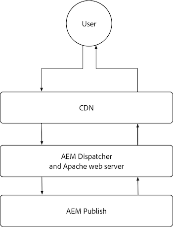

# AEM Publish

El servicio de publicación de AEM tiene dos capas principales de almacenamiento en caché, la CDN de AEM as a Cloud Service y la Dispatcher de AEM. Opcionalmente, se puede colocar una CDN administrada por el cliente delante de la CDN de AEM as a Cloud Service. La CDN de AEM as a Cloud Service proporciona una entrega de contenido perimetral, lo que garantiza que las experiencias se entreguen con baja latencia a usuarios de todo el mundo. AEM Dispatcher proporciona almacenamiento en caché directamente delante de AEM Publish y se utiliza para mitigar la carga innecesaria en AEM Publish.

{align="center"}

## La red de distribución de contenido (CDN)

El almacenamiento en caché de CDN de AEM as a Cloud Service está controlado por encabezados de caché de respuesta HTTP y su objetivo es almacenar en caché el contenido para optimizar el equilibrio entre actualización y rendimiento. La CDN se encuentra entre el usuario final y AEM Dispatcher y se utiliza para almacenar en caché el contenido lo más cerca posible del usuario final, lo que garantiza un buen rendimiento de la experiencia.

{align="center"}

Configurar cómo la CDN almacena en caché el contenido se limita a establecer encabezados de caché en las respuestas HTTP. Estos encabezados de caché generalmente se establecen en configuraciones vhost de AEM Dispatcher mediante `mod_headers`, pero también se pueden establecer en código Java™ personalizado que se ejecuta en AEM Publish.

### ¿Cuándo se almacenan en caché las solicitudes/respuestas HTTP?

AEM as a Cloud Service CDN almacena en caché solo las respuestas HTTP y deben cumplirse todos los criterios siguientes:

+ El estado de respuesta HTTP es `2xx` o `3xx`
+ El método de solicitud HTTP es `GET` o `HEAD`
+ Al menos uno de los siguientes encabezados de respuesta HTTP está presente: `Cache-Control`, `Surrogate-Control` o `Expires`
+ La respuesta HTTP puede ser cualquier tipo de contenido, incluidos HTML, JSON, CSS, JS y archivos binarios.

De manera predeterminada, las respuestas HTTP no almacenadas en caché por [AEM Dispatcher](#aem-dispatcher) quitan automáticamente cualquier encabezado de caché de respuestas HTTP para evitar el almacenamiento en caché en CDN. Este comportamiento se puede reemplazar cuidadosamente usando `mod_headers` con la directiva `Header always set ...` cuando sea necesario.

### ¿Qué se almacena en caché?

AEM as a Cloud Service CDN almacena en caché lo siguiente:

+ cuerpo de respuesta HTTP
+ Encabezados de respuesta HTTP

Normalmente, una solicitud/respuesta HTTP para una sola URL se almacena en caché como un solo objeto. Sin embargo, la CDN puede administrar el almacenamiento en caché de varios objetos para una sola dirección URL, cuando el encabezado `Vary` está establecido en la respuesta HTTP. Evite especificar `Vary` en encabezados cuyos valores no tengan un conjunto de valores estrictamente controlados, ya que esto puede provocar muchos errores de caché, lo que reduce la proporción de visitas de caché. Para admitir el almacenamiento en caché de distintas solicitudes en AEM Dispatcher, [revise la documentación de almacenamiento en caché de variantes](https://experienceleague.adobe.com/docs/experience-manager-learn/cloud-service/developing/advanced/variant-caching.html).

### Duración de caché{#cdn-cache-life}

La CDN de publicación de AEM está basada en TTL (tiempo de vida), lo que significa que la duración de la caché está determinada por los encabezados de respuesta HTTP `Cache-Control`, `Surrogate-Control` o `Expires`. Si el proyecto no establece los encabezados de almacenamiento en caché de respuestas HTTP y se cumplen los [criterios de idoneidad](#when-are-http-requestsresponses-cached), Adobe establece una duración de caché predeterminada de 10 minutos (600 segundos).

Así es como los encabezados de caché influyen en la duración de la caché de la CDN:

+ El encabezado de respuesta HTTP [`Cache-Control`](https://developer.fastly.com/reference/http/http-headers/Cache-Control/) indica al explorador web y a la CDN cuánto tiempo deben almacenar la respuesta en caché. El valor se expresa en segundos. Por ejemplo, `Cache-Control: max-age=3600` indica al explorador web que almacene en caché la respuesta durante una hora. CDN ignora este valor si el encabezado de respuesta HTTP `Surrogate-Control` también está presente.
+ El encabezado de respuesta HTTP [`Surrogate-Control`](https://developer.fastly.com/reference/http/http-headers/Surrogate-Control/) indica a la CDN de AEM cuánto tiempo debe almacenar la respuesta en caché. El valor se expresa en segundos. Por ejemplo, `Surrogate-Control: max-age=3600` indica a la red de distribución de contenido (CDN) que almacene en caché la respuesta durante una hora.
+ El encabezado de respuesta HTTP [`Expires`](https://developer.fastly.com/reference/http/http-headers/Expires/) indica a la CDN (y al explorador web) de AEM cuánto tiempo es válida la respuesta almacenada en caché. El valor es una fecha. Por ejemplo, `Expires: Sat, 16 Sept 2023 09:00:00 EST` indica al explorador web que almacene en caché la respuesta hasta la fecha y hora especificadas.

Utilice `Cache-Control` para controlar la duración de la caché cuando sea la misma tanto para el explorador como para CDN. Utilice `Surrogate-Control` cuando el explorador web deba almacenar la respuesta en caché durante un tiempo diferente al de la CDN.

#### Duración predeterminada de la caché

Si una respuesta HTTP cumple los requisitos para el almacenamiento en caché de AEM Dispatcher [según los calificadores anteriores](#when-are-http-requestsresponses-cached), los siguientes son los valores predeterminados a menos que haya una configuración personalizada.

| Tipo de contenido | Duración predeterminada de la caché de CDN |
|:------------ |:---------- |
| [HTML/JSON/XML](https://experienceleague.adobe.com/docs/experience-manager-cloud-service/content/implementing/content-delivery/caching.html#html-text) | 5 minutos |
| [Assets (imágenes, vídeos, documentos, etc.)](https://experienceleague.adobe.com/docs/experience-manager-cloud-service/content/implementing/content-delivery/caching.html#images) | 10 minutos |
| [Consultas persistentes (JSON)](https://experienceleague.adobe.com/docs/experience-manager-cloud-service/content/headless/graphql-api/persisted-queries.html?publish-instances) | 2 horas |
| [Bibliotecas de cliente (JS/CSS)](https://experienceleague.adobe.com/docs/experience-manager-cloud-service/content/implementing/content-delivery/caching.html#client-side-libraries) | 30 días |
| [Otros](https://experienceleague.adobe.com/docs/experience-manager-cloud-service/content/implementing/content-delivery/caching.html#other-content) | No almacenado en caché |

### Personalizar las reglas de caché

[Configurar cómo la CDN almacena en caché el contenido](https://experienceleague.adobe.com/docs/experience-manager-cloud-service/content/implementing/content-delivery/caching.html#disp) se limita a establecer encabezados de caché en respuestas HTTP. Estos encabezados de caché se suelen establecer en configuraciones de AEM Dispatcher `vhost` mediante `mod_headers`, pero también se pueden establecer en código Java™ personalizado que se ejecuta en AEM Publish.

## Dispatcher de AEM

{align="center"}

### ¿Cuándo se almacenan en caché las solicitudes/respuestas HTTP?

Las respuestas HTTP para las solicitudes HTTP correspondientes se almacenan en caché cuando se cumplen los siguientes criterios:

+ El método de solicitud HTTP es `GET` o `HEAD`
   + `HEAD` solicitudes HTTP solo almacenan en caché los encabezados de respuesta HTTP. No tienen cuerpos de respuesta.
+ El estado de respuesta HTTP es `200`
+ La respuesta HTTP NO es para un archivo binario.
+ La ruta de la dirección URL de la solicitud HTTP termina con una extensión, por ejemplo: `.html`, `.json`, `.css`, `.js`, etc.
+ La solicitud HTTP no contiene autorización y AEM no la autentica.
   + Sin embargo, el almacenamiento en caché de las solicitudes autenticadas [se puede habilitar globalmente](https://experienceleague.adobe.com/docs/experience-manager-dispatcher/using/configuring/dispatcher-configuration.html#caching-when-authentication-is-used) o selectivamente mediante el almacenamiento en caché con permisos confidenciales [3&rbrace;.](https://experienceleague.adobe.com/docs/experience-manager-dispatcher/using/configuring/permissions-cache.html?lang=es)
+ La solicitud HTTP no contiene parámetros de consulta.
   + Sin embargo, configurar [Parámetros de consulta ignorados](https://experienceleague.adobe.com/docs/experience-manager-dispatcher/using/configuring/dispatcher-configuration.html?lang=es#ignoring-url-parameters) permite que las solicitudes HTTP con los parámetros de consulta ignorados se almacenen en caché o se proporcionen desde la caché.
+ La ruta de acceso de la solicitud HTTP [&#x200B; coincide con una regla de permiso de Dispatcher y no coincide con una regla de denegación &#x200B;](https://experienceleague.adobe.com/docs/experience-manager-dispatcher/using/configuring/dispatcher-configuration.html#specifying-the-documents-to-cache).
+ La respuesta HTTP no tiene ninguno de los siguientes encabezados de respuesta HTTP establecidos por AEM Publish:

   + `no-cache`
   + `no-store`
   + `must-revalidate`

### ¿Qué se almacena en caché?

AEM Dispatcher almacena en caché lo siguiente:

+ cuerpo de respuesta HTTP
+ Encabezados de respuesta HTTP especificados en la [configuración de encabezados de caché](https://experienceleague.adobe.com/docs/experience-manager-dispatcher/using/configuring/dispatcher-configuration.html#caching-http-response-headers) de Dispatcher. Consulte la configuración predeterminada que se incluye con el [Arquetipo de proyecto de AEM](https://github.com/adobe/aem-project-archetype/blob/develop/src/main/archetype/dispatcher.cloud/src/conf.dispatcher.d/available_farms/default.farm#L106-L113).
   + `Cache-Control`
   + `Content-Disposition`
   + `Content-Type`
   + `Expires`
   + `Last-Modified`
   + `X-Content-Type-Options`

### Duración de caché

AEM Dispatcher almacena en caché las respuestas HTTP mediante los siguientes métodos:

+ Hasta que la invalidación se active mediante mecanismos como la publicación o cancelación de la publicación del contenido.
+ TTL (tiempo de vida) cuando se [configura explícitamente en la configuración de Dispatcher](https://experienceleague.adobe.com/docs/experience-manager-dispatcher/using/configuring/dispatcher-configuration.html#configuring-time-based-cache-invalidation-enablettl). Vea la configuración predeterminada en [Arquetipo de proyecto de AEM](https://github.com/adobe/aem-project-archetype/blob/develop/src/main/archetype/dispatcher.cloud/src/conf.dispatcher.d/available_farms/default.farm#L122-L127) revisando la configuración de `enableTTL`.

#### Duración predeterminada de la caché

Si una respuesta HTTP cumple los requisitos para el almacenamiento en caché de AEM Dispatcher [según los calificadores anteriores](#when-are-http-requestsresponses-cached-1), los siguientes son los valores predeterminados a menos que haya una configuración personalizada.

| Tipo de contenido | Duración predeterminada de la caché de CDN |
|:------------ |:---------- |
| [HTML/JSON/XML](https://experienceleague.adobe.com/docs/experience-manager-cloud-service/content/implementing/content-delivery/caching.html#html-text) | Hasta la invalidación |
| [Assets (imágenes, vídeos, documentos, etc.)](https://experienceleague.adobe.com/docs/experience-manager-cloud-service/content/implementing/content-delivery/caching.html#images) | Nunca |
| [Consultas persistentes (JSON)](https://experienceleague.adobe.com/docs/experience-manager-cloud-service/content/headless/graphql-api/persisted-queries.html?publish-instances) | 1 minuto |
| [Bibliotecas de cliente (JS/CSS)](https://experienceleague.adobe.com/docs/experience-manager-cloud-service/content/implementing/content-delivery/caching.html#client-side-libraries) | 30 días |
| [Otros](https://experienceleague.adobe.com/docs/experience-manager-cloud-service/content/implementing/content-delivery/caching.html#other-content) | Hasta la invalidación |

### Personalizar las reglas de caché

La memoria caché de AEM Dispatcher se puede configurar mediante la [configuración de Dispatcher](https://experienceleague.adobe.com/docs/experience-manager-dispatcher/using/configuring/dispatcher-configuration.html?lang=en#configuring-the-dispatcher-cache-cache), que incluye:

+ Qué se almacena en caché
+ Qué partes de la caché se invalidan al publicar/cancelar la publicación
+ Qué parámetros de consulta de solicitud HTTP se omiten al evaluar la caché
+ Qué encabezados de respuesta HTTP se almacenan en caché
+ Habilitar o deshabilitar el almacenamiento en caché de TTL
+ ... y mucho más

Si se usa `mod_headers` para establecer encabezados de caché, la configuración de `vhost` no afectará al almacenamiento en caché de Dispatcher (basado en TTL), ya que se agregarán a la respuesta HTTP después de que AEM Dispatcher procese la respuesta. Para afectar al almacenamiento en caché de Dispatcher a través de encabezados de respuesta HTTP, se requiere código Java™ personalizado que se ejecute en AEM Publish y que establezca los encabezados de respuesta HTTP adecuados.
