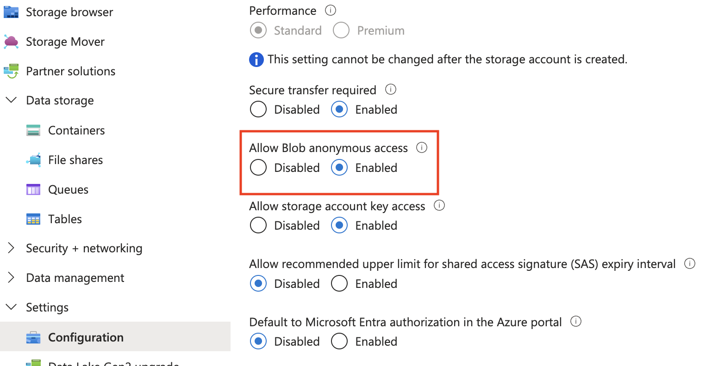

# Páginas de error personalizadas

Obtenga información sobre cómo implementar páginas de error personalizadas para el sitio web alojado en AEM as a Cloud Service.

En este tutorial, aprenderá lo siguiente:

- Páginas de error predeterminadas
- Desde donde se muestran las páginas de error
   - Tipo de servicio de AEM: creación, publicación y vista previa
   - CDN administrado por Adobe
- Opciones para personalizar páginas de error
   - Directiva Apache ErrorDocument
   - ACS AEM Commons - Controlador de página de error
   - Páginas de error de CDN

## Páginas de error predeterminadas

Revisemos cuándo se muestran las páginas de error, las páginas de error predeterminadas y desde dónde se proporcionan.

Las páginas de error se muestran cuando:

- la página no existe (404)
- no está autorizado para acceder a una página (403)
- error del servidor (500) debido a problemas de código o porque el servidor no está disponible.

AEM as a Cloud Service proporciona _páginas de error predeterminadas_ para los escenarios anteriores. Es una página genérica y no coincide con su marca.

La página de error predeterminada _se proporciona_ desde el _tipo de servicio de AEM_(autor, publicación, vista previa) o desde la _CDN administrada por Adobe_. Consulte la tabla siguiente para obtener más detalles.

| Página de error servida desde | Detalles |
|---------------------|:-----------------------:|
| Tipo de servicio de AEM: creación, publicación y vista previa | Cuando el tipo de servicio de AEM sirve la solicitud de página y se produce cualquiera de los escenarios de error anteriores, la página de error se sirve desde el tipo de servicio de AEM. De forma predeterminada, la página de error 5XX se reemplaza con la página de error de CDN administrada por Adobe a menos que se establezca el encabezado `x-aem-error-pass: true`. |
| CDN administrado por Adobe | Cuando la CDN administrada por Adobe _no puede alcanzar el tipo de servicio de AEM_ (servidor de origen), la página de error se proporciona desde la CDN administrada por Adobe. **Es un evento improbable, pero vale la pena planificarlo.** |

>[!NOTE]
>
>En AEM as a Cloud Service, la CDN proporciona una página de error genérica cuando se recibe un error 5XX del backend. Para permitir que pase la respuesta real del servidor, debe agregar el siguiente encabezado a la respuesta: `x-aem-error-pass: true`.
>Esto solo funciona para respuestas procedentes de AEM o de la capa Apache/Dispatcher. Otros errores inesperados procedentes de capas de infraestructura intermedias siguen mostrando la página de error genérica.


Por ejemplo, las páginas de error predeterminadas proporcionadas desde el tipo de servicio de AEM y la CDN administrada por Adobe son las siguientes:


Sin embargo, puede _personalizar el tipo de servicio de AEM y las páginas de error de CDN administradas por Adobe_ para que coincidan con su marca y proporcionen una mejor experiencia de usuario.

## Opciones para personalizar páginas de error

Las siguientes opciones están disponibles para personalizar las páginas de error:

| Aplicable a | Nombre de opción | Descripción |
|---------------------|:-----------------------:|:-----------------------:|
| Tipos de servicios de AEM: publicación y previsualización | Directiva ErrorDocument | Utilice la directiva [ErrorDocument](https://httpd.apache.org/docs/2.4/custom-error.html) en el archivo de configuración de Apache para especificar la ruta a la página de error personalizada. Solo se aplica a los tipos de servicio de AEM: publicación y vista previa. |
| Tipos de servicios de AEM: creación, publicación y vista previa | Controlador de página de error de ACS AEM Commons | Use el [Controlador de página de error de AEM Commons ACS](https://adobe-consulting-services.github.io/acs-aem-commons/features/error-handler/index.html) para personalizar los errores en todos los tipos de servicios de AEM. |
| CDN administrado por Adobe | Páginas de error de CDN | Utilice las páginas de error de CDN para personalizar las páginas de error cuando la CDN administrada por Adobe no pueda alcanzar el tipo de servicio de AEM (servidor de origen). |


## Requisitos previos

En este tutorial, aprenderá a personalizar las páginas de error utilizando la directiva _ErrorDocument_, el _Controlador de páginas de error de ACS AEM Commons_ y las opciones _Páginas de error de CDN_. Para seguir este tutorial, necesita lo siguiente:

- El [entorno de desarrollo local de AEM](https://experienceleague.adobe.com/en/docs/experience-manager-learn/cloud-service/local-development-environment-set-up/overview) o el entorno de AEM as a Cloud Service. La opción _Páginas de error de CDN_ se aplica al entorno de AEM as a Cloud Service.

- [Proyecto WKND de AEM](https://github.com/adobe/aem-guides-wknd) para personalizar páginas de error.

## Configuración

- Clone e implemente el proyecto WKND de AEM en su entorno de desarrollo local de AEM siguiendo los pasos a continuación:

  ```
  # For local AEM development environment
  $ git clone git@github.com:adobe/aem-guides-wknd.git
  $ cd aem-guides-wknd
  $ mvn clean install -PautoInstallSinglePackage -PautoInstallSinglePackagePublish
  ```

- Para el entorno AEM as a Cloud Service, implemente el proyecto WKND de AEM ejecutando la [canalización de pila completa](https://experienceleague.adobe.com/en/docs/experience-manager-cloud-service/content/implementing/using-cloud-manager/cicd-pipelines/introduction-ci-cd-pipelines#full-stack-pipeline); consulte el ejemplo de la [canalización que no es de producción](https://experienceleague.adobe.com/en/docs/experience-manager-learn/cloud-service/cloud-manager/cicd-non-production-pipeline).

- Compruebe que las páginas del sitio WKND se representan correctamente.

## Directiva Apache ErrorDocument para personalizar las páginas de error servidas de AEM{#errordocument}

Para personalizar páginas de error servidas por AEM, use la directiva `ErrorDocument` de Apache.

En AEM as a Cloud Service, la opción de directiva Apache `ErrorDocument` solo se aplica a los tipos de servicio de publicación y vista previa. No es aplicable al tipo de servicio de autor, ya que Apache + Dispatcher no forma parte de la arquitectura de implementación.

Revisemos cómo el proyecto [AEM WKND](https://github.com/adobe/aem-guides-wknd) usa la directiva `ErrorDocument` de Apache para mostrar páginas de error personalizadas.

- El módulo `ui.content.sample` contiene las [páginas de error](https://github.com/adobe/aem-guides-wknd/tree/main/ui.content.sample/src/main/content/jcr_root/content/wknd/language-masters/en/errors) de marca en `/content/wknd/language-masters/en/errors`. Revisarlos en su entorno [local AEM](http://localhost:4502/sites.html/content/wknd/language-masters/en/errors) o AEM as a Cloud Service `https://author-p<ID>-e<ID>.adobeaemcloud.com/ui#/aem/sites.html/content/wknd/language-masters/en/errors`.

- El archivo `wknd.vhost` del módulo `dispatcher` contiene:
   - La directiva [ErrorDocument](https://github.com/adobe/aem-guides-wknd/blob/main/dispatcher/src/conf.d/available_vhosts/wknd.vhost#L139-L143) que señala a las [páginas de error](https://github.com/adobe/aem-guides-wknd/blob/main/dispatcher/src/conf.d/variables/custom.vars#L7-L8) anteriores.
   - El valor [DispatcherPassError](https://github.com/adobe/aem-guides-wknd/blob/main/dispatcher/src/conf.d/available_vhosts/wknd.vhost#L133) está establecido en 1, por lo que Dispatcher permite que Apache gestione todos los errores.

  ```
  # In `wknd.vhost` file:
  
  ...
  
  ## ErrorDocument directive
  ErrorDocument 404 ${404_PAGE}
  ErrorDocument 500 ${500_PAGE}
  ErrorDocument 502 ${500_PAGE}
  ErrorDocument 503 ${500_PAGE}
  ErrorDocument 504 ${500_PAGE}
  
  ## Add Header for 5XX error page response
  <IfModule mod_headers.c>
    ### By default, CDN overrides 5XX error pages. To allow the actual response of the backend to pass through, add the header x-aem-error-pass: true
    Header set x-aem-error-pass "true" "expr=%{REQUEST_STATUS} >= 500 && %{REQUEST_STATUS} < 600"
  </IfModule>
  
  ...
  ## DispatcherPassError directive
  <IfModule disp_apache2.c>
      ...
      DispatcherPassError        1
  </IfModule>
  
  # In `custom.vars` file
  ...
  ## Define the error page paths
  Define 404_PAGE /content/wknd/us/en/errors/404.html
  Define 500_PAGE /content/wknd/us/en/errors/500.html
  ...
  ```

- Revise las páginas de error personalizadas del sitio WKND introduciendo un nombre de página o una ruta incorrectos en su entorno, por ejemplo [https://publish-p105881-e991000.adobeaemcloud.com/us/en/foo/bar.html](https://publish-p105881-e991000.adobeaemcloud.com/us/en/foo/bar.html).

## ACS AEM Commons-Error Page Handler para personalizar páginas de error servidas por AEM{#acs-aem-commons}

Para personalizar las páginas de error servidas por AEM en _todos los tipos de servicio de AEM_, puede usar la opción [Controlador de página de error de ACS AEM Commons](https://adobe-consulting-services.github.io/acs-aem-commons/features/error-handler/index.html).

. Para obtener instrucciones detalladas paso a paso, consulte la sección [Cómo usar](https://adobe-consulting-services.github.io/acs-aem-commons/features/error-handler/index.html#how-to-use).

## Páginas de error de CDN para personalizar las páginas de error de CDN servidas{#cdn-error-pages}

Para personalizar las páginas de error proporcionadas por la CDN administrada por Adobe, utilice la opción Páginas de error de CDN.

Vamos a implementar páginas de error de CDN para personalizar las páginas de error cuando la CDN administrada por Adobe no puede alcanzar el tipo de servicio de AEM (servidor de origen).

>[!IMPORTANT]
>
> La CDN administrada por _Adobe no puede alcanzar el tipo de servicio AEM_ (servidor de origen) es un **evento improbable**, pero vale la pena planificarlo.

Los pasos de alto nivel para implementar páginas de error de CDN son los siguientes:

- Desarrollar contenido de página de error personalizado como aplicación de una sola página (SPA).
- Aloje los archivos estáticos necesarios para la página de error de CDN en una ubicación de acceso público.
- Configure la regla de CDN (errorPages) y haga referencia a los archivos estáticos anteriores.
- Implemente la regla de CDN configurada en el entorno de AEM as a Cloud Service mediante la canalización de Cloud Manager.
- Pruebe las páginas de error de CDN.


### Resumen de páginas de error de CDN

La página de error de CDN la implementa como aplicación de una sola página (SPA) la CDN administrada por Adobe. El documento de SPA de HTML entregado por la CDN administrada por Adobe contiene el mínimo fragmento de HTML. El contenido de la página de error personalizada se genera dinámicamente mediante un archivo JavaScript. El cliente debe desarrollar y alojar el archivo JavaScript en una ubicación de acceso público.

El fragmento de HTML que entrega la CDN administrada por Adobe tiene la siguiente estructura:

```html
<!DOCTYPE html>
<html lang="en">
  <head>
    
    ...

    <title>{title}</title>
    <link rel="icon" href="{icoUrl}">
    <link rel="stylesheet" href="{cssUrl}">
  </head>
  <body>
    <script src="{jsUrl}"></script>
  </body>
</html>
```

El fragmento de código de HTML contiene los siguientes marcadores de posición:

1. **jsUrl**: la dirección URL absoluta del archivo JavaScript para procesar el contenido de la página de error creando elementos HTML de forma dinámica.
1. **cssUrl**: La dirección URL absoluta del archivo CSS para aplicar estilo al contenido de la página de error.
1. **icoUrl**: La dirección URL absoluta del favicon.


### Desarrollar una página de error personalizada

Desarrollemos el contenido de página de error de marca específico de WKND como una aplicación de una sola página (SPA).

Para fines de demostración, usemos [React](https://react.dev/); sin embargo, puede usar cualquier módulo o biblioteca de JavaScript.

- Cree un nuevo proyecto de React ejecutando el siguiente comando:

  ```
  $ npx create-react-app aem-cdn-error-page
  ```

- Abra el proyecto en su editor de código favorito y actualice los siguientes archivos:

   - `src/App.js`: es el componente principal que procesa el contenido de la página de error.

     ```javascript
     import logo from "./wknd-logo.png";
     import "./App.css";
     
     function App() {
       return (
         <>
           <div className="App">
             <div className="container">
             
             </div>
           </div>
           <div className="container">
             <div className="error-code">CDN Error Page</div>
             <h1 className="error-message">Ruh-Roh! Page Not Found</h1>
             <p className="error-description">
               We're sorry, we are unable to fetch this page!
             </p>
           </div>
         </>
       );
     }
     
     export default App;
     ```

   - `src/App.css`: aplicar estilo al contenido de la página de error.

     ```css
     .App {
       text-align: left;
     }
     
     .App-logo {
       height: 14vmin;
       pointer-events: none;
     }
     
     
     body {
       margin-top: 0;
       padding: 0;
       font-family: Arial, sans-serif;
       background-color: #fff;
       color: #333;
       display: flex;
       justify-content: center;
       align-items: center;
     }
     
     .container {
       text-align: letf;
       padding-top: 10px;
     }
     
     .error-code {
       font-size: 4rem;
       font-weight: bold;
       color: #ff6b6b;
     }
     
     .error-message {
       font-size: 2.5rem;
       margin-bottom: 10px;
     }
     
     .error-description {
       font-size: 1rem;
       margin-bottom: 20px;
     }
     ```

   - Agregar el archivo `wknd-logo.png` a la carpeta `src`. Copie el [archivo](https://github.com/adobe/aem-guides-wknd/blob/main/ui.frontend/src/main/webpack/resources/images/favicons/favicon-512.png) como `wknd-logo.png`.

   - Agregar el archivo `favicon.ico` a la carpeta `public`. Copie el [archivo](https://github.com/adobe/aem-guides-wknd/blob/main/ui.frontend/src/main/webpack/resources/images/favicons/favicon-32.png) como `favicon.ico`.

   - Compruebe el contenido de la página de error de CDN con marca WKND ejecutando el proyecto:

     ```
     $ npm start
     ```

     Abra el explorador y vaya a `http://localhost:3000/` para ver el contenido de la página de error de CDN.

   - Cree el proyecto para generar los archivos estáticos:

     ```
     $ npm run build
     ```

     Los archivos estáticos se generan en la carpeta `build`.


También puede descargar el archivo [aem-cdn-error-page.zip](./assets/aem-cdn-error-page.zip) que contiene los archivos de proyecto de React anteriores.

A continuación, aloje los archivos estáticos anteriores en una ubicación de acceso público.

### Archivos estáticos de host necesarios para la página de error de CDN

Vamos a alojar los archivos estáticos en Azure Blob Storage. Sin embargo, puedes usar cualquier servicio de alojamiento de archivos estáticos como [Netlify](https://www.netlify.com/), [Vercel](https://vercel.com/) o [AWS S3](https://aws.amazon.com/s3/).

- Siga la documentación oficial de [Azure Blob Storage](https://learn.microsoft.com/en-us/azure/storage/blobs/storage-quickstart-blobs-portal) para crear un contenedor y cargar los archivos estáticos.

  >[!IMPORTANT]
  >
  >Si utiliza otros servicios de alojamiento de archivos estáticos, siga su documentación para alojar los archivos estáticos.

- Asegúrese de que los archivos estáticos sean de acceso público. Mi configuración de cuenta de almacenamiento específica de demostración de WKND es la siguiente:

   - **Nombre de cuenta de almacenamiento**: `aemcdnerrorpageresources`
   - **Nombre de contenedor**: `static-files`

  

- En el contenedor superior `static-files`, se cargan los siguientes archivos de la carpeta `build`:

   - `error.js`: se cambió el nombre del archivo `build/static/js/main.<hash>.js` a `error.js` y a [accesible públicamente](https://aemcdnerrorpageresources.blob.core.windows.net/static-files/error.js).
   - `error.css`: se cambió el nombre del archivo `build/static/css/main.<hash>.css` a `error.css` y a [accesible públicamente](https://aemcdnerrorpageresources.blob.core.windows.net/static-files/error.css).
   - `favicon.ico`: el archivo `build/favicon.ico` se ha cargado tal cual y [es de acceso público](https://aemcdnerrorpageresources.blob.core.windows.net/static-files/favicon.ico).

A continuación, configure la regla CDN (errorPages) y haga referencia a los archivos estáticos anteriores.

### Configuración de la regla de CDN

Vamos a configurar la regla de CDN `errorPages` que utiliza los archivos estáticos anteriores para procesar el contenido de la página de error de CDN.

1. Abra el archivo `cdn.yaml` de la carpeta principal `config` de su proyecto de AEM. Por ejemplo, el archivo cdn.yaml](https://github.com/adobe/aem-guides-wknd/blob/main/config/cdn.yaml) del proyecto [WKND.

1. Agregue la siguiente regla de CDN al archivo `cdn.yaml`:

   ```yaml
   kind: "CDN"
   version: "1"
   metadata:
     envTypes: ["dev", "stage", "prod"]
   data:
     # The CDN Error Page configuration. 
     # The error page is displayed when the Adobe-managed CDN is unable to reach the origin server.
     # It is implemented as a Single Page Application (SPA) and WKND branded content must be generated dynamically using the JavaScript file 
     errorPages:
       spa:
         title: Adobe AEM CDN Error Page # The title of the error page
         icoUrl: https://aemcdnerrorpageresources.blob.core.windows.net/static-files/favicon.ico # The PUBLIC URL of the favicon
         cssUrl: https://aemcdnerrorpageresources.blob.core.windows.net/static-files/error.css # The PUBLIC URL of the CSS file
         jsUrl: https://aemcdnerrorpageresources.blob.core.windows.net/static-files/error.js # The PUBLIC URL of the JavaScript file
   ```

1. Guarde, confirme y envíe los cambios al repositorio de flujo ascendente de Adobe.

### Implementación de la regla CDN

Finalmente, implemente la regla de CDN configurada en el entorno de AEM as a Cloud Service mediante la canalización de Cloud Manager.

1. En Cloud Manager, vaya a la sección **Canalizaciones**.

1. Cree una nueva canalización o seleccione la canalización existente que implemente solamente los archivos **Config**. Para ver los pasos detallados, consulte [Crear una canalización de configuración](https://experienceleague.adobe.com/en/docs/experience-manager-learn/cloud-service/security/traffic-filter-and-waf-rules/how-to-setup#deploy-rules-through-cloud-manager).

1. Haga clic en el botón **Ejecutar** para implementar la regla de CDN.


### Prueba de las páginas de error de CDN

Para probar las páginas de error de CDN, siga los siguientes pasos:

- En el explorador, vaya a la URL de publicación de AEM as a Cloud Service y anexe `cdnstatus?code=404` a la URL, por ejemplo, [https://publish-p105881-e991000.adobeaemcloud.com/cdnstatus?code=404](https://publish-p105881-e991000.adobeaemcloud.com/cdnstatus?code=404), o acceda a través de la [URL de dominio personalizado](https://wknd.enablementadobe.com/cdnstatus?code=404)

  

- Los códigos admitidos son: 403, 404, 406, 500 y 503.

- Compruebe la pestaña de red del explorador para ver si los archivos estáticos se cargan desde el almacenamiento del blob de Azure. El documento de HTML entregado por la CDN administrada por Adobe contiene el contenido mínimo y el archivo de JavaScript crea dinámicamente el contenido de la página de error con marca.

  

## Resumen

En este tutorial, ha aprendido acerca de las páginas de error predeterminadas, desde las que se proporcionan las páginas de error y las opciones para personalizar las páginas de error. Ha aprendido a implementar páginas de error personalizadas utilizando la directiva Apache `ErrorDocument`, las opciones `ACS AEM Commons Error Page Handler` y `CDN Error Pages`.

## Recursos adicionales

- [Configurar páginas de error de CDN](https://experienceleague.adobe.com/en/docs/experience-manager-cloud-service/content/implementing/content-delivery/cdn-error-pages)

- [Cloud Manager - Canalizaciones de configuración](https://experienceleague.adobe.com/en/docs/experience-manager-cloud-service/content/implementing/using-cloud-manager/cicd-pipelines/introduction-ci-cd-pipelines#config-deployment-pipeline)
