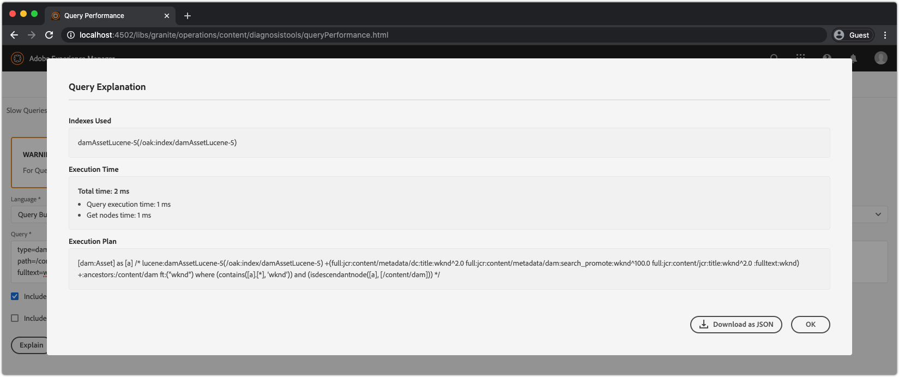

# Otras herramientas para depurar AEM SDK

Varias otras herramientas pueden ayudar a depurar la aplicación en el inicio rápido local del SDK de AEM.

## CRXDE Lite

CRXDE Lite es una interfaz basada en web para interactuar con el repositorio de datos JCR, AEM. CRXDE Lite proporciona una visibilidad total del JCR, incluidos nodos, propiedades, valores de propiedad y permisos.

El CRXDE Lite se encuentra en:

+ Herramientas > General > CRXDE Lite
+ o directamente en [http://localhost:4502/crx/de/index.jsp](http://localhost:4502/crx/de/index.jsp)

## Explicar la consulta

Explicar la herramienta basada en la web de Consulta en AEM inicio rápido local del SDK, que proporciona perspectivas clave sobre cómo AEM interpreta y ejecuta consultas, y una herramienta inestimable para garantizar que las consultas se ejecuten de forma AEM y con un rendimiento óptimo.

Explicar que la Consulta se encuentra en:

+ Herramientas > Diagnóstico > Rendimiento de la Consulta > Ficha Explicar Consulta
+ [http://localhost:4502/libs/granite/operations/content/diagnosistools/queryPerformance.html](http://localhost:4502/libs/granite/operations/content/diagnosistools/queryPerformance.html) > Ficha Explicar Consulta

## Depurador de QueryBuilder

El depurador de QueryBuilder es una herramienta basada en Web que ayuda a depurar y comprender las consultas de búsqueda mediante la sintaxis de AEM [QueryBuilder](https://docs.adobe.com/content/help/en/experience-manager-65/developing/platform/query-builder/querybuilder-api.html).

El depurador de QueryBuilder se encuentra en:

+ [http://localhost:4502/libs/cq/search/content/querydebug.html](http://localhost:4502/libs/cq/search/content/querydebug.html)

## Sling Log Tracer y AEM complemento Chrome

[Sling Log Tracer](https://sling.apache.org/documentation/bundles/log-tracers.html), que se suministra con el inicio rápido local del SDK de AEM, permite realizar un seguimiento a fondo de las solicitudes HTTP, exponiendo en detalle la información de depuración por solicitud. La configuración OSGi de [Log Tracer debe configurarse](https://sling.apache.org/documentation/bundles/log-tracers.html#configuration-1) para habilitar esta función.

El complemento [AEM Chrome](https://chrome.google.com/webstore/detail/aem-chrome-plug-in/ejdcnikffjleeffpigekhccpepplaode?hl=en-US) de código abierto para el [explorador Web Google Chrome](https://www.google.com/chrome/) se integra con Log Tracer, exponiendo la información de depuración directamente en las herramientas de desarrollo de Chrome.

_El complemento AEM Chrome es una herramienta de código abierto y Adobe no lo admite._

