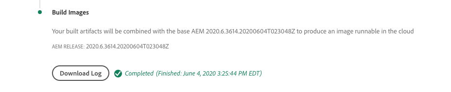

# Depuración AEM compilación e implementaciones as a Cloud Service

Adobe Cloud Manager facilita la compilación y las implementaciones de código para AEM as a Cloud Service. Pueden producirse errores durante los pasos del proceso de compilación, lo que requiere una acción para resolverlos. Esta guía explica los errores comunes en la implementación y cómo abordarlos mejor.


## Validación

El paso de validación simplemente garantiza que las configuraciones básicas de Cloud Manager sean válidas. Los errores de validación comunes incluyen:

### El entorno está en un estado no válido

+ __Mensaje de error:__ El entorno está en un estado no válido.
   
+ __Causa:__ El entorno de destino de la canalización está en un estado de transición en el que no puede aceptar nuevas compilaciones.
+ __Resolución:__ Espere a que el estado se resuelva en un estado en ejecución (o que la actualización esté disponible). Si se va a eliminar el entorno, vuelva a crearlo o elija otro entorno para crearlo.

### No se encuentra el entorno asociado a la canalización

+ __Mensaje de error:__ El entorno se marca como eliminado.
   
+ __Causa:__ Se ha eliminado el entorno para el que está configurada la canalización.
Aunque se vuelva a crear un nuevo entorno con el mismo nombre, Cloud Manager no volverá a asociar automáticamente la canalización a ese entorno con el mismo nombre.
+ __Resolución:__ Edite la configuración de la canalización y vuelva a seleccionar el entorno al que desee implementar.

### No se encuentra la rama Git asociada a la canalización

+ __Mensaje de error:__ Canalización no válida: XXXXXX. Reason=Branch=xxxx no se encuentra en el repositorio.
   
+ __Causa:__ Se ha eliminado la rama Git que la canalización está configurada para usar.
+ __Resolución:__ Vuelva a crear la rama de Git que falta con el mismo nombre o vuelva a configurar la canalización para que se cree desde una rama diferente y existente.

## Prueba de compilación y unidad


La fase de generación y prueba de unidades realiza una compilación de Maven (`mvn clean package`) del proyecto extraído de la rama Git configurada de la canalización.

Los errores identificados en esta fase deben ser reproducibles al crear el proyecto localmente, con las siguientes excepciones:

+ Una dependencia maven no disponible en [Maven Central](https://search.maven.org/) y el repositorio de Maven que contiene la dependencia:
   + No se puede acceder desde Cloud Manager, como un repositorio privado interno de Maven o el repositorio de Maven requiere autenticación y se han proporcionado credenciales incorrectas.
   + No registrado explícitamente en el `pom.xml`. Tenga en cuenta que, incluidos los repositorios de Maven, no se recomienda porque aumenta los tiempos de compilación.
+ Las pruebas unitarias fallan debido a problemas de tiempo. Esto puede ocurrir cuando las pruebas unitarias son sensibles al tiempo. Un indicador sólido está encendido `.sleep(..)` en el código de prueba.
+ El uso de complementos Maven no compatibles.

## Escaneo de código


El análisis de código realiza un análisis estático del código mediante una combinación de prácticas recomendadas específicas de Java y AEM.

El análisis de código produce un error de compilación si existen vulnerabilidades de seguridad crítica en el código. Se pueden anular menos infracciones, pero se recomienda que se corrijan. Tenga en cuenta que el análisis de código es imperfecto y puede resultar en [falsos positivos](https://experienceleague.adobe.com/docs/experience-manager-cloud-service/implementing/using-cloud-manager/test-results/overview-test-results.html#dealing-with-false-positives).

Para resolver los problemas de digitalización de código, descargue el informe con formato CSV proporcionado por Cloud Manager a través de la variable **Detalles de la descarga** y revise las entradas.

Para obtener más información, consulte AEM reglas específicas, consulte la documentación de Cloud Manager [reglas de digitalización de código específicas de AEM personalizadas](https://experienceleague.adobe.com/docs/experience-manager-cloud-manager/using/how-to-use/custom-code-quality-rules.html).

## Crear imágenes



La imagen de compilación es responsable de combinar los artefactos de código creados creados en el paso Generar y prueba de unidad con la versión de AEM, para formar un único artefacto implementable.

Aunque se encuentran problemas de compilación y compilación de código durante la Prueba de compilación y unidad, puede haber problemas estructurales o de configuración identificados al intentar combinar el artefacto de compilación personalizado con la versión de AEM.

### Duplicar configuraciones de OSGi

Cuando se resuelven varias configuraciones de OSGi mediante el modo de ejecución para el entorno de AEM de destino, el paso Generar imagen falla con el error :

```
[ERROR] Unable to convert content-package [/tmp/packages/enduser.all-1.0-SNAPSHOT.zip]: 
Configuration 'com.example.ExampleComponent' already defined in Feature Model 'com.example.groupId:example.all:slingosgifeature:xxxxx:X.X', 
set the 'mergeConfigurations' flag to 'true' if you want to merge multiple configurations with same PID
```

#### Causa 1

+ __Causa:__ El paquete completo del proyecto AEM contiene varios paquetes de código, y la misma configuración OSGi la proporcionan más de uno de los paquetes de código, lo que provoca un conflicto, lo que provoca que el paso Generar imagen no pueda decidir cuál debe utilizarse, por lo que falla la compilación. Tenga en cuenta que esto no se aplica a las configuraciones de fábrica de OSGi, siempre que tengan nombres únicos.
+ __Resolución:__ Revise todos los paquetes de código (incluidos los paquetes de código de terceros incluidos) que se implementen como parte de la aplicación de AEM, buscando configuraciones OSGi duplicadas que se resuelvan, a través del modo de ejecución, en el entorno de destino. La guía del mensaje de error &quot;establecer el indicador mergeConfigurations en true&quot; no es posible en AEM as a Cloud Service y debe ignorarse.

#### Causa 2

+ __Causa:__ El AEM del proyecto incluye incorrectamente el mismo paquete de código dos veces, lo que resulta en la duplicación de cualquier configuración OSGi contenida en dicho paquete.
+ __Resolución:__ Revise todos los paquetes de pom.xml incrustados en el proyecto completo y asegúrese de que tienen el `filevault-package-maven-plugin` [configuración](https://experienceleague.adobe.com/docs/experience-manager-cloud-service/implementing/developing/aem-project-content-package-structure.html#cloud-manager-target) configure como `<cloudManagerTarget>none</cloudManagerTarget>`.

### Secuencia de comandos de repoción malformada

Las secuencias de comandos de informe definen el contenido de línea de base, los usuarios, las ACL, etc. En AEM as a Cloud Service, los scripts de informe se aplican durante la Imagen de compilación, pero en AEM inicio rápido local del SDK se aplican cuando se activa la configuración de fábrica de informes OSGi. Debido a esto, los scripts de Report pueden fallar silenciosamente (con el inicio de sesión) en AEM inicio rápido local del SDK, pero pueden provocar que el paso Generar imagen falle y detener la implementación.

+ __Causa:__ El formato de una secuencia de comandos de informe no es correcto. Esto puede dejar el repositorio en un estado incompleto, ya que cualquier secuencia de comandos de informe después de que la secuencia de comandos fallida no se ejecute en el repositorio.
+ __Resolución:__ Revise el inicio rápido local del SDK de AEM cuando se implementa la configuración OSGi del script de informe para determinar si los errores son y cuáles son.

### Dependencia de contenido de informe insatisfactoria

Las secuencias de comandos de informe definen el contenido de línea de base, los usuarios, las ACL, etc. En AEM inicio rápido local del SDK, las secuencias de comandos de repoinit se aplican cuando se activa la configuración de fábrica de OSGi de reposo, o en otras palabras, después de que el repositorio esté activo y puede haber sufrido cambios de contenido directamente o a través de paquetes de contenido. En AEM as a Cloud Service, las secuencias de comandos de los puntos se aplican durante la compilación de la imagen a un repositorio que puede no contener contenido del que dependa la secuencia de comandos de los informes.

+ __Causa:__ Una secuencia de comandos de informe depende del contenido que no existe.
+ __Resolución:__ Asegúrese de que exista el contenido del que depende la secuencia de comandos de informe. A menudo, esto indica secuencias de comandos de informe insuficientemente definidas que carecen de directivas que definan estas estructuras de contenido que faltan, pero que son necesarias. Esto se puede reproducir localmente eliminando AEM, desempaquetando el Jar y añadiendo la configuración OSGi del informe que contiene el script de informe a la carpeta de instalación, e iniciando AEM. El error se presentará en el archivo error.log de inicio rápido local del SDK de AEM.


### La versión de los componentes principales de la aplicación es buena a la versión implementada

_Este problema solo afecta a los entornos que no son de producción y que NO se actualizan automáticamente a la última versión de AEM._

AEM as a Cloud Service incluye automáticamente la última versión de los componentes principales en todas las versiones de AEM, es decir, después de que se haya implementado la última versión de los componentes principales en un entorno as a Cloud Service AEM, automática o manualmente.

Es posible que el paso Generar imagen falle cuando:

+ La aplicación de implementación actualiza la versión de dependencia de los componentes principales de en la variable `core` (Paquete OSGi)
+ A continuación, la aplicación de implementación se implementa en un entorno AEM simulador de pruebas (que no sea de producción) que no se haya actualizado para utilizar una versión de AEM que contenga la nueva versión de componentes principales.

Para evitar este error, cada vez que haya disponible una actualización del entorno as a Cloud Service de AEM, incluya la actualización como parte de la siguiente compilación/implementación y asegúrese siempre de que las actualizaciones se incluyen después de incrementar la versión de los componentes principales en la base de código de la aplicación.

+ __Síntomas:__
El paso Generar imagen falla y ERROR informa de que 
`com.adobe.cq.wcm.core.components...` los paquetes en intervalos de versiones específicos no pudieron ser importados por el `core` proyecto.

   ```
   [ERROR] Bundle com.example.core:0.0.3-SNAPSHOT is importing package(s) Package com.adobe.cq.wcm.core.components.models;version=[12.13,13) in start level 20 but no bundle is exporting these for that start level in the required version range.
   [ERROR] Analyser detected errors on feature 'com.adobe.granite:aem-ethos-app-image:slingosgifeature:aem-runtime-application-publish-dev:1.0.0-SNAPSHOT'. See log output for error messages.
   [INFO] ------------------------------------------------------------------------
   [INFO] BUILD FAILURE
   [INFO] ------------------------------------------------------------------------
   ```

+ __Causa:__  El paquete OSGi de la aplicación (definido en la variable `core` proyecto) importa clases de Java de la dependencia principal de los componentes principales, a un nivel de versión diferente al que se implementa en AEM as a Cloud Service.
+ __Resolución:__
   + Con Git, revierta a una confirmación de trabajo existente antes del incremento de la versión del componente principal. Empuje esta confirmación a una rama de Git de Cloud Manager y realice una actualización del entorno desde esta rama. Esto actualizará AEM as a Cloud Service a la última versión de AEM, que incluirá la versión posterior de los componentes principales. Una vez que el AEM as a Cloud Service se actualice a la última versión de AEM, que tendrá la última versión de los componentes principales, vuelva a implementar el código que originalmente falló.
   + Para reproducir este problema localmente, asegúrese de que la versión del SDK de AEM sea la misma AEM versión que utiliza el entorno as a Cloud Service de AEM.


### Crear un caso de asistencia de Adobe

Si los enfoques de solución de problemas anteriores no resuelven el problema, cree un caso de soporte de Adobe a través de:

+ [Adobe Admin Console](https://adminconsole.adobe.com) > Pestaña Asistencia > Crear caso

   _Si es miembro de varias organizaciones de Adobe, asegúrese de que la organización de Adobe que tiene una canalización fallida esté seleccionada en el conmutador de organizaciones de Adobe antes de crear el caso._

## Implementar en

El paso Implementar en es responsable de tomar el artefacto de código generado en la imagen de compilación, inicia los nuevos servicios de AEM Author y Publish que lo utilizan y, una vez realizado correctamente, elimina cualquier servicio antiguo de AEM Author y Publish. Los paquetes de contenido mutables y los índices también se instalan y actualizan en este paso.

Familiarícese con [Registros as a Cloud Service AEM](./logs.md) antes de depurar el paso Implementar en . La variable `aemerror` El registro contiene información sobre el inicio y cierre de pods que puede ser pertinente para Implementar en problemas. Tenga en cuenta que el registro disponible mediante el botón Descargar registro en el paso Implementar en de Cloud Manager no es el `aemerror` y no contiene información detallada relacionada con el inicio de sus aplicaciones.


Las tres razones principales por las que el paso Implementar en puede fallar:

### La canalización de Cloud Manager contiene una versión AEM antigua

+ __Causa:__ Una canalización de Cloud Manager contiene una versión de AEM anterior a la implementada en el entorno de destino. Esto puede ocurrir cuando se reutiliza una canalización y se señala a un nuevo entorno que ejecuta una versión posterior de AEM. Esto se puede identificar comprobando si la versión de AEM del entorno es buena y no la versión de AEM de la canalización.
   
+ __Resolución:__
   + Si el entorno de destino tiene una actualización disponible, seleccione Actualizar en las acciones del entorno y, a continuación, vuelva a ejecutar la compilación.
   + Si el entorno de destino no tiene una actualización disponible, significa que está ejecutando la última versión de AEM. Para resolver esto, elimine la canalización y vuelva a crearla.


### Se agota el tiempo de espera de Cloud Manager

El código que se ejecuta durante el inicio del servicio de AEM recién implementado lleva tanto tiempo que Cloud Manager supera el tiempo de espera antes de que se pueda completar la implementación. En estos casos, la implementación puede tener éxito, incluso aunque el estado de Cloud Manager informe sea Failed.

+ __Causa:__ El código personalizado puede ejecutar operaciones, como consultas grandes o transmisiones de contenido, activadas al principio en el paquete OSGi o ciclos de vida del componente que retrasan significativamente el tiempo de inicio de AEM.
+ __Resolución:__ Revise la implementación para ver el código que se ejecuta al principio del ciclo de vida del paquete OSGi y revise la `aemerror` registros para AEM Author y Publish services alrededor de la hora del error (hora de registro en GMT) como muestra Cloud Manager, y busque mensajes de registro que indiquen cualquier proceso de registro personalizado que se esté ejecutando.

### Código o configuración incompatible

La mayoría de las infracciones de código y configuración se detectan anteriormente en la compilación, pero es posible que el código personalizado o la configuración no sean compatibles con la AEM as a Cloud Service y no se detecten hasta que se ejecuten en el contenedor.

+ __Causa:__ El código personalizado puede invocar operaciones largas, como consultas grandes o transmisiones de contenido, activadas al principio en el paquete OSGi o ciclos de vida del componente que retrasan significativamente el tiempo de inicio de AEM.
+ __Resolución:__ Consulte la `aemerror` registros de los servicios de AEM Author y Publish alrededor de la hora (hora de registro en GMT) del error, como muestra Cloud Manager.
   1. Revise los registros para ver si hay ERRORES lanzados por las clases Java proporcionadas por la aplicación personalizada. Si se encuentran problemas, resuelva, inserte el código fijo y vuelva a compilar la canalización.
   1. Revise los registros para ver si hay ERRORES notificados por aspectos de AEM que está ampliando o interactuando en su aplicación personalizada, e investigue dichos errores; es posible que estos ERRORES no se atribuyan directamente a las clases Java. Si se encuentran problemas, resuelva, inserte el código fijo y vuelva a compilar la canalización.

### Inclusión de /var en el paquete de contenido

`/var` es mutable con una variedad de contenido transitorio y de tiempo de ejecución. Inclusión `/var` en paquetes de contenido (por ejemplo, `ui.content`) implementada mediante Cloud Manager puede provocar que el paso Implementar falle.

Este problema es difícil de identificar, ya que no provoca un error en la implementación inicial, solo en implementaciones posteriores. Los síntomas notables incluyen:

+ La implementación inicial se realiza correctamente, aunque el contenido mutable nuevo o modificado, que forma parte de la implementación, no parece existir en el servicio AEM Publish.
+ La activación/desactivación del contenido en AEM Author está bloqueada
+ Las implementaciones posteriores fallan en el paso Implementar en , con el paso Implementar en fallando después de aproximadamente 60 minutos.

Para validar este problema es la causa del comportamiento fallido:

1. Al determinar que al menos un paquete de contenido que forma parte de la implementación, escribe en `/var`.
1. Compruebe que la cola de distribución principal (en negrita) esté bloqueada en:
   + Autor de AEM > Herramientas > Implementación > Distribución
      
1. Al fallar la implementación posterior, descargue los registros &quot;Implementar en&quot; de Cloud Manager con el botón Descargar registro:

   

   ... y verifique que haya aproximadamente 60 minutos entre las instrucciones de registro:

   ```
   2020-01-01T01:01:02+0000 Begin deployment in aem-program-x-env-y-dev [CorrelationId: 1234]
   ```

   ... y ...

   ```
   2020-01-01T02:04:10+0000 Failed deployment in aem-program-x-env-y-dev
   ```

   Tenga en cuenta que este registro no contendrá estos indicadores en las implementaciones iniciales que informan que son exitosas, sino solo en las implementaciones fallidas posteriores.

+ __Causa:__ AEM usuario del servicio de replicación utilizado para implementar paquetes de contenido en el servicio AEM Publish no puede escribir en `/var` en AEM Publish. Esto provoca que falle la implementación del paquete de contenido en el servicio AEM Publish.
+ __Resolución:__ Las siguientes formas de resolver estos problemas se enumeran en orden de preferencia:
   1. Si la variable `/var` recursos no es necesario eliminar ningún recurso en `/var` de paquetes de contenido que se implementan como parte de su aplicación.
   2. Si la variable `/var` Los recursos son necesarios, defina las estructuras de nodos mediante [informe](https://experienceleague.adobe.com/docs/experience-manager-cloud-service/implementing/deploying/overview.html#repoinit). Los scripts de informe se pueden dirigir a AEM Author, AEM Publish o ambos, a través de los modos de ejecución OSGi.
   3. Si la variable `/var` los recursos solo son necesarios para AEM autor y no se pueden modelar razonablemente usando [informe](https://experienceleague.adobe.com/docs/experience-manager-cloud-service/implementing/deploying/overview.html#repoinit), muévalos a un paquete de contenido discreto que solo esté instalado en AEM Author por [incrustar](https://experienceleague.adobe.com/docs/experience-manager-cloud-service/implementing/developing/aem-project-content-package-structure.html#embeddeds) en el `all` paquete en una carpeta del modo de ejecución de AEM Author (`<target>/apps/example-packages/content/install.author</target>`).
   4. Proporcione las ACL adecuadas al `sling-distribution-importer` usuario de servicio tal como se describe en esta [KB de Adobe](https://helpx.adobe.com/in/experience-manager/kb/cm/cloudmanager-deploy-fails-due-to-sling-distribution-aem.html).

### Crear un caso de asistencia de Adobe

Si los enfoques de solución de problemas anteriores no resuelven el problema, cree un caso de soporte de Adobe a través de:

+ [Adobe Admin Console](https://adminconsole.adobe.com) > Pestaña Asistencia > Crear caso

   _Si es miembro de varias organizaciones de Adobe, asegúrese de que la organización de Adobe que tiene una canalización fallida esté seleccionada en el conmutador de organizaciones de Adobe antes de crear el caso._
