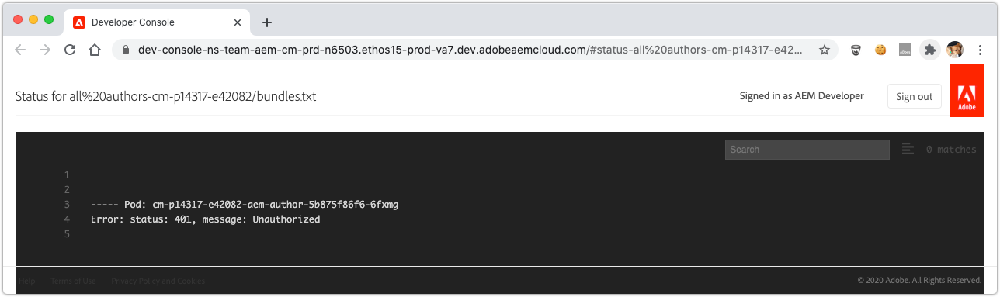
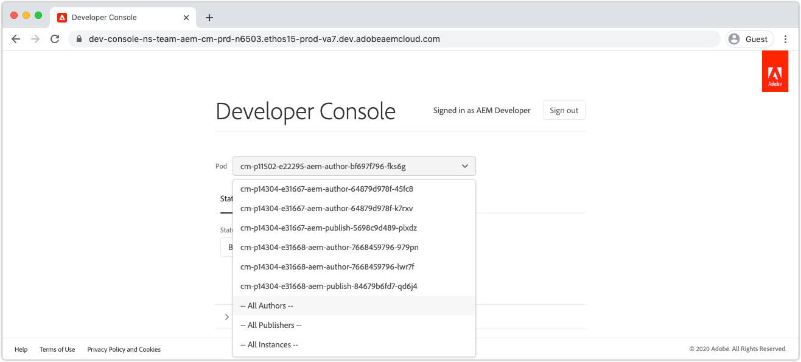
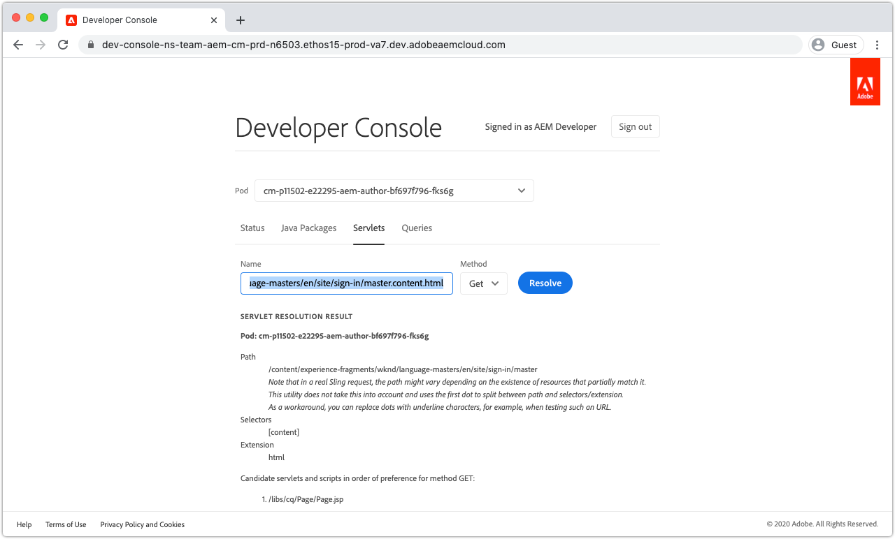

# Depuración AEM as a Cloud Service con Developer Console

AEM as a Cloud Service proporciona una consola de desarrollador para cada entorno que expone varios detalles de la ejecución del servicio de AEM que son útiles para la depuración.

Cada entorno as a Cloud Service AEM tiene su propia Developer Console.

## Acceso a Developer Console

Para acceder y utilizar Developer Console, se deben conceder los siguientes permisos al Adobe ID del desarrollador mediante [Admin Console del Adobe](https://adminconsole.adobe.com).

1. Asegúrese de que la organización de Adobe que ha realizado Cloud Manager y AEM productos as a Cloud Service esté activa en el conmutador de organización de Adobe.
1. El desarrollador debe ser miembro del producto de Cloud Manager __Desarrollador: Cloud Service__ Perfil de producto.
   + Si no existe esta pertenencia, el desarrollador no podrá iniciar sesión en Developer Console.
1. El desarrollador debe ser miembro de __AEM usuarios__ o __Administradores de AEM__ Perfil de producto en AEM Author o Publish.
   + Si esta pertenencia no existe, la variable [status](#status) los volcados se agotarán con un error 401 no autorizado.

### Solución de problemas de acceso a Developer Console

#### 401 Error no autorizado en el estado de dumping

Si se informa de la descarga de cualquier estado como error 401 no autorizado, significa que el usuario aún no existe con los permisos necesarios en AEM as a Cloud Service o que el uso de tokens de inicio de sesión no es válido o ha caducado.

Para resolver el problema 401 No autorizado:

1. Asegúrese de que el usuario pertenece al perfil de producto de IMS de Adobe (AEM administradores o usuarios AEM) correspondiente a la instancia de producto as a Cloud Service de AEM de Developer Console asociada.
   + Recuerde que Developer Console accede a 2 instancias de producto de Adobe IMS; las instancias de producto AEM as a Cloud Service Author y Publish , de modo que asegúrese de que se utilizan los perfiles de producto correctos según el nivel de servicio que requiera acceso a través de Developer Console.
1. Inicie sesión en la AEM as a Cloud Service (Autor o Publicación) y asegúrese de que el usuario y los grupos se han sincronizado correctamente en AEM.
   + Developer Console requiere que el registro de usuario se cree en el nivel de servicio de AEM correspondiente para que se autentique en dicho nivel de servicio.
1. Borre las cookies del explorador, el estado de la aplicación (almacenamiento local) y vuelva a iniciar sesión en Developer Console, lo que garantiza que el token de acceso que Developer Console utiliza sea correcto y no haya caducado.

## Pod

AEM servicios as a Cloud Service de Author y Publish están compuestos por varias instancias respectivamente para gestionar la variabilidad del tráfico y las actualizaciones móviles sin downtime. Estas instancias se denominan Pods. La selección de la secuencia en Developer Console define el alcance de los datos que se exponen mediante los demás controles.

+ Un pod es una instancia discreta que forma parte de un servicio de AEM (autor o publicación)
+ Los pods son transitorios, lo que significa AEM los crea as a Cloud Service y los destruye según sea necesario
+ Solo los pods que forman parte del entorno as a Cloud Service de AEM asociado, se enumeran en el conmutador Pod de Developer Console del entorno.
+ En la parte inferior del conmutador de pod, las opciones de conveniencia permiten seleccionar pods por tipo de servicio:
   + Todos los autores
   + Todos los editores
   + Todas las instancias

## Estado

El estado proporciona opciones para generar un estado de ejecución de AEM específico en el texto o en la salida JSON. Developer Console proporciona información similar a la de la consola web OSGi local de inicio rápido del SDK de AEM, con la marcada diferencia de que Developer Console es de solo lectura.

### Paquetes

Paquetes enumera todos los paquetes OSGi en AEM. Esta funcionalidad es similar a [Paquetes OSGi locales de inicio rápido del SDK de AEM](http://localhost:4502/system/console/bundles) at `/system/console/bundles`.

Los paquetes ayudan a depurar mediante:

+ Lista de todos los paquetes OSGi implementados en AEM as a Service
+ Enumerar el estado de cada paquete OSGi; incluido si están activos o no
+ Proporcionar detalles sobre dependencias no resueltas que hacen que los paquetes OSGi no se vuelvan activos

### Componentes

Componentes enumera todos los componentes de OSGi en AEM. Esta funcionalidad es similar a [Componentes OSGi locales de inicio rápido del SDK de AEM](http://localhost:4502/system/console/components) at `/system/console/components`.

Los componentes ayudan a depurar mediante:

+ Lista de todos los componentes de OSGi implementados en AEM as a Cloud Service
+ Proporcionar el estado de cada componente OSGi; incluso si están activos o no están satisfechos
+ Proporcionar detalles en referencias de servicio insatisfechas puede hacer que los componentes de OSGi se vuelvan activos
+ Enumerar las propiedades de OSGi y sus valores enlazados al componente OSGi.
   + Esto mostrará los valores reales inyectados mediante [Variables de configuración de entorno OSGi](https://experienceleague.adobe.com/docs/experience-manager-cloud-service/content/implementing/deploying/configuring-osgi.html#environment-specific-configuration-values).

### Configuraciones

Configurations enumera todas las configuraciones del componente OSGi (propiedades y valores de OSGi). Esta funcionalidad es similar a [Administrador de configuración OSGi del inicio rápido local del SDK de AEM](http://localhost:4502/system/console/configMgr) at `/system/console/configMgr`.

La ayuda de configuraciones en la depuración se realiza de la siguiente manera:

+ Listado de propiedades OSGi y sus valores por componente OSGi
   + Esto NO muestra los valores reales inyectados mediante [Variables de configuración de entorno OSGi](https://experienceleague.adobe.com/docs/experience-manager-cloud-service/content/implementing/deploying/configuring-osgi.html#environment-specific-configuration-values). Consulte [Componentes](#components) arriba, para los valores insertados.
+ Localización e identificación de propiedades mal configuradas

### Índices Oak

Los índices Oak proporcionan un volcado de los nodos definidos debajo `/oak:index`. Tenga en cuenta que esto no muestra índices combinados, lo que ocurre cuando se modifica un índice de AEM.

La ayuda de los índices Oak para la depuración se realiza de la siguiente manera:

+ Lista de todas las definiciones de índices Oak que proporcionan información sobre cómo se ejecutan las consultas de búsqueda en AEM. Tenga en cuenta que los índices modificados a AEM no se reflejan aquí. Esta vista solo es útil para índices que solo proporciona AEM o que proporciona el código personalizado.

### Servicios OSGi

Componentes enumera todos los servicios de OSGi. Esta funcionalidad es similar a [Servicios OSGi de inicio rápido locales del SDK de AEM](http://localhost:4502/system/console/services) at `/system/console/services`.

Ayuda de OSGi Services para la depuración mediante:

+ Enumerar todos los servicios OSGi en AEM, junto con su paquete OSGi de suministro y todos los paquetes OSGi que lo consumen

### Trabajos de Sling

Sling Jobs enumera todas las colas de trabajos de Sling. Esta funcionalidad es similar a [Trabajos de inicio rápido locales del SDK de AEM](http://localhost:4502/system/console/slingevent) at `/system/console/slingevent`.

Ayuda de trabajos de Sling en la depuración mediante:

+ Listado de colas de trabajos de Sling y sus configuraciones
+ Proporcionar perspectivas sobre el número de trabajos de Sling activos, en cola y procesados, lo que resulta útil para depurar problemas con Workflow, Transient Workflow y otros trabajos realizados por trabajos de Sling en AEM.

## Paquetes Java

Los paquetes Java permiten comprobar si un paquete Java, y una versión, están disponibles para su uso en AEM as a Cloud Service. Esta funcionalidad es la misma que [Buscador de dependencias del SDK de inicio rápido local de AEM](http://localhost:4502/system/console/depfinder) at `/system/console/depfinder`.

Los paquetes Java se utilizan para generar problemas y los paquetes no se inician debido a importaciones no resueltas o clases no resueltas en scripts (HTL, JSP, etc.). Si los paquetes Java no informan de ningún paquete exportan un paquete Java (o la versión no coincide con la importada por un paquete OSGi):

+ Asegúrese de que la versión de AEM dependencia de maven de la API del proyecto coincide con la versión de la versión de AEM del entorno (y, si es posible, actualice todo a la versión más reciente).
+ Si se utilizan dependencias adicionales de Maven en el proyecto de Maven
   + Determine si se puede utilizar en su lugar una API alternativa proporcionada por la dependencia de la API del SDK de AEM.
   + Si se requiere la dependencia adicional, asegúrese de que se proporciona como un paquete OSGi (en lugar de un Jar simple) y que está incrustado en el paquete de código de su proyecto, (`ui.apps`), similar a cómo se incrusta el paquete principal de OSGi en el `ui.apps` paquete.

## Servlets

Servlets se utiliza para proporcionar perspectiva sobre cómo AEM resuelve una URL en un servlet o script de Java (HTL, JSP) que gestiona la solicitud en última instancia. Esta funcionalidad es la misma que [Sling Servlet Resolver del SDK de inicio rápido local de AEM](http://localhost:4502/system/console/servletresolver) at `/system/console/servletresolver`.

Servlets ayuda a la depuración a determinar:

+ Cómo se descompone una URL en sus partes a las que se puede dirigir (recurso, selector, extensión).
+ A qué servlet o script se resuelve una URL, lo que ayuda a identificar las URL mal formadas o los servlets o scripts mal registrados.

## Consultas

Las consultas ayudan a proporcionar perspectivas sobre qué y cómo se ejecutan las consultas de búsqueda en AEM. Esta funcionalidad es la misma que  [Herramientas locales de inicio rápido del SDK de AEM > Rendimiento de la consulta ](http://localhost:4502/libs/granite/operations/content/diagnosistools/queryPerformance.html) consola.

Las consultas solo funcionan cuando se selecciona un pod específico, ya que se abre la consola web del rendimiento de las consultas del pod, lo que requiere que el desarrollador tenga acceso para iniciar sesión en el servicio de AEM.

Las consultas ayudan a depurar mediante:

+ Explicar cómo Oak interpreta, analiza y ejecuta las consultas. Esto es muy importante a la hora de rastrear por qué una consulta es lenta y de comprender cómo se puede acelerar.
+ Lista de las consultas más populares que se ejecutan en AEM, con la capacidad de explicarlas.
+ Enumerar las consultas más lentas que se ejecutan en AEM, con la capacidad de explicarlas.
