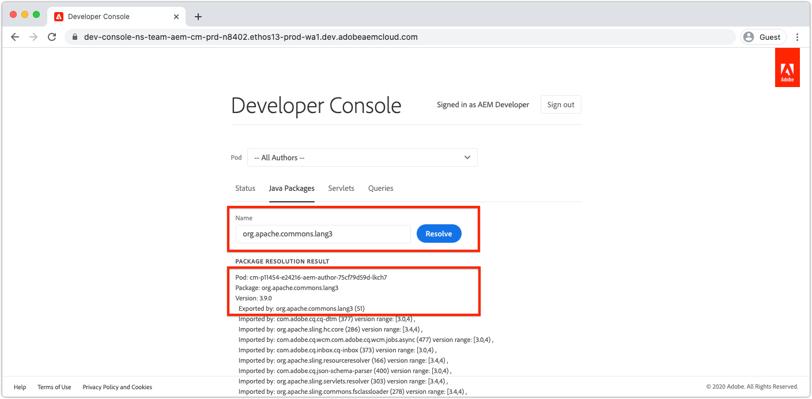

# Depuración de AEM como Cloud Service con la Consola de programadores

AEM como Cloud Service proporciona una consola de desarrollador para cada entorno que expone varios detalles del servicio de AEM en ejecución que son útiles para la depuración.

Cada AEM como entorno Cloud Service tiene su propia consola de desarrollador.

## Acceso a la consola de desarrollador

Para acceder a la consola de desarrollador y utilizarla, se deben otorgar los siguientes permisos al Adobe ID del desarrollador mediante el Admin Console [del](https://adminconsole.adobe.com)Adobe.

1. Asegúrese de que la organización de Adobe que ha realizado Cloud Manager y AEM como productos de Cloud Service esté activa en el conmutador de organización de Adobe.
1. El desarrollador debe ser miembro del __desarrollador del producto Cloud Manager: Perfil del producto Cloud Service__ .
   + Si este abono no existe, el desarrollador no podrá iniciar sesión en Developer Console.
1. El desarrollador debe ser miembro del Perfil de producto Administradores ____ AEM del servicio de AEM Author y Publish.
   + Si no existe este abono, los [volcados de estado](#status) se agotarán con un error 401 No autorizado.

### Resolución de problemas de acceso a la consola de desarrollador

#### 401 Error no autorizado en el estado de dumping

Si se produce un error 401 no autorizado al vaciar algún estado, significa que el usuario no existe todavía con los permisos necesarios en AEM como Cloud Service o que los tokens de inicio de sesión utilizados no son válidos o han caducado.

Para resolver el problema 401 No autorizado:

1. Asegúrese de que el usuario es miembro del Perfil de productos de IMS de Adobe (administradores AEM o usuarios AEM) correspondiente a la AEM asociada de la consola de desarrollador como instancia de producto de Cloud Service.
   + Recuerde que Developer Console tiene acceso a 2 instancias de producto de Adobe IMS; la AEM como Cloud Service Autor y Publicar instancias de producto, por lo que debe asegurarse de que se utilizan los Perfiles de producto correctos en función del nivel de servicio al que se deba acceder mediante la consola de desarrollador.
1. Inicie sesión en el AEM como Cloud Service (autor o publicación) y asegúrese de que el usuario y los grupos se han sincronizado correctamente en AEM.
   + Developer Console requiere que el registro de usuario se cree en el nivel de servicio de AEM correspondiente para que se autentique en dicho nivel de servicio.
1. Borre las cookies del explorador, así como el estado de la aplicación (almacenamiento local) y vuelva a iniciar sesión en la consola de desarrollador, asegurándose de que la consola de desarrollador de token de acceso está utilizando es correcta y no ha caducado.

## Pod

AEM como Cloud Service Autor y Servicios de publicación están compuestos de varias instancias respectivamente para gestionar la variabilidad del tráfico y las actualizaciones móviles sin downtime. Estas instancias se denominan Pods. La selección del pod en la consola de desarrollador define el alcance de los datos que se expondrán a través de los demás controles.

+ Un pod es una instancia discreta que forma parte de un servicio de AEM (autor o publicación)
+ Los pods son transitorios, lo que significa AEM cuando un Cloud Service los crea y destruye según sea necesario
+ Solo se muestran los pods que forman parte del AEM asociado como entorno de Cloud Service en el conmutador de pods de la consola de desarrollador de entorno.
+ En la parte inferior del conmutador de pod, las opciones de comodidad permiten seleccionar pods por tipo de servicio:
   + Todos los autores
   + Todos los editores
   + Todas las instancias

## Estado

El estado proporciona opciones para obtener un estado de tiempo de ejecución de AEM específico en texto o salida JSON. La consola de desarrollador proporciona información similar a la de OSGi del SDK de inicio rápido local de AEM, con la marcada diferencia de que la consola de desarrollador es de solo lectura.

### Paquetes

Agrupa todas las listas OSGi en AEM. Esta funcionalidad es similar a la de los paquetes OSGi de inicio rápido [AEM SDK](http://localhost:4502/system/console/bundles) local en `/system/console/bundles`.

Los paquetes ayudan a depurar mediante:

+ Lista de todos los paquetes de OSGi implementados en AEM como un servicio
+ Enumerar el estado de cada paquete OSGi; incluso si están activos o no
+ Proporcionar detalles sobre las dependencias no resueltas que hacen que los paquetes de OSGi no se activen

### Componentes

Componentes lista todos los componentes OSGi de AEM. Esta funcionalidad es similar a [AEM componentes](http://localhost:4502/system/console/components) OSGi locales de inicio rápido del SDK en `/system/console/components`.

Los componentes ayudan en la depuración mediante:

+ Lista de todos los componentes de OSGi implementados en AEM como Cloud Service
+ Proporcionar el estado de cada componente OSGi; incluso si están activos o no están satisfechos
+ Proporcionar detalles en referencias de servicio insatisfechas puede hacer que los componentes de OSGi se activen
+ Lista de propiedades de OSGi y sus valores enlazados al componente OSGi

### Configuraciones

Configuraciones lista todas las configuraciones del componente OSGi (propiedades y valores de OSGi). Esta funcionalidad es similar a la de [AEM Administrador](http://localhost:4502/system/console/configMgr) de configuración OSGi local de inicio rápido del SDK en `/system/console/configMgr`.

La ayuda de las configuraciones en la depuración se realiza mediante:

+ Lista de propiedades OSGi y sus valores por componente OSGi
+ Localización e identificación de propiedades mal configuradas

### Índices de roble

Los índices de roble proporcionan un volcado de los nodos definidos debajo `/oak:index`. Tenga en cuenta que esto no muestra índices combinados, lo que ocurre cuando se modifica un índice de AEM.

Ayuda de los índices Oak en la depuración mediante:

+ Enumerar todas las definiciones de índices Oak que proporcionan perspectivas sobre cómo se ejecutan las consultas de búsqueda en AEM. Tenga en cuenta que los índices modificados a AEM no se reflejan aquí. Esta vista solo es útil para índices que son proporcionados únicamente por AEM, o solamente por el código personalizado.

### Servicios OSGi

Componentes lista todos los servicios de OSGi. Esta funcionalidad es similar a los servicios OSGi de inicio rápido [AEM SDK locales en](http://localhost:4502/system/console/services) `/system/console/services`.

Ayuda de OSGi Services en la depuración mediante:

+ Enumerar todos los servicios OSGi en AEM, junto con su paquete OSGi y todos los paquetes OSGi que lo consumen

### Trabajos sling

Sling Jobs lista todas las colas de trabajos Sling. Esta funcionalidad es similar a los trabajos [de inicio rápido del SDK de](http://localhost:4502/system/console/slingevent) AEM en `/system/console/slingevent`.

Ayuda de Sling Jobs en la depuración mediante:

+ Lista de colas de trabajos Sling y sus configuraciones
+ Proporcionar perspectivas sobre el número de trabajos Sling activos, en cola y procesados, lo que resulta útil para depurar problemas con Flujo de trabajo, Flujo de trabajo transitorio y otros trabajos realizados por Sling Jobs en AEM.

## Paquetes Java

Los paquetes Java permiten comprobar si un paquete Java, y una versión, están disponibles para su uso en AEM como Cloud Service. Esta funcionalidad es la misma que [AEM Buscador](http://localhost:4502/system/console/depfinder) de Dependencias de inicio rápido local del SDK en `/system/console/depfinder`.

Los paquetes Java se utilizan para generar problemas. Los paquetes no se inician debido a importaciones no resueltas o clases sin resolver en scripts (HTL, JSP, etc.). Si los informes de paquetes Java no contienen paquetes para exportar un paquete Java (o si la versión no coincide con la importada por un paquete OSGi):

+ Asegúrese de que la versión de la dependencia de la API de AEM del proyecto coincide con la versión de AEM versión del entorno (y, si es posible, actualice todo a la versión más reciente).
+ Si se utilizan dependencias Maven adicionales en el proyecto Maven
   + Determine si se puede usar una API alternativa proporcionada por la dependencia de la API del SDK de AEM en su lugar.
   + Si se requiere la dependencia adicional, asegúrese de que se proporciona como un paquete OSGi (en lugar de un Jar sin formato) y que está incrustado en el paquete de código del proyecto (`ui.apps`), de forma similar a como el paquete OSGi principal está incrustado en el `ui.apps` paquete.

## Servlets

Servlets se utiliza para proporcionar información sobre cómo AEM resuelve una URL en un servlet o secuencia de comandos Java (HTL, JSP) que gestiona la solicitud en última instancia. Esta funcionalidad es la misma que la de Sling Servlet Resolver [del SDK de inicio rápido](http://localhost:4502/system/console/servletresolver) AEM en `/system/console/servletresolver`.

Servlets ayuda a la depuración a determinar:

+ Cómo se descompone una dirección URL en sus partes direccionables (recurso, selector, extensión).
+ Qué servlet o secuencia de comandos resuelve una URL, lo que ayuda a identificar las URL mal formadas o los servlets o scripts mal registrados.

## Consultas

Las consultas ayudan a proporcionar perspectivas sobre qué y cómo se ejecutan las consultas de búsqueda en AEM. Esta funcionalidad es la misma que la de [AEM consola de inicio rápido del SDK local Herramientas > Rendimiento de la Consulta ](http://localhost:4502/libs/granite/operations/content/diagnosistools/queryPerformance.html) .

Las consultas solo funcionan cuando se selecciona un pod específico, ya que se abre la consola web Rendimiento de Consulta del pod, lo que requiere que el desarrollador tenga acceso para iniciar sesión en el servicio de AEM.

Las consultas ayudan a depurar mediante:

+ Explicar cómo Oak interpreta, analiza y ejecuta las consultas. Esto es muy importante al rastrear por qué una consulta es lenta y comprender cómo se puede acelerar.
+ Enumerar las consultas más populares que se ejecutan en AEM, con la capacidad de explicarlas.
+ Enumerar las consultas más lentas que se ejecutan en AEM, con la capacidad de explicarlas.
