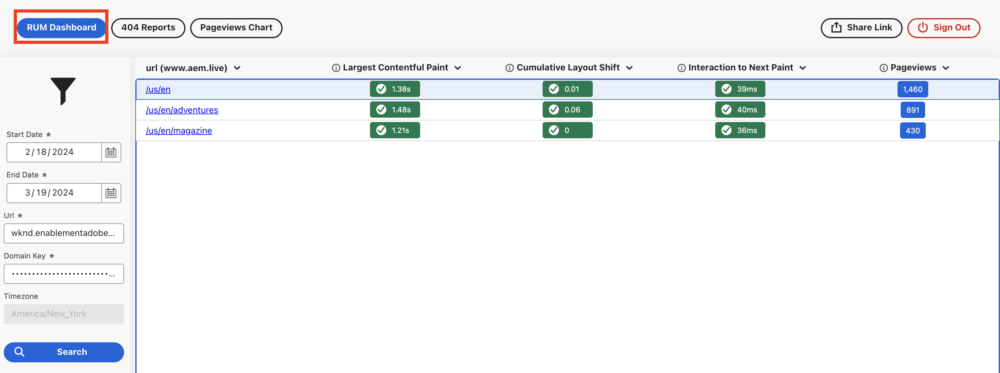

# Monitorización de usuarios reales (RUM)

AEM Obtenga información sobre Real User Monitoring (RUM) en el sitio web de as a Cloud Service. Obtenga información sobre cómo habilitar RUM, qué datos se recopilan y cómo utilizar los datos de RUM para optimizar la experiencia del usuario en el sitio web.

## Información general

Real User Monitoring (RUM) es un método utilizado para _recopilar, medir y analizar las interacciones y experiencias de los usuarios_ con un sitio web en tiempo real. Proporciona información sobre la interacción de los visitantes del sitio con el sitio web, incluido su comportamiento, rendimiento y experiencia general. Esto se logra inyectando un pequeño fragmento de código JavaScript en las páginas del sitio.

Con el código JavaScript, RUM captura los datos directamente desde el navegador del usuario mientras interactúan con su sitio web. Estos datos se pueden utilizar para identificar y diagnosticar problemas de rendimiento, optimizar la experiencia del usuario y mejorar los resultados empresariales.

AEM La función RUM en el as a Cloud Service de la ofrece una vista completa de la experiencia del usuario en el sitio web. Captura las siguientes métricas clave para cada página (URL) visitada por el usuario:

- [Pintado de contenido más grande (LCP)](https://web.dev/articles/lcp) - mide el rendimiento de carga.
- [Desplazamiento de diseño acumulativo (CLS)](https://web.dev/articles/cls) - mide la estabilidad visual.
- [Interacción con la siguiente pintura (INP)](https://web.dev/articles/inp) - mide la interactividad.
- Vistas de página: mide la cantidad de veces que se ve una página.

También captura los errores 404 y los gráficos de vista de páginas para el sitio web.

Las métricas de LCP, CLS e INP forman parte del [Elementos vitales web básicos](https://web.dev/articles/vitals) que son un conjunto de métricas relacionadas con la velocidad, la capacidad de respuesta y la estabilidad visual de un sitio web. Google utiliza estas métricas para medir la experiencia del usuario en un sitio web, y son importantes para la clasificación de los motores de búsqueda.

## Activar RUM

Para habilitar RUM para su sitio web de AEM CS, consulte [Configuración del Servicio de Control de Usuarios Reales](https://experienceleague.adobe.com/en/docs/experience-manager-cloud-service/content/implementing/using-cloud-manager/content-requests#how-to-set-up-the-rum-service).

Los detalles clave del RUM en AEM CS son:

- El RUM solo se aplica al servicio de publicación de AEM CS, lo que significa que el código JavaScript solo se inserta en el entorno de publicación.
- El `com.adobe.granite.webvitals.WebVitalsConfig` La configuración de OSGi controla las rutas de inclusión y exclusión, que son rutas del repositorio y no rutas de URL.
- De forma predeterminada `/content` ruta de acceso incluida.
- Para excluir las rutas, agregue la variable `AEM_WEBVITALS_EXCLUDE` Variable de entorno de Cloud Manager, consulte [Adición de variables de entorno](https://experienceleague.adobe.com/en/docs/experience-manager-cloud-service/content/implementing/using-cloud-manager/environment-variables#add-variables). Las rutas están separadas por una coma.
- El código OOTB es responsable de insertar el código JavaScript en las páginas.

### de verificación

Para comprobar si RUM está habilitado para su sitio web, vea el origen del HTML de la página publicada y busque los siguientes bloques de scripts:

```html
...

<!-- Added before the closing </head> tag -->
<script type="module">
    window.RUM_BASE = 'https://rum.hlx.page/';
    import { sampleRUM } from 'https://rum.hlx.page/.rum/@adobe/helix-rum-js@^1/src/index.js';
    sampleRUM('top');
    window.addEventListener('load', () => sampleRUM('load'));
    document.addEventListener('click', () => sampleRUM('click'));
</script>

...

<!-- Added before the closing </body> tag -->
<script type="module">
    window.RUM_BASE = 'https://rum.hlx.page/';
    import { sampleRUM } from 'https://rum.hlx.page/.rum/@adobe/helix-rum-js@^1/src/index.js';
    sampleRUM('lazy');
    sampleRUM('cwv');
</script>
```

## Recopilación de datos de RUM

- Los datos de RUM se recopilan utilizando `sampleRUM()` pasando el nombre del punto de comprobación. En el ejemplo anterior, los puntos de comprobación son `top`, `load`, `click`, `lazy`, y `cwv`.
- Un punto de comprobación es un evento con nombre en la secuencia de carga de la página e interacción con ella.

Consulte también [Servicio de monitorización de usuarios reales y privacidad](https://experienceleague.adobe.com/en/docs/experience-manager-cloud-service/content/implementing/using-cloud-manager/content-requests#rum-service-and-privacy) y [Qué datos se recopilan](https://experienceleague.adobe.com/en/docs/experience-manager-cloud-service/content/implementing/using-cloud-manager/content-requests#what-data-is-being-collected) para obtener más información.

## Vista de datos de RUM

Para ver los datos de RUM que necesita `domainkey`, el Adobe lo proporciona como parte de la configuración de RUM. El tablero de RUM está disponible en [https://data.aem.live/](https://data.aem.live/) y puede acceder a él mediante la clave de dominio y la url.

AEM Por ejemplo, la siguiente captura de pantalla muestra el tablero RUM para el sitio web de WKND de.



El panel RUM proporciona las siguientes perspectivas clave:

- **Métricas de rendimiento** - LCP, CLS, INP y vistas de página.
- **Métricas de error** - Errores 404.
- **Gráficos de vista de página** : Número de vistas de página a lo largo del tiempo.

## Cómo utilizar los datos de RUM

Con las perspectivas anteriores, puede optimizar la experiencia del usuario en el sitio web. Por ejemplo:

- Reduzca LCP, CLS e INP para mejorar el rendimiento de carga de página y la interactividad. Consulte [Cómo mejorar el LCP](https://web.dev/articles/lcp#improve-lcp), [Cómo mejorar CLS](https://web.dev/articles/cls#improve-cls) y [Cómo mejorar el INP](https://web.dev/articles/inp#improve-inp)para obtener más información.
- Para mejorar la experiencia del usuario, corrija los errores 404.
- Para comprender el comportamiento del usuario y optimizar el contenido, analice los gráficos de vista de página.

El Adobe recomienda una revisión periódica del tablero de RUM y especialmente después de una liberación mayor o menor.

Consulte también [Quién puede beneficiarse del servicio de monitorización de usuarios reales](https://experienceleague.adobe.com/en/docs/experience-manager-cloud-service/content/implementing/using-cloud-manager/content-requests#who-can-benefit-from-rum-service) para obtener más información.
