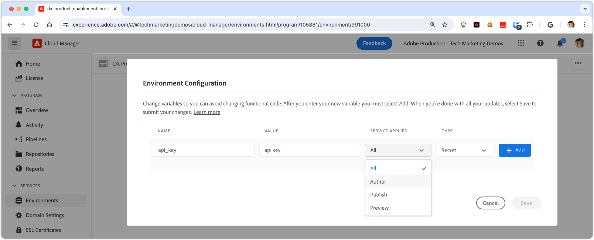

# Administración de secretos en AEM as a Cloud Service

La administración de secretos, como claves y contraseñas de API, es crucial para mantener la seguridad de la aplicación. Adobe Experience Manager (AEM) as a Cloud Service ofrece herramientas sólidas para gestionar secretos de forma segura.

En este tutorial, aprenderá las prácticas recomendadas para administrar secretos dentro de AEM. Cubriremos las herramientas y técnicas proporcionadas por AEM para proteger su información confidencial, asegurándonos de que la aplicación siga siendo segura y confidencial.

Este tutorial supone un conocimiento práctico del desarrollo de Java de AEM, los servicios OSGi, los modelos Sling y Adobe Cloud Manager.

## Servicio OSGi del administrador de secretos

En AEM as a Cloud Service, la administración de secretos mediante los servicios OSGi proporciona un enfoque escalable y seguro. Los servicios OSGi se pueden configurar para administrar información confidencial, como claves y contraseñas de API, definidas a través de configuraciones de OSGi y configuradas mediante Cloud Manager.

### Implementación del servicio OSGi

Analizaremos el desarrollo de un servicio OSGi personalizado que [expone secretos de las configuraciones de OSGi](https://experienceleague.adobe.com/en/docs/experience-manager-cloud-service/content/implementing/deploying/configuring-osgi#secret-configuration-values).

La implementación lee secretos de la configuración de OSGi a través del método `@Activate` y los expone a través del método `getSecret(String secretName)`. También puede crear métodos discretos como `getApiKey()` para cada secreto, pero este método requiere más mantenimiento a medida que se agregan o eliminan secretos.

```java
package com.example.core.util.impl;

import com.example.core.util.SecretsManager;
import org.osgi.service.component.annotations.*;
import org.slf4j.Logger;
import org.slf4j.LoggerFactory;
import org.apache.sling.api.resource.ValueMap;
import org.apache.sling.api.resource.ValueMapDecorator;
import java.util.Map;

@Component(
    service = { SecretsManager.class }
)
public class SecretsManagerImpl implements SecretsManager {
    private static final Logger log = LoggerFactory.getLogger(SecretsManagerImpl.class);
 
    private ValueMap secrets;

    @Override
    public String getSecret(String secretName) {
        return secrets.get(secretName, String.class);
    }

    @Activate
    @Modified
    protected void activate(Map<String, Object> properties) {
        secrets = new ValueMapDecorator(properties);
    }
}
```

Como servicio OSGi, es mejor registrarlo y consumirlo a través de una interfaz Java. A continuación se muestra una interfaz sencilla que permite a los consumidores obtener secretos por nombre de propiedad OSGi.

```java
package com.example.core.util;

import org.osgi.annotation.versioning.ConsumerType;

@ConsumerType
public interface SecretsManager {
    String getSecret(String secretName);
}
```

## Asignar secretos a la configuración de OSGi

Para exponer valores secretos en el servicio OSGi, asígnelos a configuraciones OSGi usando [valores de configuración secreta OSGi](https://experienceleague.adobe.com/en/docs/experience-manager-cloud-service/content/implementing/deploying/configuring-osgi#secret-configuration-values). Defina el nombre de la propiedad OSGi como la clave para recuperar el valor secreto del método `SecretsManager.getSecret()`.

Defina los secretos en el archivo de configuración OSGi `/apps/example/osgiconfig/config/com.example.core.util.impl.SecretsManagerImpl.cfg.json` en su proyecto de AEM Maven. Cada propiedad representa un secreto expuesto en AEM, con el valor establecido mediante Cloud Manager. La clave es el nombre de la propiedad OSGi, que se utiliza para recuperar el valor secreto del servicio `SecretsManager`.

```json
{
    "api.key": "$[secret:api_key]",
    "service.password": "$[secret:service_password]"
}
```

Como alternativa al uso de un servicio OSGi de administrador de secretos compartido, puede incluir secretos directamente en la configuración OSGi de servicios específicos que los utilizan. Este método es útil cuando los secretos solo los necesita un único servicio OSGi y no se comparten en varios servicios. En este caso, los valores secretos se definen en el archivo de configuración OSGi para el servicio específico y se accede a ellos en el código Java del servicio a través del método `@Activate`.

## Consumir secretos

Los secretos se pueden consumir desde el servicio OSGi de varias formas, como desde un modelo Sling u otro servicio OSGi. A continuación se muestran ejemplos de cómo consumir secretos de ambos.

### Del modelo Sling

Los modelos Sling suelen proporcionar lógica empresarial a los componentes del sitio de AEM. El servicio OSGi `SecretsManager` se puede consumir mediante la anotación `@OsgiService` y utilizar en el modelo Sling para recuperar el valor secreto.

```java
import com.example.core.util.SecretsManager;
import org.apache.sling.api.resource.Resource;
import org.apache.sling.api.servlets.SlingHttpServletRequest;
import org.apache.sling.models.annotations.Model;
import org.apache.sling.models.annotations.OsgiService;

@Model(
    adaptables = {SlingHttpServletRequest.class, Resource.class},
    adapters = {ExampleDatabaseModel.class}
)
public class ExampleDatabaseModelImpl implements ExampleDatabaseModel {

    @OsgiService
    SecretsManager secretsManager;

    @Override 
    public String doWork() {
        final String secret = secretsManager.getSecret("api.key");
        // Do work with secret
    }
}
```

### Del servicio OSGi

Los servicios OSGi suelen exponer la lógica empresarial reutilizable dentro de AEM, utilizada por los modelos Sling, los servicios AEM como Flujos de trabajo u otros servicios OSGi personalizados. El servicio OSGi `SecretsManager` se puede consumir a través de la anotación `@Reference` y utilizar dentro del servicio OSGi para recuperar el valor secreto.

```java
import com.example.core.util.SecretsManager;
import org.osgi.service.component.annotations.Component;
import org.osgi.service.component.annotations.Reference;

@Component
public class ExampleSecretConsumerImpl implements ExampleSecretConsumer {

    @Reference
    SecretsManager secretsManager;

    public void doWork() {
        final String secret = secretsManager.getSecret("service.password");
        // Do work with the secret
    }
}
```

## Establecer secretos en Cloud Manager

Con el servicio y la configuración OSGi en su lugar, el paso final es establecer los valores secretos en Cloud Manager.

Los valores de los secretos se pueden establecer mediante la [API de Cloud Manager](https://developer.adobe.com/experience-cloud/cloud-manager/reference/api/#tag/Variables) o, más comúnmente, mediante la [IU de Cloud Manager](https://experienceleague.adobe.com/en/docs/experience-manager-cloud-service/content/implementing/using-cloud-manager/environment-variables#overview). Para aplicar una variable secreta a través de la interfaz de usuario de Cloud Manager:



1. Inicie sesión en [Adobe Cloud Manager](https://my.cloudmanager.adobe.com).
1. Seleccione el programa y el entorno de AEM para el que desea establecer el secreto.
1. En la vista Detalles del entorno, seleccione la ficha **Configuración**.
1. Seleccione **Añadir**.
1. En el cuadro de diálogo Configuración del entorno:
   - Introduzca el nombre secreto de la variable (por ejemplo, `api_key`) a la que se hace referencia en la configuración OSGi.
   - Introduzca el valor secreto.
   - Seleccione a qué servicio de AEM se aplica el secreto.
   - Seleccione **Secreto** como tipo.
1. Seleccione **Agregar** para mantener el secreto.
1. Añada tantos secretos como sea necesario. Una vez finalizado, seleccione **Guardar** para aplicar los cambios inmediatamente al entorno de AEM.

El uso de configuraciones de Cloud Manager para secretos proporciona la ventaja de aplicar valores diferentes para entornos o servicios diferentes y de girar los secretos sin volver a implementar la aplicación de AEM.
