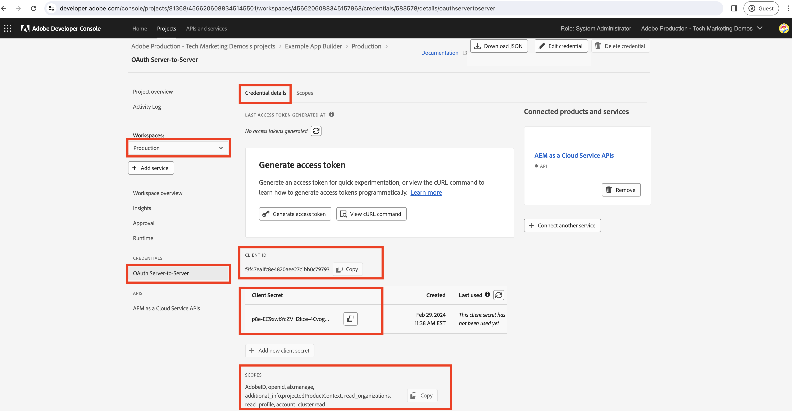

# Generar token de acceso de servidor a servidor en la acción del Generador de aplicaciones

Es posible que las acciones del Generador de aplicaciones deban interactuar con las API de Adobe compatibles **Credenciales de servidor a servidor OAuth** y están asociados a proyectos de la consola de Adobe Developer en los que se implementa la aplicación App Builder.

Esta guía explica cómo generar un token de acceso utilizando _Credenciales de servidor a servidor OAuth_ para su uso en una acción del Generador de aplicaciones.

>[!IMPORTANT]
>
> Las credenciales de la cuenta de servicio (JWT) han quedado obsoletas y pasan a ser credenciales de servidor a servidor OAuth. Sin embargo, todavía hay algunas API de Adobe que solo admiten credenciales de cuenta de servicio (JWT) y la migración de OAuth de servidor a servidor está en curso. Consulte la documentación de la API de Adobe para comprender qué credenciales se admiten.

## Configuraciones del proyecto de la consola Adobe Developer

Al agregar la API de Adobe deseada al proyecto de la consola de Adobe Developer, en el _Configurar API_ , seleccione la opción **Servidor a servidor OAuth** tipo de autenticación.


Para asignar la cuenta de servicio de integración creada automáticamente arriba, seleccione el perfil de producto deseado. Por lo tanto, a través del perfil de producto, los permisos de la cuenta de servicio están controlados.


## archivo .env

En el del proyecto del Creador de aplicaciones `.env` , anexe claves personalizadas para las credenciales de servidor a servidor OAuth del proyecto de la consola de Adobe Developer. Los valores de credenciales de servidor a servidor de OAuth se pueden obtener del proyecto de la consola de Adobe Developer __Credenciales__ > __Servidor a servidor OAuth__ para un espacio de trabajo determinado.



```
...
OAUTHS2S_CLIENT_ID=58b23182d80a40fea8b12bc236d71167
OAUTHS2S_CLIENT_SECRET=p8e-EIRF6kY6EHLBSdw2b-pLUWKodDqJqSz3
OAUTHS2S_CECREDENTIALS_METASCOPES=AdobeID,openid,ab.manage,additional_info.projectedProductContext,read_organizations,read_profile,account_cluster.read
```

Los valores de `OAUTHS2S_CLIENT_ID`, `OAUTHS2S_CLIENT_SECRET`, `OAUTHS2S_CECREDENTIALS_METASCOPES` se puede copiar directamente desde la pantalla Credenciales de servidor a servidor OAuth del proyecto de la consola de Adobe Developer.

## Asignación de entradas

Con el valor de credencial de servidor a servidor OAuth establecido en la variable `.env` , deben asignarse a las entradas de acción de AppBuilder para que se puedan leer en la propia acción. Para ello, añada entradas para cada variable en la variable `ext.config.yaml` acción `inputs` con el formato: `PARAMS_INPUT_NAME: $ENV_KEY`.

Por ejemplo:

```yaml
operations:
  view:
    - type: web
      impl: index.html
actions: actions
runtimeManifest:
  packages:
    dx-excshell-1:
      license: Apache-2.0
      actions:
        generic:
          function: actions/generic/index.js
          web: 'yes'
          runtime: nodejs:16
          inputs:
            LOG_LEVEL: debug
            OAUTHS2S_CLIENT_ID: $OAUTHS2S_CLIENT_ID
            OAUTHS2S_CLIENT_SECRET: $OAUTHS2S_CLIENT_SECRET
            OAUTHS2S_CECREDENTIALS_METASCOPES: $OAUTHS2S_CECREDENTIALS_METASCOPES
          annotations:
            require-adobe-auth: false
            final: true
```

Las claves definidas en `inputs` están disponibles en la `params` objeto proporcionado a la acción del Generador de aplicaciones.

## Credenciales de servidor a servidor OAuth para el token de acceso

En la acción Generador de aplicaciones, las credenciales de servidor a servidor de OAuth están disponibles en el `params` objeto. Con estas credenciales, el token de acceso se puede generar utilizando [Bibliotecas OAuth 2.0](https://oauth.net/code/). O puede usar la variable [Biblioteca de recuperación de nodos](https://www.npmjs.com/package/node-fetch) para realizar una solicitud del POST al extremo del token de IMS de Adobe para obtener el token de acceso.

En el siguiente ejemplo se muestra cómo utilizar el complemento `node-fetch` para realizar una solicitud del POST al extremo del token de IMS de Adobe para obtener el token de acceso.

```javascript
const fetch = require("node-fetch");
const { Core } = require("@adobe/aio-sdk");
const { errorResponse, stringParameters, checkMissingRequestInputs } = require("../utils");

async function main(params) {
  const logger = Core.Logger("main", { level: params.LOG_LEVEL || "info" });

  try {
    // Perform any necessary input error checking
    const systemErrorMessage = checkMissingRequestInputs(params, ["OAUTHS2S_CLIENT_ID", "OAUTHS2S_CLIENT_SECRET", "OAUTHS2S_CECREDENTIALS_METASCOPES"], []);

    // The Adobe IMS token endpoint URL
    const adobeIMSV3TokenEndpointURL = 'https://ims-na1.adobelogin.com/ims/token/v3';

    // The POST request options
    const options = {
        method: 'POST',
        headers: {
        'Content-Type': 'application/x-www-form-urlencoded',
        },
        body: `grant_type=client_credentials&client_id=${params.OAUTHS2S_CLIENT_ID}&client_secret=${params.OAUTHS2S_CLIENT_SECRET}&scope=${params.OAUTHS2S_CECREDENTIALS_METASCOPES}`,
    };

    // Make a POST request to the Adobe IMS token endpoint to get the access token
    const tokenResponse = await fetch(adobeIMSV3TokenEndpointURL, options);
    const tokenResponseJSON = await tokenResponse.json();

    // The 24-hour IMS Access Token is used to call the AEM Data Service API
    // Can look at caching this token for 24 hours to reduce calls
    const accessToken = tokenResponseJSON.access_token;

    // Invoke an AEM Data Service API using the access token
    const aemDataResponse = await fetch(`https://api.adobeaemcloud.com/adobe/stats/statistics/contentRequestsQuota?imsOrgId=${IMS_ORG_ID}&current=true`, {
      headers: {
        'X-Adobe-Accept-Experimental': '1',
        'x-gw-ims-org-id': IMS_ORG_ID,
        'X-Api-Key': params.OAUTHS2S_CLIENT_ID,
        Authorization: `Bearer ${access_token}`, // The 24-hour IMS Access Token
      },
      method: "GET",
    });

    if (!aemDataResponse.ok) { throw new Error("Request to API failed with status code " + aemDataResponse.status);}

    // API data
    let data = await aemDataResponse.json();

    const response = {
      statusCode: 200,
      body: data,
    };

    return response;
  } catch (error) {
    logger.error(error);
    return errorResponse(500, "server error", logger);
  }
}

exports.main = main;
```
