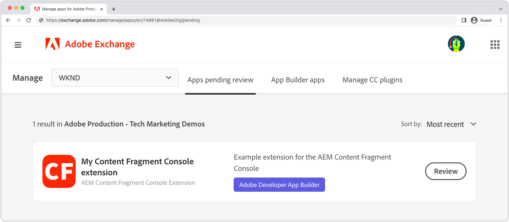

# Implementar una extensión

Para su uso en entornos as a Cloud Service AEM, la aplicación de extensión App Builder debe implementarse y aprobarse.

Hay que tener en cuenta varias consideraciones a la hora de implementar las aplicaciones de extensión de App Builder:

+ Las extensiones se implementan en el espacio de trabajo del proyecto de la consola de Adobe Developer. Los espacios de trabajo predeterminados son:
   + __Producción__ workspace contiene implementaciones de extensiones disponibles en todas AEM as a Cloud Service.
   + __Prueba__ workspace actúa como espacio de trabajo para desarrolladores. Las extensiones implementadas en el espacio de trabajo de Stage no están disponibles en AEM as a Cloud Service.
Los espacios de trabajo de la consola de Adobe Developer no tienen correlación directa con AEM tipos de entorno as a Cloud Service.
+ Una extensión implementada en el espacio de trabajo de producción se muestra en todos AEM entornos as a Cloud Service de la organización de Adobe en la que existe la extensión.
Una extensión no se puede limitar a los entornos con los que está registrada añadiendo [lógica condicional que comprueba el nombre de host as a Cloud Service AEM](https://developer.adobe.com/uix/docs/guides/publication/#enabling-extension-only-on-specific-aem-environments).
+ Se pueden usar varias extensiones en AEM as a Cloud Service. Adobe recomienda que cada aplicación de extensión de App Builder se utilice para resolver un solo objetivo comercial. Dicho esto, una aplicación de App Builder de una sola extensión puede implementar varios puntos de extensión que admitan un objetivo comercial común.

## Implementación inicial

Para que una extensión esté disponible en AEM entornos as a Cloud Service, debe implementarse en la consola de Adobe Developer.

El proceso de implementación se divide en dos pasos lógicos:

1. Un desarrollador de la aplicación de extensión App Builder para la consola de Adobe Developer.
1. Aprobación de la extensión por un administrador de implementación o un propietario de empresa.

### Implementar la extensión de la aplicación App Builder

Implemente la extensión en el espacio de trabajo Producción. Las extensiones implementadas en el espacio de trabajo de producción se añaden automáticamente a todos AEM servicios de Autor as a Cloud Service en la organización de Adobe en la que se implementa la extensión.

1. Abra una línea de comandos en la raíz de la aplicación App Builder de la extensión actualizada.
1. Asegúrese de que el espacio de trabajo Producción esté activo

   ```shell
   $ aio app use -w Production
   ```

   Combinar cualquier cambio en `.env` y `.aio`.

1. Implemente la extensión actualizada de la aplicación App Builder.

   ```shell
   $ aio app deploy
   ```

#### Solicitud de aprobación de implementación

{align="center"}

1. Iniciar sesión en [Consola de Adobe Developer](https://developer.adobe.com)
1. Select __Consola__
1. Vaya a __Proyectos__
1. Seleccione el proyecto asociado a la extensión
1. Seleccione el __Producción__ workspace
1. Select __Enviar para aprobación__
1. Complete y envíe el formulario, actualizando los campos según sea necesario.

Tenga en cuenta que se requiere un icono. Si no tiene un icono, puede usar [este icono](./assets/deploy/icon.png).

### Aprobar la solicitud de implementación

{align="center"}

1. Iniciar sesión en [Adobe Exchange](https://exchange.adobe.com/)
1. Vaya a __Administrar__ > __Aplicaciones pendientes de revisión__
1. __Consulte__ la aplicación de extensión de App Builder
1. Si los cambios de la extensión son aceptables __Accept__ la revisión. Esto inserta inmediatamente la extensión en todos AEM servicios de Autor as a Cloud Service dentro de la organización de Adobe.

Una vez aprobada la solicitud de extensión, la extensión se activa inmediatamente en los servicios de autor as a Cloud Service de AEM.

## Actualizar una extensión

La actualización y la extensión de la aplicación App Builder siguen el mismo proceso que el [implementación inicial](#initial-deployment), con la desviación de que la implementación de la extensión existente debe revocarse primero.

### Revocar la extensión

Para implementar una nueva versión de una extensión, primero debe revocarse (o eliminarse). Mientras la extensión es revocada, no está disponible en AEM consolas.

1. Iniciar sesión en [Adobe Exchange](https://exchange.adobe.com/)
1. Vaya a __Administrar__ > __Aplicaciones de App Builder__
1. __Revocar__ la extensión para actualizar

### Implementación de la extensión

Implemente la extensión en el espacio de trabajo Producción. Las extensiones implementadas en el espacio de trabajo de producción se añaden automáticamente a todos AEM servicios de Autor as a Cloud Service en la organización de Adobe en la que se implementa la extensión.

1. Abra una línea de comandos en la raíz de la aplicación App Builder de la extensión actualizada.
1. Asegúrese de que el espacio de trabajo Producción esté activo

   ```shell
   $ aio app use -w Production
   ```

   Combinar cualquier cambio en `.env` y `.aio`.

1. Implemente la extensión actualizada de la aplicación App Builder.

   ```shell
   $ aio app deploy
   ```

#### Solicitud de aprobación de implementación

{align="center"}

1. Iniciar sesión en [Consola de Adobe Developer](https://developer.adobe.com)
1. Select __Consola__
1. Vaya a __Proyectos__
1. Seleccione el proyecto asociado a la extensión
1. Seleccione el __Producción__ workspace
1. Select __Enviar para aprobación__
1. Complete y envíe el formulario, actualizando los campos según sea necesario.

#### Aprobar la solicitud de implementación

{align="center"}

1. Iniciar sesión en [Adobe Exchange](https://exchange.adobe.com/)
1. Vaya a __Administrar__ > __Aplicaciones pendientes de revisión__
1. __Consulte__ la aplicación de extensión de App Builder
1. Si los cambios de la extensión son aceptables __Accept__ la revisión. Esto inserta inmediatamente la extensión en todos AEM servicios de Autor as a Cloud Service dentro de la organización de Adobe.

Una vez aprobada la solicitud de extensión, la extensión se activa inmediatamente en los servicios de autor as a Cloud Service de AEM.

## Eliminación de una extensión


Para quitar una extensión, revoque (o quite) la extensión de Adobe Exchange. Cuando se revoca la extensión, se elimina de todos AEM servicios de Autor as a Cloud Service.

1. Iniciar sesión en [Adobe Exchange](https://exchange.adobe.com/)
1. Vaya a __Administrar__ > __Aplicaciones de App Builder__
1. __Revocar__ la extensión que desea eliminar
