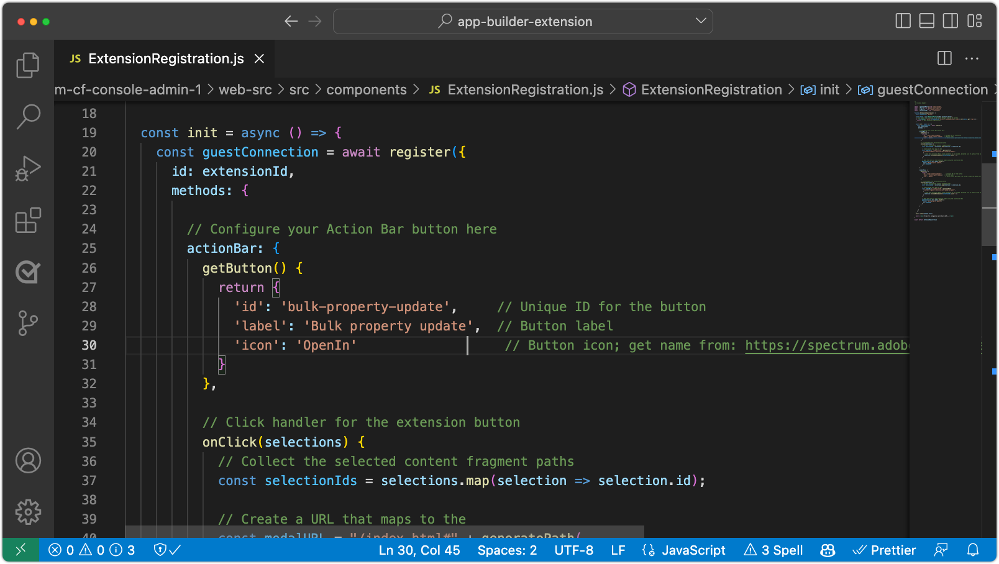

# Extensión de la consola Fragmentos de contenido de AEM

[Consola AEM fragmentos de contenido](https://experienceleague.adobe.com/docs/experience-manager-cloud-service/content/sites/administering/content-fragments/content-fragments-console.html?lang=es) las extensiones se pueden agregar mediante dos puntos de extensión: un botón de la sección [La consola Fragmento de contenido](https://experienceleague.adobe.com/docs/experience-manager-cloud-service/content/sites/administering/content-fragments/content-fragments-console.html?lang=es) menú de encabezado o barra de acciones. Las extensiones se escriben en JavaScript que se ejecutan como aplicaciones de App Builder y pueden implementar una interfaz de usuario web personalizada y acciones de Adobe I/O Runtime sin servidor para realizar un trabajo más intensivo y de larga duración.

{align="center"}

| Tipo de extensión | Descripción | Parámetros |
| :--- | :--- | :--- |
| Menú Encabezado | Agrega un botón al encabezado que se muestra cuando __zero__ Los fragmentos de contenido están seleccionados. | Ninguno. |
| Barra de acciones | Agrega un botón a la barra de acciones que se muestra cuando __uno o más__ Los fragmentos de contenido están seleccionados. | Matriz de las rutas de fragmentos de contenido seleccionadas. |

Una sola extensión de la consola de fragmentos de contenido AEM puede incluir cero o un menú de encabezado y cero o un tipo de extensión de barra de acciones. Si se requieren varios tipos de extensión del mismo tipo, se deben crear varias extensiones de la consola Fragmentos de contenido AEM.

AEM las extensiones de la consola Fragmentos de contenido requieren un [Proyecto de la consola de Adobe Developer](https://developer.adobe.com/uix/docs/services/aem-cf-console-admin/extension-development/#create-a-project-in-adobe-developer-console) y [aplicación de App Builder](https://developer.adobe.com/uix/docs/services/aem-cf-console-admin/code-generation) usando la variable `@adobe/aem-cf-admin-ui-ext-tpl` plantilla, asociada al proyecto de la consola de Adobe Developer.

Seleccione entre las siguientes funciones al generar la aplicación de App Builder, en función de lo que haga la extensión. Cualquier combinación de opciones se puede utilizar en una extensión.

|  | Botón Agregar a [Menú Encabezado](./header-menu.md) | Botón Agregar a [Barra de acciones](./action-bar.md) | Show [Modal](./modal.md) | Agregar [controlador del lado del servidor](./runtime-action.md) |
| ------------------------------------------ | :-----------------------: | :----------------------: | :--------: | :--------------------:  |
| Disponible cuando los fragmentos de contenido no están seleccionados | š |  |  |  |
| Disponible cuando se seleccionan uno o más fragmentos de contenido |  | ✔ |  |  |
| Recopila datos personalizados del usuario |  |  | ✔️ |  |
| Muestra comentarios personalizados al usuario |  |  | ✔️ |  |
| Invoca solicitudes HTTP a AEM |  |  |  | ✔ |
| Invoca solicitudes HTTP a servicios de Adobe o de terceros |  |  |  | ✔ |

## Documentación de Adobe Developer

Adobe Developer contiene detalles del desarrollador sobre AEM extensiones de la consola de fragmentos de contenido. Revise el [Contenido de Adobe Developer para obtener más información técnica](https://developer.adobe.com/uix/docs/).

## Desarrollo de una extensión

Siga los pasos descritos a continuación para aprender a generar, desarrollar e implementar una extensión de la consola de fragmentos de contenido AEM para AEM as a Cloud Service.

    <!-- Create Adobe Developer Project -->
    

        

            

                <figure class="image is-16by9">
                    
                </figure>
            

            

                

                    
1. Crear un proyecto

                    
Cree un proyecto de Adobe Developer Console que defina su acceso a otros servicios de Adobe y administre sus implementaciones.

                    <a href="https://developer.adobe.com/uix/docs/services/aem-cf-console-admin/extension-development/#create-a-project-in-adobe-developer-console" class="spectrum-Button spectrum-Button--outline spectrum-Button--primary spectrum-Button--sizeM" target="_adobe-developer-com">
                        Creación de un proyecto de Adobe Developer
                    </a>
                

            

        

    

    <!-- Generate an Extension app -->
    

        

            

                <figure class="image is-16by9">
                    
                </figure>
            

            

                

                    
2. Inicializar una aplicación de extensión

                    
Inicialice una aplicación del Generador de aplicaciones de la extensión de la consola de fragmentos de contenido de AEM que defina dónde aparece la extensión y el trabajo que realiza.

                    <a href="https://developer.adobe.com/uix/docs/services/aem-cf-console-admin/code-generation/#launch-code-generation-during-project-initialization" class="spectrum-Button spectrum-Button--outline spectrum-Button--primary spectrum-Button--sizeM" target="_adobe-developer-com">
                        Inicializar una aplicación de extensión
                    </a>
                

            

        

    

    <!-- Extension registration -->
    

        

            

                <figure class="image is-16by9">
                    
                </figure>
            

            

                

                    
3. Registro de extensión

                    
Registre la extensión en la consola de fragmentos de contenido de AEM como un menú de encabezado o un tipo de extensión de barra de acciones.

                    <a href="./extension-registration.md" class="spectrum-Button spectrum-Button--outline spectrum-Button--primary spectrum-Button--sizeM">
                        Registrar la extensión
                    </a>
                

            

        

    

    <!-- Header Menu -->
    

        

            

                <figure class="image is-16by9">
                    
                </figure>
            

            

                

                    
4a. Menú Encabezado

                    
Obtenga información sobre cómo crear una extensión de menú de encabezado de la Consola de fragmento de contenido AEM.

                    <a href="./header-menu.md" class="spectrum-Button spectrum-Button--outline spectrum-Button--primary spectrum-Button--sizeM">
                        Ampliación del menú del encabezado
                    </a>
                

            

        

    

    <!-- Action Bar -->
    

        

            

                <figure class="image is-16by9">
                    
                </figure>
            

            

                

                    
4b. Barra de acciones

                    
Obtenga información sobre cómo crear una extensión de barra de acciones de la Consola de fragmentos de contenido AEM.

                    <a href="./action-bar.md" class="spectrum-Button spectrum-Button--outline spectrum-Button--primary spectrum-Button--sizeM">
                        Ampliación de la barra de acciones
                    </a>
                

            

        

    

    <!-- Modal -->
    

        

            

                <figure class="image is-16by9">
                    
                </figure>
            

            

                

                    
5. Modal

                    
Agregue un modal personalizado a la extensión que se puede usar para crear experiencias personalizadas para los usuarios. Los modelos suelen recopilar entradas de los usuarios y mostrar los resultados de una operación.

                    <a href="./modal.md" class="spectrum-Button spectrum-Button--outline spectrum-Button--primary spectrum-Button--sizeM">
                        Añadir un modal
                    </a>
                

            

        

    

    <!-- Adobe I/O Runtime action -->
    

        

            

                <figure class="image is-16by9">
                    
                </figure>
            

            

                

                    
6. Acción de Adobe I/O Runtime

                    
Agregue una acción Adobe I/O Runtime sin servidor que la extensión pueda invocar para interactuar con fragmentos de contenido y AEM para realizar operaciones comerciales personalizadas.

                    <a href="./runtime-action.md" class="spectrum-Button spectrum-Button--outline spectrum-Button--primary spectrum-Button--sizeM">
                        Agregar una acción de Adobe I/O Runtime
                    </a>
                

            

        

    

    <!-- Test -->
    

        

            

                <figure class="image is-16by9">
                    
                </figure>
            

            

                

                    
7. Prueba

                    
Pruebe las extensiones durante el desarrollo y comparta las extensiones completadas en los probadores de control de calidad o de aceptación del usuario mediante una dirección URL especial.

                    <a href="./test.md" class="spectrum-Button spectrum-Button--outline spectrum-Button--primary spectrum-Button--sizeM">
                        Probar la extensión
                    </a>
                

            

        

    

    <!-- Extension deployment -->
    

        

            

                <figure class="image is-16by9">
                    
                </figure>
            

            

                

                    
8. Implementación de producción

                    
Implemente la extensión en Adobe I/O para que esté disponible para AEM usuarios. Las extensiones también se pueden actualizar y eliminar.

                    <a href="./deploy.md" class="spectrum-Button spectrum-Button--outline spectrum-Button--primary spectrum-Button--sizeM">
                        Implementar en producción
                    </a>
                

            

        

    

## Extensiones de ejemplo

Ejemplo AEM extensiones de la consola Fragmento de contenido.

    <!-- Bulk property update extension -->
    

        

            

                <figure class="image is-16by9">
                    
                </figure>
            

            

                

                    
Extensión de actualización de propiedades masivas

                    
Explore una extensión de barra de acciones de ejemplo que actualice de forma masiva una propiedad en fragmentos de contenido seleccionados.

                    <a href="./example-extensions/bulk-property-update.md" class="spectrum-Button spectrum-Button--outline spectrum-Button--primary spectrum-Button--sizeM">
                        Explorar la extensión de ejemplo
                    </a>
                

            

        

    

    <!-- Bulk property update extension -->
    

        

            

                <figure class="image is-16by9">
                    
                </figure>
            

            

                

                    
Generación y carga de imágenes en AEM extensión

                    
Explore una extensión de barra de acciones de ejemplo que genere una imagen mediante OpenAI, la cargue en AEM y actualice la propiedad de imagen en el fragmento de contenido seleccionado.

                    <a href="./example-extensions/image-generation-and-image-upload.md" class="spectrum-Button spectrum-Button--outline spectrum-Button--primary spectrum-Button--sizeM">
                        Explorar la extensión de ejemplo
                    </a>
                

            

        

    

