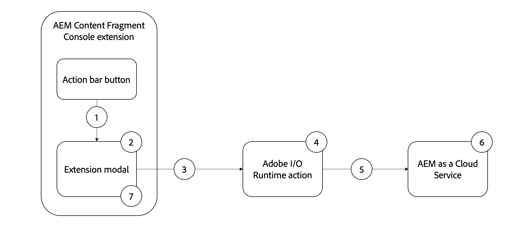

# Extensión de ejemplo de actualización masiva de propiedades

>[!VIDEO](https://video.tv.adobe.com/v/3412296?quality=12&learn=on)

AEM Este ejemplo de extensión de la consola de fragmentos de contenido es un [barra de acciones](https://developer.adobe.com/uix/docs/services/aem-cf-console-admin/api/action-bar/) que actualiza de forma masiva una propiedad de fragmento de contenido a un valor común.

El flujo funcional de la extensión de ejemplo es el siguiente:

{align="center"}

1. Seleccione Fragmentos de contenido y haga clic en el botón de la extensión en la [barra de acciones](#extension-registration) abre el [modal](#modal).
2. El [modal](#modal) muestra un formulario de entrada personalizado creado con [Espectro de reacción](https://react-spectrum.adobe.com/react-spectrum/).
3. AEM Al enviar el formulario, se envía la lista de los fragmentos de contenido seleccionados y el host de a [acción personalizada de Adobe I/O Runtime](#adobe-io-runtime-action).
4. El [Acción de Adobe I/O Runtime](#adobe-io-runtime-action) valida las entradas y realiza solicitudes de PUT AEM HTTP para actualizar los fragmentos de contenido seleccionados, lo que a su vez se convierte en una solicitud de.
5. Una serie de PUT HTTP para cada fragmento de contenido para actualizar la propiedad especificada.
6. AEM El as a Cloud Service mantiene las actualizaciones de la propiedad en el fragmento de contenido y devuelve respuestas correctas o de error a la acción de Adobe I/O Runtime.
7. El modal recibió la respuesta de la acción de Adobe I/O Runtime y muestra una lista de actualizaciones masivas correctas.

## Punto de extensión

Este ejemplo se extiende hasta el punto de extensión `actionBar` para agregar un botón personalizado a la consola Fragmento de contenido.

| AEM Interfaz de usuario extendida | Punto de extensión |
| ------------------------ | --------------------- | 
| [Consola de fragmento de contenido](https://developer.adobe.com/uix/docs/services/aem-cf-console-admin/) | [Barra de acciones](https://developer.adobe.com/uix/docs/services/aem-cf-console-admin/api/action-bar/) |


## Extensión de ejemplo

El ejemplo utiliza un proyecto de consola de Adobe Developer existente y las siguientes opciones al inicializar la aplicación App Builder mediante `aio app init`.

+ ¿Qué plantillas desea buscar?: `All Extension Points`
+ Elija las plantillas que desea instalar:` @adobe/aem-cf-admin-ui-ext-tpl`
+ ¿Qué nombre desea dar a su extensión?: `Bulk property update`
+ Proporcione una breve descripción de la extensión: `An example action bar extension that bulk updates a single property one or more content fragments.`
+ ¿Con qué versión desea comenzar?: `0.0.1`
+ ¿Qué desea hacer a continuación?
   + `Add a custom button to Action Bar`
      + Proporcione un nombre de etiqueta para el botón: `Bulk property update`
      + ¿Necesita mostrar un modal para el botón? `y`
   + `Add server-side handler`
      + Adobe I/O Runtime permite invocar código sin servidor bajo demanda. ¿Cómo desea asignar un nombre a esta acción?: `generic`

La aplicación de extensión del App Builder generada se actualiza tal como se describe a continuación.

### Rutas de aplicaciones{#app-routes}

El `src/aem-cf-console-admin-1/web-src/src/components/App.js` contiene el [React router](https://reactrouter.com/en/main).

Existen dos conjuntos lógicos de rutas:

1. La primera ruta asigna solicitudes a `index.html`, que invoca el componente React responsable de [registro de extensión](#extension-registration).

   ```javascript
   <Route index element={<ExtensionRegistration />} />
   ```

1. El segundo conjunto de rutas asigna direcciones URL a componentes de React que representan el contenido del modal de la extensión. El `:selection` param representa una ruta de fragmento de contenido de lista delimitada.

   Si la extensión tiene varios botones para invocar acciones discretas, [registro de extensión](#extension-registration) asigna a una ruta definida aquí.

   ```javascript
   <Route
       exact path="content-fragment/:selection/bulk-property-update"
       element={<BulkPropertyUpdateModal />}
       />
   ```

### Registro de extensiones

`ExtensionRegistration.js`, asignado al `index.html` AEM route, es el punto de entrada para la extensión de la y define:

1. AEM La ubicación del botón de extensión aparecerá en la experiencia de creación de la (`actionBar` o `headerMenu`)
1. Definición del botón de extensión en `getButtons()` función
1. El controlador de clics para el botón, en el `onClick()` función

+ `src/aem-cf-console-admin-1/web-src/src/components/ExtensionRegistration.js`

```javascript
import React from "react";
import { generatePath } from "react-router";
import { Text } from "@adobe/react-spectrum";
import { register } from "@adobe/uix-guest";
import { extensionId } from "./Constants";

function ExtensionRegistration() {
  const init = async () => {
    const guestConnection = await register({
      id: extensionId, // Some unique ID for the extension used to facilitate communication between the extension and Content Fragment Console
      methods: {
        // Configure your Action Bar button here
        actionBar: {
          getButtons() {
            return [
              {
                id: "examples.action-bar.bulk-property-update", // Unique ID for the button
                label: "Bulk property update", // Button label
                icon: "OpenIn", // Button icon; get name from: https://spectrum.adobe.com/page/icons/ (Remove spaces, keep uppercase)
                // Click handler for the extension button
                onClick(selections) {
                  // Collect the selected content fragment paths
                  const selectionIds = selections.map(
                    (selection) => selection.id
                  );

                  // Create a URL that maps to the
                  const modalURL =
                    "/index.html#" +
                    generatePath(
                      "/content-fragment/:selection/bulk-property-update",
                      {
                        // Set the :selection React route parameter to an encoded, delimited list of paths of the selected content fragments
                        selection: encodeURIComponent(selectionIds.join("|")),
                      }
                    );

                  // Open the route in the extension modal using the constructed URL
                  guestConnection.host.modal.showUrl({
                    // The modal title
                    title: "Bulk property update",
                    url: modalURL,
                  });
                },
              },
            ];
          },
        },
      },
    });
  };

  init().catch(console.error);

  return <Text>IFrame for integration with Host (AEM)...</Text>;
}

export default ExtensionRegistration;
```

### Modal

Cada ruta de la extensión, tal como se define en [`App.js`](#app-routes), se asigna a un componente de React que se procesa en el modal de la extensión.

En esta aplicación de ejemplo, hay un componente React modal (`BulkPropertyUpdateModal.js`) que tiene tres estados:

1. Cargando, lo que indica que el usuario debe esperar
1. El formulario de actualización masiva de propiedades que permite al usuario especificar el nombre y el valor de la propiedad que se va a actualizar
1. La respuesta de la operación de actualización masiva de propiedades, que enumera los fragmentos de contenido que se actualizaron y los que no se pudieron actualizar

AEM Es importante señalar que cualquier interacción con los de la extensión debe delegarse a un [Acción de Adobe I/O Runtime de AppBuilder](https://developer.adobe.com/runtime/docs/guides/using/creating_actions/), que es un proceso independiente sin servidor que se ejecuta en [Adobe I/O Runtime](https://developer.adobe.com/runtime/docs/).
El uso de acciones de Adobe I/O Runtime AEM para comunicarse con los usuarios es para evitar problemas de conectividad de Intercambio de Recursos de Origen Cruzado (CORS).

Cuando se envía el formulario de actualización masiva de propiedades, se crea un `onSubmitHandler()` invoca la acción de Adobe I/O Runtime AEM AEM, pasando el host (dominio) actual de la y el token de acceso del usuario, que a su vez llama a la [AEM API de fragmento de contenido](https://experienceleague.adobe.com/docs/experience-manager-65/assets/extending/assets-api-content-fragments.html) para actualizar los fragmentos de contenido.

Cuando se recibe la respuesta de la acción Adobe I/O Runtime, el modal se actualiza para mostrar los resultados de la operación de actualización de propiedades por lotes.

+ `src/aem-cf-console-admin-1/web-src/src/components/BulkPropertyUpdateModal.js`

```javascript
import React, { useState, useEffect } from 'react'
import { attach } from "@adobe/uix-guest"
import {
  Flex,
  Form,
  Provider,
  Content,
  defaultTheme,
  ContextualHelp,
  Text,
  TextField,
  ButtonGroup,
  Button,
  Heading,
  ListView,
  Item,
} from '@adobe/react-spectrum'

import Spinner from "./Spinner"

import { useParams } from "react-router-dom"

import allActions from '../config.json'
import actionWebInvoke from '../utils'

import { extensionId } from "./Constants"

export default function BulkPropertyUpdateModal() {
  // Set up state used by the React component
  const [guestConnection, setGuestConnection] = useState()
  
  const [actionInvokeInProgress, setActionInvokeInProgress] = useState(false);
  const [actionResponse, setActionResponse] = useState();

  const [propertyName, setPropertyName] = useState(null);
  const [propertyValue, setPropertyValue] = useState(null);
  const [validationState, setValidationState] = useState({});

  // Get the selected content fragment paths from the route parameter `:selection`
  let { selection } = useParams();
  let fragmentIds = selection?.split('|') || [];
  
  console.log('Content Fragment Ids', fragmentIds);

  if (!fragmentIds || fragmentIds.length === 0) {
    console.error("Unable to locate a list of Content Fragments to update.")
    return;
  }

  // Asynchronously attach the extension to AEM, we must wait or the guestConnection to be set before doing anything in the modal
  useEffect(() => {
    (async () => {
       // extensionId is the unique id of this extension (you can make this up as long as its unique) .. in this case its `bulk-property-update` pulled out into Constants.js as it is also referenced in ExtensionRegistration.js
      const guestConnection = await attach({ id: extensionId })
      setGuestConnection(guestConnection);
    })()
  }, [])


  // Determine view to display in the modal
  if (!guestConnection) {
    // If the guestConnection is not initialized, display a loading spinner
    return <Spinner />
  } else if (actionInvokeInProgress) {
    // If the bulk property action has been invoked but not completed, display a loading spinner
    return <Spinner />
  } else if (actionResponse) {
    // If the bulk property action has completed, display the response
    return renderResponse();
  } else {
    // Else display the bulk property update form
    return renderForm();
  }

  /**
   * Renders the Bulk Property Update form. 
   * This form has two fields:
   * - Property Name: The name of the Content Fragment property name to update
   * - Property Value: the value the Content Fragment property, specified by the Property Name, will be updated to
   * 
   * @returns the Bulk Property Update form
   */
  function renderForm() {
    return (
      // Use React Spectrum components to render the form
      <Provider theme={defaultTheme} colorScheme='light'>
        <Content width="100%">
          <Flex width="100%">
            <Form 
              width="100%">
              <TextField label="Property name"
                          isRequired={true}
                          validationState={validationState?.propertyName}
                onChange={setPropertyName}
                contextualHelp={
                  <ContextualHelp>
                    <Heading>Need help?</Heading>
                    <Content>
                      <Text>The <strong>Property name</strong> must be a valid for the Content Fragment model(s) the selected Content Fragments implement.</Text>
                    </Content>
                  </ContextualHelp>
                } />

              <TextField
                label="Property value"
                validationState={validationState?.propertyValue}
                onChange={setPropertyValue} />

              <ButtonGroup align="start" marginTop="size-200">
                <Button variant="cta" onPress={onSubmitHandler}>Update {fragmentIds.length} Content Fragments</Button>
              </ButtonGroup>
            </Form>
          </Flex>

          {/* Render the close button so the user can close the modal */}
          {renderCloseButton()}
        </Content>
      </Provider>
    )
  }
  /**
   * Display the response from the Adobe I/O Runtime action in the modal.
   * This includes:
   * - A list of content fragments that were updated successfully
   * - A list a content fragments that failed to update
   * 
   * @returns the response view
   */
  function renderResponse() {
    // Separate the successful and failed content fragments updates
    const successes = actionResponse.filter(item => item.status === 200);
    const failures = actionResponse.filter(item => item.status !== 200);

    return (
      <Provider theme={defaultTheme} colorScheme='light'>
        <Content width="100%">

          <Text>Bulk updated property <strong>{propertyName}</strong> with value <strong>{propertyValue}</strong></Text>

          {/* Render the list of content fragments that were updated successfully */}
          {successes.length > 0 &&
            <><Heading level="4">{successes.length} Content Fragments successfully updated</Heading>
              <ListView
                items={successes}
                selectionMode="none"
                aria-label="Successful updates"
              >
                {(item) => (
                  <Item key={item.fragmentId} textValue={item.fragmentId.split('/').pop()}>
                    {item.fragmentId.split('/').pop()}
                  </Item>
                )}
              </ListView></>}

          {/* Render the list of content fragments that failed to update */}
          {failures.length > 0 &&
            <><Heading level="4">{failures.length} Content Fragments failed to update</Heading><ListView
              items={failures}
              selectionMode="none"
              aria-label="Failed updates"
            >
              {(item) => (
                <Item key={item.fragmentId} textValue={item.fragmentId.split('/').pop()}>
                  {item.fragmentId.split('/').pop()}
                </Item>
              )}
            </ListView></>}

          {/* Render the close button so the user can close the modal */}
          {renderCloseButton()}
        </Content>
      </Provider>);
  }

  /**
   * Provide a close button for the modal, else it cannot be closed (without refreshing the browser window)
   * 
   * @returns a button that closes the modal.
   */
   function renderCloseButton() {
    return (
      <Flex width="100%" justifyContent="end" alignItems="center" marginTop="size-400">
        <ButtonGroup align="end">
          <Button variant="primary" onPress={() => guestConnection.host.modal.close()}>Close</Button>
        </ButtonGroup>
      </Flex>
    );
  }

  /**
   * Handle the Bulk Property Update form submission.
   * This function calls the supporting Adobe I/O Runtime action to update the selected Content Fragments, and then returns the response for display in the modal
   * When invoking the Adobe I/O Runtime action, the following parameters are passed as they're used by the action to connect to AEM:
   * - AEM Host to connect to
   * - AEM access token to connect to AEM with
   * - The list of Content Fragment paths to update
   * - The Content Fragment property name to update
   * - The value to update the Content Fragment property to
   * 
   * @returns a list of content fragment update successes and failures
   */
  async function onSubmitHandler() {
    // Validate the form input fields
    if (propertyName?.length > 1) {
      setValidationState({propertyName: 'valid', propertyValue: 'valid'});
    } else {
      setValidationState({propertyName: 'invalid', propertyValue: 'valid'});
      return;
    }

    // Mark the extension as invoking the action, so the loading spinner is displayed
    setActionInvokeInProgress(true);

    // Set the HTTP headers to access the Adobe I/O runtime action
    const headers = {
      'Authorization': 'Bearer ' + guestConnection.sharedContext.get('auth').imsToken,
      'x-gw-ims-org-id': guestConnection.sharedContext.get('auth').imsOrg
    };

    console.log('headers', headers);

    // Set the parameters to pass to the Adobe I/O Runtime action
    const params = {
      aemHost: `https://${guestConnection.sharedContext.get('aemHost')}`,

      fragmentIds: fragmentIds,
      propertyName: propertyName,
      propertyValue: propertyValue
    };

    // Invoke the Adobe I/O Runtime action named `generic`. This name defined in the `ext.config.yaml` file.
    const action = 'generic';

    try {
      // Invoke Adobe I/O Runtime action with the configured headers and parameters
      const actionResponse = await actionWebInvoke(allActions[action], headers, params);

      // Set the response from the Adobe I/O Runtime action
      setActionResponse(actionResponse);

      console.log(`Response from ${action}:`, actionResponse)
    } catch (e) {
      // Log and store any errors
      console.error(e)
    }

    // Set the action as no longer being invoked, so the loading spinner is hidden
    setActionInvokeInProgress(false);
  }
}
```


### Acción de Adobe I/O Runtime

AEM Una aplicación de App Builder de extensión puede definir o utilizar 0 o varias acciones de Adobe I/O Runtime.
Las acciones de Adobe AEM en tiempo de ejecución deben ser un trabajo responsable que requiera interactuar con, o con otros servicios web de Adobe.

En esta aplicación de ejemplo, la acción Adobe I/O Runtime, que utiliza el nombre predeterminado `generic` - es responsable de:

1. AEM Realización de una serie de solicitudes HTTP a la API de fragmentos de contenido de la para actualizar los fragmentos de contenido.
1. Recopilar las respuestas de estas solicitudes HTTP, clasificarlas en éxitos y errores
1. Devolver la lista de éxitos y errores para que la muestre el modal (`BulkPropertyUpdateModal.js`)

+ `src/aem-cf-console-admin-1/actions/generic/index.js`


```javascript
const fetch = require('node-fetch')
const { Core } = require('@adobe/aio-sdk')
const { errorResponse, getBearerToken, stringParameters, checkMissingRequestInputs } = require('../utils')

// main function that will be executed by Adobe I/O Runtime
async function main (params) {
  // create a Logger
  const logger = Core.Logger('main', { level: params.LOG_LEVEL || 'info' })

  try {
    // 'info' is the default level if not set
    logger.info('Calling the main action')

    // log parameters, only if params.LOG_LEVEL === 'debug'
    logger.debug(stringParameters(params))

    // check for missing request input parameters and headers
    const requiredParams = [ 'aemHost', 'fragmentIds', 'propertyName', 'propertyValue' ]
    const requiredHeaders = ['Authorization']
    const errorMessage = checkMissingRequestInputs(params, requiredParams, requiredHeaders)
    if (errorMessage) {
      // return and log client errors
      return errorResponse(400, errorMessage, logger)
    }
      
    const body = {
      "properties": {
        "elements": {
          [params.propertyName]: {
            "value": params.propertyValue
          }
        }
      }
    };

    // Extract the user Bearer token from the Authorization header used to authenticate the request to AEM
    const accessToken = getBearerToken(params);

    let results = await Promise.all(params.fragmentIds.map(async (fragmentId) => {

      logger.info(`Updating fragment ${fragmentId} with property ${params.propertyName} and value ${params.propertyValue}`);

      const res = await fetch(`${params.aemHost}${fragmentId.replace('/content/dam/', '/api/assets/')}.json`, { 
        method: 'put',
        body: JSON.stringify(body),
        headers: {
          'Authorization': `Bearer ${accessToken}`,
          'Content-Type': 'application/json'
        }
      });

      if (res.ok) {
        logger.info(`Successfully updated ${fragmentId}`);
        return { fragmentId, status: res.status, statusText: res.statusText, body: await res.json() };
      } else {
        logger.info(`Failed to update ${fragmentId}`);
        return { fragmentId, status: res.status, statusText: res.statusText, body: await res.text() };
      }
    }));

    const response = {
      statusCode: 200,
      body: results
    };

    logger.info('Adobe I/O Runtime action response', response);

    // Return the response to the A
     return response;

  } catch (error) {
    // log any server errors
    logger.error(error)
    // return with 500
    return errorResponse(500, 'server error', logger)
  }
}

exports.main = main
```
