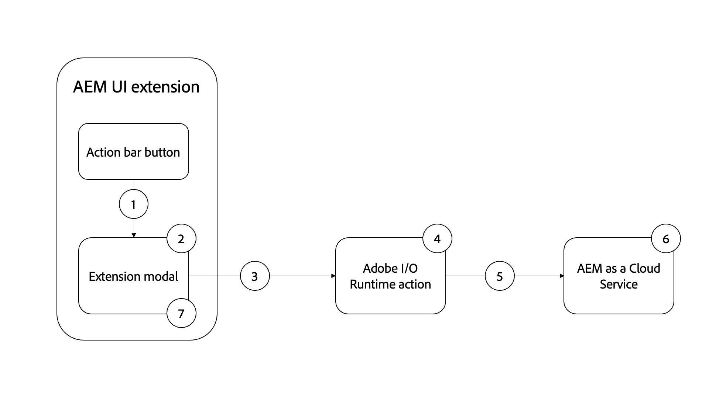

# AEM Generación de recursos de imagen mediante OpenAI

AEM Aprenda a generar una imagen con OpenAI o DALL·E 2 y cárguela a DAM para que la velocidad de contenido sea mayor a la de la vista de los usuarios de DAM.

>[!VIDEO](https://video.tv.adobe.com/v/3413093?quality=12&learn=on)

AEM Este ejemplo de extensión de la consola de fragmentos de contenido es un [barra de acciones](https://developer.adobe.com/uix/docs/services/aem-cf-console-admin/api/action-bar/) extensión que genera una imagen digital a partir de la entrada de lenguaje natural mediante [API de OpenAI](https://openai.com/api/) o [DALL·E 2](https://openai.com/dall-e-2/). AEM La imagen generada se cargará en el DAM y la propiedad de imagen del fragmento de contenido seleccionado se actualizará para hacer referencia a esta imagen cargada y recién generada de DAM.

En este ejemplo aprenderá lo siguiente:

1. Generación de imágenes con [API de OpenAI](https://beta.openai.com/docs/guides/images/image-generation-beta) o [DALL·E 2](https://openai.com/dall-e-2/)
2. AEM Carga de imágenes a la
3. Actualización de propiedad de fragmento de contenido

El flujo funcional de la extensión de ejemplo es el siguiente:

{align="center"}

1. Seleccione Fragmento de contenido y haga clic en el `Generate Image` botón en el [barra de acciones](#extension-registration) abre el [modal](#modal).
1. El [modal](#modal) muestra un formulario de entrada personalizado creado con [Espectro de reacción](https://react-spectrum.adobe.com/react-spectrum/).
1. Al enviar el formulario, se envía al usuario `Image Description` AEM texto, el fragmento de contenido seleccionado y el host de la [acción personalizada de Adobe I/O Runtime](#adobe-io-runtime-action).
1. El [Acción de Adobe I/O Runtime](#adobe-io-runtime-action) valida las entradas.
1. A continuación, llama al de OpenAI [Generación de imágenes](https://beta.openai.com/docs/guides/images/image-generation-beta) API y utiliza `Image Description` texto para especificar qué imagen se debe generar.
1. El [generación de imágenes](https://beta.openai.com/docs/guides/images/image-generation-beta) el punto final crea una imagen original de tamaño _1024 x 1024_ píxeles que utilizan el valor del parámetro de solicitud de petición de datos y devuelve la URL de imagen generada como respuesta.
1. El [Acción de Adobe I/O Runtime](#adobe-io-runtime-action) descarga la imagen generada en el tiempo de ejecución del Generador de aplicaciones.
1. AEM A continuación, inicia la carga de imágenes desde el tiempo de ejecución del Generador de aplicaciones a DAM en la ruta de acceso predefinida.
1. AEM El as a Cloud Service guarda la imagen en el DAM y devuelve respuestas de éxito o error a la acción de Adobe I/O Runtime. AEM La respuesta de carga correcta actualiza el valor de propiedad de imagen del fragmento de contenido seleccionado mediante otra petición HTTP para que se realice la acción de Adobe I/O Runtime a la hora de realizar la.
1. El modal recibe la respuesta de la acción de Adobe I/O Runtime AEM y proporciona un vínculo de detalles de recurso de la imagen cargada y recién generada.

## Punto de extensión

Este ejemplo se extiende hasta el punto de extensión `actionBar` para agregar un botón personalizado a la consola Fragmento de contenido.

| AEM Interfaz de usuario extendida | Punto de extensión |
| ------------------------ | --------------------- | 
| [Consola de fragmento de contenido](https://developer.adobe.com/uix/docs/services/aem-cf-console-admin/) | [Barra de acciones](https://developer.adobe.com/uix/docs/services/aem-cf-console-admin/api/action-bar/) |

## Extensión de ejemplo

El ejemplo utiliza un proyecto de consola de Adobe Developer existente y las siguientes opciones al inicializar la aplicación App Builder mediante `aio app init`.

+ ¿Qué plantillas desea buscar?: `All Extension Points`
+ Elija las plantillas que desea instalar:` @adobe/aem-cf-admin-ui-ext-tpl`
+ ¿Qué nombre desea dar a su extensión?: `Image generation`
+ Proporcione una breve descripción de la extensión: `An example action bar extension that generates an image using OpenAI and uploads it to AEM DAM.`
+ ¿Con qué versión desea comenzar?: `0.0.1`
+ ¿Qué desea hacer a continuación?
   + `Add a custom button to Action Bar`
      + Proporcione un nombre de etiqueta para el botón: `Generate Image`
      + ¿Debe mostrar un modal para el botón? `y`
   + `Add server-side handler`
      + Adobe I/O Runtime permite invocar código sin servidor bajo demanda. ¿Cómo desea asignar un nombre a esta acción?: `generate-image`

La aplicación de extensión del App Builder generada se actualiza tal como se describe a continuación.

### Configuración inicial

1. Regístrese para obtener una [API de OpenAI](https://openai.com/api/) y cree una cuenta [Clave de API](https://beta.openai.com/account/api-keys)
1. Añada esta clave al proyecto de App Builder `.env` archivo

   ```
       # Specify your secrets here
       # This file must not be committed to source control
       ## Adobe I/O Runtime credentials
       ...
       AIO_runtime_apihost=https://adobeioruntime.net
       ...
       # OpenAI secret API key
       OPENAI_API_KEY=my-openai-secrete-key-to-generate-images
       ...
   ```

1. Aprobado `OPENAI_API_KEY` como parámetro de la acción Adobe I/O Runtime, actualice el `src/aem-cf-console-admin-1/ext.config.yaml`

   ```yaml
       ...
   
       runtimeManifest:
         packages:
           aem-cf-console-admin-1:
             license: Apache-2.0
             actions:
               generate-image:
                 function: actions/generate-image/index.js
                 web: 'yes'
                 runtime: nodejs:16
                 inputs:
                   LOG_LEVEL: debug
                   OPENAI_API_KEY: $OPENAI_API_KEY
       ...
   ```

1. Instalar debajo de las bibliotecas de Node.js
   1. [La biblioteca OpenAI Node.js](https://github.com/openai/openai-node#installation) : para invocar la API de OpenAI fácilmente
   1. [AEM Cargar en el](https://github.com/adobe/aem-upload#install) AEM : para cargar imágenes en instancias de-CS.


>[!TIP]
>
>En las secciones siguientes, se muestra información sobre los archivos JavaScript clave de acción de React y Adobe I/O Runtime. Para su referencia, los archivos de claves de `web-src` y  `actions` del proyecto AppBuilder, consulte la sección [adobe-appbuilder-cfc-ext-image-generation-code.zip](./assets/digital-image-generation/adobe-appbuilder-cfc-ext-image-generation-code.zip).


### Rutas de aplicaciones{#app-routes}

El `src/aem-cf-console-admin-1/web-src/src/components/App.js` contiene el [React router](https://reactrouter.com/en/main).

Existen dos conjuntos lógicos de rutas:

1. La primera ruta asigna solicitudes a `index.html`, que invoca el componente React responsable de [registro de extensión](#extension-registration).

   ```javascript
   <Route index element={<ExtensionRegistration />} />
   ```

1. El segundo conjunto de rutas asigna direcciones URL a componentes de React que representan el contenido del modal de la extensión. El `:selection` param representa una ruta de fragmento de contenido de lista delimitada.

   Si la extensión tiene varios botones para invocar acciones discretas, [registro de extensión](#extension-registration) asigna a una ruta definida aquí.

   ```javascript
   <Route
       exact path="content-fragment/:selection/generate-image-modal"
       element={<GenerateImageModal />}
       />
   ```

### Registro de extensiones

`ExtensionRegistration.js`, asignado al `index.html` AEM route, es el punto de entrada para la extensión de la y define:

1. AEM La ubicación del botón de extensión aparecerá en la experiencia de creación de la (`actionBar` o `headerMenu`)
1. Definición del botón de extensión en `getButtons()` función
1. El controlador de clics para el botón, en el `onClick()` función

+ `src/aem-cf-console-admin-1/web-src/src/components/ExtensionRegistration.js`

```javascript
import React from "react";
import { generatePath } from "react-router";
import { Text } from "@adobe/react-spectrum";
import { register } from "@adobe/uix-guest";
import { extensionId } from "./Constants";

function ExtensionRegistration() {
  const init = async () => {
    const guestConnection = await register({
      id: extensionId, // Some unique ID for the extension used to facilitate communication between the extension and Content Fragment Console
      methods: {
        // Configure your Action Bar button here
        actionBar: {
          getButtons() {
            return [{
              'id': 'generate-image',     // Unique ID for the button
              'label': 'Generate Image',  // Button label 
              'icon': 'PublishCheck',      // Button icon; get name from: https://spectrum.adobe.com/page/icons/ (Remove spaces, keep uppercase)
              // Click handler for the extension button
              onClick(selections) {
                // Collect the selected content fragment paths 
                const selectionIds = selections.map(selection => selection.id);

                // Create a URL that maps to the 
                const modalURL = "/index.html#" + generatePath(
                  "/content-fragment/:selection/generate-image-modal",
                  {
                    // Set the :selection React route parameter to an encoded, delimited list of paths of the selected content fragments
                    selection: encodeURIComponent(selectionIds.join('|')),
                  }
                );

                // Open the route in the extension modal using the constructed URL
                guestConnection.host.modal.showUrl({
                  title: "Generate Image",
                  url: modalURL
                })
                },
              },
            ];
          },
        },
      },
    });
  };

  init().catch(console.error);

  return <Text>IFrame for integration with Host (AEM)...</Text>;
}

export default ExtensionRegistration;          
```

### Modal

Cada ruta de la extensión, tal como se define en [`App.js`](#app-routes), se asigna a un componente de React que se procesa en el modal de la extensión.

En esta aplicación de ejemplo, hay un componente React modal (`GenerateImageModal.js`) que tiene cuatro estados:

1. Cargando, lo que indica que el usuario debe esperar
1. El mensaje de advertencia que sugiere que los usuarios seleccionen solo un fragmento de contenido a la vez
1. El formulario Generar imagen que permite al usuario proporcionar una descripción de imagen en lenguaje natural.
1. AEM La respuesta de la operación de generación de imágenes, que proporciona el vínculo de detalles del recurso de la imagen cargada y recién generada.

AEM Es importante señalar que cualquier interacción con los de la extensión debe delegarse a un [Acción de Adobe I/O Runtime de AppBuilder](https://developer.adobe.com/runtime/docs/guides/using/creating_actions/), que es un proceso independiente sin servidor que se ejecuta en [Adobe I/O Runtime](https://developer.adobe.com/runtime/docs/).
El uso de acciones de Adobe I/O Runtime AEM para comunicarse con los usuarios, y es para evitar problemas de conectividad de Intercambio de Recursos de Origen Cruzado (CORS).

Si la variable _Generar imagen_ formulario se envía, un formulario personalizado `onSubmitHandler()` invoca la acción de Adobe I/O Runtime AEM AEM, pasando la descripción de la imagen, el host (dominio) actual de la y el token de acceso de la cuenta de usuario de. A continuación, la acción llama al de OpenAI [Generación de imágenes](https://beta.openai.com/docs/guides/images/image-generation-beta) API para generar una imagen utilizando la descripción de la imagen enviada. Siguiente con [AEM Cargar en el](https://github.com/adobe/aem-upload) del módulo del nodo `DirectBinaryUpload` AEM Clase que carga la imagen generada en el sitio de destino y que finalmente utiliza. [AEM API de fragmento de contenido](https://experienceleague.adobe.com/docs/experience-manager-65/assets/extending/assets-api-content-fragments.html) para actualizar los fragmentos de contenido.

Cuando se recibe la respuesta de la acción Adobe I/O Runtime, el modal se actualiza para mostrar los resultados de la operación de generación de imágenes.

+ `src/aem-cf-console-admin-1/web-src/src/components/GenerateImageModal.js`

```javascript
export default function GenerateImageModal() {
  // Set up state used by the React component
  const [guestConnection, setGuestConnection] = useState();

  // State hooks to manage the application state
  const [imageDescription, setImageDescription] = useState(null);
  const [validationState, setValidationState] = useState({});

  const [actionInvokeInProgress, setActionInvokeInProgress] = useState(false);
  const [actionResponse, setActionResponse] = useState();

  // Get the selected content fragment paths from the route parameter `:selection`
  const { selection } = useParams();
  const fragmentIds = selection?.split('|') || [];

  console.log('Selected Fragment Ids', fragmentIds);

  if (!fragmentIds || fragmentIds.length === 0) {
    console.error('The Content Fragments are not selected, can NOT generate images');
    return;
  }

  // Asynchronously attach the extension to AEM, we must wait or the guestConnection to be set before doing anything in the modal
  useEffect(() => {
    (async () => {
      const myGuestConnection = await attach({ id: extensionId });

      setGuestConnection(myGuestConnection);
    })();
  }, []);

  // Determine view to display in the modal
  if (!guestConnection) {
    // If the guestConnection is not initialized, display a loading spinner
    return <Spinner />;
  } if (actionInvokeInProgress) {
    // If the 'Generate Image' action has been invoked but not completed, display a loading spinner
    return <Spinner />;
  } if (fragmentIds.length > 1) {
    // If more than one CF selected show warning and suggest to select only one CF
    return renderMoreThanOneCFSelectionError();
  } if (fragmentIds.length === 1 && !actionResponse) {
    // Display the 'Generate Image' modal and ask for image description
    return renderImgGenerationForm();
  } if (actionResponse) {
    // If the 'Generate Image' action has completed, display the response
    return renderActionResponse();
  }

  /**
   * Renders the message suggesting to select only on CF at a time to not lose credits accidentally
   *
   * @returns the suggestion or error message to select one CF at a time
   */
  function renderMoreThanOneCFSelectionError() {
    return (
      <Provider theme={defaultTheme} colorScheme="light">
        <Content width="100%">
          <Text>
            As this operation
            <strong> uses credits from Generative AI services</strong>
            {' '}
            such as DALL·E 2 (or Stable Dufusion), we allow only one Generate Image at a time.
            <p />
            <strong>So please select only one Content Fragment at this moment.</strong>
          </Text>

          <Flex width="100%" justifyContent="end" alignItems="center" marginTop="size-400">
            <ButtonGroup align="end">
              <Button variant="negative" onPress={() => guestConnection.host.modal.close()}>Close</Button>
            </ButtonGroup>
          </Flex>

        </Content>
      </Provider>
    );
  }

  /**
   * Renders the form asking for image description in the natural language and
   * displays message this action uses credits from Generative AI services.
   *
   * @returns the image description input field and credit usage message
   */
  function renderImgGenerationForm() {
    return (

      <Provider theme={defaultTheme} colorScheme="light">
        <Content width="100%">

          <Flex width="100%">
            <Form
              width="100%"
            >
              <TextField
                label="Image Description"
                description="The image description in natural language, for e.g. Alaskan adventure in wilderness, animals, and flowers."
                isRequired
                validationState={validationState?.propertyName}
                onChange={setImageDescription}
                contextualHelp={(
                  <ContextualHelp>
                    <Heading>Need help?</Heading>
                    <Content>
                      <Text>
                        The
                        <strong>description of an image</strong>
                        {' '}
                        you are looking for in the natural language, for e.g. &quot;Family vacation on the beach with blue ocean, dolphins, boats and drink&quot;
                      </Text>
                    </Content>
                  </ContextualHelp>
                  )}
              />

              <Text>
                <p />
                Please note this will use credits from Generative AI services such as OpenAI/DALL·E 2. The AI-generated images are saved to this AEM as a Cloud Service Author service using logged user access (IMS) token.
              </Text>

              <ButtonGroup align="end">
                <Button variant="accent" onPress={onSubmitHandler}>Use Credits</Button>
                <Button variant="accent" onPress={() => guestConnection.host.modal.close()}>Close</Button>
              </ButtonGroup>
            </Form>
          </Flex>

        </Content>
      </Provider>
    );
  }

  function buildAssetDetailsURL(aemImgURL) {
    const urlParts = aemImgURL.split('.com');
    const aemAssetDetailsURL = `${urlParts[0]}.com/ui#/aem/assetdetails.html${urlParts[1]}`;

    return aemAssetDetailsURL;
  }

  /**
   * Displays the action response received from the App Builder
   *
   * @returns Displays App Builder action and details
   */
  function renderActionResponse() {
    return (
      <Provider theme={defaultTheme} colorScheme="light">
        <Content width="100%">

          {actionResponse.status === 'success'
            && (
              <>
                <Heading level="4">
                  Successfully generated an image, uploaded it to this AEM-CS Author service, and associated it to the selected Content Fragment.
                </Heading>

                <Text>
                  {' '}
                  Please see generated image in AEM-CS
                  {' '}
                  <Link>
                    <a href={buildAssetDetailsURL(actionResponse.aemImgURL)} target="_blank" rel="noreferrer">
                      here.
                    </a>
                  </Link>
                </Text>
              </>
            )}

          {actionResponse.status === 'failure'
            && (
            <Heading level="4">
              Failed to generate, upload image, please check App Builder logs.
            </Heading>
            )}

          <Flex width="100%" justifyContent="end" alignItems="center" marginTop="size-400">
            <ButtonGroup align="end">
              <Button variant="negative" onPress={() => guestConnection.host.modal.close()}>Close</Button>
            </ButtonGroup>
          </Flex>

        </Content>
      </Provider>
    );
  }

  /**
   * Handle the Generate Image form submission.
   * This function calls the supporting Adobe I/O Runtime actions such as
   * - Call the Generative AI service (DALL·E) with 'image description' to generate an image
   * - Download the AI generated image to App Builder runtime
   * - Save the downloaded image to AEM DAM and update Content Fragment's image reference property to use this new image
   *
   * When invoking the Adobe I/O Runtime actions, the following parameters are passed as they're used by the action to connect to AEM:
   * - AEM Host to connect to
   * - AEM access token to connect to AEM with
   * - The Content Fragment path to update
   *
   * @returns In case of success the updated content fragment, otherwise failure message
   */
  async function onSubmitHandler() {
    console.log('Started Image Generation orchestration');

    // Validate the form input fields
    if (imageDescription?.length > 1) {
      setValidationState({ imageDescription: 'valid' });
    } else {
      setValidationState({ imageDescription: 'invalid' });
      return;
    }

    // Mark the extension as invoking the action, so the loading spinner is displayed
    setActionInvokeInProgress(true);

    // Set the HTTP headers to access the Adobe I/O runtime action
    const headers = {
      Authorization: `Bearer ${guestConnection.sharedContext.get('auth').imsToken}`,
      'x-gw-ims-org-id': guestConnection.sharedContext.get('auth').imsOrg,
    };

    // Set the parameters to pass to the Adobe I/O Runtime action
    const params = {

      aemHost: `https://${guestConnection.sharedContext.get('aemHost')}`,

      fragmentId: fragmentIds[0],
      imageDescription,
    };

    const generateImageAction = 'generate-image';

    try {
      const generateImageActionResponse = await actionWebInvoke(allActions[generateImageAction], headers, params);

      // Set the response from the Adobe I/O Runtime action
      setActionResponse(generateImageActionResponse);

      console.log(`Response from ${generateImageAction}:`, actionResponse);
    } catch (e) {
      // Log and store any errors
      console.error(e);
    }

    // Set the action as no longer being invoked, so the loading spinner is hidden
    setActionInvokeInProgress(false);
  }
}
```

>[!NOTE]
>
>En el `buildAssetDetailsURL()` función, el `aemAssetdetailsURL` El valor de la variable supone que [Unified Shell](https://experienceleague.adobe.com/docs/experience-manager-cloud-service/content/overview/aem-cloud-service-on-unified-shell.html#overview) está activada. Si ha deshabilitado Unified Shell, debe quitar el `/ui#/aem` desde el valor de variable.


### Acción de Adobe I/O Runtime

AEM Una aplicación de App Builder de extensión puede definir o utilizar 0 o varias acciones de Adobe I/O Runtime.
La acción Adobe AEM en tiempo de ejecución es responsable del trabajo que requiere interactuar con el Adobe o el servicio web de terceros o con los servicios de la red de la red.

En esta aplicación de ejemplo, la `generate-image` La acción de Adobe I/O Runtime es responsable de lo siguiente:

1. Generación de una imagen mediante [Generación de imágenes de API OpenAI](https://beta.openai.com/docs/guides/images/image-generation-beta) servicio
1. AEM Carga de la imagen generada en la instancia de-CS mediante [AEM Cargar en el](https://github.com/adobe/aem-upload) biblioteca
1. AEM Realización de una solicitud HTTP a la API de fragmentos de contenido de la para actualizar la propiedad de imagen del fragmento de contenido.
1. Devolver la información clave de los aciertos y errores para que la muestre el modal (`GenerateImageModal.js`)


#### Punto de entrada (`index.js`)

El `index.js` organiza las tareas anteriores (1 a 3) utilizando los módulos JavaScript correspondientes, concretamente `generate-image-using-openai, upload-generated-image-to-aem, update-content-fragement`. Estos módulos y el código asociado se describen en la siguiente sección [subsecciones](#image-generation-module---generate-image-using-openaijs).

+ `src/aem-cf-console-admin-1/actions/generate-image/index.js`

```javascript
/**
 *
 * This action orchestrates an image generation by calling the OpenAI API (DALL·E 2) and saves generated image to AEM.
 *
 * It leverages following modules
 *  - 'generate-image-using-openai' - To generate an image using OpenAI API
 *  - 'upload-generated-image-to-aem' - To upload the generated image into AEM-CS instance
 *  - 'update-content-fragement' - To update the CF image property with generated image's DAM path
 *
 */

const { Core } = require('@adobe/aio-sdk');
const {
  errorResponse, stringParameters, getBearerToken, checkMissingRequestInputs,
} = require('../utils');

const { generateImageUsingOpenAI } = require('./generate-image-using-openai');

const { uploadGeneratedImageToAEM } = require('./upload-generated-image-to-aem');

const { updateContentFragmentToUseGeneratedImg } = require('./update-content-fragement');

// main function that will be executed by Adobe I/O Runtime
async function main(params) {
  // create a Logger
  const logger = Core.Logger('main', { level: params.LOG_LEVEL || 'info' });

  try {
    // 'info' is the default level if not set
    logger.info('Calling the main action');

    // log parameters, only if params.LOG_LEVEL === 'debug'
    logger.debug(stringParameters(params));

    // check for missing request input parameters and headers
    const requiredParams = ['aemHost', 'fragmentId', 'imageDescription'];
    const requiredHeaders = ['Authorization'];
    const errorMessage = checkMissingRequestInputs(params, requiredParams, requiredHeaders);

    if (errorMessage) {
      // return and log client errors
      return errorResponse(400, errorMessage, logger);
    }

    // extract the user Bearer token from the Authorization header
    const token = getBearerToken(params);

    // Call OpenAI (DALL·E 2) API to generate an image using image description
    const generatedImageURL = await generateImageUsingOpenAI(params);
    logger.info(`Generated image using OpenAI API and url is : ${generatedImageURL}`);

    // Upload the generated image to AEM-CS
    const uploadedImagePath = await uploadGeneratedImageToAEM(params, generatedImageURL, token);
    logger.info(`Uploaded image to AEM, path is: ${uploadedImagePath}`);

    // Update Content Fragment with the newly generated image reference
    const updateContentFragmentPath = await updateContentFragmentToUseGeneratedImg(params, uploadedImagePath, token);
    logger.info(`Updated Content Fragment path is: ${updateContentFragmentPath}`);

    let result;
    if (updateContentFragmentPath) {
      result = {
        status: 'success', message: 'Successfully generated and uploaded image to AEM', genTechServiceImageURL: generatedImageURL, aemImgURL: uploadedImagePath, fragmentPath: updateContentFragmentPath,
      };
    } else {
      result = { status: 'failure', message: 'Failed to generated and uploaded image, please check App Builder logs' };
    }

    const response = {
      statusCode: 200,
      body: result,
    };

    logger.info('Adobe I/O Runtime action response', response);

    // Return the response to the caller
    return response;
  } catch (error) {
    // log any server errors
    logger.error(error);
    // return with 500
    return errorResponse(500, 'server error', logger);
  }
}

exports.main = main;
```

#### Generación de imágenes

Este módulo es responsable de llamar a OpenAI [Generación de imágenes](https://beta.openai.com/docs/guides/images/image-generation-beta) extremo que utiliza [openia](https://github.com/openai/openai-node) biblioteca. Para obtener la clave secreta de la API de OpenAI definida en la `.env` utiliza el archivo `params.OPENAI_API_KEY`.

+ `src/aem-cf-console-admin-1/actions/generate-image/generate-image-using-openai.js`

```javascript
/**
 * This module calls OpenAI API to generate an image based on image description provided to Action
 *
 */

const { Configuration, OpenAIApi } = require('openai');

const { Core } = require('@adobe/aio-sdk');

// Placeholder than actual OpenAI Image
const PLACEHOLDER_IMG_URL = 'https://www.gstatic.com/webp/gallery/2.png';

async function generateImageUsingOpenAI(params) {
  // create a Logger
  const logger = Core.Logger('generateImageUsingOpenAI', { level: params.LOG_LEVEL || 'info' });

  let generatedImageURL = PLACEHOLDER_IMG_URL;

  // create configuration object with the API Key
  const configuration = new Configuration({
    apiKey: params.OPENAI_API_KEY,
  });

  // create OpenAIApi object
  const openai = new OpenAIApi(configuration);

  logger.info(`Generating image for input: ${params.imageDescription}`);

  try {
    // invoke createImage method with details
    const response = await openai.createImage({
      prompt: params.imageDescription,
      n: 1,
      size: '1024x1024',
    });

    generatedImageURL = response.data.data[0].url;

    logger.info(`The OpenAI generate image url is: ${generatedImageURL}`);
  } catch (error) {
    logger.error(`Error while generating image, details are: ${error}`);
  }

  return generatedImageURL;
}

module.exports = {
  generateImageUsingOpenAI,
};
```

#### AEM Cargar en el servidor de

AEM Este módulo es responsable de cargar la imagen generada por OpenAI a los archivos de la aplicación de forma que se pueda acceder a la interfaz de usuario de [AEM Cargar en el](https://github.com/adobe/aem-upload) biblioteca. La imagen generada se descarga primero en tiempo de ejecución del Generador de aplicaciones mediante Node.js [Sistema de archivos](https://nodejs.org/api/fs.html) AEM y una vez completada la carga en la biblioteca de, se elimina la biblioteca de,

En el siguiente código `uploadGeneratedImageToAEM` AEM La función organiza la descarga de imagen generada en tiempo de ejecución, la carga en tiempo de ejecución y la eliminación en tiempo de ejecución. La imagen se carga en `/content/dam/wknd-shared/en/generated` , asegúrese de que todas las carpetas existan en DAM, su requisito previo para utilizar [AEM Cargar en el](https://github.com/adobe/aem-upload) biblioteca.

+ `src/aem-cf-console-admin-1/actions/generate-image/upload-generated-image-to-aem.js`

```javascript
/**
 * This module uploads the generated image to AEM-CS instance using current user's IMS token
 *
 */

const { Core } = require('@adobe/aio-sdk');
const fs = require('fs');

const {
  DirectBinaryUploadErrorCodes,
  DirectBinaryUpload,
  DirectBinaryUploadOptions,
} = require('@adobe/aem-upload');

const codes = DirectBinaryUploadErrorCodes;
const IMG_EXTENSION = '.png';

const GENERATED_IMAGES_DAM_PATH = '/content/dam/wknd-shared/en/generated';

async function downloadImageToRuntime(logger, generatedImageURL) {
  logger.log('Downloading generated image to the runtime');

  // placeholder image name
  let generatedImageName = 'generated.png';

  try {
    // Get the generated image name from the image URL
    const justImgURL = generatedImageURL.substring(0, generatedImageURL.indexOf(IMG_EXTENSION) + 4);
    generatedImageName = justImgURL.substring(justImgURL.lastIndexOf('/') + 1);

    // Read image from URL as the buffer
    const response = await fetch(generatedImageURL);
    const buffer = await response.buffer();

    // Write/download image to the runtime
    fs.writeFileSync(generatedImageName, buffer, (err) => {
      if (err) throw err;
      logger.log('Saved the generated image!');
    });
  } catch (error) {
    logger.error(`Error while downloading image on the runtime, details are: ${error}`);
  }

  return generatedImageName;
}

function setupEventHandlers(binaryUpload, logger) {
  binaryUpload.on('filestart', (data) => {
    const { fileName } = data;

    logger.log(`Started file upload ${fileName}`);
  });

  binaryUpload.on('fileprogress', (data) => {
    const { fileName, transferred } = data;

    logger.log(`Fileupload is in progress ${fileName} & ${transferred}`);
  });

  binaryUpload.on('fileend', (data) => {
    const { fileName } = data;

    logger.log(`Finished file upload ${fileName}`);
  });

  binaryUpload.on('fileerror', (data) => {
    const { fileName, errors } = data;

    logger.log(`Error in file upload ${fileName} and ${errors}`);
  });
}

async function getImageSize(downloadedImgName) {
  const stats = fs.statSync(downloadedImgName);
  return stats.size;
}

async function uploadImageToAEMFromRuntime(logger, aemURL, downloadedImgName, accessToken) {
  let aemImageURL;
  try {
    logger.log('Uploading generated image to AEM from the runtime');

    const binaryUpload = new DirectBinaryUpload();

    // setup event handlers to track the progress, success or error
    setupEventHandlers(binaryUpload, logger);

    // get downloaded image size
    const imageSize = await getImageSize(downloadedImgName);
    logger.info(`The image upload size is: ${imageSize}`);

    // The deatils of the file to be uploaded
    const uploadFiles = [
      {
        fileName: downloadedImgName, // name of the file as it will appear in AEM
        fileSize: imageSize, // total size, in bytes, of the file
        filePath: downloadedImgName, // Full path to the local file
      },
    ];

    // Provide AEM URL and DAM Path where images will be uploaded
    const options = new DirectBinaryUploadOptions()
      .withUrl(`${aemURL}${GENERATED_IMAGES_DAM_PATH}`)
      .withUploadFiles(uploadFiles);

    // Add headers like content type and authorization
    options.withHeaders({
      'content-type': 'image/png',
      Authorization: `Bearer ${accessToken}`,
    });

    // Start the upload to AEM
    await binaryUpload.uploadFiles(options)
      .then((result) => {
        // Handle Error
        result.getErrors().forEach((error) => {
          if (error.getCode() === codes.ALREADY_EXISTS) {
            logger.error('The generated image already exists');
          }
        });

        // Handle Upload result and check for errors
        result.getFileUploadResults().forEach((fileResult) => {
          // log file upload result
          logger.info(`File upload result ${JSON.stringify(fileResult)}`);

          fileResult.getErrors().forEach((fileErr) => {
            if (fileErr.getCode() === codes.ALREADY_EXISTS) {
              const fileName = fileResult.getFileName();
              logger.error(`The generated image already exists ${fileName}`);
            }
          });
        });
      })
      .catch((err) => {
        logger.info(`Failed to uploaded generated image to AEM${err}`);
      });

    logger.info('Successfully uploaded generated image to AEM');

    aemImageURL = `${aemURL + GENERATED_IMAGES_DAM_PATH}/${downloadedImgName}`;
  } catch (error) {
    logger.info(`Error while uploading generated image to AEM, see ${error}`);
  }

  return aemImageURL;
}

async function deleteFileFromRuntime(logger, downloadedImgName) {
  try {
    logger.log('Deleting the generated image from the runtime');

    fs.unlinkSync(downloadedImgName);

    logger.log('Successfully deleted the generated image from the runtime');
  } catch (error) {
    logger.error(`Error while deleting generated image from the runtime, details are: ${error}`);
  }
}

async function uploadGeneratedImageToAEM(params, generatedImageURL, accessToken) {
  // create a Logger
  const logger = Core.Logger('uploadGeneratedImageToAEM', { level: params.LOG_LEVEL || 'info' });

  const aemURL = params.aemHost;

  logger.info(`Uploading generated image from ${generatedImageURL} to AEM ${aemURL} by streaming the bytes.`);

  // download image to the App Builder runtime
  const downloadedImgName = await downloadImageToRuntime(logger, generatedImageURL);

  // Upload image to AEM from the App Builder runtime
  const aemImageURL = await uploadImageToAEMFromRuntime(logger, aemURL, downloadedImgName, accessToken);

  // Delete the downloaded image from the App Builder runtime
  await deleteFileFromRuntime(logger, downloadedImgName);

  return aemImageURL;
}

module.exports = {
  uploadGeneratedImageToAEM,
};
```

#### Actualizar fragmento de contenido

AEM Este módulo es responsable de actualizar la propiedad de imagen del fragmento de contenido dado con la ruta DAM de la imagen recién cargada mediante la API de fragmentos de contenido de la.

+ `src/aem-cf-console-admin-1/actions/generate-image/update-content-fragement.js`

```javascript
/**
 * This module updates the CF image property with generated image's DAM path
 *
 */
const { Core } = require('@adobe/aio-sdk');

const ADVENTURE_MODEL_IMG_PROPERTY_NAME = 'primaryImage';

const ARTICLE_MODEL_IMG_PROPERTY_NAME = 'featuredImage';

const AUTHOR_MODEL_IMG_PROPERTY_NAME = 'profilePicture';

function findImgPropertyName(fragmenPath) {
  if (fragmenPath && fragmenPath.includes('/adventures')) {
    return ADVENTURE_MODEL_IMG_PROPERTY_NAME;
  } if (fragmenPath && fragmenPath.includes('/magazine')) {
    return ARTICLE_MODEL_IMG_PROPERTY_NAME;
  }
  return AUTHOR_MODEL_IMG_PROPERTY_NAME;
}

async function updateContentFragmentToUseGeneratedImg(params, uploadedImagePath, accessToken) {
  // create a Logger
  const logger = Core.Logger('updateContentFragment', { level: params.LOG_LEVEL || 'info' });

  const fragmenPath = params.fragmentId;
  const imgPropName = findImgPropertyName(fragmenPath);
  const relativeImgPath = uploadedImagePath.substring(uploadedImagePath.indexOf('/content/dam'));

  logger.info(`Update CF ${fragmenPath} to use ${relativeImgPath} image path`);

  const body = {
    properties: {
      elements: {
        [imgPropName]: {
          value: relativeImgPath,
        },
      },
    },
  };

  const res = await fetch(`${params.aemHost}${fragmenPath.replace('/content/dam/', '/api/assets/')}.json`, {
    method: 'put',
    body: JSON.stringify(body),
    headers: {
      Authorization: `Bearer ${accessToken}`,
      'Content-Type': 'application/json',
    },

  });

  if (res.ok) {
    logger.info(`Successfully updated ${fragmenPath}`);
    return fragmenPath;
  }

  logger.info(`Failed to update ${fragmenPath}`);
  return '';
}

module.exports = {
  updateContentFragmentToUseGeneratedImg,
};
```
