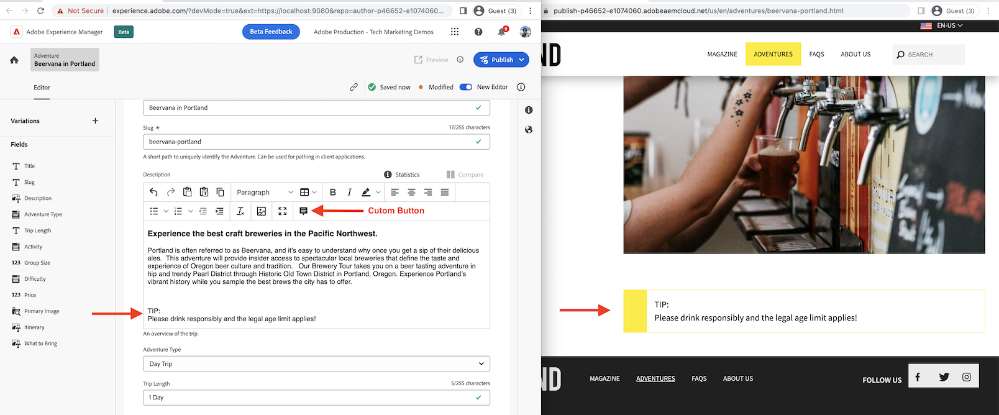

# Agregar un botón personalizado a la barra de herramientas del Editor de texto enriquecido (RTE)

{align="center"}

Se pueden añadir botones personalizados al **Barra de herramientas RTE** en el Editor de fragmentos de contenido mediante `rte` punto de extensión. En este ejemplo se muestra cómo agregar un botón personalizado denominado _Añadir sugerencia_ Vaya a la barra de herramientas RTE y modifique el contenido dentro de RTE.

Uso de `rte` punto de extensión `getCustomButtons()` método se pueden añadir uno o varios botones personalizados al **Barra de herramientas RTE**. También es posible añadir o quitar botones RTE estándar como _Copiar, Pegar, Negrita y Cursiva_ usando `getCoreButtons()` y `removeButtons)` métodos respectivamente.

En este ejemplo se muestra cómo insertar una nota o sugerencia resaltada mediante la función personalizada _Añadir sugerencia_ botón de barra de herramientas. El contenido de la nota o sugerencia resaltado tiene un formato especial aplicado mediante elementos HTML y las clases CSS asociadas. El contenido del marcador de posición y el código del HTML se insertan mediante la variable `onClick()` método de devolución de llamada del `getCustomButtons()`.

## Punto de extensión

Este ejemplo se extiende hasta el punto de extensión `rte` para agregar un botón personalizado a la barra de herramientas RTE del Editor de fragmentos de contenido.

| AEM Interfaz de usuario extendida | Punto de extensión |
| ------------------------ | --------------------- | 
| [Editor de fragmentos de contenido](https://developer.adobe.com/uix/docs/services/aem-cf-editor/) | [Barra de herramientas del editor de texto enriquecido](https://developer.adobe.com/uix/docs/services/aem-cf-editor/api/rte-toolbar/) |

## Extensión de ejemplo

En el siguiente ejemplo se crea un _Añadir sugerencia_ botón personalizado en la barra de herramientas RTE. La acción de hacer clic inserta el texto del marcador de posición en la posición del símbolo de intercalación actual en RTE.

El código muestra cómo añadir el botón personalizado con un icono y registrar la función del controlador de clics.

### Registro de extensiones

`ExtensionRegistration.js`AEM , asignado a la ruta index.html, es el punto de entrada para la extensión de la y define:

+ Definición del botón de barra de herramientas RTE en `getCustomButtons()` función con `id, tooltip and icon` atributos.
+ El controlador de clics para el botón, en el `onClick()` función.
+ La función del controlador de clics recibe la variable `state` como argumento para obtener el contenido del RTE en formato de HTML o texto. Sin embargo, en este ejemplo no se utiliza.
+ La función del controlador de clics devuelve una matriz de instrucciones. Esta matriz tiene un objeto con `type` y `value` atributos. Para insertar el contenido, seleccione la opción `value` fragmento de código del HTML attributes, `type` utiliza el atributo `insertContent`. Si hay un caso de uso para reemplazar el contenido, el caso de uso es `replaceContent` tipo de instrucción.

El `insertContent` el valor es una cadena de HTML, `<div class=\"cmp-contentfragment__element-tip\"><div>TIP</div><div>Add your tip text here...</div></div>`. Las clases CSS `cmp-contentfragment__element-tip` Los campos utilizados para mostrar el valor no están definidos en el widget, sino implementados en la experiencia web en la que se muestra este campo de fragmento de contenido.


`src/aem-cf-editor-1/web-src/src/components/ExtensionRegistration.js`

```javascript
import { Text } from "@adobe/react-spectrum";
import { register } from "@adobe/uix-guest";
import { extensionId } from "./Constants";

// This function is called when the extension is registered with the host and runs in an iframe in the Content Fragment Editor browser window.
function ExtensionRegistration() {

  const init = async () => {
    const guestConnection = await register({
      id: extensionId,
      methods: {
        rte: {

          // RTE Toolbar custom button
          getCustomButtons: () => ([
            {
              id: "wknd-cf-tip",       // Provide a unique ID for the custom button
              tooltip: "Add Tip",      // Provide a label for the custom button
              icon: 'Note',            // Provide an icon for the button (see https://spectrum.adobe.com/page/icons/ for a list of available icons)
              onClick: (state) => {    // Provide a click handler function that returns the instructions array with type and value. This example inserts the HTML snippet for TIP content.
                return [{
                  type: "insertContent",
                  value: "<div class=\"cmp-contentfragment__element-tip\"><div>TIP</div><div>Add your tip text here...</div></div>"
                }];
              },
            },
          ]),
      }
    });
  };
  
  init().catch(console.error);

  return <Text>IFrame for integration with Host (AEM)...</Text>;
}
```
