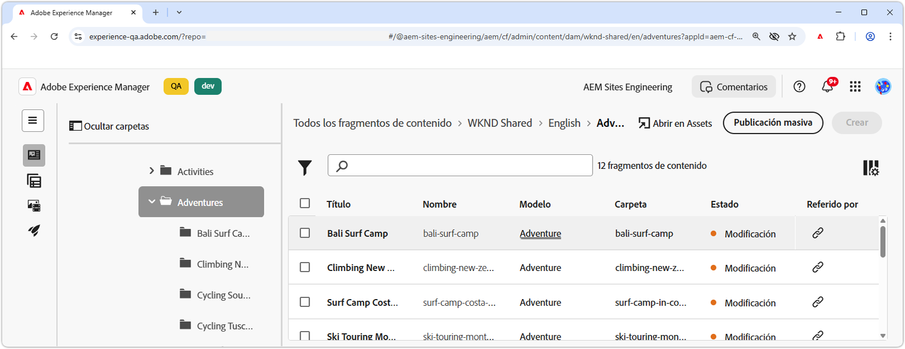
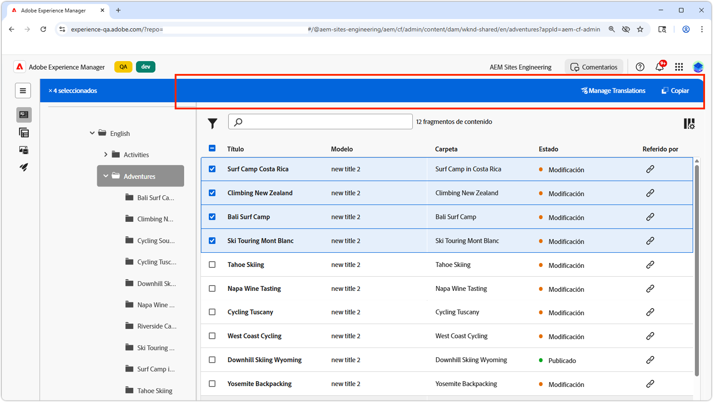
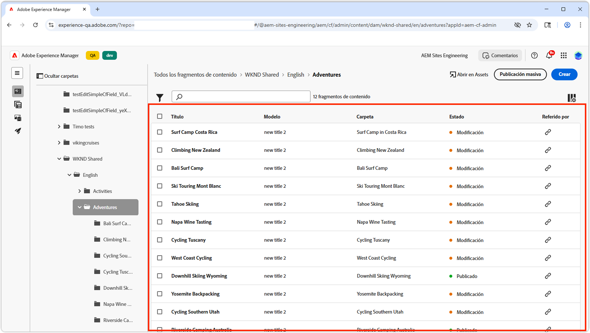
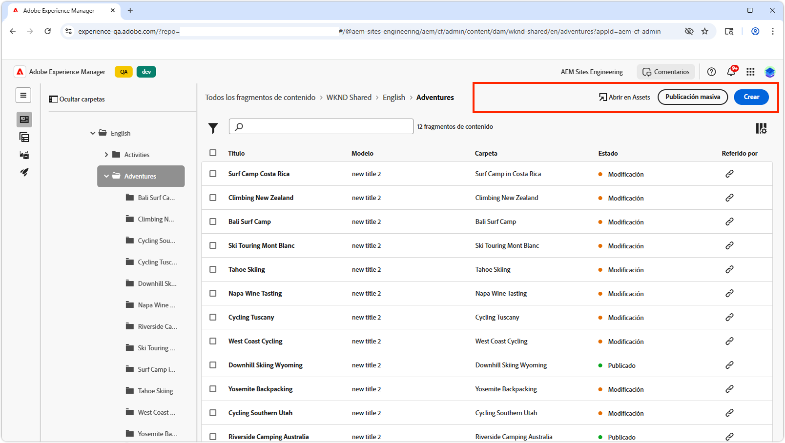
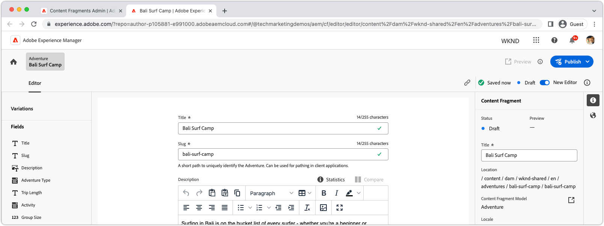

# AEM Extensibilidad de fragmentos de contenido

AEM La interfaz de usuario de fragmentos de contenido es una potente interfaz de usuario ampliable para administrar la creación, administración y edición de fragmentos de contenido. Hay varios puntos de extensión disponibles para personalizar la interfaz de usuario según sus necesidades. Hay diferentes puntos de extensión disponibles en función de la interfaz de usuario que amplíe.

## Puntos de extensión de la consola Fragmentos de contenido

AEM La Consola de fragmento de contenido en (Adobe Experience Manager) es una interfaz de usuario que proporciona una ubicación centralizada para administrar y organizar fragmentos de contenido. Ofrece un completo conjunto de herramientas y funciones para crear, editar, publicar y rastrear fragmentos de contenido, lo que permite a los usuarios administrar de forma eficaz el contenido estructurado en varios canales y puntos de contacto.

AEM [Consola de fragmentos de contenido de](https://experienceleague.adobe.com/docs/experience-manager-cloud-service/content/sites/administering/content-fragments/content-fragments-console.html?lang=es) es la interfaz de usuario ampliable para enumerar y administrar fragmentos de contenido. AEM [Se han creado extensiones de la consola de fragmentos de contenido de](https://developer.adobe.com/uix/docs/services/aem-cf-console-admin/code-generation) mediante la plantilla de App Builder `@adobe/aem-cf-admin-ui-ext-tpl`.

Los siguientes puntos de extensión de la consola Fragmentos de contenido están disponibles:

      

        

          

            <figure class="image is-16by9">
              
            </figure>
          

          

            

              
<a href="https://developer.adobe.com/uix/docs/services/aem-cf-console-admin/api/action-bar/" title="Barra de acciones" target="_blank" rel="referrer">Barra de acciones</a>

              
Personalizar acciones para cuando se seleccionan uno o más fragmentos de contenido.

              <a href="https://developer.adobe.com/uix/docs/services/aem-cf-console-admin/api/action-bar/" class="spectrum-Button spectrum-Button--outline spectrum-Button--primary spectrum-Button--sizeM" target="_blank" rel="referrer">
                Ver los documentos
              </a>
            

          

        

      

  

    

      

        <figure class="image is-16by9">
          
        </figure>
      

      

        

          
<a href="https://developer.adobe.com/uix/docs/services/aem-cf-console-admin/api/grid-columns/" title="Columnas de cuadrícula" target="_blank" rel="referrer">Columnas de cuadrícula</a>

          
Personalice los datos que aparecen en la lista Fragmentos de contenido.

          <a href="https://developer.adobe.com/uix/docs/services/aem-cf-console-admin/api/grid-columns/" class="spectrum-Button spectrum-Button--outline spectrum-Button--primary spectrum-Button--sizeM" target="_blank" rel="referrer">
            Ver los documentos
          </a>
        

      

    

  

  

    

      

        <figure class="image is-16by9">
          
        </figure>
      

      

        

          
<a href="https://developer.adobe.com/uix/docs/services/aem-cf-console-admin/api/header-menu/" title="Menú del encabezado" target="_blank" rel="referrer">Menú del encabezado</a>

          
Personalice las acciones para cuando no haya fragmentos de contenido seleccionados.

          <a href="https://developer.adobe.com/uix/docs/services/aem-cf-console-admin/api/header-menu/" class="spectrum-Button spectrum-Button--outline spectrum-Button--primary spectrum-Button--sizeM" target="_blank" rel="referrer">
            Ver los documentos
          </a>
        

      

    

  
  

## Puntos de extensión del Editor de fragmentos de contenido

AEM El Editor de fragmentos de contenido en (Adobe Experience Manager) es un componente de interfaz de usuario que permite a los usuarios crear, editar y administrar fragmentos de contenido. Proporciona un entorno visualmente intuitivo y fácil de usar para trabajar con contenido estructurado, lo que permite a los usuarios definir y organizar elementos de contenido, aplicar plantillas, administrar variaciones y previsualizar cómo aparece el contenido en diferentes canales. El editor de fragmentos de contenido optimiza el proceso de creación de contenido reutilizable y modular que se puede distribuir y publicar fácilmente en varias experiencias digitales.

AEM El Editor de fragmentos de contenido es la interfaz de usuario ampliable para editar fragmentos de contenido. AEM [Se han creado extensiones del Editor de fragmentos de contenido de la](https://developer.adobe.com/uix/docs/services/aem-cf-editor/code-generation/) con la plantilla de App Builder `@adobe/aem-cf-editor-ui-ext-tpl`.

Los siguientes puntos de extensión del Editor de fragmentos de contenido están disponibles:

    

      

        

          <figure class="image is-16by9">
            
          </figure>
        

        

          

            
<a href="https://developer.adobe.com/uix/docs/services/aem-cf-editor/api/header-menu/" title="Menú del encabezado" target="_blank" rel="referrer">Menú del encabezado</a>

            
Personalice las acciones en el menú de encabezado del Editor de fragmentos de contenido.

            <a href="https://developer.adobe.com/uix/docs/services/aem-cf-editor/api/header-menu" class="spectrum-Button spectrum-Button--outline spectrum-Button--primary spectrum-Button--sizeM" target="_blank" rel="referrer">
              Ver los documentos
            </a>
          

        

      

    

  

    

      

        <figure class="image is-16by9">
          
        </figure>
      

      

        

          
<a href="https://developer.adobe.com/uix/docs/services/aem-cf-editor/api/rte-toolbar/" title="Barra de herramientas Editor de texto enriquecido"  target="_blank" rel="referrer">Barra de herramientas Editor de texto enriquecido</a>

          
Agregue un botón personalizado al Editor de texto enriquecido (RTE) del Editor de fragmentos de contenido.

          <a href="https://developer.adobe.com/uix/docs/services/aem-cf-editor/api/rte-toolbar/" class="spectrum-Button spectrum-Button--outline spectrum-Button--primary spectrum-Button--sizeM" target="_blank" rel="referrer">
            Ver los documentos
          </a>
        

      

    

  

    

      

        <figure class="image is-16by9">
          
        </figure>
      

      

        

          
<a href="https://developer.adobe.com/uix/docs/services/aem-cf-editor/api/rte-widgets/" title="Widgets del editor de texto enriquecido" target="_blank" rel="referrer">Widgets del editor de texto enriquecido</a>

          
Personalizar acciones en RTE enlazadas a pulsaciones de teclas.

          <a href="https://developer.adobe.com/uix/docs/services/aem-cf-editor/api/rte-widgets/" class="spectrum-Button spectrum-Button--outline spectrum-Button--primary spectrum-Button--sizeM" target="_blank" rel="referrer">
            Ver los documentos
          </a>
        

      

    

  

  

    

      

        <figure class="image is-16by9">
          
        </figure>
      

      

        

          
<a href="https://developer.adobe.com/uix/docs/services/aem-cf-editor/api/rte-badges/ " title="Distintivos del Editor de texto enriquecido" target="_blank" rel="referrer">Distintivos del Editor de texto enriquecido</a>

          
Personalice bloques de estilo no editables dentro de RTE.

          <a href="https://developer.adobe.com/uix/docs/services/aem-cf-editor/api/rte-badges/" class="spectrum-Button spectrum-Button--outline spectrum-Button--primary spectrum-Button--sizeM" target="_blank" rel="referrer">
            Ver los documentos
          </a>
        

      

    

  

## Ejemplos de extensiones

AEM Le damos la bienvenida a una colección de ejemplos de código de extensibilidad de la interfaz de usuario de. Este recurso está diseñado para proporcionarle demostraciones prácticas y perspectivas sobre la ampliación de la interfaz de usuario de Adobe Experience Manager AEM (). AEM Tanto si es un desarrollador que busca mejorar la funcionalidad de la aplicación, estos ejemplos de código sirven como una valiosa referencia.

  

    

      

        <figure class="image is-16by9">
          
        </figure>
      

      

        

          
<a href="./examples/console-bulk-property-update.md" title="Actualización de propiedades por lotes">Actualización de propiedades de fragmentos de contenido en lotes</a>

          
Una extensión de la barra de acciones de la consola Fragmento de contenido con acción modal y Adobe I/O Runtime.

          <a href="./examples/console-bulk-property-update.md" class="spectrum-Button spectrum-Button--outline spectrum-Button--primary spectrum-Button--sizeM">
            Ver el ejemplo
          </a>
        

      

    

  

  

        

            

                <figure class="image is-16by9">
                    
                </figure>
            

            

                

                    
<a href="./examples/console-image-generation-and-image-upload.md" title="AEM Generación y carga de imágenes basadas en OpenAI a la extensión de la">Generación de imágenes de OpenAPI</a>

                    
AEM Explore un ejemplo de extensión de barra de acciones que genera una imagen mediante OpenAI, la carga en la propiedad de imagen y la actualiza en el fragmento de contenido seleccionado.

                    <a href="./examples/console-image-generation-and-image-upload.md" class="spectrum-Button spectrum-Button--outline spectrum-Button--primary spectrum-Button--sizeM">
                        Ver el ejemplo
                    </a>
                

            

        

    
    
  

    

      

        <figure class="image is-16by9">
          
        </figure>
      

      

        

          
<a href="./examples/custom-grid-columns.md" title="Columnas personalizadas">Columnas personalizadas</a>

          
Agregue una columna personalizada a la consola Fragmento de contenido.

          <a href="./examples/custom-grid-columns.md" class="spectrum-Button spectrum-Button--outline spectrum-Button--primary spectrum-Button--sizeM">
            Ver el ejemplo
          </a>
        

      

    

  
    
  

    

      

        <figure class="image is-16by9">
          
        </figure>
      

      

        

          
<a href="./examples/editor-export-to-xml.md" title="Exportar a XML">Exportar a XML</a>

          
Exporte un fragmento de contenido como XML desde el Editor de fragmentos de contenido.

          <a href="./examples/editor-export-to-xml.md" class="spectrum-Button spectrum-Button--outline spectrum-Button--primary spectrum-Button--sizeM">
            Ver el ejemplo
          </a>
        

      

    

  
    
  

    

      

        <figure class="image is-16by9">
          
        </figure>
      

      

        

          
<a href="./examples/editor-rte-toolbar.md" title="Botón de barra de herramientas del Editor de texto enriquecido">Botón de barra de herramientas del Editor de texto enriquecido</a>

          
Agregue botones personalizados de la barra de herramientas a los campos RTE en el Editor de fragmentos de contenido.

          <a href="./examples/editor-rte-toolbar.md" class="spectrum-Button spectrum-Button--outline spectrum-Button--primary spectrum-Button--sizeM">
            Ver el ejemplo
          </a>
        

      

    

  
   
  

    

      

        <figure class="image is-16by9">
          
        </figure>
      

      

        

          
<a href="./examples/editor-rte-toolbar.md" title="Widget del editor de texto enriquecido">Widget del editor de texto enriquecido</a>

          
Agregue widgets al editor de texto enriquecido en el editor de fragmentos de contenido.

          <a href="./examples/editor-rte-widget.md" class="spectrum-Button spectrum-Button--outline spectrum-Button--primary spectrum-Button--sizeM">
            Ver el ejemplo
          </a>
        

      

    

  
   
  

    

      

        <figure class="image is-16by9">
          
        </figure>
      

      

        

          
<a href="./examples/editor-rte-badges.md" title="Insignia del editor de texto enriquecido">Insignia del editor de texto enriquecido</a>

          
Agregue insignias al Editor de texto enriquecido en el Editor de fragmentos de contenido.

          <a href="./examples/editor-rte-badges.md" class="spectrum-Button spectrum-Button--outline spectrum-Button--primary spectrum-Button--sizeM">
            Ver el ejemplo
          </a>
        

      

    

  

    

      

        <figure class="image is-16by9">
          
        </figure>
      

      

        

          
<a href="./examples/editor-custom-field.md" title="Campos personalizados">Campos personalizados</a>

          
Cree campos personalizados de fragmento de contenido.

          <a href="./examples/editor-custom-field.md" class="spectrum-Button spectrum-Button--outline spectrum-Button--primary spectrum-Button--sizeM">
            Ver el ejemplo
          </a>
        

      

    

  
 

