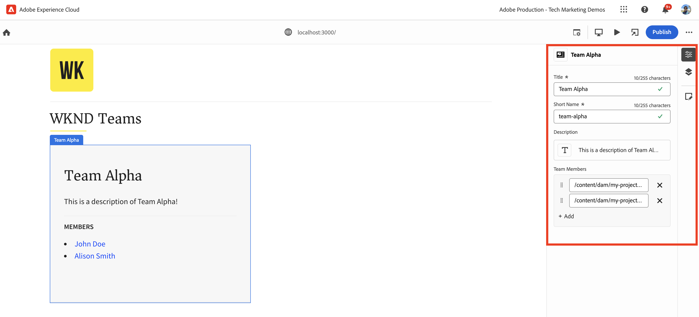

# Instrumentar la aplicación React para editar contenido mediante el editor universal

Aprenda a instrumentar la aplicación React para editar el contenido mediante el Editor universal.

## Requisitos previos

Ha configurado el entorno de desarrollo local como se describe en el paso anterior [Configuración de desarrollo local](./local-development-setup.md) paso.

## Incluir la biblioteca principal del editor universal

Empecemos por incluir la biblioteca principal del Editor universal en la aplicación WKND Teams React. Es una biblioteca JavaScript que proporciona la capa de comunicación entre la aplicación editada y el editor universal.

Existen dos formas de incluir la biblioteca principal del editor universal en la aplicación React:

1. Dependencia del módulo del nodo del registro npm, consulte [@adobe/universal-editor-cors](https://www.npmjs.com/package/@adobe/universal-editor-cors).
1. Etiqueta de script (`<script>`) en el archivo del HTML.

Para este tutorial, vamos a utilizar el método de etiqueta Script.

1. Instale el `react-helmet-async` paquete para administrar el `<script>` en la aplicación React.

   ```bash
   $ npm install react-helmet-async
   ```

1. Actualice el `src/App.js` de la aplicación WKND Teams React para incluir la biblioteca principal del Editor universal.

   ```javascript
   ...
   import { Helmet, HelmetProvider } from "react-helmet-async";
   
   function App() {
   return (
       <HelmetProvider>
           <div className="App">
               <Helmet>
                   {/* AEM Universal Editor :: CORE Library
                     Loads the LATEST Universal Editor library
                   */}
                   <script
                       src="https://universal-editor-service.experiencecloud.live/corslib/LATEST"
                       async
                   />
               </Helmet>
               <Router>
                   <header>
                       <Link to={"/"}>
                       
                       </Link>
                       <hr />
                   </header>
                   <Routes>
                       <Route path="/" element={<Home />} />
                       <Route path="/person/:fullName" element={<Person />} />
                   </Routes>
               </Router>
           </div>
       </HelmetProvider>
   );
   }
   
   export default App;
   ```

## Añadir metadatos: fuente de contenido

Para conectar la aplicación WKND Teams React _con el origen de contenido_ para editarlo, debe proporcionar metadatos de conexión. El servicio de editor universal utiliza estos metadatos para establecer una conexión con el origen de contenido.

Los metadatos de la conexión se almacenan como `<meta>` etiquetas en el archivo de HTML. La sintaxis de los metadatos de la conexión es la siguiente:

```html
<meta name="urn:adobe:aue:<category>:<referenceName>" content="<protocol>:<url>">
```

Añadamos los metadatos de conexión a la aplicación WKND Teams React dentro del `<Helmet>` componente. Actualice el `src/App.js` archivo con lo siguiente `<meta>` etiqueta. AEM En este ejemplo, la fuente de contenido es una instancia de local que se ejecuta en `https://localhost:8443`.

```javascript
...
function App() {
return (
    <HelmetProvider>
        <div className="App">
            <Helmet>
                {/* AEM Universal Editor :: CORE Library
                    Loads the LATEST Universal Editor library
                */}
                <script
                    src="https://universal-editor-service.experiencecloud.live/corslib/LATEST"
                    async
                />
                {/* AEM Universal Editor :: Connection metadata 
                    Connects to local AEM instance
                */}
                <meta
                    name="urn:adobe:aue:system:aemconnection"
                    content={`aem:https://localhost:8443`}
                />
            </Helmet>
            ...
    </HelmetProvider>
);
}

export default App;
```

El `aemconnection` proporciona un nombre corto del origen de contenido. La instrumentación posterior utiliza el nombre corto para hacer referencia al origen de contenido.

## Añadir metadatos: configuración del servicio Editor universal local

En lugar del servicio de editor universal alojado en el Adobe, se utiliza una copia local del servicio de editor universal para el desarrollo local. AEM El servicio local enlaza el editor universal y el SDK de la, por lo que vamos a añadir los metadatos del servicio del editor universal local a la aplicación React de WKND Teams.

Estas opciones de configuración también se almacenan como `<meta>` etiquetas en el archivo de HTML. La sintaxis de los metadatos del servicio Editor universal local es la siguiente:

```html
<meta name="urn:adobe:aue:config:service" content="<url>">
```

Añadamos los metadatos de conexión a la aplicación WKND Teams React dentro del `<Helmet>` componente. Actualice el `src/App.js` archivo con lo siguiente `<meta>` etiqueta. En este ejemplo, el servicio de editor universal local se está ejecutando en `https://localhost:8001`.

```javascript
...

function App() {
  return (
    <HelmetProvider>
      <div className="App">
        <Helmet>
          {/* AEM Universal Editor :: CORE Library
              Loads the LATEST Universal Editor library
          */}
          <script
            src="https://universal-editor-service.experiencecloud.live/corslib/LATEST"
            async
          />
          {/* AEM Universal Editor :: Connection metadata 
              Connects to local AEM instance
          */}
          <meta
            name="urn:adobe:aue:system:aemconnection"
            content={`aem:https://localhost:8443`}
          />
          {/* AEM Universal Editor :: Configuration for Service
              Using locally running Universal Editor service
          */}
          <meta
            name="urn:adobe:aue:config:service"
            content={`https://localhost:8001`}
          />
        </Helmet>
        ...
    </HelmetProvider>
);
}
export default App;
```

## Instrumentación de los componentes de React

Para editar el contenido de la aplicación WKND Teams React como _título y descripción del equipo_, debe instrumentar los componentes de React. La instrumentación significa añadir atributos de datos relevantes (`data-aue-*`) a los elementos de HTML que desea que puedan editarse mediante el Editor universal. Para obtener más información sobre los atributos de datos, consulte [Atributos y tipos](https://experienceleague.adobe.com/en/docs/experience-manager-cloud-service/content/implementing/developing/universal-editor/attributes-types).

### Definir elementos editables

Empecemos por definir los elementos que desea editar con el Editor universal. AEM En la aplicación React de WKND Teams, el título y la descripción del equipo se almacenan en el fragmento de contenido del equipo en la aplicación de, por lo que son los mejores candidatos para la edición.

Vamos a instrumentar el `Teams` Componente React para poder editar el título y la descripción del equipo.

1. Abra el `src/components/Teams.js` de la aplicación WKND Teams React.
1. Añada el `data-aue-prop`, `data-aue-type` y `data-aue-label` atributo a los elementos título y descripción del equipo.

   ```javascript
   ...
   function Teams() {
       const { teams, error } = useAllTeams();
       ...
   
       return (
           <div className="team">
               // AEM Universal Editor :: Instrumentation using data-aue-* attributes
               <h2 className="team__title" data-aue-prop="title" data-aue-type="text" data-aue-label="title">{title}</h2>
               <p className="team__description" data-aue-prop="description" data-aue-type="richtext" data-aue-label="description">{description.plaintext}</p>
               ...
           </div>
       );
   }
   
   export default Teams;
   ```

1. Actualice la página Editor universal en el explorador que carga la aplicación WKND Teams React. Ahora puede ver que el título del equipo y los elementos de descripción son editables.

   

1. Si intenta editar el título o la descripción del equipo mediante la edición en línea o el carril de propiedades, se mostrará un indicador de carga, pero no le permitirá editar el contenido. AEM Debido a que el editor universal no tiene en cuenta los detalles de recursos de la para cargar y guardar el contenido.

   

En resumen, los cambios anteriores marcan los elementos de título y descripción del equipo como editables en el editor universal. Sin embargo, **aún no puede editar (a través de inline o del carril de propiedades) y guardar los cambios** AEM , para ello, debe añadir los detalles del recurso de la mediante la variable `data-aue-resource` atributo. Vamos a hacer eso en el siguiente paso.

### AEM Definición de detalles del recurso

AEM AEM Para volver a guardar el contenido editado en el carril de propiedades y también para cargar el contenido en él, debe proporcionar los detalles del recurso de la al editor universal.

AEM En este caso, el recurso de la es la ruta del fragmento de contenido del equipo, por lo que vamos a añadir los detalles del recurso a la `Teams` Componente React en el nivel superior `<div>` Elemento.

1. Actualice el `src/components/Teams.js` para añadir el `data-aue-resource`, `data-aue-type` y `data-aue-label` atributos al nivel superior `<div>` Elemento.

   ```javascript
   ...
   function Teams() {
       const { teams, error } = useAllTeams();
       ...
   
       // Render single Team
       function Team({ _path, title, shortName, description, teamMembers }) {
           // Must have title, shortName and at least 1 team member
           if (!_path || !title || !shortName || !teamMembers) {
               return null;
           }
   
         return (
           // AEM Universal Editor :: Instrumentation using data-aue-* attributes
           <div className="team" data-aue-resource={`urn:aemconnection:${_path}/jcr:content/data/master`} data-aue-type="reference" data-aue-label={title}>
           ...
           </div>
       );
       }
   }
   export default Teams;
   ```

   El valor del `data-aue-resource` AEM El atributo es la ruta de recurso de la ruta de acceso del fragmento de contenido del equipo. El `urn:aemconnection:` prefix utiliza el nombre corto del origen de contenido definido en los metadatos de la conexión.

1. Actualice la página Editor universal en el explorador que carga la aplicación WKND Teams React. Ahora puede ver que el elemento Equipo de nivel superior es editable, pero el carril de propiedades sigue sin cargar el contenido. En la pestaña de red del explorador, puede ver el error 401 No autorizado para `details` que carga el contenido. AEM Está intentando utilizar el token de IMS para la autenticación, pero el SDK de la local no admite la autenticación IMS.

   

1. AEM Para corregir el error 401 Unauthorized, debe proporcionar los detalles de autenticación del SDK de la local al editor universal mediante **Encabezados de autenticación** en el Editor universal. AEM Como su SDK de local, establezca el valor en `Basic YWRtaW46YWRtaW4=` para `admin:admin` credenciales.

   

1. Actualice la página Editor universal en el explorador que carga la aplicación WKND Teams React. Ahora puede ver que el carril de propiedades está cargando el contenido y puede editar el título y la descripción del equipo en línea o mediante el carril de propiedades.

   

#### Bajo el capó

AEM El carril de propiedades carga el contenido del recurso de la mediante el servicio de editor universal local. Mediante la pestaña de red del explorador, puede ver la solicitud del POST al servicio Universal Editor local (`https://localhost:8001/details`) para cargar el contenido.

AEM Cuando edita el contenido mediante la edición en línea o el carril de propiedades, los cambios se guardan de nuevo en el recurso de la mediante el servicio de editor universal local. Mediante la pestaña de red del explorador, puede ver la solicitud del POST al servicio Universal Editor local (`https://localhost:8001/update` o `https://localhost:8001/patch`) para guardar el contenido.


El objeto JSON de carga útil de solicitud contiene los detalles necesarios como el servidor de contenido (`connections`), ruta de recurso (`target`) y el contenido actualizado (`patch`).


### Expandir el contenido editable

Vamos a expandir el contenido editable y aplicar la instrumentación al **integrantes del equipo** para que pueda editar los integrantes del equipo mediante el carril propiedades.

Como en el caso anterior, vamos a añadir el correspondiente `data-aue-*` atributos para los integrantes del equipo en `Teams` Componente React.

1. Actualice el `src/components/Teams.js` para agregar atributos de datos al `<li key={index} className="team__member">` Elemento.

   ```javascript
   ...
   function Teams() {
       const { teams, error } = useAllTeams();
       ...
   
       <div>
           <h4 className="team__members-title">Members</h4>
           <ul className="team__members">
               {/* Render the referenced Person models associated with the team */}
               {teamMembers.map((teamMember, index) => {
                   return (
                       // AEM Universal Editor :: Instrumentation using data-aue-* attributes
                       <li key={index} className="team__member" data-aue-resource={`urn:aemconnection:${teamMember?._path}/jcr:content/data/master`} data-aue-type="component" data-aue-label={teamMember.fullName}>
                       <Link to={`/person/${teamMember.fullName}`}>
                           {teamMember.fullName}
                       </Link>
                       </li>
                   );
               })}
           </ul>
       </div>
       ...
   }
   export default Teams;
   ```

   El valor del `data-aue-type` el atributo es `component` ya que los integrantes del equipo se almacenan como `Person` AEM Los fragmentos de contenido en el contenido de ayuda a indicar las partes móviles o eliminables del contenido, y los fragmentos de contenido en los que se puede hacer clic en el botón de ayuda.

1. Actualice la página Editor universal en el explorador que carga la aplicación WKND Teams React. Ahora puede ver que los integrantes del equipo se pueden editar mediante el carril de propiedades.

   

#### Bajo el capó

Como en el caso anterior, la recuperación y el guardado del contenido se realizan mediante el servicio de editor universal local. El `/details`, `/update` o `/patch` se realizan solicitudes al servicio local de editor universal para cargar y guardar el contenido.

### Definición de adición y eliminación de contenido

Hasta ahora, ha hecho que el contenido existente sea editable, pero ¿qué sucede si desea agregar contenido nuevo? Vamos a añadir la capacidad de añadir o eliminar miembros del equipo al equipo de WKND mediante el Editor universal. AEM Por lo tanto, los autores de contenido no necesitan ir a la página de inicio de la aplicación para agregar o eliminar miembros del equipo.

Sin embargo, una recapitulación rápida, los miembros del equipo de WKND se almacenan como `Person` AEM Los fragmentos de contenido en la y están asociados al fragmento de contenido del equipo mediante la variable `teamMembers` propiedad. AEM Para revisar la definición del modelo en visita [my-project](http://localhost:4502/libs/dam/cfm/models/console/content/models.html/conf/my-project).

1. En primer lugar, cree el archivo de definición del componente `/public/static/component-definition.json`. Este archivo contiene la definición del componente para `Person` Fragmento de contenido. El `aem/cf` El complemento permite insertar fragmentos de contenido, basados en un modelo y una plantilla que proporcionan los valores predeterminados que se pueden aplicar.

   ```json
   {
       "groups": [
           {
           "title": "Content Fragments",
           "id": "content-fragments",
           "components": [
               {
               "title": "Person",
               "id": "person",
               "plugins": {
                   "aem": {
                       "cf": {
                           "name": "person",
                           "cfModel": "/conf/my-project/settings/dam/cfm/models/person",
                           "cfFolder": "/content/dam/my-project/en",
                           "title": "person",
                           "template": {
                               "fullName": "New Person",
                               "biographyText": "This is biography of new person"
                               }
                           }
                       }
                   }
               }
           ]
           }
       ]
   }
   ```

1. A continuación, consulte el archivo de definición de componentes anterior en `index.html` de la aplicación WKND Team React. Actualice el `public/index.html` del archivo `<head>` para incluir el archivo de definición del componente.

   ```html
   ...
   <script
       type="application/vnd.adobe.aue.component+json"
       src="/static/component-definition.json"
   ></script>
   <title>WKND App - Basic GraphQL Tutorial</title>
   </head>
   ...
   ```

1. Finalmente, actualice el `src/components/Teams.js` para añadir atributos de datos. El **MIEMBROS** para actuar como un contenedor para los integrantes del equipo, vamos a agregar la sección `data-aue-prop`, `data-aue-type`, y `data-aue-label` atributos a `<div>` Elemento.

   ```javascript
   ...
   function Teams() {
       const { teams, error } = useAllTeams();
       ...
   
       {/* AEM Universal Editor :: Team Members as container */}
       <div data-aue-prop="teamMembers" data-aue-type="container" data-aue-label="members">
           <h4 className="team__members-title">Members</h4>
           <ul className="team__members">
           {/* Render the referenced Person models associated with the team */}
           {teamMembers.map((teamMember, index) => {
               return (
               // AEM Universal Editor :: Instrumentation using data-aue-* attributes
               <li key={index} className="team__member" data-aue-resource={`urn:aemconnection:${teamMember?._path}/jcr:content/data/master`} data-aue-type="component" data-aue-label={teamMember.fullName}>
                   <Link to={`/person/${teamMember.fullName}`}>
                   {teamMember.fullName}
                   </Link>
               </li>
               );
           })}
           </ul>
       </div>
       ...
   }
   export default Teams;
   ```

1. Actualice la página Editor universal en el explorador que carga la aplicación WKND Teams React. Ahora puede ver que la variable **MIEMBROS** La sección actúa como un contenedor. Puede insertar nuevos integrantes del equipo mediante el carril de propiedades y la variable **+** icono.

   

1. Para eliminar un miembro del equipo, seleccione el miembro del equipo y haga clic en **Eliminar** icono.

   

#### Bajo el capó

Las operaciones de adición y eliminación de contenido las realiza el servicio de editor universal local. La solicitud del POST para `/add` o `/remove` AEM con una carga útil detallada se realizan en el servicio de editor universal local para añadir o eliminar el contenido a la.

## Archivos de solución

Para verificar los cambios de implementación o si no puede hacer que la aplicación WKND Teams React funcione con el editor universal, consulte el [basic-tutorial-instrumented-for-UE](https://github.com/adobe/aem-guides-wknd-graphql/tree/solution/basic-tutorial-instrumented-for-UE) rama de solución.

Comparación archivo a archivo con el de trabajo **basic-tutorial** La rama está disponible [aquí](https://github.com/adobe/aem-guides-wknd-graphql/compare/solution/basic-tutorial...solution/basic-tutorial-instrumented-for-UE?expand=1).

## Felicitaciones

La aplicación WKND Teams React se ha instrumentado correctamente para añadir, editar y eliminar contenido mediante el editor universal. Ha aprendido a incluir la biblioteca principal, añadir conexión y los metadatos del servicio de editor universal local, e instrumentar el componente React con varios datos (`data-aue-*`) atributos.
